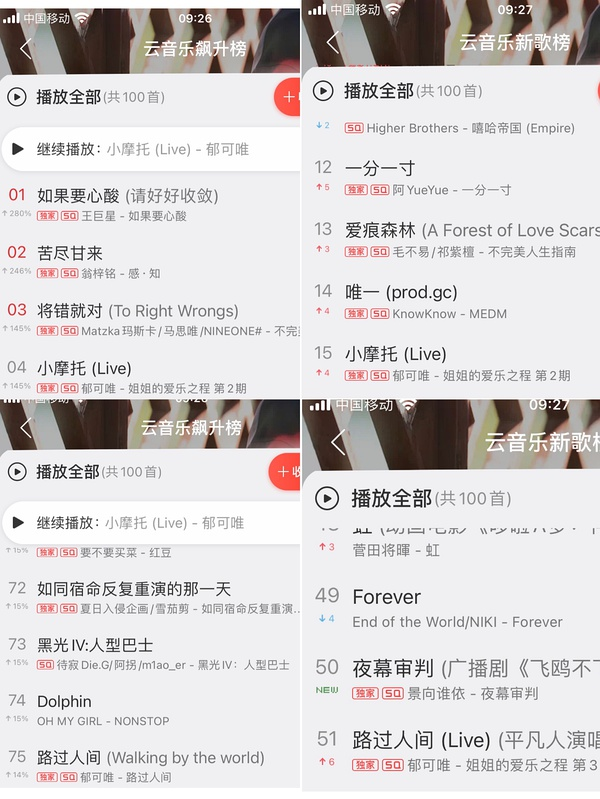
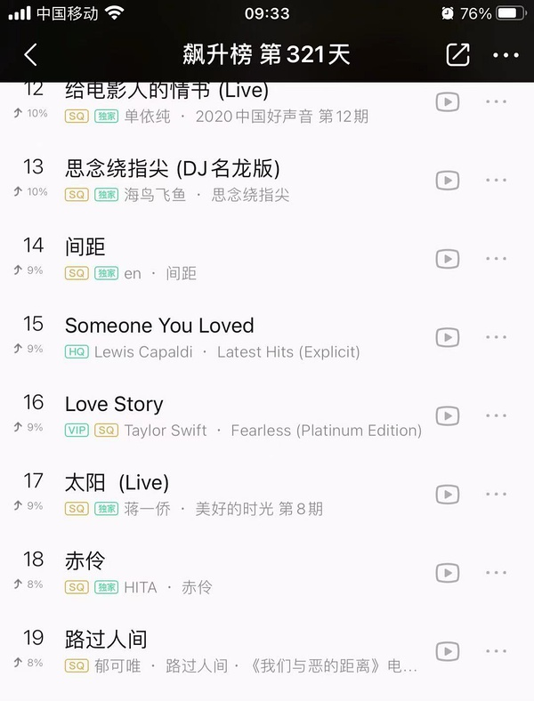

[主页](./main.md "main.md") | [首页](./comments1-100.md "comments1-100.md") | [前一页](./comments4001-4100.md "comments4001-4100.md") | [后一页](./comments4201-4300.md "comments4201-4300.md") | [末页](./comments10601-10700.md "comments10601-10700.md")  

---
*     [Unknow](https://www.douban.com/people/219306324/)    2020-11-17 09:21:20  
  >希望能有霏霏😢对下各家行程表就好了  
  >
  >-- [柳微微](https://www.douban.com/people/149620484/)  
  
  之前成都站梦辰飞行 她的行程表上有吗？  
---
*     [漠漠yt](https://www.douban.com/people/223048792/)    2020-11-17 09:21:33  
  >我这还在挨着翻，我还以为她过敏呢！第一次听过羊肉能吃红枣却受不住的😑😑😑我咋感觉她是  
  >
  >-- [树根芯](https://www.douban.com/people/150517926/)  
  
  她都是羊肉涮火锅 如果上火了 她肯定会说是吃火锅的原因 而不是因为羊肉  
---
*     [minimum](https://www.douban.com/people/218236166/)    2020-11-17 09:22:04  
  今天又是为小摩托和小人间骄傲的一天  
  为什么小摩托又飘这么高，昨天没怎么啊～  
---
*     [minimum](https://www.douban.com/people/218236166/)    2020-11-17 09:23:17  
  >之前成都站梦辰飞行 她的行程表上有吗？  
  >
  >-- [Unknow](https://www.douban.com/people/219306324/)  
  
  当然没有，smc今天长沙录综艺，后边无行程  
  霏霏这几天的行程都是北京录新专辑  
---
*     [柳微微](https://www.douban.com/people/149620484/)    2020-11-17 09:23:46  
  >之前成都站梦辰飞行 她的行程表上有吗？  
  >
  >-- [Unknow](https://www.douban.com/people/219306324/)  
  
  有的啊  
---
*     [柳微微](https://www.douban.com/people/149620484/)    2020-11-17 09:24:19  
  >之前成都站梦辰飞行 她的行程表上有吗？  
  >
  >-- [Unknow](https://www.douban.com/people/219306324/)  
  
  如果录制综艺的时间撞了，就肯定飞不了，霏霏这个月没出行程诶好像  
---
*     [minimum](https://www.douban.com/people/218236166/)    2020-11-17 09:24:56  
  >如果录制综艺的时间撞了，就肯定飞不了，霏霏这个月没出行程诶好像  
  >
  >-- [柳微微](https://www.douban.com/people/149620484/)  
  
  出了的，这几天是北京录专辑  
---
*     [已注 销](https://www.douban.com/people/155947097/)    2020-11-17 09:25:14  
  >之前不是有瓜说 有飞行姐姐吗，希望有琼姐  
  >
  >-- [Unknow](https://www.douban.com/people/219306324/)  
  
  梦一个flow团聚啊  
---
*     [柳微微](https://www.douban.com/people/149620484/)    2020-11-17 09:26:00  
  >出了的，这几天是北京录专辑  
  >
  >-- [minimum](https://www.douban.com/people/218236166/)  
  
  哭了😢葵要是不去双十二的话，大碗很久都没合体的可能了  
---
*     [树根芯](https://www.douban.com/people/150517926/)    2020-11-17 09:26:35  
  >她都是羊肉涮火锅 如果上火了 她肯定会说是吃火锅的原因 而不是因为羊肉  
  >
  >-- [漠漠yt](https://www.douban.com/people/223048792/)  
  
  呵呵！到底有多不喜欢红枣啊😔😔羊肉都能涮红汤的人！！！助理三个没有生活助理吗？？烤脆的红枣当花生米吃啊！一天几颗就行！！！！哪怕是看中医也不过是在四物汤基础上加臣辅药材而已！  
---
*     [柳微微](https://www.douban.com/people/149620484/)    2020-11-17 09:27:45  
  昨天静姐还教育了说生孩子没用看个人体质  
---
*     [summertrain](https://www.douban.com/people/183524918/)    2020-11-17 09:29:00  
  >昨天静姐还教育了说生孩子没用看个人体质  
  >
  >-- [柳微微](https://www.douban.com/people/149620484/)  
  
  然后她还说：“对，听到没有”（可骄傲了呢😂）  
---
*     [Yisa黎珞](https://www.douban.com/people/217273308/)    楼主    2020-11-17 09:31:07  
  >今天又是为小摩托和小人间骄傲的一天  
  >为什么小摩托又飘这么高，昨天没怎么啊～  
  >
  >-- [minimum](https://www.douban.com/people/218236166/)  
  
    
  小摩托好能打啊  
---
*     [吃瓜](https://www.douban.com/people/219893584/)    2020-11-17 09:32:13  
  >梦一个flow团聚啊  
  >
  >-- [已注 销](https://www.douban.com/people/155947097/)  
  
  琼18日好像有品牌活动，除非她只来一天，否则不太可能  
---
*     [Shirley Tian](https://www.douban.com/people/150047836/)    2020-11-17 09:32:16  
  >今天又是为小摩托和小人间骄傲的一天  
  >为什么小摩托又飘这么高，昨天没怎么啊～  
  >
  >-- [minimum](https://www.douban.com/people/218236166/)  
  
  小摩托小人间是我们的小骄傲😄😄😄  
---
*     [minimum](https://www.douban.com/people/218236166/)    2020-11-17 09:33:31  
  >小摩托好能打啊  
  >
  >-- [Yisa黎珞](https://www.douban.com/people/217273308/)  
  
  小人间在qq比较高  
  小人间版本渠道多，分散  
---
* [![[已注销]](../../image/icon/user_normal.jpg)](https://www.douban.com/people/219008874/)    [[已注销]](https://www.douban.com/people/219008874/)    2020-11-17 09:33:48  
  昨天机场好像没有飞行姐姐的瓜？  
---
*     [吃瓜](https://www.douban.com/people/219893584/)    2020-11-17 09:34:56  
  >昨天静姐还教育了说生孩子没用看个人体质  
  >
  >-- [柳微微](https://www.douban.com/people/149620484/)  
  
  对，突然来一句，不知道是静看了葵直播还是葵在飞机上和她吐槽了这事  
---
*     [minimum](https://www.douban.com/people/218236166/)    2020-11-17 09:35:43  
  >哭了😢葵要是不去双十二的话，大碗很久都没合体的可能了  
  >
  >-- [柳微微](https://www.douban.com/people/149620484/)  
  
  那个名单看着不靠谱的样子  
  大碗合体还是等smc婚礼吧，估计快了  
  大碗里惋惜的是hzfw的无数次错过  
---
*     [Yisa黎珞](https://www.douban.com/people/217273308/)    楼主    2020-11-17 09:36:25  
  >小人间在qq比较高  
  >小人间版本渠道多，分散  
  >
  >-- [minimum](https://www.douban.com/people/218236166/)  
  
    
    
---
*     [Unknow](https://www.douban.com/people/219306324/)    2020-11-17 09:39:03  
  >对，突然来一句，不知道是静看了葵直播还是葵在飞机上和她吐槽了这事  
  >
  >-- [吃瓜](https://www.douban.com/people/219893584/)  
  
  应该是葵跟她说的吧，葵直播的时候，静不是在外面和粉丝  
---
*     [chen](https://www.douban.com/people/179141216/)    2020-11-17 09:39:20  
  >漏了一张，补上  
  >
  >-- [笑忘书](https://www.douban.com/people/40401623/)  
  
  昨晚直播看到这一幕 真是心都化😊  
---
*     [minimum](https://www.douban.com/people/218236166/)    2020-11-17 09:39:49  
  >昨天机场好像没有飞行姐姐的瓜？  
  >
  >-- [[已注销]](https://www.douban.com/people/219008874/)  
  
  如果是住在上海的姐姐飞行，机场就逮不到  
---
*     [吃瓜](https://www.douban.com/people/219893584/)    2020-11-17 09:40:45  
  >昨天机场好像没有飞行姐姐的瓜？  
  >
  >-- [[已注销]](https://www.douban.com/people/219008874/)  
  
  对，所以等看前线路透，要也没有那多半就是没有了  
---
*     [吃瓜](https://www.douban.com/people/219893584/)    2020-11-17 09:42:57  
  >如果是住在上海的姐姐飞行，机场就逮不到  
  >
  >-- [minimum](https://www.douban.com/people/218236166/)  
  
  但杭州机场那边蹲那么多家应该能逮到啊，当初梦辰不就是在成都机场被拍到的吗？  
---
* [![[已注销]](../../image/icon/user_normal.jpg)](https://www.douban.com/people/219008874/)    [[已注销]](https://www.douban.com/people/219008874/)    2020-11-17 09:43:57  
  >对，所以等看前线路透，要也没有那多半就是没有了  
  >
  >-- [吃瓜](https://www.douban.com/people/219893584/)  
  
  前线她不放料啊…昨晚去民宿不就没有任何料出来…  
---
* [![[已注销]](../../image/icon/user_normal.jpg)](https://www.douban.com/people/219008874/)    [[已注销]](https://www.douban.com/people/219008874/)    2020-11-17 09:44:32  
  >但杭州机场那边蹲那么多家应该能逮到啊，当初梦辰不就是在成都机场被拍到的吗？  
  >
  >-- [吃瓜](https://www.douban.com/people/219893584/)  
  
  上海的可能就直接坐车过去了吧…  
---
*     [Shirley Tian](https://www.douban.com/people/150047836/)    2020-11-17 09:54:34  
  >  
  >
  >-- [Yisa黎珞](https://www.douban.com/people/217273308/)  
  
  微博上真的很多人转小人间，上星节目还是有利于打歌  
---
*     [minimum](https://www.douban.com/people/218236166/)    2020-11-17 09:58:11  
  >微博上真的很多人转小人间，上星节目还是有利于打歌  
  >
  >-- [Shirley Tian](https://www.douban.com/people/150047836/)  
  
  实不相瞒，昨晚微博搜路过人间，我看了一晚上，路人真的好多  
  湖南台的用户基数真不是盖的，其他台不能比的  
---
*     [秃发雀丝](https://www.douban.com/people/3984012/)    2020-11-17 09:58:23  
  >+1😂😂我也觉得是她看了屏幕 然后在怼人  
  >
  >-- [漠漠yt](https://www.douban.com/people/223048792/)  
  
  hhhh 这个理解在满篇的kts里面太太太不解风情了  
---
*     [吃瓜](https://www.douban.com/people/219893584/)    2020-11-17 09:59:05  
  >上海的可能就直接坐车过去了吧…  
  >
  >-- [[已注销]](https://www.douban.com/people/219008874/)  
  
  也对哦，不过前线不放料一切都是白搭  
---
*     [minimum](https://www.douban.com/people/218236166/)    2020-11-17 10:00:48  
  今天在听二台旅行音综的歌单，那边音乐总监是郑楠  
  不过都是翻唱，没有歌曲原创，每期好像也没有主题，就是听歌  
---
*     [Yisa黎珞](https://www.douban.com/people/217273308/)    楼主    2020-11-17 10:01:38  
  >微博上真的很多人转小人间，上星节目还是有利于打歌  
  >
  >-- [Shirley Tian](https://www.douban.com/people/150047836/)  
  
  对，葵上团综还是值得的，华研赚到了😂滚石也占了便宜  
---
*     [葵葵的大宝贝](https://www.douban.com/people/196003397/)    2020-11-17 10:03:18  
  >对，葵上团综还是值得的，华研赚到了😂滚石也占了便宜  
  >
  >-- [Yisa黎珞](https://www.douban.com/people/217273308/)  
  
  其实觉得华研对葵挺好的   葵现在做音乐很自在  
---
*     [豆友219767725](https://www.douban.com/people/219767725/)    2020-11-17 10:06:15  
  上海的话会不会是金大喜或者小花  
---
*     [minimum](https://www.douban.com/people/218236166/)    2020-11-17 10:06:32  
  >其实觉得华研对葵挺好的   葵现在做音乐很自在  
  >
  >-- [葵葵的大宝贝](https://www.douban.com/people/196003397/)  
  
  佛一块儿去了呗  
---
*     [Shirley Tian](https://www.douban.com/people/150047836/)    2020-11-17 10:07:56  
  >其实觉得华研对葵挺好的   葵现在做音乐很自在  
  >
  >-- [葵葵的大宝贝](https://www.douban.com/people/196003397/)  
  
  华研比滚石适合葵，华研打造文艺范儿还是有一套  
---
*     [葵葵的大宝贝](https://www.douban.com/people/196003397/)    2020-11-17 10:09:04  
  >佛一块儿去了呗  
  >
  >-- [minimum](https://www.douban.com/people/218236166/)  
  
  不不不  葵在华研的这张专辑质量还是很高的  歌曲都不错  
---
*     [Shirley Tian](https://www.douban.com/people/150047836/)    2020-11-17 10:09:26  
  >对，葵上团综还是值得的，华研赚到了😂滚石也占了便宜  
  >
  >-- [Yisa黎珞](https://www.douban.com/people/217273308/)  
  
  肯定啊，旧专辑都卖空多少波了，滚石都要笑醒了～现在就看微加能不能上500  
---
*     [Yisa黎珞](https://www.douban.com/people/217273308/)    楼主    2020-11-17 10:11:16  
  >其实觉得华研对葵挺好的   葵现在做音乐很自在  
  >
  >-- [葵葵的大宝贝](https://www.douban.com/people/196003397/)  
  
  第一张专辑就不错，华研的路子跟葵的很搭  
---
*     [minimum](https://www.douban.com/people/218236166/)    2020-11-17 10:13:02  
  >肯定啊，旧专辑都卖空多少波了，滚石都要笑醒了～现在就看微加能不能上500  
  >
  >-- [Shirley Tian](https://www.douban.com/people/150047836/)  
  
  最近橙色软件上几家大唱片行，销量排行前几名全是葵崽的  
  唱片行估计有点懵，这什么情况，哈哈  
---
*     [minimum](https://www.douban.com/people/218236166/)    2020-11-17 10:13:59  
  >不不不  葵在华研的这张专辑质量还是很高的  歌曲都不错  
  >
  >-- [葵葵的大宝贝](https://www.douban.com/people/196003397/)  
  
  佛不是专辑质量不高啊  
  不喜宣传也是佛啊  
---
*     [葵葵的大宝贝](https://www.douban.com/people/196003397/)    2020-11-17 10:16:35  
  >佛不是专辑质量不高啊  
  >不喜宣传也是佛啊  
  >
  >-- [minimum](https://www.douban.com/people/218236166/)  
  
  嗯 一直不懂唱片公司要怎么宣传  唱片公司管哪一部分  
---
*     [Shirley Tian](https://www.douban.com/people/150047836/)    2020-11-17 10:21:58  
  >佛不是专辑质量不高啊  
  >不喜宣传也是佛啊  
  >
  >-- [minimum](https://www.douban.com/people/218236166/)  
  
  宣传就千万别指望了，本质小作坊，跟内地常见营销模式不是一个次元的，给你贴片就算宣传了。。。  
---
*     [minimum](https://www.douban.com/people/218236166/)    2020-11-17 10:24:08  
  >宣传就千万别指望了，本质小作坊，跟内地常见营销模式不是一个次元的，给你贴片就算宣传了。。。  
  >
  >-- [Shirley Tian](https://www.douban.com/people/150047836/)  
  
  老粉来普及下当时怎么捧红蛇团的  
  运气好？  
---
*     [minimum](https://www.douban.com/people/218236166/)    2020-11-17 10:26:25  
  >上海的话会不会是金大喜或者小花  
  >
  >-- [豆友219767725](https://www.douban.com/people/219767725/)  
  
  大碗的行程，完全空的只有小花（也可能在拍戏，但是小花最近在成都  
---
*     [Yisa黎珞](https://www.douban.com/people/217273308/)    楼主    2020-11-17 10:27:02  
  >老粉来普及下当时怎么捧红蛇团的  
  >运气好？  
  >
  >-- [minimum](https://www.douban.com/people/218236166/)  
  
  😂你好有意思  
---
*     [minimum](https://www.douban.com/people/218236166/)    2020-11-17 10:27:44  
  >😂你好有意思  
  >
  >-- [Yisa黎珞](https://www.douban.com/people/217273308/)  
  
  楼主要来管我歪楼了吗  
---
*     [葵葵的大宝贝](https://www.douban.com/people/196003397/)    2020-11-17 10:27:57  
  是吗  现在销量很好吗  
---
*     [Shirley Tian](https://www.douban.com/people/150047836/)    2020-11-17 10:37:58  
  >老粉来普及下当时怎么捧红蛇团的  
  >运气好？  
  >
  >-- [minimum](https://www.douban.com/people/218236166/)  
  
  是的，当年应该还不叫华研，也是个糊逼公司，靠电视选秀选中了蛇团三个人，她们还吐槽SHE这个名字那么土，一听就不会火，结果火成那样。。蛇团和华研是相互成就的关系，后来华研就在湾湾上市了，业务范围也很广，曲家瑞啊还有打乒乓球的，福原爱老公，都签了华研，音乐这块主营业务的话，王牌就是男歌手林宥嘉，女歌手田馥甄，后来蛇团离开华研，好像现在都不能以SHE的名义合体，只是可能撕的没有苏打绿那么难看，女歌手就真空了啊，必须补上，应该是精挑细选最后签了葵，我个人觉得契机可能是在林宥嘉和葵在蒙面合唱《浪费》那一次，合作的非常成功～然后葵19年路过人间，20年浪姐，华研应该还是很得意了吧～  
---
*     [minimum](https://www.douban.com/people/218236166/)    2020-11-17 10:39:25  
  >是吗  现在销量很好吗  
  >
  >-- [葵葵的大宝贝](https://www.douban.com/people/196003397/)  
  
  实体唱片现在都不好卖  
  葵的专辑最近一个月各唱片行销量加起来有几千张吧，就算很好的了  
---
*     [葵葵的大宝贝](https://www.douban.com/people/196003397/)    2020-11-17 10:41:00  
  >是的，当年应该还不叫华研，也是个糊逼公司，靠电视选秀选中了蛇团三个人，她们还吐槽SHE这个名  
  >
  >-- [Shirley Tian](https://www.douban.com/people/150047836/)  
  
  好像是浪费之后  林宥嘉有给公司推荐葵啥的吧  好像哪次采访听过  
---
*     [想不好长不高](https://www.douban.com/people/4098918/)    2020-11-17 10:41:20  
  >是的，当年应该还不叫华研，也是个糊逼公司，靠电视选秀选中了蛇团三个人，她们还吐槽SHE这个名  
  >
  >-- [Shirley Tian](https://www.douban.com/people/150047836/)  
  
  林宥嘉现在也不出来了，或者说没法出来了，所以最近华研头牌大概就是我葵了😂  
---
*     [minimum](https://www.douban.com/people/218236166/)    2020-11-17 10:42:07  
  >是的，当年应该还不叫华研，也是个糊逼公司，靠电视选秀选中了蛇团三个人，她们还吐槽SHE这个名  
  >
  >-- [Shirley Tian](https://www.douban.com/people/150047836/)  
  
  但是华研搞了很多年的创作人大赛，选出了郑楠这些制作人，也算成绩吧  
---
*     [chen](https://www.douban.com/people/179141216/)    2020-11-17 10:48:52  
  实体唱片现在整体flop 我本命曾经都是一专几百万那种销量 2010年后的专铁粉照着十几二十张狂买 能卖到20w 都是很惊人的销量 当然说的是正儿八经的歌手  顶流那种跟这不一卦 葵最近的销量真的算是喜人的那种  
---
*     [Yisa黎珞](https://www.douban.com/people/217273308/)    楼主    2020-11-17 10:50:33  
  >楼主要来管我歪楼了吗  
  >
  >-- [minimum](https://www.douban.com/people/218236166/)  
  
  允许歪一会，我也想看科普😂  
---
*     [Shirley Tian](https://www.douban.com/people/150047836/)    2020-11-17 10:50:36  
  >但是华研搞了很多年的创作人大赛，选出了郑楠这些制作人，也算成绩吧  
  >
  >-- [minimum](https://www.douban.com/people/218236166/)  
  
  是的，郑楠很不错了，华研还是养了一帮子创作人，好处就是能写歌写词的人不缺，坏处就是固定的班底风格比较固定，包括施人诚写词也是发挥不稳定，路过人间，my love，说谎这种就是神曲，但是也有粪曲。。。  
---
*     [Shirley Tian](https://www.douban.com/people/150047836/)    2020-11-17 10:54:20  
  >林宥嘉现在也不出来了，或者说没法出来了，所以最近华研头牌大概就是我葵了😂  
  >
  >-- [想不好长不高](https://www.douban.com/people/4098918/)  
  
  我真的很喜欢林宥嘉，他唱歌语感太好了，就是随便唱都好听，如果我来搞我是歌手，第一个我就会邀请林宥嘉，而且他好听的歌很多，像傻子，天真有邪啥的，都是很适合葵翻唱，很值得反复练习  
---
*     [葵葵的大宝贝](https://www.douban.com/people/196003397/)    2020-11-17 10:57:34  
  >我真的很喜欢林宥嘉，他唱歌语感太好了，就是随便唱都好听，如果我来搞我是歌手，第一个我就会邀  
  >
  >-- [Shirley Tian](https://www.douban.com/people/150047836/)  
  
  希望葵新专  再来几首像路过人间这种大红的歌  
---
*     [树根芯](https://www.douban.com/people/150517926/)    2020-11-17 11:01:13  
  >实体唱片现在都不好卖  
  >葵的专辑最近一个月各唱片行销量加起来有几千张吧，就算很好的了  
  >
  >-- [minimum](https://www.douban.com/people/218236166/)  
  
  主要是买了，只能放在那里收藏！不符合大部分消费观！还不如官方放高品质音频mv，然后下载收费，这种收费方式比较妥当，这样算发行量比较好！我只买了大儿子，估计也只能放哪里吃灰尘啊😔😔  
---
*     [笑忘书](https://www.douban.com/people/40401623/)    2020-11-17 11:04:30  
  >是的，郑楠很不错了，华研还是养了一帮子创作人，好处就是能写歌写词的人不缺，坏处就是固定的班  
  >
  >-- [Shirley Tian](https://www.douban.com/people/150047836/)  
  
  我记得b站有专门科普过蛇团和华研彼此成就的视频  
---
*     [minimum](https://www.douban.com/people/218236166/)    2020-11-17 11:08:46  
  >主要是买了，只能放在那里收藏！不符合大部分消费观！还不如官方放高品质音频mv，然后下载收费，  
  >
  >-- [树根芯](https://www.douban.com/people/150517926/)  
  
  我锁在办公室柜子里的，不敢拿回家，哈哈  
  现在很多专辑都带着周边出，日历什么的，吴青峰最近的专辑好像还有只定制钢笔。这样就挺好，贵都没关系，反正是氪金  
---
*     [SiofnaFan](https://www.douban.com/people/180076918/)    2020-11-17 11:08:47  
  >主要是买了，只能放在那里收藏！不符合大部分消费观！还不如官方放高品质音频mv，然后下载收费，  
  >
  >-- [树根芯](https://www.douban.com/people/150517926/)  
  
  数字化后实体专基本就是收藏意义了🤭  
---
*     [树根芯](https://www.douban.com/people/150517926/)    2020-11-17 11:09:42  
  >数字化后实体专基本就是收藏意义了🤭  
  >
  >-- [SiofnaFan](https://www.douban.com/people/180076918/)  
  
  现在已经是收藏了🤣🤣  
---
*     [树根芯](https://www.douban.com/people/150517926/)    2020-11-17 11:10:43  
  >数字化后实体专基本就是收藏意义了🤭  
  >
  >-- [SiofnaFan](https://www.douban.com/people/180076918/)  
  
  也可以多出点mv相关的周边，这确实好，必定要有实用性才行啊！  
---
*     [minimum](https://www.douban.com/people/218236166/)    2020-11-17 11:12:23  
  >我真的很喜欢林宥嘉，他唱歌语感太好了，就是随便唱都好听，如果我来搞我是歌手，第一个我就会邀  
  >
  >-- [Shirley Tian](https://www.douban.com/people/150047836/)  
  
  感动人比感染人难太多了  
  所以歌手注定是高音爱好者的狂欢  
---
* [![[已注销]](../../image/icon/user_normal.jpg)](https://www.douban.com/people/219008874/)    [[已注销]](https://www.douban.com/people/219008874/)    2020-11-17 11:14:31  
  >静静首都机场  
  >  
  >https://m.weibo.cn/7430317163/4571934262037647  
  >  
  >https://m.weibo.cn/270218481  
  >
  >-- [[已注销]](https://www.douban.com/people/219008874/)  
  
  update一条  
---
* [![[已注销]](../../image/icon/user_normal.jpg)](https://www.douban.com/people/219008874/)    [[已注销]](https://www.douban.com/people/219008874/)    2020-11-17 11:16:27  
  i静在追npy  
---
*     [笑忘书](https://www.douban.com/people/40401623/)    2020-11-17 11:17:14  
  >i静在追npy  
  >  
  >https://m.weibo.cn/3484944281/4572206451660856  
  >
  >-- [[已注销]](https://www.douban.com/people/219008874/)  
  
  今天你是勤劳的搬运工  
---
*     [Unknow](https://www.douban.com/people/219306324/)    2020-11-17 11:18:05  
  >update一条  
  >  
  >https://m.weibo.cn/5672821534/4572204627658393  
  >
  >-- [[已注销]](https://www.douban.com/people/219008874/)  
  
  我开始羡慕这些人的工作了 ，能和喜欢的明星聊天，还能把钱赚  
---
*     [吃瓜](https://www.douban.com/people/219893584/)    2020-11-17 11:19:21  
  >update一条  
  >  
  >https://m.weibo.cn/5672821534/4572204627658393  
  >
  >-- [[已注销]](https://www.douban.com/people/219008874/)  
  
  摸一下那里是什么鬼？！！233333  
---
*     [Unknow](https://www.douban.com/people/219306324/)    2020-11-17 11:19:39  
  >i静在追npy  
  >  
  >https://m.weibo.cn/3484944281/4572206451660856  
  >
  >-- [[已注销]](https://www.douban.com/people/219008874/)  
  
  哈哈哈 这个排面有了  
---
*     [已注 销](https://www.douban.com/people/155947097/)    2020-11-17 11:21:18  
  >i静在追npy  
  >  
  >https://m.weibo.cn/3484944281/4572206451660856  
  >
  >-- [[已注销]](https://www.douban.com/people/219008874/)  
  
  勤劳！  
---
* [![[已注销]](../../image/icon/user_normal.jpg)](https://www.douban.com/people/219008874/)    [[已注销]](https://www.douban.com/people/219008874/)    2020-11-17 11:22:16  
  >我开始羡慕这些人的工作了 ，能和喜欢的明星聊天，还能把钱赚  
  >
  >-- [Unknow](https://www.douban.com/people/219306324/)  
  
  还能被摸🤣🤣好酸，静静快来摸我  
---
* [![[已注销]](../../image/icon/user_normal.jpg)](https://www.douban.com/people/219008874/)    [[已注销]](https://www.douban.com/people/219008874/)    2020-11-17 11:23:23  
  >摸一下那里是什么鬼？！！233333  
  >
  >-- [吃瓜](https://www.douban.com/people/219893584/)  
  
  我去见她的时候穿的标新立异一点，她是不是就会来摸我了🤣  
---
*     [Shirley Tian](https://www.douban.com/people/150047836/)    2020-11-17 11:23:35  
  >感动人比感染人难太多了  
  >所以歌手注定是高音爱好者的狂欢  
  >
  >-- [minimum](https://www.douban.com/people/218236166/)  
  
  也不完全是，像李健，徐佳莹都不是铁肺型，但是这两个都是气声强大，唱商极高，重点是非常会选歌～  
---
*     [Unknow](https://www.douban.com/people/219306324/)    2020-11-17 11:25:37  
  >还能被摸🤣🤣好酸，静静快来摸我  
  >
  >-- [[已注销]](https://www.douban.com/people/219008874/)  
  
  那你去转行吧 还有机会  
---
*     [Unknow](https://www.douban.com/people/219306324/)    2020-11-17 11:26:10  
  >我去见她的时候穿的标新立异一点，她是不是就会来摸我了🤣  
  >
  >-- [[已注销]](https://www.douban.com/people/219008874/)  
  
  你穿一身哪吒装 肯定会  
---
*     [Yisa黎珞](https://www.douban.com/people/217273308/)    楼主    2020-11-17 11:29:06  
  >也不完全是，像李健，徐佳莹都不是铁肺型，但是这两个都是气声强大，唱商极高，重点是非常会选歌  
  >
  >-- [Shirley Tian](https://www.douban.com/people/150047836/)  
  
  😂可以了，歪了半天了，回来吧  
---
*     [Shirley Tian](https://www.douban.com/people/150047836/)    2020-11-17 11:30:42  
  >😂可以了，歪了半天了，回来吧  
  >
  >-- [Yisa黎珞](https://www.douban.com/people/217273308/)  
  
  好滴，打住了😊  
---
*     [漠漠yt](https://www.douban.com/people/223048792/)    2020-11-17 11:32:29  
  太妃糖 jjz喜欢的甜度对我来说都齁了 太甜了  
---
* [![[已注销]](../../image/icon/user_normal.jpg)](https://www.douban.com/people/219008874/)    [[已注销]](https://www.douban.com/people/219008874/)    2020-11-17 11:35:34  
  呃…看🥚的抖音，杭州站是jnl代替山争吗？  
---
*     [Unknow](https://www.douban.com/people/219306324/)    2020-11-17 11:36:39  
  >呃…看🥚的抖音，杭州站是jnl代替山争吗？  
  >
  >-- [[已注销]](https://www.douban.com/people/219008874/)  
  
  OMG!!!这不是真的 猫咪掉了  
---
*     [Yisa黎珞](https://www.douban.com/people/217273308/)    楼主    2020-11-17 11:36:45  
  >呃…看🥚的抖音，杭州站是jnl代替山争吗？  
  >
  >-- [[已注销]](https://www.douban.com/people/219008874/)  
  
  有可能，这节目总需要一个山争的角色吧  
---
*     [葵葵的大宝贝](https://www.douban.com/people/196003397/)    2020-11-17 11:37:10  
  >呃…看🥚的抖音，杭州站是jnl代替山争吗？  
  >
  >-- [[已注销]](https://www.douban.com/people/219008874/)  
  
  谁啊？  
---
*     [元素周期表51号](https://www.douban.com/people/199280408/)    2020-11-17 11:38:25  
  我错惹😢  
---
*     [Unknow](https://www.douban.com/people/219306324/)    2020-11-17 11:38:32  
  >谁啊？  
  >
  >-- [葵葵的大宝贝](https://www.douban.com/people/196003397/)  
  
  甜馨他爸  
---
*     [葵葵的大宝贝](https://www.douban.com/people/196003397/)    2020-11-17 11:38:56  
  >「该条回应已被删除」  
  >
  >-- [Yisa黎珞](https://www.douban.com/people/217273308/)  
  
  那还不错啊  
---
*     [minimum](https://www.douban.com/people/218236166/)    2020-11-17 11:40:19  
  雷翻～  
  这和山争哥差距太大了吧  
---
*     [元素周期表51号](https://www.douban.com/people/199280408/)    2020-11-17 11:42:50  
  >甜馨他爸  
  >
  >-- [Unknow](https://www.douban.com/people/219306324/)  
  
  呃这画风转的太快了  
---
*     [吃瓜](https://www.douban.com/people/219893584/)    2020-11-17 11:48:06  
  jnl的综艺感完全不行啊，以前看番茄台那个花样男团觉得他超尬不好笑还有股子油腻味  
---
*     [已注 销](https://www.douban.com/people/155947097/)    2020-11-17 11:49:56  
  jmz到底行不行。。。  
---
*     [灰灰](https://www.douban.com/people/223682334/)    2020-11-17 11:50:04  
  >jnl的综艺感完全不行啊，以前看番茄台那个花样男团觉得他超尬不好笑还有股子油腻味  
  >
  >-- [吃瓜](https://www.douban.com/people/219893584/)  
  
  真的还不如山争哥呢  
---
*     [吃瓜](https://www.douban.com/people/219893584/)    2020-11-17 11:51:58  
  话说山争这是看节目彻底糊到救不回来所以干脆半道跑了吗？  
---
*     [Unknow](https://www.douban.com/people/219306324/)    2020-11-17 11:53:29  
  >话说山争这是看节目彻底糊到救不回来所以干脆半道跑了吗？  
  >
  >-- [吃瓜](https://www.douban.com/people/219893584/)  
  
  真应了泉州站说的话，跑路了 哈哈哈哈  
---
*     [灰灰](https://www.douban.com/people/223682334/)    2020-11-17 11:55:05  
  听说还有王子异，我担心姐姐镜头又没了，一次来俩，jnl还炒鸡爱说  
---
*     [柳微微](https://www.douban.com/people/149620484/)    2020-11-17 11:55:52  
  醉了。。。。。。  
---
*     [柳微微](https://www.douban.com/people/149620484/)    2020-11-17 11:56:36  
  徐峥录节目不仅要导演，策划，还要穿词，有突发情况还得想办法，还要挨骂  
---
*     [柳微微](https://www.douban.com/people/149620484/)    2020-11-17 11:57:05  
  这节目第一期就很凉的点是所有人都不知道她们来这是干嘛的  
---
*     [吃瓜](https://www.douban.com/people/219893584/)    2020-11-17 11:57:15  
  >听说还有王子异，我担心姐姐镜头又没了，一次来俩，jnl还炒鸡爱说  
  >
  >-- [灰灰](https://www.douban.com/people/223682334/)  
  
  两个男嘉宾？那飞行姐姐肯定没戏了……连成团姐姐的镜头量都没法保障了  
---

4101-4200

---

[主页](./main.md "main.md") | [首页](./comments1-100.md "comments1-100.md") | [前一页](./comments4001-4100.md "comments4001-4100.md") | [后一页](./comments4201-4300.md "comments4201-4300.md") | [末页](./comments10601-10700.md "comments10601-10700.md")  

---
[1-100](./comments1-100.md "1-100")  [101-200](./comments101-200.md "101-200")  [201-300](./comments201-300.md "201-300")  [301-400](./comments301-400.md "301-400")  [401-500](./comments401-500.md "401-500")  [501-600](./comments501-600.md "501-600")  [601-700](./comments601-700.md "601-700")  [701-800](./comments701-800.md "701-800")  [801-900](./comments801-900.md "801-900")  [901-1000](./comments901-1000.md "901-1000")  [1001-1100](./comments1001-1100.md "1001-1100")  [1101-1200](./comments1101-1200.md "1101-1200")  [1201-1300](./comments1201-1300.md "1201-1300")  [1301-1400](./comments1301-1400.md "1301-1400")  [1401-1500](./comments1401-1500.md "1401-1500")  [1501-1600](./comments1501-1600.md "1501-1600")  [1601-1700](./comments1601-1700.md "1601-1700")  [1701-1800](./comments1701-1800.md "1701-1800")  [1801-1900](./comments1801-1900.md "1801-1900")  [1901-2000](./comments1901-2000.md "1901-2000")  [2001-2100](./comments2001-2100.md "2001-2100")  [2101-2200](./comments2101-2200.md "2101-2200")  [2201-2300](./comments2201-2300.md "2201-2300")  [2301-2400](./comments2301-2400.md "2301-2400")  [2401-2500](./comments2401-2500.md "2401-2500")  [2501-2600](./comments2501-2600.md "2501-2600")  [2601-2700](./comments2601-2700.md "2601-2700")  [2701-2800](./comments2701-2800.md "2701-2800")  [2801-2900](./comments2801-2900.md "2801-2900")  [2901-3000](./comments2901-3000.md "2901-3000")  [3001-3100](./comments3001-3100.md "3001-3100")  [3101-3200](./comments3101-3200.md "3101-3200")  [3201-3300](./comments3201-3300.md "3201-3300")  [3301-3400](./comments3301-3400.md "3301-3400")  [3401-3500](./comments3401-3500.md "3401-3500")  [3501-3600](./comments3501-3600.md "3501-3600")  [3601-3700](./comments3601-3700.md "3601-3700")  [3701-3800](./comments3701-3800.md "3701-3800")  [3801-3900](./comments3801-3900.md "3801-3900")  [3901-4000](./comments3901-4000.md "3901-4000")  [4001-4100](./comments4001-4100.md "4001-4100")  [4101-4200](./comments4101-4200.md "4101-4200")  [4201-4300](./comments4201-4300.md "4201-4300")  [4301-4400](./comments4301-4400.md "4301-4400")  [4401-4500](./comments4401-4500.md "4401-4500")  [4501-4600](./comments4501-4600.md "4501-4600")  [4601-4700](./comments4601-4700.md "4601-4700")  [4701-4800](./comments4701-4800.md "4701-4800")  [4801-4900](./comments4801-4900.md "4801-4900")  [4901-5000](./comments4901-5000.md "4901-5000")  [5001-5100](./comments5001-5100.md "5001-5100")  [5101-5200](./comments5101-5200.md "5101-5200")  [5201-5300](./comments5201-5300.md "5201-5300")  [5301-5400](./comments5301-5400.md "5301-5400")  [5401-5500](./comments5401-5500.md "5401-5500")  [5501-5600](./comments5501-5600.md "5501-5600")  [5601-5700](./comments5601-5700.md "5601-5700")  [5701-5800](./comments5701-5800.md "5701-5800")  [5801-5900](./comments5801-5900.md "5801-5900")  [5901-6000](./comments5901-6000.md "5901-6000")  [6001-6100](./comments6001-6100.md "6001-6100")  [6101-6200](./comments6101-6200.md "6101-6200")  [6201-6300](./comments6201-6300.md "6201-6300")  [6301-6400](./comments6301-6400.md "6301-6400")  [6401-6500](./comments6401-6500.md "6401-6500")  [6501-6600](./comments6501-6600.md "6501-6600")  [6601-6700](./comments6601-6700.md "6601-6700")  [6701-6800](./comments6701-6800.md "6701-6800")  [6801-6900](./comments6801-6900.md "6801-6900")  [6901-7000](./comments6901-7000.md "6901-7000")  [7001-7100](./comments7001-7100.md "7001-7100")  [7101-7200](./comments7101-7200.md "7101-7200")  [7201-7300](./comments7201-7300.md "7201-7300")  [7301-7400](./comments7301-7400.md "7301-7400")  [7401-7500](./comments7401-7500.md "7401-7500")  [7501-7600](./comments7501-7600.md "7501-7600")  [7601-7700](./comments7601-7700.md "7601-7700")  [7701-7800](./comments7701-7800.md "7701-7800")  [7801-7900](./comments7801-7900.md "7801-7900")  [7901-8000](./comments7901-8000.md "7901-8000")  [8001-8100](./comments8001-8100.md "8001-8100")  [8101-8200](./comments8101-8200.md "8101-8200")  [8201-8300](./comments8201-8300.md "8201-8300")  [8301-8400](./comments8301-8400.md "8301-8400")  [8401-8500](./comments8401-8500.md "8401-8500")  [8501-8600](./comments8501-8600.md "8501-8600")  [8601-8700](./comments8601-8700.md "8601-8700")  [8701-8800](./comments8701-8800.md "8701-8800")  [8801-8900](./comments8801-8900.md "8801-8900")  [8901-9000](./comments8901-9000.md "8901-9000")  [9001-9100](./comments9001-9100.md "9001-9100")  [9101-9200](./comments9101-9200.md "9101-9200")  [9201-9300](./comments9201-9300.md "9201-9300")  [9301-9400](./comments9301-9400.md "9301-9400")  [9401-9500](./comments9401-9500.md "9401-9500")  [9501-9600](./comments9501-9600.md "9501-9600")  [9601-9700](./comments9601-9700.md "9601-9700")  [9701-9800](./comments9701-9800.md "9701-9800")  [9801-9900](./comments9801-9900.md "9801-9900")  [9901-10000](./comments9901-10000.md "9901-10000")  [10001-10100](./comments10001-10100.md "10001-10100")  [10101-10200](./comments10101-10200.md "10101-10200")  [10201-10300](./comments10201-10300.md "10201-10300")  [10301-10400](./comments10301-10400.md "10301-10400")  [10401-10500](./comments10401-10500.md "10401-10500")  [10501-10600](./comments10501-10600.md "10501-10600")  [10601-10700](./comments10601-10700.md "10601-10700")  