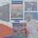

[主页](./main.md "main.md") | [首页](./comments1-100.md "comments1-100.md") | [前一页](./comments4901-5000.md "comments4901-5000.md") | [后一页](./comments5101-5200.md "comments5101-5200.md") | [末页](./comments10601-10700.md "comments10601-10700.md")  

---
*     [皓月琉璃](https://www.douban.com/people/153884600/)    2020-11-18 20:01:16  
  >还有这首。感觉是为杭州这站编曲的。  
  >  
  >https://m.weibo.cn/1878572722/4572681162722891  
  >
  >-- [哇咔咔呀](https://www.douban.com/people/213342632/)  
  
  听到说起静静子不舒服在家休息，虽很惦记，但能被cue到，还好，略感安心。  
---
*     [吃瓜](https://www.douban.com/people/219893584/)    2020-11-18 20:03:32  
  >早干嘛去了。。用好路透宣传节奏，本来节目一开始就应该如此。现在杭州这么做，更像是突然空降的  
  >
  >-- [哇咔咔呀](https://www.douban.com/people/213342632/)  
  
  看营销号就是因为需要宣男嘉宾呗，把姐姐们拉出去开着功放唱几首歌，唱的如何没所谓，让大家知道jnl wzy来了就行  
---
*     [哇咔咔呀](https://www.douban.com/people/213342632/)    2020-11-18 20:04:21  
  >要不就是为了新的嘉宾的宣传，要不就是节目组的反射弧终于感受到路透的重要了。  
  >
  >-- [cherrie199](https://www.douban.com/people/195510471/)  
  
  作为音乐综艺，我还期待过每一期都有一两首经得起大众品评有记忆度的歌曲，拍拍mv，节目播放前，提前把花絮释放出来，增加些路人期待感。啥啊，现在搞得  
---
*     [吃瓜](https://www.douban.com/people/219893584/)    2020-11-18 20:04:51  
  路演经理改jnl了啊  
---
*     [吃瓜](https://www.douban.com/people/219893584/)    2020-11-18 20:06:31  
  >作为音乐综艺，我还期待过每一期都有一两首经得起大众品评有记忆度的歌曲，拍拍mv，节目播放前，  
  >
  >-- [哇咔咔呀](https://www.douban.com/people/213342632/)  
  
  我觉得第一季的团就是被当实验品，每种方式都要试试，什么都来一下子。总结出来的经验就用到团综第二季上去……  
---
*     [哇咔咔呀](https://www.douban.com/people/213342632/)    2020-11-18 20:06:40  
  >路演经理改jnl了啊  
  >
  >-- [吃瓜](https://www.douban.com/people/219893584/)  
  
  对呀，一个经理，一个助手，全员补位到岗😓  
---
*     [cherrie199](https://www.douban.com/people/195510471/)    2020-11-18 20:07:54  
  >作为音乐综艺，我还期待过每一期都有一两首经得起大众品评有记忆度的歌曲，拍拍mv，节目播放前，  
  >
  >-- [哇咔咔呀](https://www.douban.com/people/213342632/)  
  
  也不知道是节目组和导演的脑回路异于常人，还是一开始就打算让这个团综糊穿地心，不跟浪2抢热度。这个综艺的各种操作真的让我看不懂。想当初跑男到我们城市录制，所有人都知道在哪里，能去现场都去现场，各种路透，路透也是一种对路人的宣传呀，唉！！！  
---
*     [吃瓜](https://www.douban.com/people/219893584/)    2020-11-18 20:08:12  
  >对呀，一个经理，一个助手，全员补位到岗😓  
  >
  >-- [哇咔咔呀](https://www.douban.com/people/213342632/)  
  
  那后面西安和长沙就还是这俩了，山争是真的跑了……  
---
*     [cherrie199](https://www.douban.com/people/195510471/)    2020-11-18 20:09:16  
  >作为音乐综艺，我还期待过每一期都有一两首经得起大众品评有记忆度的歌曲，拍拍mv，节目播放前，  
  >
  >-- [哇咔咔呀](https://www.douban.com/people/213342632/)  
  
  MV其实你不用期待了，第一期心花开的mv还是在山争哥哥指导下拍出来的，也就那个样子了，我就指望出好听的歌曲就行  
---
*     [哇咔咔呀](https://www.douban.com/people/213342632/)    2020-11-18 20:10:54  
  >我觉得第一季的团就是被当实验品，每种方式都要试试，什么都来一下子。总结出来的经验就用到团综  
  >
  >-- [吃瓜](https://www.douban.com/people/219893584/)  
  
  只能这么被动理解了。但是实验，也需要完善的策划团队还有随时调整拍摄策略听得进去建议，有足够能力和胸怀的节目团队啊。说到底，差评是他们节目组该得的。和姐姐们无关。  
---
*     [哇咔咔呀](https://www.douban.com/people/213342632/)    2020-11-18 20:21:13  
  >也不知道是节目组和导演的脑回路异于常人，还是一开始就打算让这个团综糊穿地心，不跟浪2抢热度  
  >
  >-- [cherrie199](https://www.douban.com/people/195510471/)  
  
  想糊是哪个节目都不希望看到的。这个原因可以pass的。感觉就是和浪姐制作团队更换的过于生硬了。新团队并没有对这个延续综艺和之前节目内容对接工作做好。对姐姐团也不够了解。闭门造车，还带有本身话题足够不用太策划细致的狂妄自大心态。  
---
*     [漠漠yt](https://www.douban.com/people/223048792/)    2020-11-18 20:22:31  
  呵呵呵  山争哥哥真的半路跑掉了 我都不知道该笑还是哭 笑 狗芒不做人逼走嘉宾 哭 我这么好的姐姐被这样对待利用  
---
*     [你同学](https://www.douban.com/people/186873665/)    2020-11-18 20:24:33  
  >还有这首。感觉是为杭州这站编曲的。  
  >  
  >https://m.weibo.cn/1878572722/4572681162722891  
  >
  >-- [哇咔咔呀](https://www.douban.com/people/213342632/)  
  
  歌还不错 就是唱… 拉尔多 拉尔多！终于明白为什么必须要有她静姐的妹妹成团了  
---
*     [cherrie199](https://www.douban.com/people/195510471/)    2020-11-18 20:25:43  
  >想糊是哪个节目都不希望看到的。这个原因可以pass的。感觉就是和浪姐制作团队更换的过于生硬了。  
  >
  >-- [哇咔咔呀](https://www.douban.com/people/213342632/)  
  
  虽然不想这么说，看到浪2已经马不停蹄的招商且明年一季度播出，实在觉得这个浪1售后团综是为了借热度再冲一波业绩。虽然节目组的工作人员肯定不希望这个节目糊，但是领导层明显对这个团综不重视。从配的团队工作能力足以说明一切，等这个团队意识到姐姐才是团综主角那天，恐怕节目已经全部录完了。  
---
*     [秃发雀丝](https://www.douban.com/people/3984012/)    2020-11-18 20:25:44  
  朋友还算是浪姐期间半个🌧️的粉丝 现在都没看过团综 这个节目真不知道在捂啥 粉丝盘都丢了  
---
*     [哇咔咔呀](https://www.douban.com/people/213342632/)    2020-11-18 20:26:08  
  >呵呵呵  山争哥哥真的半路跑掉了 我都不知道该笑还是哭 笑 狗芒不做人逼走嘉宾 哭 我这么好的姐  
  >
  >-- [漠漠yt](https://www.douban.com/people/223048792/)  
  
  山争作为导演的控场能力肯定远高于作为演员的JNL啊。。山争撤了一定有和制作团队沟通不畅的原因  
---
*     [哈咯](https://www.douban.com/people/218556081/)    2020-11-18 20:28:22  
  >对呀，一个经理，一个助手，全员补位到岗😓  
  >
  >-- [哇咔咔呀](https://www.douban.com/people/213342632/)  
  
  就非得找两个男的。。。jmz有什么毛病啊  
---
*     [哇咔咔呀](https://www.douban.com/people/213342632/)    2020-11-18 20:34:09  
  >虽然不想这么说，看到浪2已经马不停蹄的招商且明年一季度播出，实在觉得这个浪1售后团综是为了借  
  >
  >-- [cherrie199](https://www.douban.com/people/195510471/)  
  
  团队能力有大问题这不容置疑的。他们自己都不一定非常明确节目走向定位，就仓促竞标上岗了。播出的节目正片还有花絮中也出现了数次，制作参与和山争还有姐姐们讨论拍摄还有环节设置的画面，我就感觉看着散漫回应，来气。参演嘉宾是在实际片场的，她们的想法都不能被顺利参与考评，何况看的观众还有网友呢。  
---
*     [cherrie199](https://www.douban.com/people/195510471/)    2020-11-18 20:37:23  
  >团队能力有大问题这不容置疑的。他们自己都不一定非常明确节目走向定位，就仓促竞标上岗了。播出  
  >
  >-- [哇咔咔呀](https://www.douban.com/people/213342632/)  
  
  这节目，换什么嘉宾都没用，最该换的是团队，否则谁都救不了，可惜，换团队不可能，所以就～唉～  
---
*     [哇咔咔呀](https://www.douban.com/people/213342632/)    2020-11-18 20:39:05  
  >就非得找两个男的。。。jmz有什么毛病啊  
  >
  >-- [哈咯](https://www.douban.com/people/218556081/)  
  
  这是节目为拍摄初始，就订好的人员配置吧。“服务”姐姐旅行和路演，和音乐团队还有摄制团队沟通，总要有节目嘉宾担当。不能全下放给姐姐们直接来啊。这点我能理解。  
---
*     [已注销](https://www.douban.com/people/187860590/)    2020-11-18 20:44:43  
  >山争作为导演的控场能力肯定远高于作为演员的JNL啊。。山争撤了一定有和制作团队沟通不畅的原因  
  >
  >-- [哇咔咔呀](https://www.douban.com/people/213342632/)  
  
  你看第一次泉州碰面，山争明显没有提前被jmz解释一下前面节目一路走过来的各种渊源，没有了kenn做舞台，赵兆只负责音乐和乐队调试，舞台呈现任务全给了山争，泉州台风jmz都没有plan b，硬是顶着台风搭台子，山争又不能全程跟节目策划，给他四天时间搞定一切明显不现实，成都站应该也看出来姐姐们之间的微妙氛围，选择跑路只能说山争及时止损又聪明又勇敢  
---
*     [哇咔咔呀](https://www.douban.com/people/213342632/)    2020-11-18 20:45:10  
  >这节目，换什么嘉宾都没用，最该换的是团队，否则谁都救不了，可惜，换团队不可能，所以就～唉～  
  >
  >-- [cherrie199](https://www.douban.com/people/195510471/)  
  
  前天晚上她们刚到杭州，去住宿集结地的路上，静静不是有直播嘛，里面出现的一幕，让人大无语。当问及播出过节目中剪辑时长问题时，跟播导演居然回应“是因为你来晚了啊”拜托，这是成熟的编播制作从业能说出来的？😡  
---
*     [哇咔咔呀](https://www.douban.com/people/213342632/)    2020-11-18 20:46:50  
  >你看第一次泉州碰面，山争明显没有提前被jmz解释一下前面节目一路走过来的各种渊源，没有了kenn  
  >
  >-- [已注销](https://www.douban.com/people/187860590/)  
  
  爷不要你这个辛苦费了还不成😄😄  
---
*     [柳微微](https://www.douban.com/people/149620484/)    2020-11-18 20:47:58  
  >你看第一次泉州碰面，山争明显没有提前被jmz解释一下前面节目一路走过来的各种渊源，没有了kenn  
  >
  >-- [已注销](https://www.douban.com/people/187860590/)  
  
  因为节目组没做好功课什么都不知道。。。。  
---
*     [cherrie199](https://www.douban.com/people/195510471/)    2020-11-18 20:48:09  
  >前天晚上她们刚到杭州，去住宿集结地的路上，静静不是有直播嘛，里面出现的一幕，让人大无语。当  
  >
  >-- [哇咔咔呀](https://www.douban.com/people/213342632/)  
  
  所以后来能看到两次直播，静静似乎都怼了pd（如果我没有看错的话）。姐姐们对节目组意见还是很大的，尤其是很多安排。记得静静说过，很多时候她发脾气不是没理由的，多半是沟通了多次无果才发了脾气。她怼pd多半也是多次沟通无果的结果。  
---
*     [柳微微](https://www.douban.com/people/149620484/)    2020-11-18 20:50:51  
  更新了一个花絮，有葵➕蛋💰，我是在大碗CH看的  
---
*     [秃发雀丝](https://www.douban.com/people/3984012/)    2020-11-18 20:52:43  
  话说山争哥哥跑路 难道合约不是全部签的么  其实姐姐们的氛围比我预想的好很多 至少表面上是这样 节目策划组织实在带不动 浪费姐姐们的付出和时间成本🙃  
---
*     [吃瓜](https://www.douban.com/people/219893584/)    2020-11-18 20:52:59  
  说实话这个小路演出了后我反而更丧了，因为就路演来说现场效果非常不好，路人就完全是看明星的热闹  
---
*     [鱼丸子](https://www.douban.com/people/43183830/)    2020-11-18 20:55:18  
  >说实话这个小路演出了后我反而更丧了，因为就路演来说现场效果非常不好，路人就完全是看明星的热  
  >
  >-- [吃瓜](https://www.douban.com/people/219893584/)  
  
  同感 感觉很掉价  
---
*     [哇咔咔呀](https://www.douban.com/people/213342632/)    2020-11-18 20:55:53  
  >所以后来能看到两次直播，静静似乎都怼了pd（如果我没有看错的话）。姐姐们对节目组意见还是很大  
  >
  >-- [cherrie199](https://www.douban.com/people/195510471/)  
  
  静静是尊重舞台展现，尊重本职工作，才会对节目效果有期望，这根本不是几分钟多少的问题，说到底是韧劲和认真。  
---
*     [cherrie199](https://www.douban.com/people/195510471/)    2020-11-18 21:00:29  
  >静静是尊重舞台展现，尊重本职工作，才会对节目效果有期望，这根本不是几分钟多少的问题，说到底  
  >
  >-- [哇咔咔呀](https://www.douban.com/people/213342632/)  
  
  静静肯定不是为了她哪些出场时长较真，这个团综呈现出来的效果，粉丝们观看后的反馈她也许都看到了。即使真人秀部分不太好看，姐姐们也希望留下好的舞台好的歌曲。可惜节目组能力有限，就目前这个流程安排，策划能力和每一站十分有限的4天录制时间，姐姐们再有意见再心急也没用。  
---
*     [。](https://www.douban.com/people/164210963/)    2020-11-18 21:08:13  
  这么晚了又要去哪，不给姐姐们点自由安排的时间吗  
---
*     [哇咔咔呀](https://www.douban.com/people/213342632/)    2020-11-18 21:13:35  
  >https://m.weibo.cn/3183940970/4572702872967829  
  >这么晚了又要去哪，不给姐姐们点自由安排的时  
  >
  >-- [。](https://www.douban.com/people/164210963/)  
  
  她好乖。  
---
*     [吃瓜](https://www.douban.com/people/219893584/)    2020-11-18 21:16:13  
  这又是要上哪去啊？连着两天跑来跑去的，难怪只能凌晨练歌……  
---
*     [哇咔咔呀](https://www.douban.com/people/213342632/)    2020-11-18 21:18:30  
  >静静肯定不是为了她哪些出场时长较真，这个团综呈现出来的效果，粉丝们观看后的反馈她也许都看到  
  >
  >-- [cherrie199](https://www.douban.com/people/195510471/)  
  
  没办法。作为歌手路粉，我对优质音乐作品的期待，远远大于对这个综艺的期待了。只希望她们平安录制完毕，有好歌润耳留存下来。  
---
*     [一棵麦芽糖](https://www.douban.com/people/114181779/)    2020-11-18 21:19:01  
  今天看到静静了么  
---
*     [chen](https://www.douban.com/people/179141216/)    2020-11-18 21:19:31  
  >说实话这个小路演出了后我反而更丧了，因为就路演来说现场效果非常不好，路人就完全是看明星的热  
  >
  >-- [吃瓜](https://www.douban.com/people/219893584/)  
  
  同感 明明能有更好的呈现方式 非要搞这么 哎  
---
*     [cherrie199](https://www.douban.com/people/195510471/)    2020-11-18 21:21:24  
  >没办法。作为歌手路粉，我对优质音乐作品的期待，远远大于对这个综艺的期待了。只希望她们平安录  
  >
  >-- [哇咔咔呀](https://www.douban.com/people/213342632/)  
  
  我对这个团综的期待也只有出一些好听的歌，其他也没啥了，反正还有两站，希望姐姐们保重身体吧  
---
*     [cherrie199](https://www.douban.com/people/195510471/)    2020-11-18 21:21:46  
  >这又是要上哪去啊？连着两天跑来跑去的，难怪只能凌晨练歌……  
  >
  >-- [吃瓜](https://www.douban.com/people/219893584/)  
  
  20号路演，明天还有一天可以练习  
---
*     [吃瓜](https://www.douban.com/people/219893584/)    2020-11-18 21:28:27  
  >https://m.weibo.cn/3183940970/4572702872967829  
  >这么晚了又要去哪，不给姐姐们点自由安排的时  
  >
  >-- [。](https://www.douban.com/people/164210963/)  
  
  放大看了后感觉和葵同车的是静静？还是我今天没看到她太想她了出现幻觉了？  
---
*     [漠漠yt](https://www.douban.com/people/223048792/)    2020-11-18 21:30:39  
  >放大看了后感觉和葵同车的是静静？还是我今天没看到她太想她了出现幻觉了？  
  >
  >-- [吃瓜](https://www.douban.com/people/219893584/)  
  
  好像是静姐 那黄毛 吸引眼球  
---
*     [漠漠yt](https://www.douban.com/people/223048792/)    2020-11-18 21:33:00  
  >我对这个团综的期待也只有出一些好听的歌，其他也没啥了，反正还有两站，希望姐姐们保重身体吧  
  >
  >-- [cherrie199](https://www.douban.com/people/195510471/)  
  
  我对歌手的歌很期待 静静子就尽量开心一点吧 jmz对姐姐们好点吧 团综快点结束 姐姐快点上岸  
---
*     [路人甲路过](https://www.douban.com/people/223824345/)    2020-11-18 21:33:01  
  >好像是静姐 那黄毛 吸引眼球  
  >
  >-- [漠漠yt](https://www.douban.com/people/223048792/)  
  
  那明显是孟佳的长发啊😂  
---
*     [漠漠yt](https://www.douban.com/people/223048792/)    2020-11-18 21:33:51  
  >那明显是孟佳的长发啊😂  
  >
  >-- [路人甲路过](https://www.douban.com/people/223824345/)  
  
  😂😂我看了好几次 都看成静姐的  那我再去看看  
---
*     [chen](https://www.douban.com/people/179141216/)    2020-11-18 21:34:02  
  >好像是静姐 那黄毛 吸引眼球  
  >
  >-- [漠漠yt](https://www.douban.com/people/223048792/)  
  
  仔细去辨认了一下 是佳🐦  
---
*     [吃瓜](https://www.douban.com/people/219893584/)    2020-11-18 21:34:54  
  果然是幻觉吗？看来今天是见不到静静了，洗洗睡喽  
---
*     [漠漠yt](https://www.douban.com/people/223048792/)    2020-11-18 21:35:54  
  >仔细去辨认了一下 是佳🐦  
  >
  >-- [chen](https://www.douban.com/people/179141216/)  
  
  你们知道吗 我第一次看 就觉得是静姐 但心里在想  她发型咋变成二公的了😂  但那口红颜色让我一直觉得是静姐如😂  
---
*     [漠漠yt](https://www.douban.com/people/223048792/)    2020-11-18 21:36:11  
  看来是我太想她了  
---
*     [cherrie199](https://www.douban.com/people/195510471/)    2020-11-18 21:41:43  
  同车是佳哥，静静子今天可能都在休息，或者练习  
---
*     [muki](https://www.douban.com/people/190049323/)    2020-11-18 21:49:54  
  宝贝没出现的第一天 想她🥲  
---
*     [大玉米momo](https://www.douban.com/people/217504201/)    2020-11-18 22:06:20  
  想静静  
---
*     [皓月琉璃](https://www.douban.com/people/153884600/)    2020-11-18 22:11:32  
  >https://m.weibo.cn/3183940970/4572702872967829  
  >这么晚了又要去哪，不给姐姐们点自由安排的时  
  >
  >-- [。](https://www.douban.com/people/164210963/)  
  
  那个酒店好像是换衣服的地方，换完回家了。我的问题是……在哪吃的饭，我静一人吃晚饭没有😒  
---
*     [。](https://www.douban.com/people/164210963/)    2020-11-18 22:11:41  
  >这又是要上哪去啊？连着两天跑来跑去的，难怪只能凌晨练歌……  
  >
  >-- [吃瓜](https://www.douban.com/people/219893584/)  
  
  应该是从酒店回名宿了  
---
*     [漠漠yt](https://www.douban.com/people/223048792/)    2020-11-18 22:16:40  
  >那个酒店好像是换衣服的地方，换完回家了。我的问题是……在哪吃的饭，我静一人吃晚饭没有😒  
  >
  >-- [皓月琉璃](https://www.douban.com/people/153884600/)  
  
  饭应该是会安排的 就看姐姐吃不吃的下 有没有胃口  
---
*     [aaakkkiii](https://www.douban.com/people/aki102/)    2020-11-18 22:17:55  
  自从看了静静直播里她和pd不愉快的对话后，就老担心她们对静静不好😭  
---
*     [SiofnaFan](https://www.douban.com/people/180076918/)    2020-11-18 22:18:54  
  这个应该是回到了民宿的路透图了  
---
*     [Evita，](https://www.douban.com/people/evita1009/)    2020-11-18 22:19:46  
  >自从看了静静直播里她和pd不愉快的对话后，就老担心她们对静静不好😭  
  >
  >-- [aaakkkiii](https://www.douban.com/people/aki102/)  
  
  我这老母亲的心情跟你一样，为了今晚能好好休息，我都不得不去刷做饭视频转移注意力  
---
*     [candy](https://www.douban.com/people/7219773/)    2020-11-18 22:21:19  
  爬完楼 怎么气氛这么忧伤  
  看了下小路演，确实现场效果不好   
  至少静姐不用为了那个小路演带病坚持  不值得  
---
*     [SiofnaFan](https://www.douban.com/people/180076918/)    2020-11-18 22:23:15  
  不知道今天还能不能看到静静，或者确认她无大碍😕  
  让姐姐们早点休息吧，葵葵也是特殊时期啊  
---
*     [candy](https://www.douban.com/people/7219773/)    2020-11-18 22:24:45  
  这个表演  依旧是节目组 不知道为了什么临时上赶瞎弄的  
  如果是跑男 极限挑战 这类游戏类综艺，这样唱和路人们互动一下 让气氛热闹一点  
  但这是个所谓的音综  这安排的  这唱的 比商场门口卖货的好不了多少  
---
*     [会游泳的猫](https://www.douban.com/people/222984746/)    2020-11-18 22:32:51  
  >饭应该是会安排的 就看姐姐吃不吃的下 有没有胃口  
  >
  >-- [漠漠yt](https://www.douban.com/people/223048792/)  
  
  不知道酒店有没有安排，佳鸽手上打包的食物是给静姐的  
---
*     [皓月琉璃](https://www.douban.com/people/153884600/)    2020-11-18 22:34:46  
  >这个表演  依旧是节目组 不知道为了什么临时上赶瞎弄的  
  >如果是跑男 极限挑战 这类游戏类综艺，这  
  >
  >-- [candy](https://www.douban.com/people/7219773/)  
  
  有些莫名。你说是给西湖畔游人LIVE吧，船在湖中央看不见姐姐都，有谁都不知道～音效也空旷分散没法听。你说是录制给电视前的观众吧，又搞了公放并喊话游人～就，感觉不到专业操作，不知道瞎玩啥呢一天天的～  
---
*     [皓月琉璃](https://www.douban.com/people/153884600/)    2020-11-18 22:35:59  
  >不知道酒店有没有安排，佳鸽手上打包的食物是给静姐的  
  >
  >-- [会游泳的猫](https://www.douban.com/people/222984746/)  
  
  看到路透照片时，琢磨了一下，没想到真是，就她举了个一次性饭盒……  
---
*     [Shirley Tian](https://www.douban.com/people/150047836/)    2020-11-18 22:38:30  
  我来咯～什么小路演，有没有链接给我看看😰  
---
*     [candy](https://www.douban.com/people/7219773/)    2020-11-18 22:39:54  
  >有些莫名。你说是给西湖畔游人LIVE吧，船在湖中央看不见姐姐都，有谁都不知道～音效也空旷分散没  
  >
  >-- [皓月琉璃](https://www.douban.com/people/153884600/)  
  
  我只想到是给新来两男的话题  节目组买营销号热搜走一波？  
---
*     [Unknow](https://www.douban.com/people/219306324/)    2020-11-18 22:40:15  
  >我来咯～什么小路演，有没有链接给我看看😰  
  >
  >-- [Shirley Tian](https://www.douban.com/people/150047836/)  
  
  爬爬楼 楼上都有 个超也有  
---
*     [皓月琉璃](https://www.douban.com/people/153884600/)    2020-11-18 22:43:08  
  >我只想到是给新来两男的话题  节目组买营销号热搜走一波？  
  >
  >-- [candy](https://www.douban.com/people/7219773/)  
  
  也许，突然就搞了个公开，可能想各种办法救节jm……而且杭州也基本捂不住啥～  
---
*     [minimum](https://www.douban.com/people/218236166/)    2020-11-18 22:44:34  
  >我来咯～什么小路演，有没有链接给我看看😰  
  >
  >-- [Shirley Tian](https://www.douban.com/people/150047836/)  
  
  你这没睡几个小时啊  
---
*     [candy](https://www.douban.com/people/7219773/)    2020-11-18 22:46:07  
  >也许，突然就搞了个公开，可能想各种办法救节jm……而且杭州也基本捂不住啥～  
  >
  >-- [皓月琉璃](https://www.douban.com/people/153884600/)  
  
  按照节目组尬买热搜的习惯  热搜标题可以是    
  “JNL  与 WZY 千年等一回”  
---
*     [蒜苔开出了鲜花](https://www.douban.com/people/26765466/)    2020-11-18 22:47:41  
  >同感 感觉很掉价  
  >
  >-- [鱼丸子](https://www.douban.com/people/43183830/)  
  
  顶锅盖说，我下午第一次看到时候感觉像耍猴或者说是跑江湖的草台戏班  
---
*     [哇咔咔呀](https://www.douban.com/people/213342632/)    2020-11-18 22:48:13  
  >不知道酒店有没有安排，佳鸽手上打包的食物是给静姐的  
  >
  >-- [会游泳的猫](https://www.douban.com/people/222984746/)  
  
  我眼睛看错了？举着打包盒的是小🌻吧  
---
*     [candy](https://www.douban.com/people/7219773/)    2020-11-18 22:49:10  
  >顶锅盖说，我下午第一次看到时候感觉像耍猴或者说是跑江湖的草台戏班  
  >
  >-- [蒜苔开出了鲜花](https://www.douban.com/people/26765466/)  
  
  +1……  
---
*     [Yisa黎珞](https://www.douban.com/people/217273308/)    楼主    2020-11-18 22:49:21  
  姐姐已到，flow合体  
---
* [![[已注销]](../../image/icon/user_normal.jpg)](https://www.douban.com/people/219008874/)    [[已注销]](https://www.douban.com/people/219008874/)    2020-11-18 22:49:23  
  飞行是琼姐，憋死我了～已经到民宿了  
---
*     [Shirley Tian](https://www.douban.com/people/150047836/)    2020-11-18 22:50:07  
  >你这没睡几个小时啊  
  >
  >-- [minimum](https://www.douban.com/people/218236166/)  
  
  我得起来上班。。。  
---
*     [SiofnaFan](https://www.douban.com/people/180076918/)    2020-11-18 22:50:23  
  >我眼睛看错了？举着打包盒的是小🌻吧  
  >
  >-- [哇咔咔呀](https://www.douban.com/people/213342632/)  
  
  拿着东西的是葵，不过确定是打包盒？  
---
*     [Shirley Tian](https://www.douban.com/people/150047836/)    2020-11-18 22:50:30  
  >姐姐已到，flow合体  
  >
  >-- [Yisa黎珞](https://www.douban.com/people/217273308/)  
  
  啊啊啊啊啊啊啊啊flow  
---
*     [哇咔咔呀](https://www.douban.com/people/213342632/)    2020-11-18 22:50:35  
  >姐姐已到，flow合体  
  >
  >-- [Yisa黎珞](https://www.douban.com/people/217273308/)  
  
  这个消息很好  
---
*     [SiofnaFan](https://www.douban.com/people/180076918/)    2020-11-18 22:50:41  
  >姐姐已到，flow合体  
  >
  >-- [Yisa黎珞](https://www.douban.com/people/217273308/)  
  
  我去……真的呀……  
---
*     [元素周期表51号](https://www.douban.com/people/199280408/)    2020-11-18 22:50:50  
  >飞行是琼姐，憋死我了～已经到民宿了  
  >
  >-- [[已注销]](https://www.douban.com/people/219008874/)  
  
  ？？啊啊啊啊啊啊啊啊啊啊啊啊我死了啊啊啊啊啊啊啊啊啊啊啊  
---
*     [Yisa黎珞](https://www.douban.com/people/217273308/)    楼主    2020-11-18 22:51:05  
  >啊啊啊啊啊啊啊啊flow  
  >
  >-- [Shirley Tian](https://www.douban.com/people/150047836/)  
  
  Flowszd啊啊啊啊啊啊啊啊啊啊啊啊  
---
*     [SiofnaFan](https://www.douban.com/people/180076918/)    2020-11-18 22:51:10  
  >飞行是琼姐，憋死我了～已经到民宿了  
  >
  >-- [[已注销]](https://www.douban.com/people/219008874/)  
  
  这下子静葵开心了！  
  希望静静身体也跟着快快好起来😘  
---
*     [echo](https://www.douban.com/people/219314368/)    2020-11-18 22:51:13  
  啊啊啊啊啊啊啊啊！！！我的FLOW！！！！  
---
*     [萌主](https://www.douban.com/people/217820198/)    2020-11-18 22:51:18  
  啊啊啊啊 要死了 静静子的病也能好了  
---
*     [candy](https://www.douban.com/people/7219773/)    2020-11-18 22:51:25  
  >姐姐已到，flow合体  
  >
  >-- [Yisa黎珞](https://www.douban.com/people/217273308/)  
  
  这是个好消息  
---
*     [Yisa黎珞](https://www.douban.com/people/217273308/)    楼主    2020-11-18 22:51:31  
  >这个消息很好  
  >
  >-- [哇咔咔呀](https://www.douban.com/people/213342632/)  
  
  是，静静今天身体不适，终于有开心的事情了  
---
*     [Evita，](https://www.douban.com/people/evita1009/)    2020-11-18 22:51:42  
  啊啊啊啊啊，心情顿时高兴无比  
---
*     [哇咔咔呀](https://www.douban.com/people/213342632/)    2020-11-18 22:52:02  
  >拿着东西的是葵，不过确定是打包盒？  
  >
  >-- [SiofnaFan](https://www.douban.com/people/180076918/)  
  
  我不确定是不是打包盒，但是我也没看见楼上说的什么🐦拎打包盒啊😄  
---
*     [萌主](https://www.douban.com/people/217820198/)    2020-11-18 22:52:15  
  看样子静静子和葵都不知道 而且前天刚那么期盼过 这下肯定特别惊喜  
---
*     [Yisa黎珞](https://www.douban.com/people/217273308/)    楼主    2020-11-18 22:52:23  
  >飞行是琼姐，憋死我了～已经到民宿了  
  >
  >-- [[已注销]](https://www.douban.com/people/219008874/)  
  
  我也憋死了，为了flow一直憋着  
---
*     [元素周期表51号](https://www.douban.com/people/199280408/)    2020-11-18 22:52:32  
  刚在弟弟那看了一圈，对不起英霞，我不应该担心声音状态，您继续玩，这高音还能再浪几年  
---
* [![[已注销]](../../image/icon/user_normal.jpg)](https://www.douban.com/people/219008874/)    [[已注销]](https://www.douban.com/people/219008874/)    2020-11-18 22:53:04  
  憋了好几天了，我要啊啊啊啊啊啊啊啊啊啊啊啊啊啊啊啊一下  
---
*     [六月六的苗](https://www.douban.com/people/156939306/)    2020-11-18 22:54:04  
  啊啊啊啊啊啊啊iflow飞黄腾达！  
---
*     [SiofnaFan](https://www.douban.com/people/180076918/)    2020-11-18 22:54:11  
  >我不确定是不是打包盒，但是我也没看见楼上说的什么🐦拎打包盒啊😄  
  >
  >-- [哇咔咔呀](https://www.douban.com/people/213342632/)  
  
  🤣我以为又有新的路透照了  
---
*     [蒜苔开出了鲜花](https://www.douban.com/people/26765466/)    2020-11-18 22:54:19  
  >姐姐已到，flow合体  
  >
  >-- [Yisa黎珞](https://www.douban.com/people/217273308/)  
  
  娃哈哈哈哈哈哈，希望可以让jjz开心一点，身体快快好起来～  
---
*     [Unknow](https://www.douban.com/people/219306324/)    2020-11-18 22:54:45  
  >姐姐已到，flow合体  
  >
  >-- [Yisa黎珞](https://www.douban.com/people/217273308/)  
  
  啊啊啊啊啊啊啊 iflow 又觉得可以了  
---
*     [鱼丸子](https://www.douban.com/people/43183830/)    2020-11-18 22:55:05  
  我天iflow终于合体了😭睡前终于有点好消息了  
---
*     [堂堂一跑堂](https://www.douban.com/people/145292257/)    2020-11-18 22:55:53  
  我天，我的快乐又来了  
---
*     [堂堂一跑堂](https://www.douban.com/people/145292257/)    2020-11-18 22:56:12  
  极道姐妹花就是坠🦅的  
---
*     [吃瓜](https://www.douban.com/people/219893584/)    2020-11-18 22:56:24  
  睡前终于看到点好消息了，静静好好休息，期待flow合体演唱  
---

5001-5100

---

[主页](./main.md "main.md") | [首页](./comments1-100.md "comments1-100.md") | [前一页](./comments4901-5000.md "comments4901-5000.md") | [后一页](./comments5101-5200.md "comments5101-5200.md") | [末页](./comments10601-10700.md "comments10601-10700.md")  

---
[1-100](./comments1-100.md "1-100")  [101-200](./comments101-200.md "101-200")  [201-300](./comments201-300.md "201-300")  [301-400](./comments301-400.md "301-400")  [401-500](./comments401-500.md "401-500")  [501-600](./comments501-600.md "501-600")  [601-700](./comments601-700.md "601-700")  [701-800](./comments701-800.md "701-800")  [801-900](./comments801-900.md "801-900")  [901-1000](./comments901-1000.md "901-1000")  [1001-1100](./comments1001-1100.md "1001-1100")  [1101-1200](./comments1101-1200.md "1101-1200")  [1201-1300](./comments1201-1300.md "1201-1300")  [1301-1400](./comments1301-1400.md "1301-1400")  [1401-1500](./comments1401-1500.md "1401-1500")  [1501-1600](./comments1501-1600.md "1501-1600")  [1601-1700](./comments1601-1700.md "1601-1700")  [1701-1800](./comments1701-1800.md "1701-1800")  [1801-1900](./comments1801-1900.md "1801-1900")  [1901-2000](./comments1901-2000.md "1901-2000")  [2001-2100](./comments2001-2100.md "2001-2100")  [2101-2200](./comments2101-2200.md "2101-2200")  [2201-2300](./comments2201-2300.md "2201-2300")  [2301-2400](./comments2301-2400.md "2301-2400")  [2401-2500](./comments2401-2500.md "2401-2500")  [2501-2600](./comments2501-2600.md "2501-2600")  [2601-2700](./comments2601-2700.md "2601-2700")  [2701-2800](./comments2701-2800.md "2701-2800")  [2801-2900](./comments2801-2900.md "2801-2900")  [2901-3000](./comments2901-3000.md "2901-3000")  [3001-3100](./comments3001-3100.md "3001-3100")  [3101-3200](./comments3101-3200.md "3101-3200")  [3201-3300](./comments3201-3300.md "3201-3300")  [3301-3400](./comments3301-3400.md "3301-3400")  [3401-3500](./comments3401-3500.md "3401-3500")  [3501-3600](./comments3501-3600.md "3501-3600")  [3601-3700](./comments3601-3700.md "3601-3700")  [3701-3800](./comments3701-3800.md "3701-3800")  [3801-3900](./comments3801-3900.md "3801-3900")  [3901-4000](./comments3901-4000.md "3901-4000")  [4001-4100](./comments4001-4100.md "4001-4100")  [4101-4200](./comments4101-4200.md "4101-4200")  [4201-4300](./comments4201-4300.md "4201-4300")  [4301-4400](./comments4301-4400.md "4301-4400")  [4401-4500](./comments4401-4500.md "4401-4500")  [4501-4600](./comments4501-4600.md "4501-4600")  [4601-4700](./comments4601-4700.md "4601-4700")  [4701-4800](./comments4701-4800.md "4701-4800")  [4801-4900](./comments4801-4900.md "4801-4900")  [4901-5000](./comments4901-5000.md "4901-5000")  [5001-5100](./comments5001-5100.md "5001-5100")  [5101-5200](./comments5101-5200.md "5101-5200")  [5201-5300](./comments5201-5300.md "5201-5300")  [5301-5400](./comments5301-5400.md "5301-5400")  [5401-5500](./comments5401-5500.md "5401-5500")  [5501-5600](./comments5501-5600.md "5501-5600")  [5601-5700](./comments5601-5700.md "5601-5700")  [5701-5800](./comments5701-5800.md "5701-5800")  [5801-5900](./comments5801-5900.md "5801-5900")  [5901-6000](./comments5901-6000.md "5901-6000")  [6001-6100](./comments6001-6100.md "6001-6100")  [6101-6200](./comments6101-6200.md "6101-6200")  [6201-6300](./comments6201-6300.md "6201-6300")  [6301-6400](./comments6301-6400.md "6301-6400")  [6401-6500](./comments6401-6500.md "6401-6500")  [6501-6600](./comments6501-6600.md "6501-6600")  [6601-6700](./comments6601-6700.md "6601-6700")  [6701-6800](./comments6701-6800.md "6701-6800")  [6801-6900](./comments6801-6900.md "6801-6900")  [6901-7000](./comments6901-7000.md "6901-7000")  [7001-7100](./comments7001-7100.md "7001-7100")  [7101-7200](./comments7101-7200.md "7101-7200")  [7201-7300](./comments7201-7300.md "7201-7300")  [7301-7400](./comments7301-7400.md "7301-7400")  [7401-7500](./comments7401-7500.md "7401-7500")  [7501-7600](./comments7501-7600.md "7501-7600")  [7601-7700](./comments7601-7700.md "7601-7700")  [7701-7800](./comments7701-7800.md "7701-7800")  [7801-7900](./comments7801-7900.md "7801-7900")  [7901-8000](./comments7901-8000.md "7901-8000")  [8001-8100](./comments8001-8100.md "8001-8100")  [8101-8200](./comments8101-8200.md "8101-8200")  [8201-8300](./comments8201-8300.md "8201-8300")  [8301-8400](./comments8301-8400.md "8301-8400")  [8401-8500](./comments8401-8500.md "8401-8500")  [8501-8600](./comments8501-8600.md "8501-8600")  [8601-8700](./comments8601-8700.md "8601-8700")  [8701-8800](./comments8701-8800.md "8701-8800")  [8801-8900](./comments8801-8900.md "8801-8900")  [8901-9000](./comments8901-9000.md "8901-9000")  [9001-9100](./comments9001-9100.md "9001-9100")  [9101-9200](./comments9101-9200.md "9101-9200")  [9201-9300](./comments9201-9300.md "9201-9300")  [9301-9400](./comments9301-9400.md "9301-9400")  [9401-9500](./comments9401-9500.md "9401-9500")  [9501-9600](./comments9501-9600.md "9501-9600")  [9601-9700](./comments9601-9700.md "9601-9700")  [9701-9800](./comments9701-9800.md "9701-9800")  [9801-9900](./comments9801-9900.md "9801-9900")  [9901-10000](./comments9901-10000.md "9901-10000")  [10001-10100](./comments10001-10100.md "10001-10100")  [10101-10200](./comments10101-10200.md "10101-10200")  [10201-10300](./comments10201-10300.md "10201-10300")  [10301-10400](./comments10301-10400.md "10301-10400")  [10401-10500](./comments10401-10500.md "10401-10500")  [10501-10600](./comments10501-10600.md "10501-10600")  [10601-10700](./comments10601-10700.md "10601-10700")  