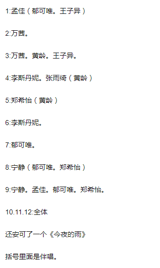

[返回目录](../../README.md "README.md")

# 「party for two，we are one」- 杭州站·完结
    来自: [Yisa黎珞](https://www.douban.com/people/217273308/)    2020-11-12 08:00:07

> 友谊是灵魂的结合，这个结合是可以离异的，这是两个敏感，正直的人之间心照不宣的契约。  
> ----伏尔泰  

    杭州站楼里总结：日常闲聊，日常关爱节目组，日常爱静葵，虽有争论，但真实  
    
    杭州站静葵总结：离谱，天赐，般配，憋屈，难受，惊喜，欢乐，平常，宠溺，疼痛，美好

楼名歌曲：  
> Party For Two： [https://y.qq.com/n/yqq/song/000rUl5c023nVl.html](https://y.qq.com/n/yqq/song/000rUl5c023nVl.html)  
> We Are One [https://y.qq.com/n/yqq/song/0046frH62rqddt.html](https://y.qq.com/n/yqq/song/0046frH62rqddt.html)  

歌曲汇总：  
*   小摩托 (Live) [https://music.163.com/#/song?id=1493073534](https://music.163.com/#/song?id=1493073534)
*   在风中 (Live) [https://music.163.com/#/song?id=1493076216](https://music.163.com/#/song?id=1493076216)
*   想去海边 (Live) [https://music.163.com/#/song?id=1493073544](https://music.163.com/#/song?id=1493073544)
*   心花开 (Live) [https://music.163.com/#/song?id=1489342354](https://music.163.com/#/song?id=1489342354)
*   路过人间 (Live) [https://music.163.com/#/song?id=1495052210](https://music.163.com/#/song?id=1495052210)
*   最美的太短暂 (Live) [https://music.163.com/#/song?id=1496777303](https://music.163.com/#/song?id=1496777303)

西安站楼名  
拉票宣言：  
> 光阴如晤：正如古城细雨裸巷人家，漫漫悠长，走过的痕迹，印在心中不消散 

> 镜中人，梦相随：和镜中静唯可唯重叠

> 信徒，十年如一日：顺口又长久，很适合表白和纪念 

往期回顾👇  
1.  [「路过人间，感谢有你」- 泉州站.完结](https://www.douban.com/group/topic/195923820/)
2.  [「我的城，和你一起」—成都站·完结](https://www.douban.com/group/topic/197767383/)
3.  [「一路阳光，微加幸福」—云南站·启程](https://www.douban.com/group/topic/199047732/?start=0)  

  
镇楼图  
  
镇楼图

## 其他线下物料  
*   11.11更新👇
考拉直播  
  
时尚女魔头  
  
绝代佳人  
  
VLOG奶包  
  
SMC VLOG里的静葵  
  
摔了PP后努力工作的葵  

*   2020-11-21 葵发长文，并透露关键词，四合院！！  
  
崽崽努力赚钱啊  
  
葵最爱你么么~~

*   2020-11-23 葵vlog  
  
静静为什么这么听话  
  
消音~~~  
  
big胆子  

*   2020-11-24 长沙快本录制 一前一后进机场  
  
how pay  

*   2020-11-25 葵上天了  
  
姐上天了  

*   2020-11-26 长沙飞北京  
  
酷酷的崽崽  
  
奶奶的小可爱  
  
长沙大本营repo，这是真实存在的美好嘛？  
  
郁葵矫情感言  

## 杭州站-物料锦集

*   2020-11-16 葵（身体原因）误机4小时与静静同机（是什么让你我相遇，是命运）静葵双直播  
杭州直播双视角地址：[静葵双视角直播](https://www.bilibili.com/video/BV1vt4y1a7RJ?p=1&share_medium=android&share_plat=android&share_source=COPY&share_tag=s_i&timestamp=1605563737&unique_k=FtK68j)  
  
美好  
  
她们在笑  
  
开开心心  

*   2020-11-17 静静直播，美少年入镜  
直播地址----[小红书直播](https://www.bilibili.com/video/BV1bK4y1Z7eq)  
  
好帅好可爱  
  
四美集齐  
  
她好奶~~  
  
她好漂亮~  
  
她好可爱  
  
两只崽崽的后脑勺  

*   2020-11-18 杭州西湖快闪，静静身体不适未参加
2020-11-18历史性时刻flow合体！！！
  
高糊的合体  
可以看一万遍的flow3人直播地址-----[Flow直播](https://www.bilibili.com/video/BV1954y1r7Qf?from=search&amp%3Bseid=186208095592624551)  

*   2020-11-19 两位崽崽路透  
  
她开心就好  
  
她开心就好  
  
到了晚上就变帅了是怎么回事  
  
私心再放一张

*   2020-11-20 静静直播，静静心情不好，葵变身及时点歌台哄姐姐开心  
静静直播地址-------------------[静静直播全程](https://www.bilibili.com/video/BV14a411w7oL?t=4731)  
人肉点歌机（葵）歌单指路地址---------[人肉点歌机（葵）歌单](https://music.163.com/#/playlist?id=5342897469&amp;updTime=1605851459985/m/)  
  
美好  
  
想不到形容词  
  
how pay  

*   路演repo：天气不好下起了雨；静静说紧张，葵说我们都陪着你呢~；葵放加州梦游，静静说好听，可不可以放在路演里；葵sol之前说了很多话；julia唱到’要懂得珍惜爱才完美‘静指葵，俩人互相摸了手臂  
歌单：  
  
静葵琼：julia （葵琼和音）  
静葵琼佳雨：加州梦游  

*   路演结束葵不慎摔倒（楼梯）摔倒，好心疼~~~~

## 成都站-直播锦集

*   姐姐惊喜盲盒 ：[惊喜芒盒第2期：郁可唯-路演策划团队](https://www.mgtv.com/b/349638/10299073.html?fpa=se&amp%3Blastp=so_result)  

*     
可可爱爱的  
  
奶里奶气的  
  
成都前线视角，末日大片  
  
引用楼里评论： 因本命的缘故，我一直相信娱乐圈有真正的友谊，静静和可唯之间的情谊，不是因对方的资历地位或是其他的什么，而是因为她们相互欣赏，性格相似又互补。从夏日限定的浪姐，到秋冬放送的爱乐，她们表现出来的情谊，我一直都能感受得到。团综录制已过半，结束之后各奔前程，知己难觅，希望在未知的将来，两位姐姐能彼此珍惜，保持这份情谊  
  
路过人间，路过你我  
  
两个可爱宝贝  
  
差3秒  
  
泪眼汪汪的静静  
  
我的姐姐只能我CUE  
  
一起来  
  
感谢JMZ能放出来  
  
她好帅  
  
她好奶帅  
  
安慰静静，怎么看像撒娇~  
  
为数不多的俩人练习镜头  
  
她有她自己的小浪漫  
  
xxj抢照片  
  
挽手一起走  
  
这可能就是四合院的日常

* 2020-11-26 感谢JMZ，静葵不再是陌生人

## 杭州站-结束
> 为了记住你的笑容，我拼命按下心中的快门。  
> ——《美丽人生》

  
希望每个路过这里的人，都能开开心心  

## 留言
---
[1-100](./comments1-100.md "1-100")  [101-200](./comments101-200.md "101-200")  [201-300](./comments201-300.md "201-300")  [301-400](./comments301-400.md "301-400")  [401-500](./comments401-500.md "401-500")  [501-600](./comments501-600.md "501-600")  [601-700](./comments601-700.md "601-700")  [701-800](./comments701-800.md "701-800")  [801-900](./comments801-900.md "801-900")  [901-1000](./comments901-1000.md "901-1000")  [1001-1100](./comments1001-1100.md "1001-1100")  [1101-1200](./comments1101-1200.md "1101-1200")  [1201-1300](./comments1201-1300.md "1201-1300")  [1301-1400](./comments1301-1400.md "1301-1400")  [1401-1500](./comments1401-1500.md "1401-1500")  [1501-1600](./comments1501-1600.md "1501-1600")  [1601-1700](./comments1601-1700.md "1601-1700")  [1701-1800](./comments1701-1800.md "1701-1800")  [1801-1900](./comments1801-1900.md "1801-1900")  [1901-2000](./comments1901-2000.md "1901-2000")  [2001-2100](./comments2001-2100.md "2001-2100")  [2101-2200](./comments2101-2200.md "2101-2200")  [2201-2300](./comments2201-2300.md "2201-2300")  [2301-2400](./comments2301-2400.md "2301-2400")  [2401-2500](./comments2401-2500.md "2401-2500")  [2501-2600](./comments2501-2600.md "2501-2600")  [2601-2700](./comments2601-2700.md "2601-2700")  [2701-2800](./comments2701-2800.md "2701-2800")  [2801-2900](./comments2801-2900.md "2801-2900")  [2901-3000](./comments2901-3000.md "2901-3000")  [3001-3100](./comments3001-3100.md "3001-3100")  [3101-3200](./comments3101-3200.md "3101-3200")  [3201-3300](./comments3201-3300.md "3201-3300")  [3301-3400](./comments3301-3400.md "3301-3400")  [3401-3500](./comments3401-3500.md "3401-3500")  [3501-3600](./comments3501-3600.md "3501-3600")  [3601-3700](./comments3601-3700.md "3601-3700")  [3701-3800](./comments3701-3800.md "3701-3800")  [3801-3900](./comments3801-3900.md "3801-3900")  [3901-4000](./comments3901-4000.md "3901-4000")  [4001-4100](./comments4001-4100.md "4001-4100")  [4101-4200](./comments4101-4200.md "4101-4200")  [4201-4300](./comments4201-4300.md "4201-4300")  [4301-4400](./comments4301-4400.md "4301-4400")  [4401-4500](./comments4401-4500.md "4401-4500")  [4501-4600](./comments4501-4600.md "4501-4600")  [4601-4700](./comments4601-4700.md "4601-4700")  [4701-4800](./comments4701-4800.md "4701-4800")  [4801-4900](./comments4801-4900.md "4801-4900")  [4901-5000](./comments4901-5000.md "4901-5000")  [5001-5100](./comments5001-5100.md "5001-5100")  [5101-5200](./comments5101-5200.md "5101-5200")  [5201-5300](./comments5201-5300.md "5201-5300")  [5301-5400](./comments5301-5400.md "5301-5400")  [5401-5500](./comments5401-5500.md "5401-5500")  [5501-5600](./comments5501-5600.md "5501-5600")  [5601-5700](./comments5601-5700.md "5601-5700")  [5701-5800](./comments5701-5800.md "5701-5800")  [5801-5900](./comments5801-5900.md "5801-5900")  [5901-6000](./comments5901-6000.md "5901-6000")  [6001-6100](./comments6001-6100.md "6001-6100")  [6101-6200](./comments6101-6200.md "6101-6200")  [6201-6300](./comments6201-6300.md "6201-6300")  [6301-6400](./comments6301-6400.md "6301-6400")  [6401-6500](./comments6401-6500.md "6401-6500")  [6501-6600](./comments6501-6600.md "6501-6600")  [6601-6700](./comments6601-6700.md "6601-6700")  [6701-6800](./comments6701-6800.md "6701-6800")  [6801-6900](./comments6801-6900.md "6801-6900")  [6901-7000](./comments6901-7000.md "6901-7000")  [7001-7100](./comments7001-7100.md "7001-7100")  [7101-7200](./comments7101-7200.md "7101-7200")  [7201-7300](./comments7201-7300.md "7201-7300")  [7301-7400](./comments7301-7400.md "7301-7400")  [7401-7500](./comments7401-7500.md "7401-7500")  [7501-7600](./comments7501-7600.md "7501-7600")  [7601-7700](./comments7601-7700.md "7601-7700")  [7701-7800](./comments7701-7800.md "7701-7800")  [7801-7900](./comments7801-7900.md "7801-7900")  [7901-8000](./comments7901-8000.md "7901-8000")  [8001-8100](./comments8001-8100.md "8001-8100")  [8101-8200](./comments8101-8200.md "8101-8200")  [8201-8300](./comments8201-8300.md "8201-8300")  [8301-8400](./comments8301-8400.md "8301-8400")  [8401-8500](./comments8401-8500.md "8401-8500")  [8501-8600](./comments8501-8600.md "8501-8600")  [8601-8700](./comments8601-8700.md "8601-8700")  [8701-8800](./comments8701-8800.md "8701-8800")  [8801-8900](./comments8801-8900.md "8801-8900")  [8901-9000](./comments8901-9000.md "8901-9000")  [9001-9100](./comments9001-9100.md "9001-9100")  [9101-9200](./comments9101-9200.md "9101-9200")  [9201-9300](./comments9201-9300.md "9201-9300")  [9301-9400](./comments9301-9400.md "9301-9400")  [9401-9500](./comments9401-9500.md "9401-9500")  [9501-9600](./comments9501-9600.md "9501-9600")  [9601-9700](./comments9601-9700.md "9601-9700")  [9701-9800](./comments9701-9800.md "9701-9800")  [9801-9900](./comments9801-9900.md "9801-9900")  [9901-10000](./comments9901-10000.md "9901-10000")  [10001-10100](./comments10001-10100.md "10001-10100")  [10101-10200](./comments10101-10200.md "10101-10200")  [10201-10300](./comments10201-10300.md "10201-10300")  [10301-10400](./comments10301-10400.md "10301-10400")  [10401-10500](./comments10401-10500.md "10401-10500")  [10501-10600](./comments10501-10600.md "10501-10600")  [10601-10700](./comments10601-10700.md "10601-10700")  