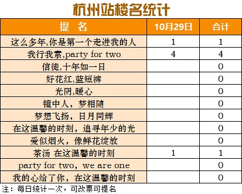
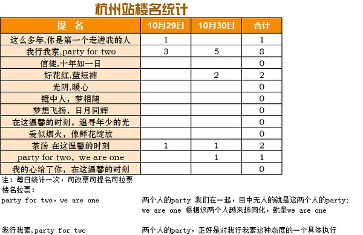

[主页](./main.md "main.md") | [首页](./comments1-100.md "comments1-100.md") | [前一页](./comments501-600.md "comments501-600.md") | [后一页](./comments701-800.md "comments701-800.md") | [末页](./comments7601-7700.md "comments7601-7700.md")  

---
*     [已注销](https://www.douban.com/people/187860590/)    2020-10-29 22:12:21  
  >想起来好像是销销子说要把id改成maximum来着😂   要和minimum凑一对😆  
  >
  >-- [松鼠与熊](https://www.douban.com/people/168667402/)  
  
  小小子问id熟不熟嘛，现在大家都记住小小子了  
---
*     [笑忘书](https://www.douban.com/people/40401623/)    2020-10-29 22:13:00  
  >第一对是边个  
  >
  >-- [阿呆](https://www.douban.com/people/223579792/)  
  
  第一对是谁和谁？  
---
*     [阿呆](https://www.douban.com/people/223579792/)    2020-10-29 22:14:44  
  >第一对是谁和谁？  
  >
  >-- [笑忘书](https://www.douban.com/people/40401623/)  
  
  我也在问松鼠与熊  
---
*     [松鼠与熊](https://www.douban.com/people/168667402/)    2020-10-29 22:15:31  
  >第一对是谁和谁？  
  >
  >-- [笑忘书](https://www.douban.com/people/40401623/)  
  
  火锅上火火火和azzdfl😂  
---
* [![[已注销]](../../image/icon/user_normal.jpg)](https://www.douban.com/people/219008874/)    [[已注销]](https://www.douban.com/people/219008874/)    2020-10-29 22:16:02  
  >第一对是谁和谁？  
  >
  >-- [笑忘书](https://www.douban.com/people/40401623/)  
  
  火锅和字母  
---
*     [松鼠与熊](https://www.douban.com/people/168667402/)    2020-10-29 22:17:03  
  >小小子问id熟不熟嘛，现在大家都记住小小子了  
  >
  >-- [已注销](https://www.douban.com/people/187860590/)  
  
  你打算什么时候从销销子变成大大子🤣gkd gkd  
---
*     [已注销](https://www.douban.com/people/187860590/)    2020-10-29 22:18:28  
    
  静静子和霞霞子选头巾的眼光竟然如此相似  
  是不是在一起久了，审美也开始趋同。。  
  你们该说什么了？  
---
* [![[已注销]](../../image/icon/user_normal.jpg)](https://www.douban.com/people/219008874/)    [[已注销]](https://www.douban.com/people/219008874/)    2020-10-29 22:19:06  
  >静静子和霞霞子选头巾的眼光竟然如此相似  
  >是不是在一起久了，审美也开始趋同。。  
  >你们该说什么了  
  >
  >-- [已注销](https://www.douban.com/people/187860590/)  
  
  kts！好的 今日任务完成了  
---
*     [海绵宝宝怕喝水](https://www.douban.com/people/219240340/)    2020-10-29 22:28:42  
  当当当，打个卡  
---
*     [笑忘书](https://www.douban.com/people/40401623/)    2020-10-29 22:35:52  
  >火锅上火火火和azzdfl😂  
  >
  >-- [松鼠与熊](https://www.douban.com/people/168667402/)  
  
  😂好吧，后边那位字母朋友我好像没怎么见他冒过泡  
---
*     [笑忘书](https://www.douban.com/people/40401623/)    2020-10-29 22:36:24  
  >静静子和霞霞子选头巾的眼光竟然如此相似  
  >是不是在一起久了，审美也开始趋同。。  
  >你们该说什么了  
  >
  >-- [已注销](https://www.douban.com/people/187860590/)  
  
  kts！今日达成  
---
*     [薄荷八宝糖](https://www.douban.com/people/185737152/)    2020-10-29 22:38:08  
  晚安啦，明天晚上估计就睡不着了，嘿嘿  
---
*     [一杯香蕉牛奶](https://www.douban.com/people/145961264/)    2020-10-29 22:49:34  
  >静静子和霞霞子选头巾的眼光竟然如此相似  
  >是不是在一起久了，审美也开始趋同。。  
  >你们该说什么了  
  >
  >-- [已注销](https://www.douban.com/people/187860590/)  
  
  还有脑门上面的发夹🤣  
---
*     [已注销](https://www.douban.com/people/187860590/)    2020-10-29 22:50:19  
  >还有脑门上面的发夹🤣  
  >
  >-- [一杯香蕉牛奶](https://www.douban.com/people/145961264/)  
  
  轮到我kts！！  
---
*     [一杯香蕉牛奶](https://www.douban.com/people/145961264/)    2020-10-29 22:50:39  
  >静静子和霞霞子选头巾的眼光竟然如此相似  
  >是不是在一起久了，审美也开始趋同。。  
  >你们该说什么了  
  >
  >-- [已注销](https://www.douban.com/people/187860590/)  
  
  还有腰上的玩意儿也一样🤣  
---
*     [已注销](https://www.douban.com/people/187860590/)    2020-10-29 22:51:05  
  >还有腰上的玩意儿也一样🤣  
  >
  >-- [一杯香蕉牛奶](https://www.douban.com/people/145961264/)  
  
  这俩不在一起天理难容  
---
*     [Yisa黎珞](https://www.douban.com/people/217273308/)    2020-10-29 22:52:54  
  >还有腰上的玩意儿也一样🤣  
  >
  >-- [一杯香蕉牛奶](https://www.douban.com/people/145961264/)  
  
  Kts  
---
*     [螺旋藻](https://www.douban.com/people/66268315/)    2020-10-29 22:56:58  
  kts，晚安，养精蓄锐～  
---
* [![[已注销]](../../image/icon/user_normal.jpg)](https://www.douban.com/people/219008874/)    [[已注销]](https://www.douban.com/people/219008874/)    2020-10-29 23:09:45  
  晚安 拜拜👋  
---
*     [Unknow](https://www.douban.com/people/219306324/)    2020-10-29 23:34:50  
  kdl  
---
*     [已注 销](https://www.douban.com/people/155947097/)    2020-10-29 23:48:08  
  >静静子和霞霞子选头巾的眼光竟然如此相似  
  >是不是在一起久了，审美也开始趋同。。  
  >你们该说什么了  
  >
  >-- [已注销](https://www.douban.com/people/187860590/)  
  
  kts！任务完成✅  
---
*     [阿呆](https://www.douban.com/people/223579792/)    2020-10-29 23:58:50  
  >静静子和霞霞子选头巾的眼光竟然如此相似  
  >是不是在一起久了，审美也开始趋同。。  
  >你们该说什么了  
  >
  >-- [已注销](https://www.douban.com/people/187860590/)  
  
  躺着等喂感觉真好  
---
*     [寒絡芸](https://www.douban.com/people/208734778/)    2020-10-30 00:23:48  
  來了！  
---
*     [rei.s.p](https://www.douban.com/people/131145094/)    2020-10-30 00:30:36  
  >人家厉害的点就是咱们笑的点，脱了你看她是国际范儿，扮上你看她就是村花啊，天生吃演员这碗饭，  
  >
  >-- [kk](https://www.douban.com/people/224759292/)  
  
  论演员的可塑性  
---
*     [summertrain](https://www.douban.com/people/183524918/)    2020-10-30 00:41:21  
  晚安，今晚早点睡，明天怕是没得睡了🤣  
---
*     [Shirley Tian](https://www.douban.com/people/150047836/)    2020-10-30 04:59:16  
  葵貌似一夜之间上王者了。。。  
---
*     [改名了](https://www.douban.com/people/192157351/)    2020-10-30 05:11:10  
  >还有腰上的玩意儿也一样🤣  
  >
  >-- [一杯香蕉牛奶](https://www.douban.com/people/145961264/)  
  
  还有拖鞋也一样  
---
*     [人间造梦](https://www.douban.com/people/205824373/)    2020-10-30 06:53:02  
  早上好  
---
*     [薄荷八宝糖](https://www.douban.com/people/185737152/)    2020-10-30 06:59:15  
  早上好啊，今晚还睡得着吗～  
---
*     [已注 销](https://www.douban.com/people/155947097/)    2020-10-30 07:05:24  
  >葵貌似一夜之间上王者了。。。  
  >
  >-- [Shirley Tian](https://www.douban.com/people/150047836/)  
  
  哈？她不是之前都掉星耀了嘛  
---
*     [Yisa黎珞](https://www.douban.com/people/217273308/)    2020-10-30 07:07:30  
  >哈？她不是之前都掉星耀了嘛  
  >
  >-- [已注 销](https://www.douban.com/people/155947097/)  
  
  🙂一夜到王者，傻孩子  
---
*     [已注 销](https://www.douban.com/people/155947097/)    2020-10-30 07:40:19  
  >🙂一夜到王者，傻孩子  
  >
  >-- [Yisa黎珞](https://www.douban.com/people/217273308/)  
  
  不愧是她🐷  
---
*     [SiofnaFan](https://www.douban.com/people/180076918/)    2020-10-30 07:49:41  
  >葵貌似一夜之间上王者了。。。  
  >
  >-- [Shirley Tian](https://www.douban.com/people/150047836/)  
  
  ……了不起…………  
---
*     [秃发雀丝](https://www.douban.com/people/3984012/)    2020-10-30 07:51:07  
  >葵貌似一夜之间上王者了。。。  
  >
  >-- [Shirley Tian](https://www.douban.com/people/150047836/)  
  
  不知道该不该夸她😪  
---
*     [Yisa黎珞](https://www.douban.com/people/217273308/)    2020-10-30 07:53:13  
  >不愧是她🐷  
  >
  >-- [已注 销](https://www.douban.com/people/155947097/)  
  
  单身是有原因的🙃  
---
*     [Yisa黎珞](https://www.douban.com/people/217273308/)    2020-10-30 08:00:59  
    
  10.30 8：00打卡  
---
*     [正义的路人](https://www.douban.com/people/218789530/)    2020-10-30 08:14:15  
  怎么投票？我跟一票 我行我素，party for two  
---
*     [Yisa黎珞](https://www.douban.com/people/217273308/)    2020-10-30 08:18:09  
  >怎么投票？我跟一票 我行我素，party for two  
  >
  >-- [正义的路人](https://www.douban.com/people/218789530/)  
  
  回复我就行😀，或者评论也行我看得到  
---
*     [Y](https://www.douban.com/people/176599605/)    2020-10-30 08:25:02  
  >10.30 8：00打卡  
  >
  >-- [Yisa黎珞](https://www.douban.com/people/217273308/)  
  
  我也投我行我素，Party for two  
---
*     [向天](https://www.douban.com/people/115338782/)    2020-10-30 08:25:36  
  >10.30 8：00打卡  
  >
  >-- [Yisa黎珞](https://www.douban.com/people/217273308/)  
  
  我选好花红，蓝短裤  
---
*     [一杯香蕉牛奶](https://www.douban.com/people/145961264/)    2020-10-30 08:26:14  
  >10.30 8：00打卡  
  >
  >-- [Yisa黎珞](https://www.douban.com/people/217273308/)  
  
  茶汤 在这温馨的时刻  
---
*     [SiofnaFan](https://www.douban.com/people/180076918/)    2020-10-30 08:29:15  
  >回复我就行😀，或者评论也行我看得到  
  >
  >-- [Yisa黎珞](https://www.douban.com/people/217273308/)  
  
  改票🤭  
  选好花红 蓝短裤  
  原来选的我行我素 party for two  
---
*     [muki](https://www.douban.com/people/190049323/)    2020-10-30 08:34:14  
  周五打卡☑️准备一下今日任务奶美帅【0/3】  
---
*     [笑忘书](https://www.douban.com/people/40401623/)    2020-10-30 08:34:16  
  滴，8:34打卡，白天继续养精蓄锐  
---
*     [笑忘书](https://www.douban.com/people/40401623/)    2020-10-30 08:36:29  
  >葵貌似一夜之间上王者了。。。  
  >
  >-- [Shirley Tian](https://www.douban.com/people/150047836/)  
  
  白天做公益那么辛苦，晚上还熬夜打游戏，这娃儿怕是欠打了🙃  
---
*     [吃瓜](https://www.douban.com/people/219893584/)    2020-10-30 08:40:47  
  今日打卡  
---
*     [Yisa黎珞](https://www.douban.com/people/217273308/)    2020-10-30 08:42:05  
  中午抓紧时间休息，晚上要熬夜了  
---
*     [豆友203241293](https://www.douban.com/people/203241293/)    2020-10-30 08:52:02  
  打卡  
---
*     [Unknow](https://www.douban.com/people/219306324/)    2020-10-30 08:58:29  
  早安打卡  
---
*     [隔壁老霞](https://www.douban.com/people/220169504/)    2020-10-30 08:58:42  
  打卡～  
---
*     [柒](https://www.douban.com/people/221078564/)    2020-10-30 09:01:35  
  打卡一下，投一个我行我素，party for two  
---
*     [kk](https://www.douban.com/people/224759292/)    2020-10-30 09:06:47  
  看来🥭出视频还是要及时看的，不然会错过镜头，昨天晚上重新看了一遍发现静静穿花衣裳唱歌那段，小雨憋笑录屏的镜头已经掐了（不知道是不是我看的入口不一样）。  
  这套路这么熟悉呢，楼里的限定五分钟已删除。  
---
*     [Unknow](https://www.douban.com/people/219306324/)    2020-10-30 09:15:29  
  >看来🥭出视频还是要及时看的，不然会错过镜头，昨天晚上重新看了一遍发现静静穿花衣裳唱歌那段  
  >
  >-- [kk](https://www.douban.com/people/224759292/)  
  
  嗯嗯 静葵同框也被打码了  
---
*     [Unknow](https://www.douban.com/people/219306324/)    2020-10-30 09:16:08  
  视频一出 不管看不看app先下载，网页端先打开 哈哈哈哈哈  
---
*     [隔壁老霞](https://www.douban.com/people/220169504/)    2020-10-30 09:19:20  
  >10.30 8：00打卡  
  >
  >-- [Yisa黎珞](https://www.douban.com/people/217273308/)  
  
  我行我素，party for two  
---
*     [已注 销](https://www.douban.com/people/155947097/)    2020-10-30 09:25:54  
  >10.30 8：00打卡  
  >
  >-- [Yisa黎珞](https://www.douban.com/people/217273308/)  
  
  我行我素，party for two  
---
*     [漠漠yt](https://www.douban.com/people/223048792/)    2020-10-30 09:29:05  
  早上好 各位姐妹们❤️❤️  
---
*     [Unknow](https://www.douban.com/people/219306324/)    2020-10-30 09:36:05  
  请教个问题昂， 那歌不是叫 我行我素我爱你 吗， 为啥楼名就取 我行我素 这半段，后半段不要了？  
---
*     [Yisa黎珞](https://www.douban.com/people/217273308/)    2020-10-30 09:37:42  
  >请教个问题昂， 那歌不是叫 我行我素我爱你 吗， 为啥楼名就取 我行我素 这半段，后半段不要了？  
  >
  >-- [Unknow](https://www.douban.com/people/219306324/)  
  
  对哦，谁提名的  
---
*     [胖🐯](https://www.douban.com/people/171300359/)    2020-10-30 09:39:23  
  >嗯嗯 静葵同框也被打码了  
  >
  >-- [Unknow](https://www.douban.com/people/219306324/)  
  
  啊这！为啥要打码呀  
---
*     [漠漠yt](https://www.douban.com/people/223048792/)    2020-10-30 09:40:44  
  >啊这！为啥要打码呀  
  >
  >-- [胖🐯](https://www.douban.com/people/171300359/)  
  
  同问  
---
*     [Unknow](https://www.douban.com/people/219306324/)    2020-10-30 09:41:33  
  >啊这！为啥要打码呀  
  >
  >-- [胖🐯](https://www.douban.com/people/171300359/)  
  
  是因为要打码背景里有个框框 不知道是什么，然后就打码了，正好打在葵的脸上。。。。  
---
*     [Unknow](https://www.douban.com/people/219306324/)    2020-10-30 09:42:58  
  >对哦，谁提名的  
  >
  >-- [Yisa黎珞](https://www.douban.com/people/217273308/)  
  
  那这是不是要改啊，一首歌就取前半段 有点不完整 仅个人感觉  
---
*     [卢妍mm](https://www.douban.com/people/80682689/)    2020-10-30 09:43:20  
  >对哦，谁提名的  
  >
  >-- [Yisa黎珞](https://www.douban.com/people/217273308/)  
  
  上个没了的楼，我说的，哈哈哈。为了工整啊~  
---
*     [Unknow](https://www.douban.com/people/219306324/)    2020-10-30 09:45:05  
  >上个没了的楼，我说的，哈哈哈。为了工整啊~  
  >
  >-- [卢妍mm](https://www.douban.com/people/80682689/)  
  
  哈哈哈哈哈 中文和英文组合 工整的点在哪(bushi  
---
*     [Yisa黎珞](https://www.douban.com/people/217273308/)    2020-10-30 09:45:32  
  >上个没了的楼，我说的，哈哈哈。为了工整啊~  
  >
  >-- [卢妍mm](https://www.douban.com/people/80682689/)  
  
  为什么把我爱你去掉，解释一下🙂  
---
*     [卢妍mm](https://www.douban.com/people/80682689/)    2020-10-30 09:49:27  
  >为什么把我爱你去掉，解释一下🙂  
  >
  >-- [Yisa黎珞](https://www.douban.com/people/217273308/)  
  
  读起来多押韵。。两个人的party，正好是对我行我素这种态度的一个具体执行。哈哈哈哈哈  
---
*     [Unknow](https://www.douban.com/people/219306324/)    2020-10-30 09:53:44  
  >读起来多押韵。。两个人的party，正好是对我行我素这种态度的一个具体执行。哈哈哈哈哈  
  >
  >-- [卢妍mm](https://www.douban.com/people/80682689/)  
  
  哇 ，那这样的话 我get到 party for two，we are one 了。两个人的party  我们在一起 哈哈哈哈哈哈  
---
*     [哇咔咔呀](https://www.douban.com/people/213342632/)    2020-10-30 09:55:36  
  >哇 ，那这样的话 我get到 party for two，we are one 了。两个人的party  我们在一起 哈哈哈哈哈  
  >
  >-- [Unknow](https://www.douban.com/people/219306324/)  
  
  嗯，one two，one two，多么协调😂😄  
---
*     [卢妍mm](https://www.douban.com/people/80682689/)    2020-10-30 09:57:22  
  >哇 ，那这样的话 我get到 party for two，we are one 了。两个人的party  我们在一起 哈哈哈哈哈  
  >
  >-- [Unknow](https://www.douban.com/people/219306324/)  
  
  we are one 没有 我行我素更具有指向性。😂😂  
---
*     [卢妍mm](https://www.douban.com/people/80682689/)    2020-10-30 09:58:22  
  >嗯，one two，one two，多么协调😂😄  
  >
  >-- [哇咔咔呀](https://www.douban.com/people/213342632/)  
  
  three four  
---
*     [kk](https://www.douban.com/people/224759292/)    2020-10-30 09:58:23  
  >哇 ，那这样的话 我get到 party for two，we are one 了。两个人的party  我们在一起 哈哈哈哈哈  
  >
  >-- [Unknow](https://www.douban.com/people/219306324/)  
  
  你才get到......  
  其实还有几层意思就是，对她们对我们来讲，团综什么的，目中无人的就是这两个人的party;  
  后面的we are one 根据这两个人越来越同化，就是we are  one  
  第三层意思纯硬了点，就是觉得正好各有这么一首英文歌，还这么搭，做楼明还挺洋气  
---
*     [Unknow](https://www.douban.com/people/219306324/)    2020-10-30 09:58:37  
  >嗯，one two，one two，多么协调😂😄  
  >
  >-- [哇咔咔呀](https://www.douban.com/people/213342632/)  
  
  哈哈哈哈 是的，而且英文对英文  
---
*     [Unknow](https://www.douban.com/people/219306324/)    2020-10-30 10:00:17  
  >你才get到......  
  >其实还有几层意思就是，对她们对我们来讲，团综什么的，目中无人的就是这两个人  
  >
  >-- [kk](https://www.douban.com/people/224759292/)  
  
  。。。我才get到，之前没留意这个提名，你诠释的好好！  
---
*     [Unknow](https://www.douban.com/people/219306324/)    2020-10-30 10:00:54  
  >10.30 8：00打卡  
  >
  >-- [Yisa黎珞](https://www.douban.com/people/217273308/)  
  
  我投 party for two，we are one  一票  
---
*     [kk](https://www.douban.com/people/224759292/)    2020-10-30 10:01:05  
  >。。。我才get到，之前没留意这个提名，你诠释的好好！  
  >
  >-- [Unknow](https://www.douban.com/people/219306324/)  
  
  因为就是我提的😀  
---
*     [哇咔咔呀](https://www.douban.com/people/213342632/)    2020-10-30 10:01:20  
  >你才get到......  
  >其实还有几层意思就是，对她们对我们来讲，团综什么的，目中无人的就是这两个人  
  >
  >-- [kk](https://www.douban.com/people/224759292/)  
  
  静静难得一首英文歌，必须你葵英文歌对仗啊😄😄  
---
*     [Unknow](https://www.douban.com/people/219306324/)    2020-10-30 10:02:26  
  >因为就是我提的😀  
  >
  >-- [kk](https://www.douban.com/people/224759292/)  
  
  鼓掌 点赞 支持！  
---
*     [Yisa黎珞](https://www.douban.com/people/217273308/)    2020-10-30 10:03:22  
    
  提名的多多拉票  
---
*     [kk](https://www.douban.com/people/224759292/)    2020-10-30 10:03:59  
  >鼓掌 点赞 支持！  
  >
  >-- [Unknow](https://www.douban.com/people/219306324/)  
  
  我提了但我没投票是觉得还想再看看有没有更好的，毕竟这个虽然搭配挺有意思，但是和下一站【杭州】这个地方没有能搭上的  
---
*     [Unknow](https://www.douban.com/people/219306324/)    2020-10-30 10:04:03  
  杭州 太适合开party ，而且对应 对手歌词里面的 “我需要party 当我去party 你又出现我身边”。  
---
*     [Unknow](https://www.douban.com/people/219306324/)    2020-10-30 10:04:52  
  >我提了但我没投票是觉得还想再看看有没有更好的，毕竟这个虽然搭配挺有意思，但是和下一站【杭州  
  >
  >-- [kk](https://www.douban.com/people/224759292/)  
  
  嗯嗯 我本来也想看看有没有更好的，但是突然get到这个了，先投了，后面看到好的再说，哈哈哈哈  
---
*     [哇咔咔呀](https://www.douban.com/people/213342632/)    2020-10-30 10:05:53  
  >提名的多多拉票  
  >
  >-- [Yisa黎珞](https://www.douban.com/people/217273308/)  
  
  咋拉票啊，要不搞个口号：one two最时尚！😄  
---
*     [Unknow](https://www.douban.com/people/219306324/)    2020-10-30 10:07:41  
  >咋拉票啊，要不搞个口号：one two最时尚！😄  
  >
  >-- [哇咔咔呀](https://www.douban.com/people/213342632/)  
  
  现在one two 就我在这投，你都拉票了 你不投一个 one two吗 ，要不显得我太孤单了😂  
---
*     [Yisa黎珞](https://www.douban.com/people/217273308/)    2020-10-30 10:08:08  
  >咋拉票啊，要不搞个口号：one two最时尚！😄  
  >
  >-- [哇咔咔呀](https://www.douban.com/people/213342632/)  
  
  看看人家我行我素 和we are one 的诠释，上栋楼不就是因为姐妹一句话最后都改票了😂  
---
* [![[已注销]](../../image/icon/user_normal.jpg)](https://www.douban.com/people/219008874/)    [[已注销]](https://www.douban.com/people/219008874/)    2020-10-30 10:08:28  
  来为影后站街  
    
  宁静《最美的太短暂》  
---
*     [哇咔咔呀](https://www.douban.com/people/213342632/)    2020-10-30 10:09:48  
  >现在one two 就我在这投，你都拉票了 你不投一个 one two吗 ，要不显得我太孤单了😂  
  >
  >-- [Unknow](https://www.douban.com/people/219306324/)  
  
  既然你都这么说了，那我就跟你一票😄  
---
*     [Unknow](https://www.douban.com/people/219306324/)    2020-10-30 10:10:19  
  >看看人家我行我素 和we are one 的诠释，上栋楼不就是因为姐妹一句话最后都改票了😂  
  >
  >-- [Yisa黎珞](https://www.douban.com/people/217273308/)  
  
  嗯 后面微加幸福一路逆袭 ，哈哈哈 诠释楼名就是最好的拉票  
---
*     [Unknow](https://www.douban.com/people/219306324/)    2020-10-30 10:11:05  
  >来为影后站街  
  >  
  >宁静《最美的太短暂》 https://c.y.qq.com/base/fcgi-bin/u?__=S78aDCT @QQ音乐  
  >
  >-- [[已注销]](https://www.douban.com/people/219008874/)  
  
  在听了  
---
*     [Unknow](https://www.douban.com/people/219306324/)    2020-10-30 10:11:30  
  >既然你都这么说了，那我就跟你一票😄  
  >
  >-- [哇咔咔呀](https://www.douban.com/people/213342632/)  
  
  哈哈哈哈 感谢 终于不是孤军奋战了  
---
*     [已注销](https://www.douban.com/people/187860590/)    2020-10-30 10:16:45  
  >为什么把我爱你去掉，解释一下🙂  
  >
  >-- [Yisa黎珞](https://www.douban.com/people/217273308/)  
  
  对，我不爱你吗🐶  
---
*     [哇咔咔呀](https://www.douban.com/people/213342632/)    2020-10-30 10:18:34  
  可唯的 we are one，其实蛮可惜的。旋律吟唱都很好听。只是那个半妖倾城剧就一般，没有被更多人听到这首歌。遗憾。借此推荐，也是希望大家记住这首歌，算是拉票吧😄  
---
*     [已注销](https://www.douban.com/people/187860590/)    2020-10-30 10:20:54  
  >可唯的 we are one，其实蛮可惜的。旋律吟唱都很好听。只是那个半妖倾城剧就一般，没有被更多人  
  >
  >-- [哇咔咔呀](https://www.douban.com/people/213342632/)  
  
  从泉州站我就在喊party for two，一直没人理我。。。这次正好one two组合吧  
---
*     [卢妍mm](https://www.douban.com/people/80682689/)    2020-10-30 10:22:46  
  >对，我不爱你吗🐶  
  >
  >-- [已注销](https://www.douban.com/people/187860590/)  
  
  害，又来一个关于“我爱你”的，个人认为，对于冗长的意思提炼到位即可，且我行我素就很有指向性了，不用纠结是否一字不差。如果我行我素 party for two 跑票了，那绝对是“我爱你”的锅，哈哈哈哈哈~  
---
*     [Yisa黎珞](https://www.douban.com/people/217273308/)    2020-10-30 10:25:04  
  >害，又来一个关于“我爱你”的，个人认为，对于冗长的意思提炼到位即可，且我行我素就很有指向性  
  >
  >-- [卢妍mm](https://www.douban.com/people/80682689/)  
  
  😂跑票肯定是我爱你的锅  
---
*     [薄荷八宝糖](https://www.douban.com/people/185737152/)    2020-10-30 10:26:06  
  >看来🥭出视频还是要及时看的，不然会错过镜头，昨天晚上重新看了一遍发现静静穿花衣裳唱歌那段  
  >
  >-- [kk](https://www.douban.com/people/224759292/)  
  
  对啊，而且现在周二的会员加更也被默默的下架了，早知道我就下载了，现在再也看不到了……  
---
*     [胖🐯](https://www.douban.com/people/171300359/)    2020-10-30 10:26:20  
  >是因为要打码背景里有个框框 不知道是什么，然后就打码了，正好打在葵的脸上。。。。  
  >
  >-- [Unknow](https://www.douban.com/people/219306324/)  
  
  🤦‍♀️原来是这样，谢谢你  
---
*     [哇咔咔呀](https://www.douban.com/people/213342632/)    2020-10-30 10:26:23  
  >从泉州站我就在喊party for two，一直没人理我。。。这次正好one two组合吧  
  >
  >-- [已注销](https://www.douban.com/people/187860590/)  
  
  😁你执着啊，那就“你一票我一票，送 one two组合来出道”哈哈哈  
---
*     [minimum](https://www.douban.com/people/218236166/)    2020-10-30 10:27:03  
  一个楼名你们前前后后可以唠个千层  
---
*     [已注销](https://www.douban.com/people/187860590/)    2020-10-30 10:29:35  
  >害，又来一个关于“我爱你”的，个人认为，对于冗长的意思提炼到位即可，且我行我素就很有指向性  
  >
  >-- [卢妍mm](https://www.douban.com/people/80682689/)  
  
  爱你是谁也不会提起的约定  
  她们不提，我们也不提，不写我爱你正好，就是要不提，懂的人自然懂  
---

601-700

---

[主页](./main.md "main.md") | [首页](./comments1-100.md "comments1-100.md") | [前一页](./comments501-600.md "comments501-600.md") | [后一页](./comments701-800.md "comments701-800.md") | [末页](./comments7601-7700.md "comments7601-7700.md")  

---
[1-100](./comments1-100.md "1-100")  [101-200](./comments101-200.md "101-200")  [201-300](./comments201-300.md "201-300")  [301-400](./comments301-400.md "301-400")  [401-500](./comments401-500.md "401-500")  [501-600](./comments501-600.md "501-600")  [601-700](./comments601-700.md "601-700")  [701-800](./comments701-800.md "701-800")  [801-900](./comments801-900.md "801-900")  [901-1000](./comments901-1000.md "901-1000")  [1001-1100](./comments1001-1100.md "1001-1100")  [1101-1200](./comments1101-1200.md "1101-1200")  [1201-1300](./comments1201-1300.md "1201-1300")  [1301-1400](./comments1301-1400.md "1301-1400")  [1401-1500](./comments1401-1500.md "1401-1500")  [1501-1600](./comments1501-1600.md "1501-1600")  [1601-1700](./comments1601-1700.md "1601-1700")  [1701-1800](./comments1701-1800.md "1701-1800")  [1801-1900](./comments1801-1900.md "1801-1900")  [1901-2000](./comments1901-2000.md "1901-2000")  [2001-2100](./comments2001-2100.md "2001-2100")  [2101-2200](./comments2101-2200.md "2101-2200")  [2201-2300](./comments2201-2300.md "2201-2300")  [2301-2400](./comments2301-2400.md "2301-2400")  [2401-2500](./comments2401-2500.md "2401-2500")  [2501-2600](./comments2501-2600.md "2501-2600")  [2601-2700](./comments2601-2700.md "2601-2700")  [2701-2800](./comments2701-2800.md "2701-2800")  [2801-2900](./comments2801-2900.md "2801-2900")  [2901-3000](./comments2901-3000.md "2901-3000")  [3001-3100](./comments3001-3100.md "3001-3100")  [3101-3200](./comments3101-3200.md "3101-3200")  [3201-3300](./comments3201-3300.md "3201-3300")  [3301-3400](./comments3301-3400.md "3301-3400")  [3401-3500](./comments3401-3500.md "3401-3500")  [3501-3600](./comments3501-3600.md "3501-3600")  [3601-3700](./comments3601-3700.md "3601-3700")  [3701-3800](./comments3701-3800.md "3701-3800")  [3801-3900](./comments3801-3900.md "3801-3900")  [3901-4000](./comments3901-4000.md "3901-4000")  [4001-4100](./comments4001-4100.md "4001-4100")  [4101-4200](./comments4101-4200.md "4101-4200")  [4201-4300](./comments4201-4300.md "4201-4300")  [4301-4400](./comments4301-4400.md "4301-4400")  [4401-4500](./comments4401-4500.md "4401-4500")  [4501-4600](./comments4501-4600.md "4501-4600")  [4601-4700](./comments4601-4700.md "4601-4700")  [4701-4800](./comments4701-4800.md "4701-4800")  [4801-4900](./comments4801-4900.md "4801-4900")  [4901-5000](./comments4901-5000.md "4901-5000")  [5001-5100](./comments5001-5100.md "5001-5100")  [5101-5200](./comments5101-5200.md "5101-5200")  [5201-5300](./comments5201-5300.md "5201-5300")  [5301-5400](./comments5301-5400.md "5301-5400")  [5401-5500](./comments5401-5500.md "5401-5500")  [5501-5600](./comments5501-5600.md "5501-5600")  [5601-5700](./comments5601-5700.md "5601-5700")  [5701-5800](./comments5701-5800.md "5701-5800")  [5801-5900](./comments5801-5900.md "5801-5900")  [5901-6000](./comments5901-6000.md "5901-6000")  [6001-6100](./comments6001-6100.md "6001-6100")  [6101-6200](./comments6101-6200.md "6101-6200")  [6201-6300](./comments6201-6300.md "6201-6300")  [6301-6400](./comments6301-6400.md "6301-6400")  [6401-6500](./comments6401-6500.md "6401-6500")  [6501-6600](./comments6501-6600.md "6501-6600")  [6601-6700](./comments6601-6700.md "6601-6700")  [6701-6800](./comments6701-6800.md "6701-6800")  [6801-6900](./comments6801-6900.md "6801-6900")  [6901-7000](./comments6901-7000.md "6901-7000")  [7001-7100](./comments7001-7100.md "7001-7100")  [7101-7200](./comments7101-7200.md "7101-7200")  [7201-7300](./comments7201-7300.md "7201-7300")  [7301-7400](./comments7301-7400.md "7301-7400")  [7401-7500](./comments7401-7500.md "7401-7500")  [7501-7600](./comments7501-7600.md "7501-7600")  [7601-7700](./comments7601-7700.md "7601-7700")  