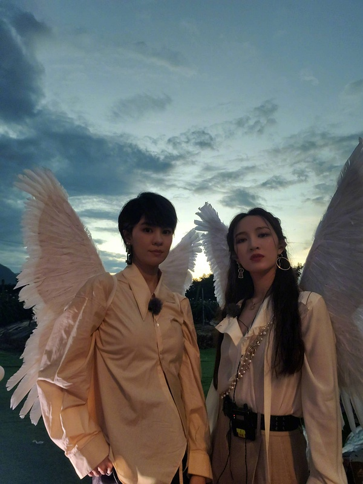

[主页](./main.md "main.md") | [首页](./comments1-100.md "comments1-100.md") | [前一页](./comments4001-4100.md "comments4001-4100.md") | [后一页](./comments4201-4300.md "comments4201-4300.md") | [末页](./comments8701-8800.md "comments8701-8800.md")  

---
*     [Unknow](https://www.douban.com/people/219306324/)    2020-12-04 11:55:18  
  趁着中午人多，主楼已经更新长沙站楼名了，大家可以去投票了  
---
*     [Shirley Tian](https://www.douban.com/people/150047836/)    2020-12-04 11:57:17  
  >对我有什么误解厚，我刚进浪组就是英霞最大body粉惹，现在翻一翻可能还能看到我之前发的“姐姐拿  
  >
  >-- [元素周期表51号](https://www.douban.com/people/199280408/)  
  
  。。。。。骚不过骚不过，我输了  
---
*     [SiofnaFan](https://www.douban.com/people/180076918/)    2020-12-04 12:09:49  
  >。。。。。骚不过骚不过，我输了  
  >
  >-- [Shirley Tian](https://www.douban.com/people/150047836/)  
  
  支棱起来啊  
---
*     [笑忘书](https://www.douban.com/people/40401623/)    2020-12-04 12:10:43  
  >趁着中午人多，主楼已经更新长沙站楼名了，大家可以去投票了  
  >
  >-- [Unknow](https://www.douban.com/people/219306324/)  
  
  你糊了，都没人理你  
---
*     [Yisa黎珞](https://www.douban.com/people/217273308/)    楼主    2020-12-04 12:12:28  
  >趁着中午人多，主楼已经更新长沙站楼名了，大家可以去投票了  
  >
  >-- [Unknow](https://www.douban.com/people/219306324/)  
  
  我谢谢你啊  
---
*     [一棵麦芽糖](https://www.douban.com/people/114181779/)    2020-12-04 12:23:35  
  静主播该起床了  
---
*     [echo](https://www.douban.com/people/219314368/)    2020-12-04 12:25:15  
  静静不准备来个直播吗🤔🤔🤔  
---
*     [哈哈哈](https://www.douban.com/people/167405019/)    2020-12-04 12:29:29  
  到现在没放歌单表示今晚放不到路演吧  
---
*     [cherrie199](https://www.douban.com/people/195510471/)    2020-12-04 12:32:59  
  今天要彩排，估计直播不了吧  
---
*     [Unknow](https://www.douban.com/people/219306324/)    2020-12-04 12:45:59  
  >你糊了，都没人理你  
  >
  >-- [笑忘书](https://www.douban.com/people/40401623/)  
  
  不是我糊了 ，我都睡完午觉了，才这点人  
---
*     [Shirley Tian](https://www.douban.com/people/150047836/)    2020-12-04 12:55:04  
  静静不直播了吗今天😭😭😭  
---
*     [吃瓜](https://www.douban.com/people/219893584/)    2020-12-04 12:55:46  
  >到现在没放歌单表示今晚放不到路演吧  
  >
  >-- [哈哈哈](https://www.douban.com/people/167405019/)  
  
  又三期？算了，反正这破节目也没什么太大期待，毕竟歌都能给直接剪掉一半  
---
*     [漠漠yt](https://www.douban.com/people/223048792/)    2020-12-04 12:56:13  
  >静静不准备来个直播吗🤔🤔🤔  
  >
  >-- [echo](https://www.douban.com/people/219314368/)  
  
  一个不化妆的人 每天等着一个美妆博主开播😂  
---
*     [echo](https://www.douban.com/people/219314368/)    2020-12-04 12:57:03  
  开始飘小雪了，希望两个崽穿厚点  
---
*     [秃发雀丝](https://www.douban.com/people/3984012/)    2020-12-04 12:57:47  
  >一个不化妆的人 每天等着一个美妆博主开播😂  
  >
  >-- [漠漠yt](https://www.douban.com/people/223048792/)  
  
  看了这么多次你还不实践一下嘛😛  
---
*     [漠漠yt](https://www.douban.com/people/223048792/)    2020-12-04 12:59:25  
  >看了这么多次你还不实践一下嘛😛  
  >
  >-- [秃发雀丝](https://www.douban.com/people/3984012/)  
  
  😂😂  
---
*     [漠漠yt](https://www.douban.com/people/223048792/)    2020-12-04 13:00:21  
  本楼之光 你们注意保暖 比较要在风雪中承受几个小时  
---
*     [Yisa黎珞](https://www.douban.com/people/217273308/)    楼主    2020-12-04 13:03:06  
  宁静老师，起床了嘛  
---
*     [cherrie199](https://www.douban.com/people/195510471/)    2020-12-04 13:04:57  
  好想宁静老师，还有🐟老师  
---
*     [秃发雀丝](https://www.douban.com/people/3984012/)    2020-12-04 13:05:16  
  宁静老师你不起来我就 睡去了🥱🥱🥱  
---
*     [韶光.](https://www.douban.com/people/144946423/)    2020-12-04 13:23:11  
  宁静老师怕是在排练了，今天应该来不及直播了  
---
*     [Yisa黎珞](https://www.douban.com/people/217273308/)    楼主    2020-12-04 13:26:45  
    
    
---
*     [葵葵的大宝贝](https://www.douban.com/people/196003397/)    2020-12-04 13:34:26  
  >宁静老师怕是在排练了，今天应该来不及直播了  
  >
  >-- [韶光.](https://www.douban.com/people/144946423/)  
  
  是的 看ch姐姐们已经出来了  
---
*     [笑忘书](https://www.douban.com/people/40401623/)    2020-12-04 13:36:13  
  >是的 看ch姐姐们已经出来了  
  >
  >-- [葵葵的大宝贝](https://www.douban.com/people/196003397/)  
  
  是在现场彩排了吧  
---
*     [蒜苔开出了鲜花](https://www.douban.com/people/26765466/)    2020-12-04 13:36:13  
  >  
  >
  >-- [Yisa黎珞](https://www.douban.com/people/217273308/)  
  
  节目组搞这个造型是个啥思路？  
---
*     [漠漠yt](https://www.douban.com/people/223048792/)    2020-12-04 13:38:19  
  >节目组搞这个造型是个啥思路？  
  >
  >-- [蒜苔开出了鲜花](https://www.douban.com/people/26765466/)  
  
  维密😂😂  
---
*     [吃瓜](https://www.douban.com/people/219893584/)    2020-12-04 13:39:44  
  >  
  >
  >-- [Yisa黎珞](https://www.douban.com/people/217273308/)  
  
  这是云南站路演？  
---
*     [鱼丸子](https://www.douban.com/people/43183830/)    2020-12-04 13:40:07  
  >  
  >
  >-- [Yisa黎珞](https://www.douban.com/people/217273308/)  
  
  这是云南站的造型？  
---
*     [疯zi损](https://www.douban.com/people/224780391/)    2020-12-04 13:42:15  
  >这是云南站的造型？  
  >
  >-- [鱼丸子](https://www.douban.com/people/43183830/)  
  
  我记得云南站🌻和+哥有首合作曲？会不会是那个的造型？  
---
*     [Shirley Tian](https://www.douban.com/people/150047836/)    2020-12-04 13:42:23  
  >  
  >
  >-- [Yisa黎珞](https://www.douban.com/people/217273308/)  
  
  What the hell...  
---
*     [葵葵的大宝贝](https://www.douban.com/people/196003397/)    2020-12-04 13:42:53  
  >我记得云南站🌻和+哥有首合作曲？会不会是那个的造型？  
  >
  >-- [疯zi损](https://www.douban.com/people/224780391/)  
  
  是的  repo有过翅膀  
---
*     [Yisa黎珞](https://www.douban.com/people/217273308/)    楼主    2020-12-04 13:43:21  
  >这是云南站路演？  
  >
  >-- [吃瓜](https://www.douban.com/people/219893584/)  
  
  云南站  
---
*     [Yisa黎珞](https://www.douban.com/people/217273308/)    楼主    2020-12-04 13:44:55  
  静葵已到，在彩排  
---
*     [SiofnaFan](https://www.douban.com/people/180076918/)    2020-12-04 13:46:16  
  >静葵已到，在彩排  
  >
  >-- [Yisa黎珞](https://www.douban.com/people/217273308/)  
  
  比我想象中要早  
---
*     [吃瓜](https://www.douban.com/people/219893584/)    2020-12-04 13:46:22  
  >云南站  
  >
  >-- [Yisa黎珞](https://www.douban.com/people/217273308/)  
  
  了，不知道今天播不播路演  
---
*     [笑忘书](https://www.douban.com/people/40401623/)    2020-12-04 13:51:10  
  >了，不知道今天播不播路演  
  >
  >-- [吃瓜](https://www.douban.com/people/219893584/)  
  
  保不准只有在老达保的那个欢送会....  
---
*     [吃瓜](https://www.douban.com/people/219893584/)    2020-12-04 13:53:59  
  >保不准只有在老达保的那个欢送会....  
  >
  >-- [笑忘书](https://www.douban.com/people/40401623/)  
  
  杭州站至少要播14首歌，搞不好也是三期。照这样下去一站三期不就成常态了？这节目组在想啥……  
---
*     [Yisa黎珞](https://www.douban.com/people/217273308/)    楼主    2020-12-04 13:54:55  
  >杭州站至少要播14首歌，搞不好也是三期。照这样下去一站三期不就成常态了？这节目组在想啥……  
  >
  >-- [吃瓜](https://www.douban.com/people/219893584/)  
  
  可能长沙，只有个演唱会  
---
*     [葵葵的大宝贝](https://www.douban.com/people/196003397/)    2020-12-04 13:55:00  
    
  是不是做一块 旁边白衣服静姐  
---
*     [笑忘书](https://www.douban.com/people/40401623/)    2020-12-04 13:56:06  
  >杭州站至少要播14首歌，搞不好也是三期。照这样下去一站三期不就成常态了？这节目组在想啥……  
  >
  >-- [吃瓜](https://www.douban.com/people/219893584/)  
  
  谁知道呢，路演砍成几段，气氛都没了  
---
*     [吃瓜](https://www.douban.com/people/219893584/)    2020-12-04 13:57:14  
  >是不是做一块 旁边白衣服静姐  
  >
  >-- [葵葵的大宝贝](https://www.douban.com/people/196003397/)  
  
  你是怎么看到衣服的？我是看头型发型猜葵旁边坐的是静  
---
*     [Unknow](https://www.douban.com/people/219306324/)    2020-12-04 13:57:38  
  >杭州站至少要播14首歌，搞不好也是三期。照这样下去一站三期不就成常态了？这节目组在想啥……  
  >
  >-- [吃瓜](https://www.douban.com/people/219893584/)  
  
  估计 长沙站就一期 纯演唱会+训练吧  
---
*     [葵葵的大宝贝](https://www.douban.com/people/196003397/)    2020-12-04 13:57:45  
  >你是怎么看到衣服的？我是看头型发型猜葵旁边坐的是静  
  >
  >-- [吃瓜](https://www.douban.com/people/219893584/)  
  
  旁边不是白色袄吗  
---
*     [Yisa黎珞](https://www.douban.com/people/217273308/)    楼主    2020-12-04 13:59:06  
  葵：黑色披风，灰色西装，黑色礼帽，长靴，帅的要死。静：黑色靴子，白色马甲，黑色毛线帽（应该会换衣服）  
---
*     [葵葵的大宝贝](https://www.douban.com/people/196003397/)    2020-12-04 14:00:00  
  >葵：黑色披风，灰色西装，黑色礼帽，长靴，帅的要死。静：黑色靴子，白色马甲，黑色毛线帽（应该  
  >
  >-- [Yisa黎珞](https://www.douban.com/people/217273308/)  
  
  葵穿好少  
---
*     [Yisa黎珞](https://www.douban.com/people/217273308/)    楼主    2020-12-04 14:01:51  
  >葵穿好少  
  >
  >-- [葵葵的大宝贝](https://www.douban.com/people/196003397/)  
  
  葵今天，太帅了，鸡叫~~~  
---
*     [卢妍mm](https://www.douban.com/people/80682689/)    2020-12-04 14:02:11  
  >我记得云南站🌻和+哥有首合作曲？会不会是那个的造型？  
  >
  >-- [疯zi损](https://www.douban.com/people/224780391/)  
  
  加鸽，官微今天发了一张这的造型  
---
*     [鱼丸子](https://www.douban.com/people/43183830/)    2020-12-04 14:02:37  
  今晚节目的歌单出了 感觉可以不用蹲直播了  
---
*     [葵葵的大宝贝](https://www.douban.com/people/196003397/)    2020-12-04 14:03:31  
  >葵今天，太帅了，鸡叫~~~  
  >
  >-- [Yisa黎珞](https://www.douban.com/people/217273308/)  
  
  这站的衣服葵都帅帅的  
---
*     [秃发雀丝](https://www.douban.com/people/3984012/)    2020-12-04 14:06:10  
  >是不是做一块 旁边白衣服静姐  
  >
  >-- [葵葵的大宝贝](https://www.douban.com/people/196003397/)  
  
  中间还坐了个人吧？绿色的  
---
*     [卢妍mm](https://www.douban.com/people/80682689/)    2020-12-04 14:06:23  
  >今晚节目的歌单出了 感觉可以不用蹲直播了  
  >
  >-- [鱼丸子](https://www.douban.com/people/43183830/)  
  
  今晚本来就没有啥意思 ，欢送会该，也不是路演。日常不知道放啥，被上次成都那样伤~今晚期待西安路演repo吧  
---
*     [葵葵的大宝贝](https://www.douban.com/people/196003397/)    2020-12-04 14:06:41  
  >今晚本来就没有啥意思 ，欢送会该，也不是路演。日常不知道放啥，被上次成都那样伤~今晚期待西安  
  >
  >-- [卢妍mm](https://www.douban.com/people/80682689/)  
  
  歌单出来了 没有静葵  
---
*     [哈哈哈](https://www.douban.com/people/167405019/)    2020-12-04 14:08:30  
  也就听个红山果吧，其他没什么意思  
---
*     [吃瓜](https://www.douban.com/people/219893584/)    2020-12-04 14:09:37  
  >歌单出来了 没有静葵  
  >
  >-- [葵葵的大宝贝](https://www.douban.com/people/196003397/)  
  
  老保达联欢会，不是路演……绝了  
---
*     [葵葵的大宝贝](https://www.douban.com/people/196003397/)    2020-12-04 14:10:26  
  >老保达联欢会，不是路演……绝了  
  >
  >-- [吃瓜](https://www.douban.com/people/219893584/)  
  
  咱们的歌又要到下期了  
---
*     [吃瓜](https://www.douban.com/people/219893584/)    2020-12-04 14:11:54  
  >咱们的歌又要到下期了  
  >
  >-- [葵葵的大宝贝](https://www.douban.com/people/196003397/)  
  
  这期感觉又是素人唱主角  
---
*     [Yisa黎珞](https://www.douban.com/people/217273308/)    楼主    2020-12-04 14:15:30  
  静：solo-hy  
---
*     [葵葵的大宝贝](https://www.douban.com/people/196003397/)    2020-12-04 14:16:40  
  >静：solo-hy  
  >
  >-- [Yisa黎珞](https://www.douban.com/people/217273308/)  
  
  西安站吗  
---
*     [卢妍mm](https://www.douban.com/people/80682689/)    2020-12-04 14:17:00  
  >静：solo-hy  
  >
  >-- [Yisa黎珞](https://www.douban.com/people/217273308/)  
  
  hy是嘛  
---
*     [Yisa黎珞](https://www.douban.com/people/217273308/)    楼主    2020-12-04 14:17:50  
  >hy是嘛  
  >
  >-- [卢妍mm](https://www.douban.com/people/80682689/)  
  
  歌名😂，保护我方瓜主一会再说  
---
*     [疯zi损](https://www.douban.com/people/224780391/)    2020-12-04 14:18:08  
  >静：solo-hy  
  >
  >-- [Yisa黎珞](https://www.douban.com/people/217273308/)  
  
  鸿雁？  
---
*     [韶光.](https://www.douban.com/people/144946423/)    2020-12-04 14:18:36  
  今晚节目好像又可以不用看了  
---
*     [贫儿](https://www.douban.com/people/218683495/)    2020-12-04 14:20:27  
  >歌名😂，保护我方瓜主一会再说  
  >
  >-- [Yisa黎珞](https://www.douban.com/people/217273308/)  
  
  刚看到这就听到静姐彩排了  
---
*     [Yisa黎珞](https://www.douban.com/people/217273308/)    楼主    2020-12-04 14:20:47  
  >鸿雁？  
  >
  >-- [疯zi损](https://www.douban.com/people/224780391/)  
  
  你厉害啊  
---
*     [echo](https://www.douban.com/people/219314368/)    2020-12-04 14:21:20  
  静静这个声音穿透力绝了。就她的听的最清楚  
---
*     [葵葵的大宝贝](https://www.douban.com/people/196003397/)    2020-12-04 14:21:39  
  >静静这个声音穿透力绝了。就她的听的最清楚  
  >
  >-- [echo](https://www.douban.com/people/219314368/)  
  
  这站有合唱不 她俩  
---
*     [疯zi损](https://www.douban.com/people/224780391/)    2020-12-04 14:21:52  
  >你厉害啊  
  >
  >-- [Yisa黎珞](https://www.douban.com/people/217273308/)  
  
  听昨天+哥直播的间奏，应该会很好听吧  
---
*     [卢妍mm](https://www.douban.com/people/80682689/)    2020-12-04 14:22:06  
  哈哈哈哈，上西安唱鸿雁啊，啊哈哈哈哈哈哈哈哈  
---
*     [韶光.](https://www.douban.com/people/144946423/)    2020-12-04 14:23:09  
  居然是鸿雁  
---
*     [SiofnaFan](https://www.douban.com/people/180076918/)    2020-12-04 14:26:46  
  >静静这个声音穿透力绝了。就她的听的最清楚  
  >
  >-- [echo](https://www.douban.com/people/219314368/)  
  
  哈哈哈哈哈哈哈哈哈哈哈  
---
*     [蒜苔开出了鲜花](https://www.douban.com/people/26765466/)    2020-12-04 14:27:33  
  >维密😂😂  
  >
  >-- [漠漠yt](https://www.douban.com/people/223048792/)  
  
  我学我姐忍住了...  
---
*     [🍃](https://www.douban.com/people/207666387/)    2020-12-04 14:28:02  
  哈哈哈哈鸿雁什么鬼啊  
---
*     [哈哈哈](https://www.douban.com/people/167405019/)    2020-12-04 14:28:40  
  鸿雁这个大歌确实适合静姐  
---
*     [蒜苔开出了鲜花](https://www.douban.com/people/26765466/)    2020-12-04 14:29:05  
  >这期感觉又是素人唱主角  
  >
  >-- [吃瓜](https://www.douban.com/people/219893584/)  
  
  我姐镜头不超过三分钟预警  
---
*     [蒜苔开出了鲜花](https://www.douban.com/people/26765466/)    2020-12-04 14:31:46  
  >哈哈哈哈鸿雁什么鬼啊  
  >
  >-- [🍃](https://www.douban.com/people/207666387/)  
  
  歌本身不错  
  我姐唱歌也不错  
  就在西安唱，以及我姐唱这歌的画风有点想象不出来，先期待一把子吧  
  话说，西安站节目组选歌的思路有点迷，是照顾我们中老年观众组么？  
---
*     [🍃](https://www.douban.com/people/207666387/)    2020-12-04 14:33:25  
  >歌本身不错  
  >我姐唱歌也不错  
  >就在西安唱，以及我姐唱这歌的画风有点想象不出来，先期待一把子吧  
  >
  >-- [蒜苔开出了鲜花](https://www.douban.com/people/26765466/)  
  
  这歌太适合她了 但是也太中老年了吧  
---
*     [chen](https://www.douban.com/people/179141216/)    2020-12-04 14:34:11  
  所以今晚云南站的路演到底是播还是不播  还是播一半😩  
---
*     [葵葵的大宝贝](https://www.douban.com/people/196003397/)    2020-12-04 14:34:47  
  >这歌太适合她了 但是也太中老年了吧  
  >
  >-- [🍃](https://www.douban.com/people/207666387/)  
  
  妈呀  刚听了下   确实有点  
---
*     [葵葵的大宝贝](https://www.douban.com/people/196003397/)    2020-12-04 14:35:05  
  >歌本身不错  
  >我姐唱歌也不错  
  >就在西安唱，以及我姐唱这歌的画风有点想象不出来，先期待一把子吧  
  >
  >-- [蒜苔开出了鲜花](https://www.douban.com/people/26765466/)  
  
  但静姐唱出来应该很好听  
---
*     [chen](https://www.douban.com/people/179141216/)    2020-12-04 14:35:18  
  >我姐镜头不超过三分钟预警  
  >
  >-- [蒜苔开出了鲜花](https://www.douban.com/people/26765466/)  
  
  以及姐姐和葵崽不熟系列 永远差三秒假cp🙃  
---
*     [鱼丸子](https://www.douban.com/people/43183830/)    2020-12-04 14:36:04  
  >歌本身不错  
  >我姐唱歌也不错  
  >就在西安唱，以及我姐唱这歌的画风有点想象不出来，先期待一把子吧  
  >
  >-- [蒜苔开出了鲜花](https://www.douban.com/people/26765466/)  
  
  也可能是照顾静姐哈哈哈哈哈  
---
*     [吃瓜](https://www.douban.com/people/219893584/)    2020-12-04 14:36:42  
  >所以今晚云南站的路演到底是播还是不播  还是播一半😩  
  >
  >-- [chen](https://www.douban.com/people/179141216/)  
  
  现在出的歌单是欢送会的，看晚点会不会再放路演歌单，不话的话就是下期放路演了  
  反正我对这节目组已经绝望了  
---
*     [Yisa黎珞](https://www.douban.com/people/217273308/)    楼主    2020-12-04 14:37:05  
  >鸿雁这个大歌确实适合静姐  
  >
  >-- [哈哈哈](https://www.douban.com/people/167405019/)  
  
  很适合静静，声压超级强，珠穆朗玛峰的山顶就是静静，敬请期待吧  
---
*     [muki](https://www.douban.com/people/190049323/)    2020-12-04 14:37:49  
  >  
  >
  >-- [Yisa黎珞](https://www.douban.com/people/217273308/)  
  
  超级奶爸👨‍🍼  
---
*     [chen](https://www.douban.com/people/179141216/)    2020-12-04 14:38:30  
  >现在出的歌单是欢送会的，看晚点会不会再放路演歌单，不话的话就是下期放路演了  
  >反正我对这节目  
  >
  >-- [吃瓜](https://www.douban.com/people/219893584/)  
  
  我到希望路演下期播吧 一次性给来个痛快  一期播半场太糟心了  
---
*     [muki](https://www.douban.com/people/190049323/)    2020-12-04 14:40:01  
  >是不是做一块 旁边白衣服静姐  
  >
  >-- [葵葵的大宝贝](https://www.douban.com/people/196003397/)  
  
  模糊帅  
---
*     [SiofnaFan](https://www.douban.com/people/180076918/)    2020-12-04 14:41:29  
  >很适合静静，声压超级强，珠穆朗玛峰的山顶就是静静，敬请期待吧  
  >
  >-- [Yisa黎珞](https://www.douban.com/people/217273308/)  
  
  我要大喊静静牛逼！！！  
---
*     [卢妍mm](https://www.douban.com/people/80682689/)    2020-12-04 14:41:59  
  >现在出的歌单是欢送会的，看晚点会不会再放路演歌单，不话的话就是下期放路演了  
  >反正我对这节目  
  >
  >-- [吃瓜](https://www.douban.com/people/219893584/)  
  
  今天应该不会有路演了吧。放了也不播不完，又播一半，糟心。一半一半的听着哪有路演的感觉啊~上期成都，刚开头就是上期后半段路演，看着一点感觉都没有，感觉是着急忙慌的把几首歌放完就了事了，每首歌中间没有互cue环节，太难看了。。。。。到现在为止，还是泉州的路演好看点  
---
*     [Shirley Tian](https://www.douban.com/people/150047836/)    2020-12-04 14:42:49  
  >很适合静静，声压超级强，珠穆朗玛峰的山顶就是静静，敬请期待吧  
  >
  >-- [Yisa黎珞](https://www.douban.com/people/217273308/)  
  
  静静牛逼！！  
---
*     [蒜苔开出了鲜花](https://www.douban.com/people/26765466/)    2020-12-04 14:43:48  
  >超级奶爸👨‍🍼  
  >
  >-- [muki](https://www.douban.com/people/190049323/)  
  
  奶爸什么鬼  
---
*     [秃发雀丝](https://www.douban.com/people/3984012/)    2020-12-04 14:44:07  
  有个女同事k歌老爱点鸿雁还被我diss 这下可好😌😌当然是夸咯  
---
*     [郡姨的麻袋](https://www.douban.com/people/144779262/)    2020-12-04 14:44:25  
  >我到希望路演下期播吧 一次性给来个痛快  一期播半场太糟心了  
  >
  >-- [chen](https://www.douban.com/people/179141216/)  
  
  所以说到现在也没有云南路演完整歌单，剪了也不知道吧╮（╯＿╰）╭  
---
*     [summertrain](https://www.douban.com/people/183524918/)    2020-12-04 14:44:32  
  >很适合静静，声压超级强，珠穆朗玛峰的山顶就是静静，敬请期待吧  
  >
  >-- [Yisa黎珞](https://www.douban.com/people/217273308/)  
  
  期待子，这首歌还是挺好听的，double赵应该改编得还不错吧🤗  
---
*     [蒜苔开出了鲜花](https://www.douban.com/people/26765466/)    2020-12-04 14:46:02  
  >很适合静静，声压超级强，珠穆朗玛峰的山顶就是静静，敬请期待吧  
  >
  >-- [Yisa黎珞](https://www.douban.com/people/217273308/)  
  
  站桩慢歌，强势输出  
---
*     [吃瓜](https://www.douban.com/people/219893584/)    2020-12-04 14:46:36  
  >所以说到现在也没有云南路演完整歌单，剪了也不知道吧╮（╯＿╰）╭  
  >
  >-- [郡姨的麻袋](https://www.douban.com/people/144779262/)  
  
  静solo、葵佳合作的两首应该都不会剪  
---
*     [一杯香蕉牛奶](https://www.douban.com/people/145961264/)    2020-12-04 14:47:00  
  >妈呀  刚听了下   确实有点  
  >
  >-- [葵葵的大宝贝](https://www.douban.com/people/196003397/)  
  
  这歌很好听呀 草原广袤的感觉 适合大静静超强声压😂  
---
*     [一杯香蕉牛奶](https://www.douban.com/people/145961264/)    2020-12-04 14:48:43  
  >很适合静静，声压超级强，珠穆朗玛峰的山顶就是静静，敬请期待吧  
  >
  >-- [Yisa黎珞](https://www.douban.com/people/217273308/)  
  
  对٩(๑^o^๑)۶ 只要节目组不作妖 好好播 现场绝对很绝 等repo~  
---
*     [葵葵的大宝贝](https://www.douban.com/people/196003397/)    2020-12-04 14:49:08  
  >静solo、葵佳合作的两首应该都不会剪  
  >
  >-- [吃瓜](https://www.douban.com/people/219893584/)  
  
  带我到山顶  葵是和声是吗  
---
*     [疯zi损](https://www.douban.com/people/224780391/)    2020-12-04 14:51:54  
  >带我到山顶  葵是和声是吗  
  >
  >-- [葵葵的大宝贝](https://www.douban.com/people/196003397/)  
  
  应该是的，看官博的单人照静边上是葵，葵边上是静  
---
*     [chen](https://www.douban.com/people/179141216/)    2020-12-04 14:52:18  
  >站桩慢歌，强势输出  
  >
  >-- [蒜苔开出了鲜花](https://www.douban.com/people/26765466/)  
  
  本楼不是有个夸静范文 🧡声压碾压 音色流氓 天妒机能🧡 回头播的时候用起来😌  
---

4101-4200

---

[主页](./main.md "main.md") | [首页](./comments1-100.md "comments1-100.md") | [前一页](./comments4001-4100.md "comments4001-4100.md") | [后一页](./comments4201-4300.md "comments4201-4300.md") | [末页](./comments8701-8800.md "comments8701-8800.md")  

---
[1-100](./comments1-100.md "1-100")  [101-200](./comments101-200.md "101-200")  [201-300](./comments201-300.md "201-300")  [301-400](./comments301-400.md "301-400")  [401-500](./comments401-500.md "401-500")  [501-600](./comments501-600.md "501-600")  [601-700](./comments601-700.md "601-700")  [701-800](./comments701-800.md "701-800")  [801-900](./comments801-900.md "801-900")  [901-1000](./comments901-1000.md "901-1000")  [1001-1100](./comments1001-1100.md "1001-1100")  [1101-1200](./comments1101-1200.md "1101-1200")  [1201-1300](./comments1201-1300.md "1201-1300")  [1301-1400](./comments1301-1400.md "1301-1400")  [1401-1500](./comments1401-1500.md "1401-1500")  [1501-1600](./comments1501-1600.md "1501-1600")  [1601-1700](./comments1601-1700.md "1601-1700")  [1701-1800](./comments1701-1800.md "1701-1800")  [1801-1900](./comments1801-1900.md "1801-1900")  [1901-2000](./comments1901-2000.md "1901-2000")  [2001-2100](./comments2001-2100.md "2001-2100")  [2101-2200](./comments2101-2200.md "2101-2200")  [2201-2300](./comments2201-2300.md "2201-2300")  [2301-2400](./comments2301-2400.md "2301-2400")  [2401-2500](./comments2401-2500.md "2401-2500")  [2501-2600](./comments2501-2600.md "2501-2600")  [2601-2700](./comments2601-2700.md "2601-2700")  [2701-2800](./comments2701-2800.md "2701-2800")  [2801-2900](./comments2801-2900.md "2801-2900")  [2901-3000](./comments2901-3000.md "2901-3000")  [3001-3100](./comments3001-3100.md "3001-3100")  [3101-3200](./comments3101-3200.md "3101-3200")  [3201-3300](./comments3201-3300.md "3201-3300")  [3301-3400](./comments3301-3400.md "3301-3400")  [3401-3500](./comments3401-3500.md "3401-3500")  [3501-3600](./comments3501-3600.md "3501-3600")  [3601-3700](./comments3601-3700.md "3601-3700")  [3701-3800](./comments3701-3800.md "3701-3800")  [3801-3900](./comments3801-3900.md "3801-3900")  [3901-4000](./comments3901-4000.md "3901-4000")  [4001-4100](./comments4001-4100.md "4001-4100")  [4101-4200](./comments4101-4200.md "4101-4200")  [4201-4300](./comments4201-4300.md "4201-4300")  [4301-4400](./comments4301-4400.md "4301-4400")  [4401-4500](./comments4401-4500.md "4401-4500")  [4501-4600](./comments4501-4600.md "4501-4600")  [4601-4700](./comments4601-4700.md "4601-4700")  [4701-4800](./comments4701-4800.md "4701-4800")  [4801-4900](./comments4801-4900.md "4801-4900")  [4901-5000](./comments4901-5000.md "4901-5000")  [5001-5100](./comments5001-5100.md "5001-5100")  [5101-5200](./comments5101-5200.md "5101-5200")  [5201-5300](./comments5201-5300.md "5201-5300")  [5301-5400](./comments5301-5400.md "5301-5400")  [5401-5500](./comments5401-5500.md "5401-5500")  [5501-5600](./comments5501-5600.md "5501-5600")  [5601-5700](./comments5601-5700.md "5601-5700")  [5701-5800](./comments5701-5800.md "5701-5800")  [5801-5900](./comments5801-5900.md "5801-5900")  [5901-6000](./comments5901-6000.md "5901-6000")  [6001-6100](./comments6001-6100.md "6001-6100")  [6101-6200](./comments6101-6200.md "6101-6200")  [6201-6300](./comments6201-6300.md "6201-6300")  [6301-6400](./comments6301-6400.md "6301-6400")  [6401-6500](./comments6401-6500.md "6401-6500")  [6501-6600](./comments6501-6600.md "6501-6600")  [6601-6700](./comments6601-6700.md "6601-6700")  [6701-6800](./comments6701-6800.md "6701-6800")  [6801-6900](./comments6801-6900.md "6801-6900")  [6901-7000](./comments6901-7000.md "6901-7000")  [7001-7100](./comments7001-7100.md "7001-7100")  [7101-7200](./comments7101-7200.md "7101-7200")  [7201-7300](./comments7201-7300.md "7201-7300")  [7301-7400](./comments7301-7400.md "7301-7400")  [7401-7500](./comments7401-7500.md "7401-7500")  [7501-7600](./comments7501-7600.md "7501-7600")  [7601-7700](./comments7601-7700.md "7601-7700")  [7701-7800](./comments7701-7800.md "7701-7800")  [7801-7900](./comments7801-7900.md "7801-7900")  [7901-8000](./comments7901-8000.md "7901-8000")  [8001-8100](./comments8001-8100.md "8001-8100")  [8101-8200](./comments8101-8200.md "8101-8200")  [8201-8300](./comments8201-8300.md "8201-8300")  [8301-8400](./comments8301-8400.md "8301-8400")  [8401-8500](./comments8401-8500.md "8401-8500")  [8501-8600](./comments8501-8600.md "8501-8600")  [8601-8700](./comments8601-8700.md "8601-8700")  [8701-8800](./comments8701-8800.md "8701-8800")  