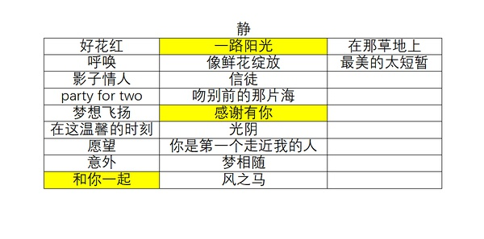
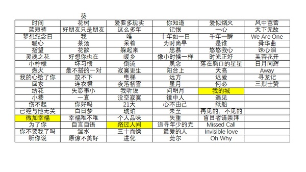

[主页](./main.md "main.md") | [首页](./comments1-100.md "comments1-100.md") | [前一页](./comments10501-10600.md "comments10501-10600.md") | [后一页](./comments10601-10700.md "comments10601-10700.md") | [末页](./comments10601-10700.md "comments10601-10700.md")  

---
*     [鹧鸪](https://www.douban.com/people/2968358/)    2020-10-28 17:04:07  
  >看🥭破浪节目后和曲江文旅的合作，大概率西安站，会终南问道，拉去赵公明财神故里楼观台去😂  
  >
  >-- [哇咔咔呀](https://www.douban.com/people/213342632/)  
  
  楼观台好没意思。。  
---
*     [哇咔咔呀](https://www.douban.com/people/213342632/)    2020-10-28 17:10:04  
  >楼观台好没意思。。  
  >
  >-- [鹧鸪](https://www.douban.com/people/2968358/)  
  
  淡季人少好拍摄管理啊。肯定不能住到市中心不是。城市花絮路演什么的可以驾车前往。不过这只是我自己的猜测哈，不作数😂  
---
*     [鹧鸪](https://www.douban.com/people/2968358/)    2020-10-28 17:12:09  
  >淡季人少好拍摄管理啊。肯定不能住到市中心不是。城市花絮路演什么的可以驾车前往。不过这只是我  
  >
  >-- [哇咔咔呀](https://www.douban.com/people/213342632/)  
  
  不知道西安会不会继续搞室外路演，那就太冷了😂  
---
* [![[已注销]](../../image/icon/user_normal.jpg)](https://www.douban.com/people/219008874/)    [[已注销]](https://www.douban.com/people/219008874/)    2020-10-28 17:14:23  
  >所以有苗头了吗🤣  
  >
  >-- [SiofnaFan](https://www.douban.com/people/180076918/)  
  
  🈚️ 还是那几个测试的微淘🤦‍♀️  
---
*     [蒜苔开出了鲜花](https://www.douban.com/people/26765466/)    2020-10-28 17:20:38  
  看ch已经有小金鱼到云南了啊，厉害  
---
*     [SiofnaFan](https://www.douban.com/people/180076918/)    2020-10-28 17:33:04  
  >🈚️ 还是那几个测试的微淘🤦‍♀️  
  >
  >-- [[已注销]](https://www.douban.com/people/219008874/)  
  
  🤦‍♀️  
---
*     [笑忘书](https://www.douban.com/people/40401623/)    2020-10-28 17:35:30  
  >看ch已经有小金鱼到云南了啊，厉害  
  >
  >-- [蒜苔开出了鲜花](https://www.douban.com/people/26765466/)  
  
  🤦‍♀️羡慕时间充裕的人  
---
*     [Unknow](https://www.douban.com/people/219306324/)    2020-10-28 17:35:53  
  >看ch已经有小金鱼到云南了啊，厉害  
  >
  >-- [蒜苔开出了鲜花](https://www.douban.com/people/26765466/)  
  
  太努力了。。。  
---
* [![[已注销]](../../image/icon/user_normal.jpg)](https://www.douban.com/people/219008874/)    [[已注销]](https://www.douban.com/people/219008874/)    2020-10-28 18:30:03  
  楼主开始做功课了吗🤣辛苦啦  
---
*     [Unknow](https://www.douban.com/people/219306324/)    2020-10-28 18:31:08  
  >楼主开始做功课了吗🤣辛苦啦  
  >
  >-- [[已注销]](https://www.douban.com/people/219008874/)  
  
  什么功课？  
---
*     [秃发雀丝](https://www.douban.com/people/3984012/)    2020-10-28 18:34:57  
  >这有啥为什么的🤣影子情人是我成为宁静老师歌迷的最大阻力  
  >
  >-- [[已注销]](https://www.douban.com/people/219008874/)  
  
  看这个回复好奇去听了下 然后哈哈哈哈🤪  
---
*     [Unknow](https://www.douban.com/people/219306324/)    2020-10-28 18:37:13  
  >看这个回复好奇去听了下 然后哈哈哈哈🤪  
  >
  >-- [秃发雀丝](https://www.douban.com/people/3984012/)  
  
  哈哈哈哈哈哈哈哈 宁静老师在音乐风格的道路上也走了好多路  
---
*     [笑忘书](https://www.douban.com/people/40401623/)    2020-10-28 18:46:47  
    
  截图画质真的好糊  
---
*     [笑忘书](https://www.douban.com/people/40401623/)    2020-10-28 18:48:34  
    
  🤦‍♀️凑合看吧  
---
*     [Unknow](https://www.douban.com/people/219306324/)    2020-10-28 18:49:43  
  >🤦‍♀️凑合看吧  
  >
  >-- [笑忘书](https://www.douban.com/people/40401623/)  
  
  葵的歌太多，我觉得应该先选静静的，然后再选与之匹配的 ，要不太难选了  
---
*     [笑忘书](https://www.douban.com/people/40401623/)    2020-10-28 18:50:20  
  >葵的歌太多，我觉得应该先选静静的，然后再选与之匹配的 ，要不太难选了  
  >
  >-- [Unknow](https://www.douban.com/people/219306324/)  
  
  🤦‍♀️都可以，反正到要选  
---
*     [Unknow](https://www.douban.com/people/219306324/)    2020-10-28 18:51:55  
  >🤦‍♀️都可以，反正到要选  
  >
  >-- [笑忘书](https://www.douban.com/people/40401623/)  
  
  🤦‍♀️🤦‍♀️🤦‍♀️好难  
---
*     [笑忘书](https://www.douban.com/people/40401623/)    2020-10-28 18:54:50  
  >🤦‍♀️🤦‍♀️🤦‍♀️好难  
  >
  >-- [Unknow](https://www.douban.com/people/219306324/)  
  
  我怀疑起名起到后面大家都被逼到放飞自我，然后各种搭配都会有🤦‍♀️🤦‍♀️🤦‍♀️  
---
*     [宝丁](https://www.douban.com/people/178843968/)    2020-10-28 19:04:39  
  实在不行，静静的选影视剧名称或者角色名吧...  
---
*     [已注销](https://www.douban.com/people/187860590/)    2020-10-28 19:08:32  
  >实在不行，静静的选影视剧名称或者角色名吧...  
  >
  >-- [宝丁](https://www.douban.com/people/178843968/)  
  
  孝庄秘史，千年一瞬  
---
*     [Unknow](https://www.douban.com/people/219306324/)    2020-10-28 19:09:55  
  >孝庄秘史，千年一瞬  
  >
  >-- [已注销](https://www.douban.com/people/187860590/)  
  
  还是歌吧🤦‍♀️  
---
*     [已注销](https://www.douban.com/people/187860590/)    2020-10-28 19:11:00  
  >孝庄秘史，千年一瞬  
  >
  >-- [已注销](https://www.douban.com/people/187860590/)  
  
  古装太多，瞬间有了些许厚重感  
---
*     [九歌](https://www.douban.com/people/220243048/)    2020-10-28 19:13:14  
  >孝庄秘史，千年一瞬  
  >
  >-- [已注销](https://www.douban.com/people/187860590/)  
  
  历史的厚重感  
---
*     [Unknow](https://www.douban.com/people/219306324/)    2020-10-28 19:13:31  
  来几个备选吧，静静的：梦想飞扬，梦相随，party for two  
---
*     [疯zi损](https://www.douban.com/people/224780391/)    2020-10-28 19:15:54  
  我记得泉州还提到过 光阴，如晤  
---
*     [笑忘书](https://www.douban.com/people/40401623/)    2020-10-28 19:17:33  
  >我记得泉州还提到过 光阴，如晤  
  >
  >-- [疯zi损](https://www.douban.com/people/224780391/)  
  
  这个我提的，感觉比较适合后期团综要结束的时候🤦‍♀️  
---
* [![[已注销]](../../image/icon/user_normal.jpg)](https://www.douban.com/people/219008874/)    [[已注销]](https://www.douban.com/people/219008874/)    2020-10-28 19:21:31  
  >什么功课？  
  >
  >-- [Unknow](https://www.douban.com/people/219306324/)  
  
  主楼更新🤣  
---
*     [SiofnaFan](https://www.douban.com/people/180076918/)    2020-10-28 19:21:45  
  我刚刚又在听定军山，一瞬间想把它用在西安站😂不知道这算不算静静的歌  
---
*     [螺旋藻](https://www.douban.com/people/66268315/)    2020-10-28 19:22:36  
  光阴 暖心；  
  镜中人，梦相随；  
  梦想飞扬，日月同辉；  
---
*     [哇咔咔呀](https://www.douban.com/people/213342632/)    2020-10-28 19:22:52  
  >这个我提的，感觉比较适合后期团综要结束的时候🤦‍♀️  
  >
  >-- [笑忘书](https://www.douban.com/people/40401623/)  
  
  留给西安，这个对应有历史层次。我投一票😍  
---
*     [螺旋藻](https://www.douban.com/people/66268315/)    2020-10-28 19:22:53  
  在这温馨的时刻，追寻年少的光  
---
*     [长鬍子的猫](https://www.douban.com/people/123437301/)    楼主    2020-10-28 19:23:02  
  >哈哈哈 辛苦沈小姐了 but 明天成都站不就结束了吗 🤣  
  >
  >-- [Unknow](https://www.douban.com/people/219306324/)  
  
  ～～  
---
*     [Unknow](https://www.douban.com/people/219306324/)    2020-10-28 19:23:49  
  >这个我提的，感觉比较适合后期团综要结束的时候🤦‍♀️  
  >
  >-- [笑忘书](https://www.douban.com/people/40401623/)  
  
  可以放西安站，因为长沙不是定了 时光正好 吗  
---
*     [Unknow](https://www.douban.com/people/219306324/)    2020-10-28 19:24:53  
  >留给西安，这个对应有历史层次。我投一票😍  
  >
  >-- [哇咔咔呀](https://www.douban.com/people/213342632/)  
  
  我也投一票 哈哈哈哈  
---
* [![[已注销]](../../image/icon/user_normal.jpg)](https://www.douban.com/people/219008874/)    [[已注销]](https://www.douban.com/people/219008874/)    2020-10-28 19:24:54  
  >我刚刚又在听定军山，一瞬间想把它用在西安站😂不知道这算不算静静的歌  
  >
  >-- [SiofnaFan](https://www.douban.com/people/180076918/)  
  
  定军山算吧…  
---
*     [Yisa黎珞](https://www.douban.com/people/217273308/)    2020-10-28 19:25:12  
  上午不是提名不少了嘛，统计一下  
---
*     [螺旋藻](https://www.douban.com/people/66268315/)    2020-10-28 19:25:24  
  爱似烟火，像鲜花绽放  
---
*     [哇咔咔呀](https://www.douban.com/people/213342632/)    2020-10-28 19:27:20  
  >我也投一票 哈哈哈哈  
  >
  >-- [Unknow](https://www.douban.com/people/219306324/)  
  
  是吧，超喜欢这个简短的对仗。流逝的时光，恍如初见。哈哈  
---
*     [螺旋藻](https://www.douban.com/people/66268315/)    2020-10-28 19:27:26  
  >定军山算吧…  
  >
  >-- [[已注销]](https://www.douban.com/people/219008874/)  
  
  定军山这个版本静静首唱，量身定做的，应该算  
---
*     [Unknow](https://www.douban.com/people/219306324/)    2020-10-28 19:27:47  
  >是吧，超喜欢这个简短的对仗。流逝的时光，恍如初见。哈哈  
  >
  >-- [哇咔咔呀](https://www.douban.com/people/213342632/)  
  
  是的！  
---
*     [哇咔咔呀](https://www.douban.com/people/213342632/)    2020-10-28 19:30:35  
  杭州是水乡，那就用“茶汤”做引啊，静静的，对仗选择。话说茶汤这个歌，该有让大家重温的理由😁  
---
*     [Yisa黎珞](https://www.douban.com/people/217273308/)    2020-10-28 19:32:01  
  这么多年 你是第一个走进我的人  
  我行我素 party for two  
  信徒 十年如一日  
  好花红 蓝短裤  
  上午的提名  
---
*     [SiofnaFan](https://www.douban.com/people/180076918/)    2020-10-28 19:34:35  
  光阴，如晤用在西安站很不错诶  
---
*     [SiofnaFan](https://www.douban.com/people/180076918/)    2020-10-28 19:35:27  
  杭州感觉可以用好花红  
---
*     [漠漠yt](https://www.douban.com/people/223048792/)    2020-10-28 19:35:35  
  看到歌单 想到长沙站的 回家 在这温馨的时刻  
---
*     [哇咔咔呀](https://www.douban.com/people/213342632/)    2020-10-28 19:38:53  
  >光阴，如晤用在西安站很不错诶  
  >
  >-- [SiofnaFan](https://www.douban.com/people/180076918/)  
  
  很喜欢如晤这首歌。瞄准现在还没有中插，表示很生气😤  
---
*     [螺旋藻](https://www.douban.com/people/66268315/)    2020-10-28 19:39:26  
  >这么多年 你是第一个走进我的人  
  >我行我素 party for two  
  >信徒 十年如一日  
  >好花红 蓝短裤  
  >上午的  
  >
  >-- [Yisa黎珞](https://www.douban.com/people/217273308/)  
  
  我提名   
  光阴 暖心；  
  镜中人，梦相随；  
  梦想飞扬，日月同辉；  
  在这温馨的时刻，追寻年少的光；  
  爱似烟火，像鲜花绽放  
---
*     [chen](https://www.douban.com/people/179141216/)    2020-10-28 19:50:11  
  茶汤 在这温馨的时刻 - - 杭州  
---
*     [Yisa黎珞](https://www.douban.com/people/217273308/)    2020-10-28 19:51:05  
  这么多年 你是第一个走进我的人  
  我行我素 party for two  
  信徒 十年如一日  
  好花红 蓝短裤  
  光阴 暖心；  
  镜中人，梦相随；  
  梦想飞扬，日月同辉；  
  在这温馨的时刻，追寻年少的光；  
  爱似烟火，像鲜花绽放  
  茶汤 在这温馨的时刻  
  😂大家点子好多啊  
---
*     [长鬍子的猫](https://www.douban.com/people/123437301/)    楼主    2020-10-28 19:56:08  
  感谢大家这一站的陪伴，今天终于有点时间把之前的物料补上了。说来惭愧，我可真是不负责任啊，更新延误，护楼延误，repo延误，总觉得有负大家的信任，难得大家还能这么开心地在楼里聊天讨论交流，再次感谢大家🧡  
  其实成都站在10.23就算完结了，可是她们俩的故事还在继续，甚至被书写得更加美满了，时间过得很快，下一站云南又要启程了，那么，就让我们跟这座万丈高楼暂别，下一站新楼见吧～🧡  
---
*     [Unknow](https://www.douban.com/people/219306324/)    2020-10-28 19:56:19  
  上午还有人说过 party for two，we are one  
---
*     [Yisa黎珞](https://www.douban.com/people/217273308/)    2020-10-28 19:58:15  
  >感谢大家这一站的陪伴，今天终于有点时间把之前的物料补上了。说来惭愧，我可真是不负责任啊，更  
  >
  >-- [长鬍子的猫](https://www.douban.com/people/123437301/)  
  
  啊啊啊啊，新楼见，repo没有延误 ，repo都是已删除😂  
---
*     [笑忘书](https://www.douban.com/people/40401623/)    2020-10-28 20:02:47  
  >啊啊啊啊，新楼见，repo没有延误 ，repo都是已删除😂  
  >
  >-- [Yisa黎珞](https://www.douban.com/people/217273308/)  
  
  太真实了  
---
*     [吃瓜](https://www.douban.com/people/219893584/)    2020-10-28 20:03:35  
  感谢楼主~repo能看到的都看到的，看不到的反正szd就对了  
    
  下一站云南继续走起~~  
---
*     [不知情人士](https://www.douban.com/people/yiyimemory/)    2020-10-28 20:05:17  
  >啊啊啊啊，新楼见，repo没有延误 ，repo都是已删除😂  
  >
  >-- [Yisa黎珞](https://www.douban.com/people/217273308/)  
  
  哈哈哈哈哈哈哈哈哈哈哈过于真实了  
---
*     [笑忘书](https://www.douban.com/people/40401623/)    2020-10-28 20:05:29  
  来来来，去新楼继续讨论  
---
*     [微笑玲儿](https://www.douban.com/people/147721235/)    2020-10-28 20:05:47  
  mark  
---
*     [Unknow](https://www.douban.com/people/219306324/)    2020-10-28 20:09:22  
  封前留名  
---
*     [summertrain](https://www.douban.com/people/183524918/)    2020-10-28 20:16:10  
  >感谢大家这一站的陪伴，今天终于有点时间把之前的物料补上了。说来惭愧，我可真是不负责任啊，更  
  >
  >-- [长鬍子的猫](https://www.douban.com/people/123437301/)  
  
  感谢楼主，我们下一站见吧  
---
*     [卢妍mm](https://www.douban.com/people/80682689/)    2020-10-28 20:17:36  
  云南站，见！  
---
*     [Yisa黎珞](https://www.douban.com/people/217273308/)    2020-10-28 20:18:36  
  再见成都，你好云南🧡🧡  
---
*     [张](https://www.douban.com/people/219753000/)    2020-10-28 20:19:22  
  封前留名  
---
*     [鱼丸子](https://www.douban.com/people/43183830/)    2020-10-28 20:30:08  
  云南见~  
---
*     [已注 销](https://www.douban.com/people/155947097/)    2020-10-28 20:43:49  
  >感谢大家这一站的陪伴，今天终于有点时间把之前的物料补上了。说来惭愧，我可真是不负责任啊，更  
  >
  >-- [长鬍子的猫](https://www.douban.com/people/123437301/)  
  
  感谢楼主，我们云南见～🧡  
---
*     [painting](https://www.douban.com/people/205350379/)    2020-10-28 20:47:03  
  楼主申请锁帖  
---

10601-10700

---

[主页](./main.md "main.md") | [首页](./comments1-100.md "comments1-100.md") | [前一页](./comments10501-10600.md "comments10501-10600.md") | [后一页](./comments10601-10700.md "comments10601-10700.md") | [末页](./comments10601-10700.md "comments10601-10700.md")  

---
[1-100](./comments1-100.md "1-100")  [101-200](./comments101-200.md "101-200")  [201-300](./comments201-300.md "201-300")  [301-400](./comments301-400.md "301-400")  [401-500](./comments401-500.md "401-500")  [501-600](./comments501-600.md "501-600")  [601-700](./comments601-700.md "601-700")  [701-800](./comments701-800.md "701-800")  [801-900](./comments801-900.md "801-900")  [901-1000](./comments901-1000.md "901-1000")  [1001-1100](./comments1001-1100.md "1001-1100")  [1101-1200](./comments1101-1200.md "1101-1200")  [1201-1300](./comments1201-1300.md "1201-1300")  [1301-1400](./comments1301-1400.md "1301-1400")  [1401-1500](./comments1401-1500.md "1401-1500")  [1501-1600](./comments1501-1600.md "1501-1600")  [1601-1700](./comments1601-1700.md "1601-1700")  [1701-1800](./comments1701-1800.md "1701-1800")  [1801-1900](./comments1801-1900.md "1801-1900")  [1901-2000](./comments1901-2000.md "1901-2000")  [2001-2100](./comments2001-2100.md "2001-2100")  [2101-2200](./comments2101-2200.md "2101-2200")  [2201-2300](./comments2201-2300.md "2201-2300")  [2301-2400](./comments2301-2400.md "2301-2400")  [2401-2500](./comments2401-2500.md "2401-2500")  [2501-2600](./comments2501-2600.md "2501-2600")  [2601-2700](./comments2601-2700.md "2601-2700")  [2701-2800](./comments2701-2800.md "2701-2800")  [2801-2900](./comments2801-2900.md "2801-2900")  [2901-3000](./comments2901-3000.md "2901-3000")  [3001-3100](./comments3001-3100.md "3001-3100")  [3101-3200](./comments3101-3200.md "3101-3200")  [3201-3300](./comments3201-3300.md "3201-3300")  [3301-3400](./comments3301-3400.md "3301-3400")  [3401-3500](./comments3401-3500.md "3401-3500")  [3501-3600](./comments3501-3600.md "3501-3600")  [3601-3700](./comments3601-3700.md "3601-3700")  [3701-3800](./comments3701-3800.md "3701-3800")  [3801-3900](./comments3801-3900.md "3801-3900")  [3901-4000](./comments3901-4000.md "3901-4000")  [4001-4100](./comments4001-4100.md "4001-4100")  [4101-4200](./comments4101-4200.md "4101-4200")  [4201-4300](./comments4201-4300.md "4201-4300")  [4301-4400](./comments4301-4400.md "4301-4400")  [4401-4500](./comments4401-4500.md "4401-4500")  [4501-4600](./comments4501-4600.md "4501-4600")  [4601-4700](./comments4601-4700.md "4601-4700")  [4701-4800](./comments4701-4800.md "4701-4800")  [4801-4900](./comments4801-4900.md "4801-4900")  [4901-5000](./comments4901-5000.md "4901-5000")  [5001-5100](./comments5001-5100.md "5001-5100")  [5101-5200](./comments5101-5200.md "5101-5200")  [5201-5300](./comments5201-5300.md "5201-5300")  [5301-5400](./comments5301-5400.md "5301-5400")  [5401-5500](./comments5401-5500.md "5401-5500")  [5501-5600](./comments5501-5600.md "5501-5600")  [5601-5700](./comments5601-5700.md "5601-5700")  [5701-5800](./comments5701-5800.md "5701-5800")  [5801-5900](./comments5801-5900.md "5801-5900")  [5901-6000](./comments5901-6000.md "5901-6000")  [6001-6100](./comments6001-6100.md "6001-6100")  [6101-6200](./comments6101-6200.md "6101-6200")  [6201-6300](./comments6201-6300.md "6201-6300")  [6301-6400](./comments6301-6400.md "6301-6400")  [6401-6500](./comments6401-6500.md "6401-6500")  [6501-6600](./comments6501-6600.md "6501-6600")  [6601-6700](./comments6601-6700.md "6601-6700")  [6701-6800](./comments6701-6800.md "6701-6800")  [6801-6900](./comments6801-6900.md "6801-6900")  [6901-7000](./comments6901-7000.md "6901-7000")  [7001-7100](./comments7001-7100.md "7001-7100")  [7101-7200](./comments7101-7200.md "7101-7200")  [7201-7300](./comments7201-7300.md "7201-7300")  [7301-7400](./comments7301-7400.md "7301-7400")  [7401-7500](./comments7401-7500.md "7401-7500")  [7501-7600](./comments7501-7600.md "7501-7600")  [7601-7700](./comments7601-7700.md "7601-7700")  [7701-7800](./comments7701-7800.md "7701-7800")  [7801-7900](./comments7801-7900.md "7801-7900")  [7901-8000](./comments7901-8000.md "7901-8000")  [8001-8100](./comments8001-8100.md "8001-8100")  [8101-8200](./comments8101-8200.md "8101-8200")  [8201-8300](./comments8201-8300.md "8201-8300")  [8301-8400](./comments8301-8400.md "8301-8400")  [8401-8500](./comments8401-8500.md "8401-8500")  [8501-8600](./comments8501-8600.md "8501-8600")  [8601-8700](./comments8601-8700.md "8601-8700")  [8701-8800](./comments8701-8800.md "8701-8800")  [8801-8900](./comments8801-8900.md "8801-8900")  [8901-9000](./comments8901-9000.md "8901-9000")  [9001-9100](./comments9001-9100.md "9001-9100")  [9101-9200](./comments9101-9200.md "9101-9200")  [9201-9300](./comments9201-9300.md "9201-9300")  [9301-9400](./comments9301-9400.md "9301-9400")  [9401-9500](./comments9401-9500.md "9401-9500")  [9501-9600](./comments9501-9600.md "9501-9600")  [9601-9700](./comments9601-9700.md "9601-9700")  [9701-9800](./comments9701-9800.md "9701-9800")  [9801-9900](./comments9801-9900.md "9801-9900")  [9901-10000](./comments9901-10000.md "9901-10000")  [10001-10100](./comments10001-10100.md "10001-10100")  [10101-10200](./comments10101-10200.md "10101-10200")  [10201-10300](./comments10201-10300.md "10201-10300")  [10301-10400](./comments10301-10400.md "10301-10400")  [10401-10500](./comments10401-10500.md "10401-10500")  [10501-10600](./comments10501-10600.md "10501-10600")  [10601-10700](./comments10601-10700.md "10601-10700")  