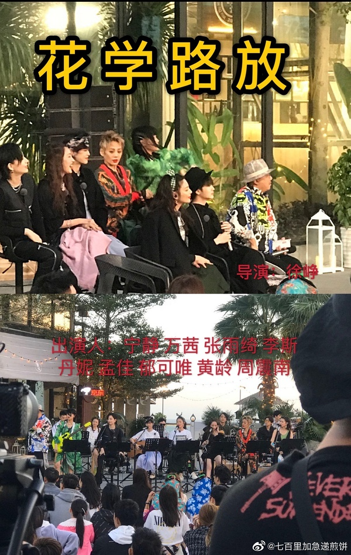
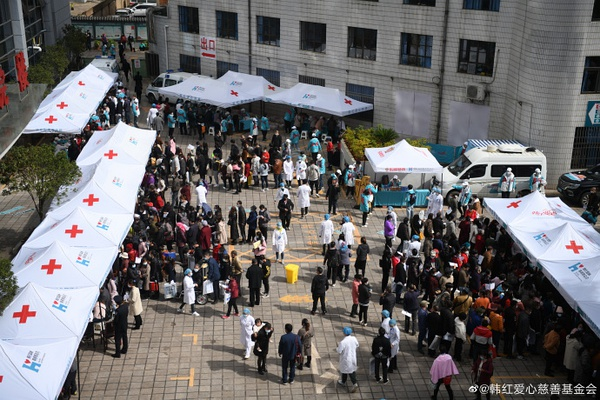

[主页](./main.md "main.md") | [首页](./comments1-100.md "comments1-100.md") | [前一页](./comments3701-3800.md "comments3701-3800.md") | [后一页](./comments3901-4000.md "comments3901-4000.md") | [末页](./comments10601-10700.md "comments10601-10700.md")  

---
*     [Unknow](https://www.douban.com/people/219306324/)    2020-10-22 12:34:15  
  >当时我记得微博有些人是说所有人都捧着林青霞，看不惯.......所以今年看静静，被人jv的话全都似  
  >
  >-- [Lee_Lee](https://www.douban.com/people/193645772/)  
  
  不管表现在怎么好，网上还是会有jv的声音  
---
*     [想不好长不高](https://www.douban.com/people/4098918/)    2020-10-22 12:34:57  
  >另外一种差不多就是关注年龄女性力量这些正面的，对节目寄予厚望来着，其实很多人因此关注，热度  
  >
  >-- [SiofnaFan](https://www.douban.com/people/180076918/)  
  
  其实节目一开始吃瓜群众都是等着看姐姐们怎么撕节目组，怎么内撕，你看第一期静静说的介绍自己，沈厂长的打板，伊能静的什么不要低腰还是其他，记不清了，微博上都抱着这回终于有人可以治🥭的心态！包括后面张小雨去脱口秀大会那次，庞博在里面说的那些话，其实都是当时吃瓜群众的心态！  
---
*     [想不好长不高](https://www.douban.com/people/4098918/)    2020-10-22 12:37:10  
  >说实话，要有讨论度又很正面，基本不可能吧  
  >  
  >浪姐六七月很火的时候，路人感兴趣热议的都是给11提  
  >
  >-- [minimum](https://www.douban.com/people/218236166/)  
  
  花少2为什么被封神，不就是里面成员互相对线的内容太刺激了，观众们看人吵架太开心了  
---
*     [SiofnaFan](https://www.douban.com/people/180076918/)    2020-10-22 12:39:31  
  >其实节目一开始吃瓜群众都是等着看姐姐们怎么撕节目组，怎么内撕，你看第一期静静说的介绍自己，  
  >
  >-- [想不好长不高](https://www.douban.com/people/4098918/)  
  
  不了，庞博的话我接受不能。  
---
* [![[已注销]](../../image/icon/user_normal.jpg)](https://www.douban.com/people/219008874/)    [[已注销]](https://www.douban.com/people/219008874/)    2020-10-22 12:40:45  
  >玛氏，M豆的物料太少😂我还在要  
  >
  >-- [Yisa黎珞](https://www.douban.com/people/217273308/)  
  
  好喜欢M豆的代言🤣  
---
*     [九儿](https://www.douban.com/people/152879078/)    2020-10-22 12:41:16  
  我也很喜欢偶像来了，一直追完的，今年还重温了一下  
---
*     [薄荷八宝糖](https://www.douban.com/people/185737152/)    2020-10-22 12:42:04  
  >7位姐姐发了微博，其中4位姐姐发了宣传图，只有1位姐姐的宣传图发了葵戴🎸，这人是谁呢？😊  
  >
  >-- [Yisa黎珞](https://www.douban.com/people/217273308/)  
  
  szd~  
---
*     [想不好长不高](https://www.douban.com/people/4098918/)    2020-10-22 12:44:48  
  >不了，庞博的话我接受不能。  
  >
  >-- [SiofnaFan](https://www.douban.com/people/180076918/)  
  
  粉丝是会接受不了，那些观众才不管呢，谁热闹我看谁！最近火的演员，我觉得微博上真正看那些选手表演的没几个吧，全等在那儿看导演们吐槽，谁吐槽得厉害就纷纷拍手叫好，现在这个环境就是这样，你都没法说谁对谁错  
---
*     [Unknow](https://www.douban.com/people/219306324/)    2020-10-22 12:46:38  
  >我也很喜欢偶像来了，一直追完的，今年还重温了一下  
  >
  >-- [九儿](https://www.douban.com/people/152879078/)  
  
  嗯 偶来是难得不用撕当噱头，温馨有趣，收视还高  
---
*     [SiofnaFan](https://www.douban.com/people/180076918/)    2020-10-22 12:48:46  
  >粉丝是会接受不了，那些观众才不管呢，谁热闹我看谁！最近火的演员，我觉得微博上真正看那些选手  
  >
  >-- [想不好长不高](https://www.douban.com/people/4098918/)  
  
  …那会儿我还是节目吃瓜观众，没有zqsg呢……并不是因为是哪位姐姐的粉丝而接受不了…  
  纯站在普通女性角度……  
  所以我并没有去看演员那个节目…  
---
*     [minimum](https://www.douban.com/people/218236166/)    2020-10-22 12:49:05  
  除去粉丝滤镜，偶来搁现在不会火，温情漫综艺审美疲劳了。你看向往的生活，马上停播了都。  
  上次浪姐的pd视频里说了，综艺肯定要制造矛盾，要不是嘉宾内撕，要不就是嘉宾和jmz撕，看pd选择哪一种。向往就是典型的温情漫综艺，嘉宾假装和jmz撕。  
    
  看演员请就位，还是嘉宾内撕更有市场  
---
*     [漠漠yt](https://www.douban.com/people/223048792/)    2020-10-22 12:49:16  
  >我也很喜欢偶像来了，一直追完的，今年还重温了一下  
  >
  >-- [九儿](https://www.douban.com/people/152879078/)  
  
  偶来是群像综艺的巅峰  
---
*     [想不好长不高](https://www.douban.com/people/4098918/)    2020-10-22 12:50:53  
  >除去粉丝滤镜，偶来搁现在不会火，温情漫综艺审美疲劳了。你看向往的生活，马上停播了都。  
  >上次  
  >
  >-- [minimum](https://www.douban.com/people/218236166/)  
  
  所以演员必须给郭双倍的钱啊，他可是担了这个节目十倍的活力😏  
---
*     [想不好长不高](https://www.douban.com/people/4098918/)    2020-10-22 12:54:23  
  >…那会儿我还是节目吃瓜观众，没有zqsg呢……并不是因为是哪位姐姐的粉丝而接受不了…  
  >纯站在普  
  >
  >-- [SiofnaFan](https://www.douban.com/people/180076918/)  
  
  都不需要看，每次节目播完，整个微博都在发那些导演点评的片段，都没人关心那些选手演的好不好，只要一吐槽流量小明星哪里不好，底下就一片叫好！唉，有时候看看这些流量明星么是可气，本事没多少市场全占光，搞得老演员要么给他们做配，要么就干脆不要了  
---
*     [阿呆](https://www.douban.com/people/223579792/)    2020-10-22 12:54:53  
  >经过成团夜，换头像这点嘲都不是事，不喜欢她的不会因为换头像就喜欢了，喜欢她的也不会因为不换  
  >
  >-- [Unknow](https://www.douban.com/people/219306324/)  
  
  支持不换！  
---
* [![[已注销]](../../image/icon/user_normal.jpg)](https://www.douban.com/people/222904340/)    [[已注销]](https://www.douban.com/people/222904340/)    2020-10-22 12:54:58  
  >都不需要看，每次节目播完，整个微博都在发那些导演点评的片段，都没人关心那些选手演的好不好，  
  >
  >-- [想不好长不高](https://www.douban.com/people/4098918/)  
  
  跑题了集美~  
---
*     [阿呆](https://www.douban.com/people/223579792/)    2020-10-22 12:55:21  
  >上楼能上7k静葵的各种视频功不可没，这楼大多时候在舞空气……能有这成绩不错了  
  >
  >-- [吃瓜](https://www.douban.com/people/219893584/)  
  
  对 就是闲扯。。。明天开始聊先导片 有机会上万  
---
*     [SiofnaFan](https://www.douban.com/people/180076918/)    2020-10-22 12:57:44  
  >对 就是闲扯。。。明天开始聊先导片 有机会上万  
  >
  >-- [阿呆](https://www.douban.com/people/223579792/)  
  
  这个……离一万距离还有很远啊…………  
---
*     [阿呆](https://www.douban.com/people/223579792/)    2020-10-22 12:58:56  
  >这个……离一万距离还有很远啊…………  
  >
  >-- [SiofnaFan](https://www.douban.com/people/180076918/)  
  
  明天就结束了？如果是周六封楼 我觉得可以  
---
*     [SiofnaFan](https://www.douban.com/people/180076918/)    2020-10-22 13:00:33  
  >明天就结束了？如果是周六封楼 我觉得可以  
  >
  >-- [阿呆](https://www.douban.com/people/223579792/)  
  
  什么时候封楼应该取决于普洱站什么时候开吧  
---
*     [想不好长不高](https://www.douban.com/people/4098918/)    2020-10-22 13:01:02  
  >跑题了集美~  
  >
  >-- [[已注销]](https://www.douban.com/people/222904340/)  
  
  哦哦哦，说着说着又扯远了，没有物料的日子就只能干聊了，停了停了😂  
---
* [![[已注销]](../../image/icon/user_normal.jpg)](https://www.douban.com/people/222904340/)    [[已注销]](https://www.douban.com/people/222904340/)    2020-10-22 13:01:58  
  >什么时候封楼应该取决于普洱站什么时候开吧  
  >
  >-- [SiofnaFan](https://www.douban.com/people/180076918/)  
  
  普洱站怎么个开法？郁葵26就去普洱了，静姐31有活动估计也是30号就会去普洱，26号前开楼还是30开楼啊  
---
*     [minimum](https://www.douban.com/people/218236166/)    2020-10-22 13:02:35  
  >明天就结束了？如果是周六封楼 我觉得可以  
  >
  >-- [阿呆](https://www.douban.com/people/223579792/)  
  
  要看明天路透程度以及先导片的含静葵量  
    
  就目前这样干聊吧，不歪楼真的聊不下去了  
    
  只能一人水500层啊啊啊啊szd，kdl，ttl  
---
*     [哇咔咔呀](https://www.douban.com/people/213342632/)    2020-10-22 13:03:42  
  >明天就结束了？如果是周六封楼 我觉得可以  
  >
  >-- [阿呆](https://www.douban.com/people/223579792/)  
  
  是郁🌻给你的“盲目自信”嘛😁  
---
*     [SiofnaFan](https://www.douban.com/people/180076918/)    2020-10-22 13:04:04  
  >普洱站怎么个开法？郁葵26就去普洱了，静姐31有活动估计也是30号就会去普洱，26号前开楼还是30开  
  >
  >-- [[已注销]](https://www.douban.com/people/222904340/)  
  
  那我觉得26号开楼比较好？  
---
*     [SiofnaFan](https://www.douban.com/people/180076918/)    2020-10-22 13:05:02  
    
  下面这张路透有见过吗？我一点儿印象都没有  
---
*     [偷吃猫的小鱼](https://www.douban.com/people/72681843/)    2020-10-22 13:05:38  
  >下面这张路透有见过吗？我一点儿印象都没有  
  >
  >-- [SiofnaFan](https://www.douban.com/people/180076918/)  
  
  泉州站的  
---
* [![[已注销]](../../image/icon/user_normal.jpg)](https://www.douban.com/people/222904340/)    [[已注销]](https://www.douban.com/people/222904340/)    2020-10-22 13:05:59  
  >那我觉得26号开楼比较好？  
  >
  >-- [SiofnaFan](https://www.douban.com/people/180076918/)  
  
  如果26开楼，再加上先导片还能嗑糖，30会放第一期正片，再加上31才开始第三站拍摄，感觉普洱站闲聊加追物料加嗑糖，有上万的机会😂  
---
*     [SiofnaFan](https://www.douban.com/people/180076918/)    2020-10-22 13:06:23  
  >泉州站的  
  >
  >-- [偷吃猫的小鱼](https://www.douban.com/people/72681843/)  
  
  嗯，这张路透图我不记得见过  
---
*     [SiofnaFan](https://www.douban.com/people/180076918/)    2020-10-22 13:07:29  
  >如果26开楼，再加上先导片还能嗑糖，30会放第一期正片，再加上31才开始第三站拍摄，感觉普洱站闲  
  >
  >-- [[已注销]](https://www.douban.com/people/222904340/)  
  
  普洱站大概是个正片直播讨论楼🤣  
---
*     [九儿](https://www.douban.com/people/152879078/)    2020-10-22 13:07:35  
  放弃午休爬完了楼，今天好无聊  
---
*     [Unknow](https://www.douban.com/people/219306324/)    2020-10-22 13:07:53  
  >下面这张路透有见过吗？我一点儿印象都没有  
  >
  >-- [SiofnaFan](https://www.douban.com/people/180076918/)  
  
  昨天别的yxh出来的，疑似jmz放的料  
---
* [![[已注销]](../../image/icon/user_normal.jpg)](https://www.douban.com/people/219008874/)    [[已注销]](https://www.douban.com/people/219008874/)    2020-10-22 13:08:12  
  >普洱站大概是个正片直播讨论楼🤣  
  >
  >-- [SiofnaFan](https://www.douban.com/people/180076918/)  
  
  看来还是普洱站站的不够高🤣  
---
*     [minimum](https://www.douban.com/people/218236166/)    2020-10-22 13:10:06  
  >看来还是普洱站站的不够高🤣  
  >
  >-- [[已注销]](https://www.douban.com/people/219008874/)  
  
  普洱就靠弟弟家站姐了，姐姐家的估计都跪了  
---
*     [Unknow](https://www.douban.com/people/219306324/)    2020-10-22 13:10:09  
  >看来还是普洱站站的不够高🤣  
  >
  >-- [[已注销]](https://www.douban.com/people/219008874/)  
  
  普洱可能是物料最少的一站 但可以靠直播把楼盖到上万  
---
* [![[已注销]](../../image/icon/user_normal.jpg)](https://www.douban.com/people/219008874/)    [[已注销]](https://www.douban.com/people/219008874/)    2020-10-22 13:10:24  
  其实最开始不是想一栋高楼从头盖到尾吗🤣不知什么时候变成了一站一栋楼  
---
* [![[已注销]](../../image/icon/user_normal.jpg)](https://www.douban.com/people/222904340/)    [[已注销]](https://www.douban.com/people/222904340/)    2020-10-22 13:11:17  
  >普洱就靠弟弟家站姐了，姐姐家的估计都跪了  
  >
  >-- [minimum](https://www.douban.com/people/218236166/)  
  
  普洱站可能是雨林地图，希望各大站姐别放弃啊😂体验一下海岛地图以外的其他地图，也是可以的啊😂  
---
*     [Unknow](https://www.douban.com/people/219306324/)    2020-10-22 13:11:37  
  >普洱站大概是个正片直播讨论楼🤣  
  >
  >-- [SiofnaFan](https://www.douban.com/people/180076918/)  
  
  普洱站是从31号姐姐们才陆陆续续到吧，30号放节目第一期 那就是节目直播楼了 哈哈哈哈  
---
* [![[已注销]](../../image/icon/user_normal.jpg)](https://www.douban.com/people/222904340/)    [[已注销]](https://www.douban.com/people/222904340/)    2020-10-22 13:12:45  
  >其实最开始不是想一栋高楼从头盖到尾吗🤣不知什么时候变成了一站一栋楼  
  >
  >-- [[已注销]](https://www.douban.com/people/219008874/)  
  
  如果能在其中一站盖到10000+，那就不太遗憾了，之前泉州站就是冲着盖万楼嘛。这样一站一楼也好，物料好翻点（这样跟自己讲😐  
---
*     [螺旋藻](https://www.douban.com/people/66268315/)    2020-10-22 13:13:22  
  >其实最开始不是想一栋高楼从头盖到尾吗🤣不知什么时候变成了一站一栋楼  
  >
  >-- [[已注销]](https://www.douban.com/people/219008874/)  
  
  哦，对呀  
---
* [![[已注销]](../../image/icon/user_normal.jpg)](https://www.douban.com/people/219008874/)    [[已注销]](https://www.douban.com/people/219008874/)    2020-10-22 13:13:26  
  >普洱就靠弟弟家站姐了，姐姐家的估计都跪了  
  >
  >-- [minimum](https://www.douban.com/people/218236166/)  
  
  普洱是真的偏…我查过我这去那 一没直飞 二无火车…  
---
*     [SiofnaFan](https://www.douban.com/people/180076918/)    2020-10-22 13:14:17  
  >昨天别的yxh出来的，疑似jmz放的料  
  >
  >-- [Unknow](https://www.douban.com/people/219306324/)  
  
  哦～那应该是了～有原图吗  
---
* [![[已注销]](../../image/icon/user_normal.jpg)](https://www.douban.com/people/219008874/)    [[已注销]](https://www.douban.com/people/219008874/)    2020-10-22 13:14:24  
  >如果能在其中一站盖到10000+，那就不太遗憾了，之前泉州站就是冲着盖万楼嘛。这样一站一楼也好，  
  >
  >-- [[已注销]](https://www.douban.com/people/222904340/)  
  
  一站一栋 就会面临什么时候开楼的问题了🤣  
---
*     [SiofnaFan](https://www.douban.com/people/180076918/)    2020-10-22 13:14:54  
  >看来还是普洱站站的不够高🤣  
  >
  >-- [[已注销]](https://www.douban.com/people/219008874/)  
  
  实在太偏远了……再加上节目组管控得那么严  
---
*     [SiofnaFan](https://www.douban.com/people/180076918/)    2020-10-22 13:16:34  
  >普洱站是从31号姐姐们才陆陆续续到吧，30号放节目第一期 那就是节目直播楼了 哈哈哈哈  
  >
  >-- [Unknow](https://www.douban.com/people/219306324/)  
  
  静姐应该30号到吧？31号还有个品牌活动诶  
---
*     [Unknow](https://www.douban.com/people/219306324/)    2020-10-22 13:17:38  
  >一站一栋 就会面临什么时候开楼的问题了🤣  
  >
  >-- [[已注销]](https://www.douban.com/people/219008874/)  
  
  还是楼名🤣  选择困难症表示 好难  
---
*     [SiofnaFan](https://www.douban.com/people/180076918/)    2020-10-22 13:18:34  
  >如果能在其中一站盖到10000+，那就不太遗憾了，之前泉州站就是冲着盖万楼嘛。这样一站一楼也好，  
  >
  >-- [[已注销]](https://www.douban.com/people/222904340/)  
  
  有直播的楼容易盖些，可惜了澜沧太偏了，应该基本无物料，没有物料盖楼加成  
---
*     [minimum](https://www.douban.com/people/218236166/)    2020-10-22 13:18:44  
  >普洱是真的偏…我查过我这去那 一没直飞 二无火车…  
  >
  >-- [[已注销]](https://www.douban.com/people/219008874/)  
  
  你查的只是到普洱吧，从普洱机场到澜沧还有170多公里哦，全程无高速，要3个半小时。  
    
  爆料不是说还要去版纳吗，澜沧去景洪也是170公里，全程无高速，3个半小时。  
    
  希望这一站这么偏让姐姐们体验下自驾流浪和音乐吧。  
    
  别让站姐们自驾流浪绝地求生了。  
---
*     [Unknow](https://www.douban.com/people/219306324/)    2020-10-22 13:19:00  
  >静姐应该30号到吧？31号还有个品牌活动诶  
  >
  >-- [SiofnaFan](https://www.douban.com/people/180076918/)  
  
  嗯 她应该会提前去，好奇是个什么品牌活动在普洱 和茶有关吗？  
---
*     [已注销](https://www.douban.com/people/187860590/)    2020-10-22 13:19:27  
  >当时我记得微博有些人是说所有人都捧着林青霞，看不惯.......所以今年看静静，被人jv的话全都似  
  >
  >-- [Lee_Lee](https://www.douban.com/people/193645772/)  
  
  srds，我很开心静静这些年发展很好，可以衬得起德高望重  
---
*     [SiofnaFan](https://www.douban.com/people/180076918/)    2020-10-22 13:20:06  
  >你查的只是到普洱吧，从普洱机场到澜沧还有170多公里哦，全程无高速，要3个半小时。  
  >  
  >爆料不是说  
  >
  >-- [minimum](https://www.douban.com/people/218236166/)  
  
  风景好路况好的话体会一下自驾游也不错  
---
* [![[已注销]](../../image/icon/user_normal.jpg)](https://www.douban.com/people/219008874/)    [[已注销]](https://www.douban.com/people/219008874/)    2020-10-22 13:21:00  
  >你查的只是到普洱吧，从普洱机场到澜沧还有170多公里哦，全程无高速，要3个半小时。  
  >  
  >爆料不是说  
  >
  >-- [minimum](https://www.douban.com/people/218236166/)  
  
  震撼我妈🤦‍♀️ 告辞 jmz自己放路透吧  
---
*     [SiofnaFan](https://www.douban.com/people/180076918/)    2020-10-22 13:21:25  
  >srds，我很开心静静这些年发展很好，可以衬得起德高望重  
  >
  >-- [已注销](https://www.douban.com/people/187860590/)  
  
  换个角度，心情也好些  
---
*     [已注销](https://www.douban.com/people/187860590/)    2020-10-22 13:21:48  
  >除去粉丝滤镜，偶来搁现在不会火，温情漫综艺审美疲劳了。你看向往的生活，马上停播了都。  
  >上次  
  >
  >-- [minimum](https://www.douban.com/people/218236166/)  
  
  向往前两季还假装为了食材厨具要劳动，能跟jmz撕一下，第四季已经放弃了，变成过日子了  
---
*     [SiofnaFan](https://www.douban.com/people/180076918/)    2020-10-22 13:21:59  
  >嗯 她应该会提前去，好奇是个什么品牌活动在普洱 和茶有关吗？  
  >
  >-- [Unknow](https://www.douban.com/people/219306324/)  
  
  这就不知道了🤣楼里有i静给答案吗  
---
*     [Shirley Tian](https://www.douban.com/people/150047836/)    2020-10-22 13:22:32  
  今天真的很无聊。。。。我对这节目的期待就是能贡献几首让我单曲循环的歌就行了～现在外面讨论度是真的很低。。  
---
* [![[已注销]](../../image/icon/user_normal.jpg)](https://www.douban.com/people/222904340/)    [[已注销]](https://www.douban.com/people/222904340/)    2020-10-22 13:22:35  
  >风景好路况好的话体会一下自驾游也不错  
  >
  >-- [SiofnaFan](https://www.douban.com/people/180076918/)  
  
  看天气预报好像那段时间天气都是雨  
---
*     [minimum](https://www.douban.com/people/218236166/)    2020-10-22 13:22:57  
  >风景好路况好的话体会一下自驾游也不错  
  >
  >-- [SiofnaFan](https://www.douban.com/people/180076918/)  
  
  希望拍点不一样的，每站关在民宿里，怕节目拍出来太无趣了。  
  综艺也是作品，姐姐们也是推掉其他工作机会来参加的  
---
* [![[已注销]](../../image/icon/user_normal.jpg)](https://www.douban.com/people/219008874/)    [[已注销]](https://www.douban.com/people/219008874/)    2020-10-22 13:23:03  
  >还是楼名🤣  选择困难症表示 好难  
  >
  >-- [Unknow](https://www.douban.com/people/219306324/)  
  
  天秤座表示尽可能避免参与选择🤣  
---
*     [SiofnaFan](https://www.douban.com/people/180076918/)    2020-10-22 13:23:55  
  >向往前两季还假装为了食材厨具要劳动，能跟jmz撕一下，第四季已经放弃了，变成过日子了  
  >
  >-- [已注销](https://www.douban.com/people/187860590/)  
  
  慢综这种，在我看来就是看人对不对😶  
---
* [![[已注销]](../../image/icon/user_normal.jpg)](https://www.douban.com/people/219008874/)    [[已注销]](https://www.douban.com/people/219008874/)    2020-10-22 13:24:01  
  >看天气预报好像那段时间天气都是雨  
  >
  >-- [[已注销]](https://www.douban.com/people/222904340/)  
  
  芒果真的是…  
---
*     [已注销](https://www.douban.com/people/187860590/)    2020-10-22 13:24:01  
  >你查的只是到普洱吧，从普洱机场到澜沧还有170多公里哦，全程无高速，要3个半小时。  
  >  
  >爆料不是说  
  >
  >-- [minimum](https://www.douban.com/people/218236166/)  
  
  话说澜沧有机场，姐姐们可以昆明转机去澜沧，不过还要看jmz怎么安排行程，全程山路没高速，怕是坐车要吐了  
---
*     [SiofnaFan](https://www.douban.com/people/180076918/)    2020-10-22 13:25:00  
  >看天气预报好像那段时间天气都是雨  
  >
  >-- [[已注销]](https://www.douban.com/people/222904340/)  
  
  啊……那为了安全着想还是算了吧……  
---
*     [已注销](https://www.douban.com/people/187860590/)    2020-10-22 13:25:18  
  >慢综这种，在我看来就是看人对不对😶  
  >
  >-- [SiofnaFan](https://www.douban.com/people/180076918/)  
  
  对，第一季都是真的老友重逢，大家聊得来，开心的感动的伤感的，后来塞进去的人越来越多，见面还要自我介绍，纯变成刷出镜率的工具了  
---
*     [Unknow](https://www.douban.com/people/219306324/)    2020-10-22 13:25:27  
  >话说澜沧有机场，姐姐们可以昆明转机去澜沧，不过还要看jmz怎么安排行程，全程山路没高速，怕是  
  >
  >-- [已注销](https://www.douban.com/people/187860590/)  
  
  云南的盘山公路，如果碰到个老司机开车快的，好容易坐吐了  
---
* [![[已注销]](../../image/icon/user_normal.jpg)](https://www.douban.com/people/222904340/)    [[已注销]](https://www.douban.com/people/222904340/)    2020-10-22 13:25:35  
  >你查的只是到普洱吧，从普洱机场到澜沧还有170多公里哦，全程无高速，要3个半小时。  
  >  
  >爆料不是说  
  >
  >-- [minimum](https://www.douban.com/people/218236166/)  
  
  全程无高速？那还是不要姐姐们自己体验自驾游了，还是找几个当地的老司机吧😥那边的省道大部分时间都是山顶上弯来弯去  
---
*     [SiofnaFan](https://www.douban.com/people/180076918/)    2020-10-22 13:25:38  
  >希望拍点不一样的，每站关在民宿里，怕节目拍出来太无趣了。  
  >综艺也是作品，姐姐们也是推掉其他  
  >
  >-- [minimum](https://www.douban.com/people/218236166/)  
  
  一直关在民宿里真的……😢  
---
*     [已注销](https://www.douban.com/people/187860590/)    2020-10-22 13:26:26  
  >云南的盘山公路，如果碰到个老司机开车快的，好容易坐吐了  
  >
  >-- [Unknow](https://www.douban.com/people/219306324/)  
  
  那我dream一个静葵同车坐在后排靠在一起，一起吐槽一起吐，哈哈哈哈，只要在一起怎么都是好的  
---
*     [SiofnaFan](https://www.douban.com/people/180076918/)    2020-10-22 13:27:18  
  >云南的盘山公路，如果碰到个老司机开车快的，好容易坐吐了  
  >
  >-- [Unknow](https://www.douban.com/people/219306324/)  
  
  我忘了云南的地形了😢  
---
*     [已注销](https://www.douban.com/people/187860590/)    2020-10-22 13:27:19  
  >全程无高速？那还是不要姐姐们自己体验自驾游了，还是找几个当地的老司机吧😥那边的省道大部分  
  >
  >-- [[已注销]](https://www.douban.com/people/222904340/)  
  
  那种盘山胳膊肘弯，哪个姐姐敢自驾。。。  
---
*     [Unknow](https://www.douban.com/people/219306324/)    2020-10-22 13:27:29  
  >一直关在民宿里真的……😢  
  >
  >-- [SiofnaFan](https://www.douban.com/people/180076918/)  
  
  看来播出后应该会有大量在民宿练歌的镜头吧，这两站看不出是旅游，完全就是去不同地方感受不同音乐，完完全全是音综啊  
---
*     [Yisa黎珞](https://www.douban.com/people/217273308/)    2020-10-22 13:28:00  
  >云南的盘山公路，如果碰到个老司机开车快的，好容易坐吐了  
  >
  >-- [Unknow](https://www.douban.com/people/219306324/)  
  
  别人吐不吐不知道，霞霞肯定不会吐，那晕船的vlog 一看就是受到过专业训练的  
---
*     [SiofnaFan](https://www.douban.com/people/180076918/)    2020-10-22 13:28:25  
  >看来播出后应该会有大量在民宿练歌的镜头吧，这两站看不出是旅游，完全就是去不同地方感受不同音  
  >
  >-- [Unknow](https://www.douban.com/people/219306324/)  
  
  😢😢😢  
---
*     [SiofnaFan](https://www.douban.com/people/180076918/)    2020-10-22 13:29:13  
  >别人吐不吐不知道，霞霞肯定不会吐，那晕船的vlog 一看就是受到过专业训练的  
  >
  >-- [Yisa黎珞](https://www.douban.com/people/217273308/)  
  
  哈哈哈哈哈哈哈哈哈哈哈哈那静静就拜托她照顾了哈哈哈哈哈哈哈哈  
---
*     [Unknow](https://www.douban.com/people/219306324/)    2020-10-22 13:29:15  
  >我忘了云南的地形了😢  
  >
  >-- [SiofnaFan](https://www.douban.com/people/180076918/)  
  
  我一个不晕车的人，到了那一个当地司机在盘山公路开了1-2小时，我都吐了，速度到不快 就是拐来拐去的，头晕眼花的  
---
*     [Unknow](https://www.douban.com/people/219306324/)    2020-10-22 13:30:06  
  >别人吐不吐不知道，霞霞肯定不会吐，那晕船的vlog 一看就是受到过专业训练的  
  >
  >-- [Yisa黎珞](https://www.douban.com/people/217273308/)  
  
  哈哈哈哈 能把那个晕车vlog剪出来 也是经过专业训练的  
---
* [![[已注销]](../../image/icon/user_normal.jpg)](https://www.douban.com/people/222904340/)    [[已注销]](https://www.douban.com/people/222904340/)    2020-10-22 13:30:15  
  >那种盘山胳膊肘弯，哪个姐姐敢自驾。。。  
  >
  >-- [已注销](https://www.douban.com/people/187860590/)  
  
  真的吓人的，望一下窗户外头，你会发现你在山顶😂 山底下跟个无底洞似的😂  
---
*     [minimum](https://www.douban.com/people/218236166/)    2020-10-22 13:30:16  
  >话说澜沧有机场，姐姐们可以昆明转机去澜沧，不过还要看jmz怎么安排行程，全程山路没高速，怕是  
  >
  >-- [已注销](https://www.douban.com/people/187860590/)  
  
  郁葵26到30号在普洱墨江县跟着韩红公益活动，31号到澜沧录团综，这货不知道会怎么走，晕不晕车  
    
  如果直接从墨江到澜沧，300多公里，开车得5个多小时  
---
*     [SiofnaFan](https://www.douban.com/people/180076918/)    2020-10-22 13:30:37  
  >我一个不晕车的人，到了那一个当地司机在盘山公路开了1-2小时，我都吐了，速度到不快 就是拐来拐  
  >
  >-- [Unknow](https://www.douban.com/people/219306324/)  
  
  不得不开始关心霞霞公益活动是什么形式  
---
*     [SiofnaFan](https://www.douban.com/people/180076918/)    2020-10-22 13:31:36  
  >郁葵26到30号在普洱墨江县跟着韩红公益活动，31号到澜沧录团综，这货不知道会怎么走，晕不晕车  
  >
  >-- [minimum](https://www.douban.com/people/218236166/)  
  
  😢😢😢好辛苦啊，吃得消吗  
---
*     [Yisa黎珞](https://www.douban.com/people/217273308/)    2020-10-22 13:31:52  
  >哈哈哈哈哈哈哈哈哈哈哈哈那静静就拜托她照顾了哈哈哈哈哈哈哈哈  
  >
  >-- [SiofnaFan](https://www.douban.com/people/180076918/)  
  
  那要做法静葵一辆车  
---
*     [九歌](https://www.douban.com/people/220243048/)    2020-10-22 13:32:09  
  >芒果真的是…  
  >
  >-- [[已注销]](https://www.douban.com/people/219008874/)  
  
  有毒  
---
*     [已注销](https://www.douban.com/people/187860590/)    2020-10-22 13:32:20  
  >真的吓人的，望一下窗户外头，你会发现你在山顶😂 山底下跟个无底洞似的😂  
  >
  >-- [[已注销]](https://www.douban.com/people/222904340/)  
  
  开始担心安全了，恐高的看一眼都头皮发麻，狗🥭最好少转场，尽量飞到就近的机场  
---
*     [Unknow](https://www.douban.com/people/219306324/)    2020-10-22 13:32:47  
  >那要做法静葵一辆车  
  >
  >-- [Yisa黎珞](https://www.douban.com/people/217273308/)  
  
  这次坐车的时间比较长 哈哈哈哈哈哈哈  
---
*     [已注销](https://www.douban.com/people/187860590/)    2020-10-22 13:32:59  
  >郁葵26到30号在普洱墨江县跟着韩红公益活动，31号到澜沧录团综，这货不知道会怎么走，晕不晕车  
  >
  >-- [minimum](https://www.douban.com/people/218236166/)  
  
  那种山路300公里超级痛苦，唉，郁葵月底好辛苦，一个礼拜都在山里  
---
*     [Yisa黎珞](https://www.douban.com/people/217273308/)    2020-10-22 13:33:59  
  >不得不开始关心霞霞公益活动是什么形式  
  >
  >-- [SiofnaFan](https://www.douban.com/people/180076918/)  
  
  参考去年形式，有医师团队看病，霞霞负责分发药品并介绍  
---
*     [SiofnaFan](https://www.douban.com/people/180076918/)    2020-10-22 13:34:54  
  >参考去年形式，有医师团队看病，霞霞负责分发药品并介绍  
  >
  >-- [Yisa黎珞](https://www.douban.com/people/217273308/)  
  
  下村吗  
---
* [![[已注销]](../../image/icon/user_normal.jpg)](https://www.douban.com/people/219008874/)    [[已注销]](https://www.douban.com/people/219008874/)    2020-10-22 13:35:09  
  几小时的山路也太痛苦了🤭我平时不晕车，山路上七拐八拐半个小时以上我就当场去世  
---
* [![[已注销]](../../image/icon/user_normal.jpg)](https://www.douban.com/people/222904340/)    [[已注销]](https://www.douban.com/people/222904340/)    2020-10-22 13:36:01  
  >开始担心安全了，恐高的看一眼都头皮发麻，狗🥭最好少转场，尽量飞到就近的机场  
  >
  >-- [已注销](https://www.douban.com/people/187860590/)  
  
  普洱好像有机场啊，我查了一下好像叫思茅机场，普洱隔壁的临沧市也有临沧机场，西双版纳也有机场。整个云南好像有14个机场，就希望节目组好好考虑下路线，选个最近的吧  
---
*     [已注销](https://www.douban.com/people/187860590/)    2020-10-22 13:38:56  
  >芒果真的是…  
  >
  >-- [[已注销]](https://www.douban.com/people/219008874/)  
  
  狗🥭要每一站都刷新个极端天气吗，千万要保证姐姐们的安全  
---
* [![[已注销]](../../image/icon/user_normal.jpg)](https://www.douban.com/people/219008874/)    [[已注销]](https://www.douban.com/people/219008874/)    2020-10-22 13:41:39  
  >狗🥭要每一站都刷新个极端天气吗，千万要保证姐姐们的安全  
  >
  >-- [已注销](https://www.douban.com/people/187860590/)  
  
  山区下雨感觉好危险🤭  
---
*     [Yisa黎珞](https://www.douban.com/people/217273308/)    2020-10-22 13:42:59  
  >下村吗  
  >
  >-- [SiofnaFan](https://www.douban.com/people/180076918/)  
  
    
  霞霞去了就在那小棚子里，现在#  
---
*     [已注 销](https://www.douban.com/people/155947097/)    2020-10-22 13:43:35  
  >那我dream一个静葵同车坐在后排靠在一起，一起吐槽一起吐，哈哈哈哈，只要在一起怎么都是好的  
  >
  >-- [已注销](https://www.douban.com/people/187860590/)  
  
  哈哈哈哈哈或这个我也可以  
---
*     [秃发雀丝](https://www.douban.com/people/3984012/)    2020-10-22 13:43:56  
  >郁葵26到30号在普洱墨江县跟着韩红公益活动，31号到澜沧录团综，这货不知道会怎么走，晕不晕车  
  >
  >-- [minimum](https://www.douban.com/people/218236166/)  
  
  葵成都站开始就马不停蹄 到普洱站开始估计就很累的了  
---
*     [已注销](https://www.douban.com/people/187860590/)    2020-10-22 13:44:50  
  >霞霞去了就在那小棚子里，现在#韩红爱心百人援滇# 义诊第四站：泸西县人民医院  
  >
  >-- [Yisa黎珞](https://www.douban.com/people/217273308/)  
  
  可是歌手去了能做什么吗？要全天跟着义诊医生？  
---
*     [Yisa黎珞](https://www.douban.com/people/217273308/)    2020-10-22 13:46:17  
  >郁葵26到30号在普洱墨江县跟着韩红公益活动，31号到澜沧录团综，这货不知道会怎么走，晕不晕车  
  >
  >-- [minimum](https://www.douban.com/people/218236166/)  
  
  我看韩红爱心百人援滇这几天行程，一天一个县，霞霞26-30要去起码4个县  
---
*     [小丽](https://www.douban.com/people/225045400/)    2020-10-22 13:47:21  
  路人给宁静说一声，哇！她好漂亮！  
---
*     [Yisa黎珞](https://www.douban.com/people/217273308/)    2020-10-22 13:48:39  
  >可是歌手去了能做什么吗？要全天跟着义诊医生？  
  >
  >-- [已注销](https://www.douban.com/people/187860590/)  
  
  去年为药房组成员，每种药品的用途，仔细叮嘱病患（多为年纪大的）用药须知  
---
*     [阿呆](https://www.douban.com/people/223579792/)    2020-10-22 13:49:18  
  >是郁🌻给你的“盲目自信”嘛😁  
  >
  >-- [哇咔咔呀](https://www.douban.com/people/213342632/)  
  
  不 是楼里的各位  
---
*     [豆友219767725](https://www.douban.com/people/219767725/)    2020-10-22 13:49:23  
  >可是歌手去了能做什么吗？要全天跟着义诊医生？  
  >
  >-- [已注销](https://www.douban.com/people/187860590/)  
  
  歌手去年的任务是派药  
---

3801-3900

---

[主页](./main.md "main.md") | [首页](./comments1-100.md "comments1-100.md") | [前一页](./comments3701-3800.md "comments3701-3800.md") | [后一页](./comments3901-4000.md "comments3901-4000.md") | [末页](./comments10601-10700.md "comments10601-10700.md")  

---
[1-100](./comments1-100.md "1-100")  [101-200](./comments101-200.md "101-200")  [201-300](./comments201-300.md "201-300")  [301-400](./comments301-400.md "301-400")  [401-500](./comments401-500.md "401-500")  [501-600](./comments501-600.md "501-600")  [601-700](./comments601-700.md "601-700")  [701-800](./comments701-800.md "701-800")  [801-900](./comments801-900.md "801-900")  [901-1000](./comments901-1000.md "901-1000")  [1001-1100](./comments1001-1100.md "1001-1100")  [1101-1200](./comments1101-1200.md "1101-1200")  [1201-1300](./comments1201-1300.md "1201-1300")  [1301-1400](./comments1301-1400.md "1301-1400")  [1401-1500](./comments1401-1500.md "1401-1500")  [1501-1600](./comments1501-1600.md "1501-1600")  [1601-1700](./comments1601-1700.md "1601-1700")  [1701-1800](./comments1701-1800.md "1701-1800")  [1801-1900](./comments1801-1900.md "1801-1900")  [1901-2000](./comments1901-2000.md "1901-2000")  [2001-2100](./comments2001-2100.md "2001-2100")  [2101-2200](./comments2101-2200.md "2101-2200")  [2201-2300](./comments2201-2300.md "2201-2300")  [2301-2400](./comments2301-2400.md "2301-2400")  [2401-2500](./comments2401-2500.md "2401-2500")  [2501-2600](./comments2501-2600.md "2501-2600")  [2601-2700](./comments2601-2700.md "2601-2700")  [2701-2800](./comments2701-2800.md "2701-2800")  [2801-2900](./comments2801-2900.md "2801-2900")  [2901-3000](./comments2901-3000.md "2901-3000")  [3001-3100](./comments3001-3100.md "3001-3100")  [3101-3200](./comments3101-3200.md "3101-3200")  [3201-3300](./comments3201-3300.md "3201-3300")  [3301-3400](./comments3301-3400.md "3301-3400")  [3401-3500](./comments3401-3500.md "3401-3500")  [3501-3600](./comments3501-3600.md "3501-3600")  [3601-3700](./comments3601-3700.md "3601-3700")  [3701-3800](./comments3701-3800.md "3701-3800")  [3801-3900](./comments3801-3900.md "3801-3900")  [3901-4000](./comments3901-4000.md "3901-4000")  [4001-4100](./comments4001-4100.md "4001-4100")  [4101-4200](./comments4101-4200.md "4101-4200")  [4201-4300](./comments4201-4300.md "4201-4300")  [4301-4400](./comments4301-4400.md "4301-4400")  [4401-4500](./comments4401-4500.md "4401-4500")  [4501-4600](./comments4501-4600.md "4501-4600")  [4601-4700](./comments4601-4700.md "4601-4700")  [4701-4800](./comments4701-4800.md "4701-4800")  [4801-4900](./comments4801-4900.md "4801-4900")  [4901-5000](./comments4901-5000.md "4901-5000")  [5001-5100](./comments5001-5100.md "5001-5100")  [5101-5200](./comments5101-5200.md "5101-5200")  [5201-5300](./comments5201-5300.md "5201-5300")  [5301-5400](./comments5301-5400.md "5301-5400")  [5401-5500](./comments5401-5500.md "5401-5500")  [5501-5600](./comments5501-5600.md "5501-5600")  [5601-5700](./comments5601-5700.md "5601-5700")  [5701-5800](./comments5701-5800.md "5701-5800")  [5801-5900](./comments5801-5900.md "5801-5900")  [5901-6000](./comments5901-6000.md "5901-6000")  [6001-6100](./comments6001-6100.md "6001-6100")  [6101-6200](./comments6101-6200.md "6101-6200")  [6201-6300](./comments6201-6300.md "6201-6300")  [6301-6400](./comments6301-6400.md "6301-6400")  [6401-6500](./comments6401-6500.md "6401-6500")  [6501-6600](./comments6501-6600.md "6501-6600")  [6601-6700](./comments6601-6700.md "6601-6700")  [6701-6800](./comments6701-6800.md "6701-6800")  [6801-6900](./comments6801-6900.md "6801-6900")  [6901-7000](./comments6901-7000.md "6901-7000")  [7001-7100](./comments7001-7100.md "7001-7100")  [7101-7200](./comments7101-7200.md "7101-7200")  [7201-7300](./comments7201-7300.md "7201-7300")  [7301-7400](./comments7301-7400.md "7301-7400")  [7401-7500](./comments7401-7500.md "7401-7500")  [7501-7600](./comments7501-7600.md "7501-7600")  [7601-7700](./comments7601-7700.md "7601-7700")  [7701-7800](./comments7701-7800.md "7701-7800")  [7801-7900](./comments7801-7900.md "7801-7900")  [7901-8000](./comments7901-8000.md "7901-8000")  [8001-8100](./comments8001-8100.md "8001-8100")  [8101-8200](./comments8101-8200.md "8101-8200")  [8201-8300](./comments8201-8300.md "8201-8300")  [8301-8400](./comments8301-8400.md "8301-8400")  [8401-8500](./comments8401-8500.md "8401-8500")  [8501-8600](./comments8501-8600.md "8501-8600")  [8601-8700](./comments8601-8700.md "8601-8700")  [8701-8800](./comments8701-8800.md "8701-8800")  [8801-8900](./comments8801-8900.md "8801-8900")  [8901-9000](./comments8901-9000.md "8901-9000")  [9001-9100](./comments9001-9100.md "9001-9100")  [9101-9200](./comments9101-9200.md "9101-9200")  [9201-9300](./comments9201-9300.md "9201-9300")  [9301-9400](./comments9301-9400.md "9301-9400")  [9401-9500](./comments9401-9500.md "9401-9500")  [9501-9600](./comments9501-9600.md "9501-9600")  [9601-9700](./comments9601-9700.md "9601-9700")  [9701-9800](./comments9701-9800.md "9701-9800")  [9801-9900](./comments9801-9900.md "9801-9900")  [9901-10000](./comments9901-10000.md "9901-10000")  [10001-10100](./comments10001-10100.md "10001-10100")  [10101-10200](./comments10101-10200.md "10101-10200")  [10201-10300](./comments10201-10300.md "10201-10300")  [10301-10400](./comments10301-10400.md "10301-10400")  [10401-10500](./comments10401-10500.md "10401-10500")  [10501-10600](./comments10501-10600.md "10501-10600")  [10601-10700](./comments10601-10700.md "10601-10700")  