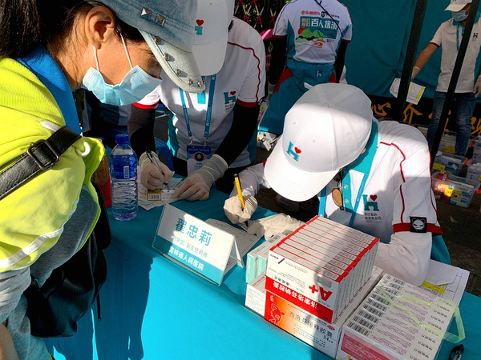

[主页](./main.md "main.md") | [首页](./comments1-100.md "comments1-100.md") | [前一页](./comments9401-9500.md "comments9401-9500.md") | [后一页](./comments9601-9700.md "comments9601-9700.md") | [末页](./comments10601-10700.md "comments10601-10700.md")  

---
*     [漠漠yt](https://www.douban.com/people/223048792/)    2020-10-26 21:35:10  
  >隔壁瓜说 云南路演 在西双版纳🤦‍♀️吃瓜不信瓜  
  >
  >-- [[已注销]](https://www.douban.com/people/219008874/)  
  
  之前就看到有说要去版纳 但当时没说在那儿路演  
---
*     [已注销](https://www.douban.com/people/187860590/)    2020-10-26 21:35:16  
  >本楼每天要做的几件事：  
  >1、她好漂亮  
  >2、她好奶  
  >3、kts！  
  >4、［该回复已删除］  
  >
  >-- [已注 销](https://www.douban.com/people/155947097/)  
  
  哈哈哈哈哈哈哈哈，比我每天手账打卡的完成度还要高，我爱我的静静葵葵  
---
*     [SiofnaFan](https://www.douban.com/people/180076918/)    2020-10-26 21:36:34  
  >隔壁瓜说 云南路演 在西双版纳🤦‍♀️吃瓜不信瓜  
  >
  >-- [[已注销]](https://www.douban.com/people/219008874/)  
  
  哈？  
---
*     [笑忘书](https://www.douban.com/people/40401623/)    2020-10-26 21:36:38  
  >隔壁瓜说 云南路演 在西双版纳🤦‍♀️吃瓜不信瓜  
  >
  >-- [[已注销]](https://www.douban.com/people/219008874/)  
  
  🤦‍♀️什么鬼，两个地方车程三个多小时啊，还不是高速路  
---
*     [SiofnaFan](https://www.douban.com/people/180076918/)    2020-10-26 21:36:57  
  >本楼每天要做的几件事：  
  >1、她好漂亮  
  >2、她好奶  
  >3、kts！  
  >4、［该回复已删除］  
  >
  >-- [已注 销](https://www.douban.com/people/155947097/)  
  
  哈哈哈哈哈哈哈哈哈哈哈哈哈哈哈  
---
*     [薄荷八宝糖](https://www.douban.com/people/185737152/)    2020-10-26 21:40:52  
  >本楼每天要做的几件事：  
  >1、她好漂亮  
  >2、她好奶  
  >3、kts！  
  >4、［该回复已删除］  
  >
  >-- [已注 销](https://www.douban.com/people/155947097/)  
  
  最后一条看了要心梗😂  
---
*     [Unknow](https://www.douban.com/people/219306324/)    2020-10-26 21:41:22  
  >本楼每天要做的几件事：  
  >1、她好漂亮  
  >2、她好奶  
  >3、kts！  
  >4、［该回复已删除］  
  >
  >-- [已注 销](https://www.douban.com/people/155947097/)  
  
  😂😂😂没毛病  
---
*     [萌主](https://www.douban.com/people/217820198/)    2020-10-26 21:43:20  
  葵这几天净坐车了  
---
*     [漠漠yt](https://www.douban.com/people/223048792/)    2020-10-26 21:43:54  
  静静葵=静静queen 读起来是不是有亿点相似  
---
*     [已注销](https://www.douban.com/people/187860590/)    2020-10-26 21:50:40  
  >静静葵=静静queen 读起来是不是有亿点相似  
  >
  >-- [漠漠yt](https://www.douban.com/people/223048792/)  
  
  kts！天作之合对不对  
---
* [![[已注销]](../../image/icon/user_normal.jpg)](https://www.douban.com/people/219008874/)    [[已注销]](https://www.douban.com/people/219008874/)    2020-10-26 21:51:51  
  >？普洱市澜沧县民宿，跑去隔壁的西双版纳演出？那为什么不一开始就把位置定在西双版纳🤦‍♀  
  >
  >-- [松鼠与熊](https://www.douban.com/people/168667402/)  
  
  🤦‍♀️谁知道jmz什么骚操作 可能澜沧人少点？  
---
*     [鱼丸子](https://www.douban.com/people/43183830/)    2020-10-26 21:55:45  
  说不定传说中的自驾要来了  
---
*     [元素周期表51号](https://www.douban.com/people/199280408/)    2020-10-26 21:56:19  
  宁静真xxx的漂亮  
---
*     [阿呆](https://www.douban.com/people/223579792/)    2020-10-26 21:58:05  
  >对 今天在ch里还看到一张 贼拉帅  
  >
  >-- [Unknow](https://www.douban.com/people/219306324/)  
  
  好帅  
---
*     [漠漠yt](https://www.douban.com/people/223048792/)    2020-10-26 21:58:07  
  >kts！天作之合对不对  
  >
  >-- [已注销](https://www.douban.com/people/187860590/)  
  
  Kts  
---
*     [阿呆](https://www.douban.com/people/223579792/)    2020-10-26 21:58:46  
  >借金主爸爸今天发的图来完成一波kpi？  
  >
  >-- [已注 销](https://www.douban.com/people/155947097/)  
  
  我要去排队了  
---
*     [漠漠yt](https://www.douban.com/people/223048792/)    2020-10-26 22:00:25  
  我姑妈每次看到静静 都只有一句话 宁静真的太漂亮了  
---
*     [已注销](https://www.douban.com/people/187860590/)    2020-10-26 22:00:45  
  >说不定传说中的自驾要来了  
  >
  >-- [鱼丸子](https://www.douban.com/people/43183830/)  
  
  盘山公路自驾😂，乘风破浪之后要翻山越岭了  
---
*     [秃发雀丝](https://www.douban.com/people/3984012/)    2020-10-26 22:05:41  
  >静静新收藏，有点期待女人花了呢  
  >
  >-- [已注销](https://www.douban.com/people/187860590/)  
  
  女人花静静今天新加的吧 早上八点看还没有呢🤪  
---
*     [阿夕夕夕夕](https://www.douban.com/people/221568156/)    2020-10-26 22:06:04  
  >本楼每天要做的几件事：  
  >1、她好漂亮  
  >2、她好奶  
  >3、kts！  
  >4、［该回复已删除］  
  >
  >-- [已注 销](https://www.douban.com/people/155947097/)  
  
  神总结  
---
*     [九歌](https://www.douban.com/people/220243048/)    2020-10-26 22:07:24  
  >盘山公路自驾😂，乘风破浪之后要翻山越岭了  
  >
  >-- [已注销](https://www.douban.com/people/187860590/)  
  
  静姐和葵晕车吗  
---
*     [已注销](https://www.douban.com/people/187860590/)    2020-10-26 22:08:29  
  >静姐和葵晕车吗  
  >
  >-- [九歌](https://www.douban.com/people/220243048/)  
  
  正常情况应该都还好，可是云南那种180°转眼的盘山公路开4个小时，可能大家都没那个体验  
---
*     [已注销](https://www.douban.com/people/187860590/)    2020-10-26 22:08:55  
  >女人花静静今天新加的吧 早上八点看还没有呢🤪  
  >
  >-- [秃发雀丝](https://www.douban.com/people/3984012/)  
  
  今天加的，可能在三楼放着轻音乐织毛衣  
---
*     [笑忘书](https://www.douban.com/people/40401623/)    2020-10-26 22:10:36  
  >正常情况应该都还好，可是云南那种180°转眼的盘山公路开4个小时，可能大家都没那个体验  
  >
  >-- [已注销](https://www.douban.com/people/187860590/)  
  
  🤦‍♀️不仅仅是山路十八弯，有些山路还比较危险，不熟的人不能开  
---
*     [胖🐯](https://www.douban.com/people/171300359/)    2020-10-26 22:12:54  
  >静静新收藏，有点期待女人花了呢  
  >
  >-- [已注销](https://www.douban.com/people/187860590/)  
  
  哈哈哈哈哈这是在哪里找到的呀  
---
*     [已注销](https://www.douban.com/people/187860590/)    2020-10-26 22:16:15  
  >哈哈哈哈哈这是在哪里找到的呀  
  >
  >-- [胖🐯](https://www.douban.com/people/171300359/)  
  
  q音静姐主页  
---
*     [已注销](https://www.douban.com/people/187860590/)    2020-10-26 22:16:51  
  >🤦‍♀️不仅仅是山路十八弯，有些山路还比较危险，不熟的人不能开  
  >
  >-- [笑忘书](https://www.douban.com/people/40401623/)  
  
  好危险的感觉，这两天还有岷江自驾掉下去的，jmz最好别折腾  
---
*     [已注 销](https://www.douban.com/people/155947097/)    2020-10-26 22:19:51  
  >哈哈哈哈哈哈哈哈，比我每天手账打卡的完成度还要高，我爱我的静静葵葵  
  >
  >-- [已注销](https://www.douban.com/people/187860590/)  
  
  哈哈哈今日完成度💯  
---
*     [已注 销](https://www.douban.com/people/155947097/)    2020-10-26 22:20:19  
  >最后一条看了要心梗😂  
  >
  >-- [薄荷八宝糖](https://www.douban.com/people/185737152/)  
  
  哈哈哈哈哈看见这几个字就抓心挠肺是不是  
---
*     [笑忘书](https://www.douban.com/people/40401623/)    2020-10-26 22:28:07  
  >好危险的感觉，这两天还有岷江自驾掉下去的，jmz最好别折腾  
  >
  >-- [已注销](https://www.douban.com/people/187860590/)  
  
  是啊，山路真的各种弯弯绕绕，然后有些车速还快，我小时候，每逢五一或者十一长假都会听到有外省车从山路上冲下去的消息🤦‍♀️🤦‍♀️🤦‍♀️不过现在都是走高速了，基本没什么危险了，但是高速上又体会不到自驾的乐趣  
---
*     [echo](https://www.douban.com/people/219314368/)    2020-10-26 22:28:57  
  最后一条真的是噩梦啊  
---
*     [已注销](https://www.douban.com/people/187860590/)    2020-10-26 22:33:01  
  >是啊，山路真的各种弯弯绕绕，然后有些车速还快，我小时候，每逢五一或者十一长假都会听到有外省  
  >
  >-- [笑忘书](https://www.douban.com/people/40401623/)  
  
  澜沧到版纳好像没有高速的，路况最好的就是国道公路了，有点点担心  
---
*     [秃发雀丝](https://www.douban.com/people/3984012/)    2020-10-26 22:34:25  
  弟弟发weibo回应那个事情了 有点进展也好....  
---
*     [胖🐯](https://www.douban.com/people/171300359/)    2020-10-26 22:35:23  
  >q音静姐主页  
  >
  >-- [已注销](https://www.douban.com/people/187860590/)  
  
  好的谢谢！  
---
*     [平平无奇的猹](https://www.douban.com/people/218771450/)    2020-10-26 22:36:18  
  >弟弟发weibo回应那个事情了 有点进展也好....  
  >
  >-- [秃发雀丝](https://www.douban.com/people/3984012/)  
  
  讲道理这个回应不太行.....  
---
*     [秃发雀丝](https://www.douban.com/people/3984012/)    2020-10-26 22:39:42  
  >讲道理这个回应不太行.....  
  >
  >-- [平平无奇的猹](https://www.douban.com/people/218771450/)  
  
  就中规中矩吧……看这几天舆论发展 周五基本就有个眉目了  
---
*     [想不好长不高](https://www.douban.com/people/4098918/)    2020-10-26 22:46:18  
  >讲道理这个回应不太行.....  
  >
  >-- [平平无奇的猹](https://www.douban.com/people/218771450/)  
  
  总比他那些谈恋爱队友好一点吧，而且也说会一起努力面对承担，不过没有明说会帮父母一起还钱，就差点意思了  
---
*     [已注销](https://www.douban.com/people/187860590/)    2020-10-26 22:51:06  
  蓝短裤竟然是首儿歌？？  
---
*     [笑忘书](https://www.douban.com/people/40401623/)    2020-10-26 22:53:08  
  >澜沧到版纳好像没有高速的，路况最好的就是国道公路了，有点点担心  
  >
  >-- [已注销](https://www.douban.com/people/187860590/)  
  
  部分路段没有高速吧，也不用太担心，安全问题jmz肯定会重视的  
---
*     [想不好长不高](https://www.douban.com/people/4098918/)    2020-10-26 22:53:10  
  >蓝短裤竟然是首儿歌？？  
  >
  >-- [已注销](https://www.douban.com/people/187860590/)  
  
  大概是连葵粉都不知道当年为什么首专里要放进去的一首儿歌  
---
*     [彷徨少年时](https://www.douban.com/people/charlotte3/)    2020-10-26 22:55:09  
  >大概是连葵粉都不知道当年为什么首专里要放进去的一首儿歌  
  >
  >-- [想不好长不高](https://www.douban.com/people/4098918/)  
  
  那是李正帆写的呀！本来他和葵在音乐理念上就很契合，而且唱天使版的时候那声嘶吼也是发自内心的了！当时看了李正帆在豆瓣的回复很是感动呀！  
---
*     [秃发雀丝](https://www.douban.com/people/3984012/)    2020-10-26 22:56:35  
  蓝短裤还是专辑名有两版本吧……前面几张专辑选曲风格蛮分裂的  
---
*     [已注销](https://www.douban.com/people/187860590/)    2020-10-26 22:58:19  
  >那是李正帆写的呀！本来他和葵在音乐理念上就很契合，而且唱天使版的时候那声嘶吼也是发自内心的  
  >
  >-- [彷徨少年时](https://www.douban.com/people/charlotte3/)  
  
  这背后还有好多故事啊  
---
*     [想不好长不高](https://www.douban.com/people/4098918/)    2020-10-26 23:00:08  
  >那是李正帆写的呀！本来他和葵在音乐理念上就很契合，而且唱天使版的时候那声嘶吼也是发自内心的  
  >
  >-- [彷徨少年时](https://www.douban.com/people/charlotte3/)  
  
  我知道，但是放专辑里就很分裂啊，而且作为她出道的第一张专辑，放了一首，emmmm有点先锋实验味道的歌，就有点让人摸不到头脑，一般新人的第一张专辑不是要先打响她的品牌么  
---
*     [SiofnaFan](https://www.douban.com/people/180076918/)    2020-10-26 23:02:32  
  >大概是连葵粉都不知道当年为什么首专里要放进去的一首儿歌  
  >
  >-- [想不好长不高](https://www.douban.com/people/4098918/)  
  
  考古好像里面和声全是她自己？  
---
*     [想不好长不高](https://www.douban.com/people/4098918/)    2020-10-26 23:06:25  
  >考古好像里面和声全是她自己？  
  >
  >-- [SiofnaFan](https://www.douban.com/people/180076918/)  
  
  对啊，这些和声对她来说真的是小菜一碟了，其实什么王菲啊孙燕姿啊张韶涵啊，她09年比赛前就学得活灵活现了，模仿个把个声音完全不在话下  
---
*     [SiofnaFan](https://www.douban.com/people/180076918/)    2020-10-26 23:09:43  
  >对啊，这些和声对她来说真的是小菜一碟了，其实什么王菲啊孙燕姿啊张韶涵啊，她09年比赛前就学得  
  >
  >-- [想不好长不高](https://www.douban.com/people/4098918/)  
  
  哈哈哈模仿合集也有看过，确实模仿得像  
  蓝短裤这个如果不是最近已经熟悉她可可爱爱的声音，我都不敢认😂  
---
*     [想不好长不高](https://www.douban.com/people/4098918/)    2020-10-26 23:15:08  
  >哈哈哈模仿合集也有看过，确实模仿得像  
  >蓝短裤这个如果不是最近已经熟悉她可可爱爱的声音，我都  
  >
  >-- [SiofnaFan](https://www.douban.com/people/180076918/)  
  
  听蓝短裤的时候就特别酸爽，滚石跟玩似的，最后选的那些歌上到九十九，下到刚会走，老少通吃，每个曲风来一首，简直是精分的合体😂  
---
*     [SiofnaFan](https://www.douban.com/people/180076918/)    2020-10-26 23:20:50  
  >听蓝短裤的时候就特别酸爽，滚石跟玩似的，最后选的那些歌上到九十九，下到刚会走，老少通吃，每  
  >
  >-- [想不好长不高](https://www.douban.com/people/4098918/)  
  
  😂😂😂😂  
  我都是全部歌随机循环，都不知道这些  
  等年底忙完，仔细一张张考古一下  
---
*     [蒜苔开出了鲜花](https://www.douban.com/people/26765466/)    2020-10-26 23:30:10  
  >正常情况应该都还好，可是云南那种180°转眼的盘山公路开4个小时，可能大家都没那个体验  
  >
  >-- [已注销](https://www.douban.com/people/187860590/)  
  
  我觉得还可以啦。云贵那边的司机都很厉害，十八弯的山路都开得很稳的，不会那种急刹急停。  
---
*     [蒜苔开出了鲜花](https://www.douban.com/people/26765466/)    2020-10-26 23:31:24  
  >讲道理这个回应不太行.....  
  >
  >-- [平平无奇的猹](https://www.douban.com/people/218771450/)  
  
  其实这件事我觉得满无解的。  
  触大众雷点了  
---
*     [已注销](https://www.douban.com/people/187860590/)    2020-10-26 23:32:04  
  >我觉得还可以啦。云贵那边的司机都很厉害，十八弯的山路都开得很稳的，不会那种急刹急停。  
  >
  >-- [蒜苔开出了鲜花](https://www.douban.com/people/26765466/)  
  
  转场路途好远，这么看大邑一点都不远了呢  
---
*     [cherrie199](https://www.douban.com/people/195510471/)    2020-10-26 23:37:27  
  >对 今天在ch里还看到一张 贼拉帅  
  >
  >-- [Unknow](https://www.douban.com/people/219306324/)  
  
  她好漂亮，打卡完成  
---
*     [蒜苔开出了鲜花](https://www.douban.com/people/26765466/)    2020-10-26 23:37:57  
  >转场路途好远，这么看大邑一点都不远了呢  
  >
  >-- [已注销](https://www.douban.com/people/187860590/)  
  
  路途虽远，沿途风景也不错的。  
  不要把行程做得太紧，找当地司机稳稳开没啥的，要相信祖国这几年基建的功力。  
  我记得十几年前我去云贵游的时候，进泸沽湖那路还遇上泥石流，只能绕路，一车人吐了一半。  
---
*     [已注销](https://www.douban.com/people/187860590/)    2020-10-26 23:40:22  
  >路途虽远，沿途风景也不错的。  
  >不要把行程做得太紧，找当地司机稳稳开没啥的，要相信祖国这几年  
  >
  >-- [蒜苔开出了鲜花](https://www.douban.com/people/26765466/)  
  
  说到风景就有点期待了，路途颠簸，祝她俩别吐！  
---
*     [已注 销](https://www.douban.com/people/155947097/)    2020-10-26 23:43:29  
  >说到风景就有点期待了，路途颠簸，祝她俩别吐！  
  >
  >-- [已注销](https://www.douban.com/people/187860590/)  
  
  你的祝福好特别哈哈哈哈  
---
*     [蒜苔开出了鲜花](https://www.douban.com/people/26765466/)    2020-10-26 23:45:40  
  >说到风景就有点期待了，路途颠簸，祝她俩别吐！  
  >
  >-- [已注销](https://www.douban.com/people/187860590/)  
  
  我觉得现在县级乃至镇级之间的路都修得很好的了，祖国基建水平绝对的全球第一。  
  除非雨季进藏冬季去北疆之类不要轻易尝试。  
---
*     [想不好长不高](https://www.douban.com/people/4098918/)    2020-10-26 23:51:12  
  >说到风景就有点期待了，路途颠簸，祝她俩别吐！  
  >
  >-- [已注销](https://www.douban.com/people/187860590/)  
  
  还好啦，我上次也是和朋友自驾去云南，在山里开车，放一首张震岳的思念是一种病，当你在穿山越岭的另一边，我在孤独的路上没有尽头，太带感了  
---
*     [如果云儿知道](https://www.douban.com/people/219440898/)    2020-10-27 00:25:14  
  晚安  
---
*     [笑忘书](https://www.douban.com/people/40401623/)    2020-10-27 00:40:00  
  >还好啦，我上次也是和朋友自驾去云南，在山里开车，放一首张震岳的思念是一种病，当你在穿山越岭  
  >
  >-- [想不好长不高](https://www.douban.com/people/4098918/)  
  
  😂这么嗨的吗？可能是我生长的地方，我对这些山路完全没得感觉  
---
*     [summertrain](https://www.douban.com/people/183524918/)    2020-10-27 00:42:25  
  dream一个明天破万，然后开新楼，晚安😊  
---
*     [已注 销](https://www.douban.com/people/155947097/)    2020-10-27 00:43:39  
  晚安🧡🧡  
---
*     [韶光.](https://www.douban.com/people/144946423/)    2020-10-27 00:45:57  
  晚安🧡  
---
*     [不知情人士](https://www.douban.com/people/yiyimemory/)    2020-10-27 00:52:36  
  睡前爬完了楼，吃到了之前漏掉的lz的瓜超开心，她好漂亮（✔），以及果然看到了“已删除”。  
  （圆满的一天🤣🤣🤣）  
---
*     [电梯](https://www.douban.com/people/189778042/)    2020-10-27 01:28:55  
  晚安咯  
---
*     [电梯](https://www.douban.com/people/189778042/)    2020-10-27 01:29:18  
  >睡前爬完了楼，吃到了之前漏掉的lz的瓜超开心，她好漂亮（✔），以及果然看到了“已删除”。  
  >
  >-- [不知情人士](https://www.douban.com/people/yiyimemory/)  
  
  啥她好漂亮，呜呜呜呜没看到  
---
*     [陈家贝贝](https://www.douban.com/people/161294972/)    2020-10-27 06:40:31  
  奶葵葵早  
---
*     [陈家贝贝](https://www.douban.com/people/161294972/)    2020-10-27 06:40:52  
  云南之行一切顺利，一定注意安全，照顾好自己  
---
*     [陈家贝贝](https://www.douban.com/people/161294972/)    2020-10-27 06:41:11  
  我来为1万添砖加瓦  
---
*     [薄荷八宝糖](https://www.douban.com/people/185737152/)    2020-10-27 06:55:18  
  早上好啊  
---
*     [人间造梦](https://www.douban.com/people/205824373/)    2020-10-27 07:54:33  
  早上好  
---
*     [El-cilantro](https://www.douban.com/people/154160208/)    2020-10-27 08:10:54  
  今天能破万吗  
---
*     [lalalala](https://www.douban.com/people/222773885/)    2020-10-27 08:14:01  
  早上好啊  
---
*     [Dora](https://www.douban.com/people/219507428/)    2020-10-27 08:25:07  
  为一万添砖加瓦，她好漂亮，她好漂亮，她好漂亮，重要的事说三遍  
---
*     [只想静静呆着](https://www.douban.com/people/220407000/)    2020-10-27 08:34:33  
  争取破万啊 静姐好漂亮🤩  
---
*     [Unknow](https://www.douban.com/people/219306324/)    2020-10-27 08:38:45  
  早上好  
---
*     [已注 销](https://www.douban.com/people/155947097/)    2020-10-27 08:49:48  
  早，今天能破万吗~  
---
* [![[已注销]](../../image/icon/user_normal.jpg)](https://www.douban.com/people/219008874/)    [[已注销]](https://www.douban.com/people/219008874/)    2020-10-27 09:00:46  
  早上好  
---
*     [Yisa黎珞](https://www.douban.com/people/217273308/)    2020-10-27 09:18:31  
  新鲜的公益葵 她真可爱  
---
*     [Yisa黎珞](https://www.douban.com/people/217273308/)    2020-10-27 09:20:37  
  多动的葵  
---
*     [笑忘书](https://www.douban.com/people/40401623/)    2020-10-27 09:25:23  
  >http://weibointl.api.weibo.com/share/180281956.html?weibo_id=4564554539602722 新鲜的公益葵  
  >
  >-- [Yisa黎珞](https://www.douban.com/people/217273308/)  
  
  随时挂着小水壶的葵真的好奶  
---
*     [已注 销](https://www.douban.com/people/155947097/)    2020-10-27 09:33:01  
  >http://weibointl.api.weibo.com/share/180281956.html?weibo_id=4564554539602722 新鲜的公益葵  
  >
  >-- [Yisa黎珞](https://www.douban.com/people/217273308/)  
  
  她真的又奶又可爱  
---
* [![[已注销]](../../image/icon/user_normal.jpg)](https://www.douban.com/people/219008874/)    [[已注销]](https://www.douban.com/people/219008874/)    2020-10-27 09:36:08  
  >http://weibointl.api.weibo.com/share/180282346.html?weibo_id=4564558817010097 多动的葵  
  >
  >-- [Yisa黎珞](https://www.douban.com/people/217273308/)  
  
  好奶啊🤣郁三岁  
---
*     [Yisa黎珞](https://www.douban.com/people/217273308/)    2020-10-27 09:44:50  
    
    
---
*     [Yisa黎珞](https://www.douban.com/people/217273308/)    2020-10-27 09:45:04  
    
    
---
*     [SiofnaFan](https://www.douban.com/people/180076918/)    2020-10-27 09:48:26  
  >http://weibointl.api.weibo.com/share/180281956.html?weibo_id=4564554539602722 新鲜的公益葵  
  >
  >-- [Yisa黎珞](https://www.douban.com/people/217273308/)  
  
  她好可爱🥰  
---
*     [SiofnaFan](https://www.douban.com/people/180076918/)    2020-10-27 09:48:59  
  >  
  >
  >-- [Yisa黎珞](https://www.douban.com/people/217273308/)  
  
  我爱她🧡  
---
*     [笑忘书](https://www.douban.com/people/40401623/)    2020-10-27 09:49:30  
  >  
  >
  >-- [Yisa黎珞](https://www.douban.com/people/217273308/)  
  
  完了完了，我真要变妈粉了🤦‍♀️  
---
*     [Yisa黎珞](https://www.douban.com/people/217273308/)    2020-10-27 09:51:58  
    
    
---
*     [Yisa黎珞](https://www.douban.com/people/217273308/)    2020-10-27 09:52:16  
    
    
---
*     [SiofnaFan](https://www.douban.com/people/180076918/)    2020-10-27 09:52:47  
  >  
  >
  >-- [Yisa黎珞](https://www.douban.com/people/217273308/)  
  
  她好美🧡  
---
*     [Yisa黎珞](https://www.douban.com/people/217273308/)    2020-10-27 09:53:25  
  >我爱她🧡  
  >
  >-- [SiofnaFan](https://www.douban.com/people/180076918/)  
  
  你不对劲儿  
---
*     [Yisa黎珞](https://www.douban.com/people/217273308/)    2020-10-27 09:54:00  
  >完了完了，我真要变妈粉了🤦‍♀️  
  >
  >-- [笑忘书](https://www.douban.com/people/40401623/)  
  
  奶成这样很难不妈粉  
---
*     [遇见宁](https://www.douban.com/people/185377664/)    2020-10-27 09:54:58  
  来破万留脚印  
---
*     [SiofnaFan](https://www.douban.com/people/180076918/)    2020-10-27 09:57:44  
  >你不对劲儿  
  >
  >-- [Yisa黎珞](https://www.douban.com/people/217273308/)  
  
  哪里不对劲🤨  
---
*     [笑忘书](https://www.douban.com/people/40401623/)    2020-10-27 09:58:03  
  >奶成这样很难不妈粉  
  >
  >-- [Yisa黎珞](https://www.douban.com/people/217273308/)  
  
  在妈粉的路上一去不回头🤦‍♀️  
---
*     [松鼠与熊](https://www.douban.com/people/168667402/)    2020-10-27 10:00:06  
  呜呜呜呜视频里的小葵好乖好小朋友，直接妈粉😭   梁仔发的小葵认真公益的时候又让我疯狂心动💗  
---
*     [猫猫猫🐱](https://www.douban.com/people/220406829/)    2020-10-27 10:02:48  
  好乖的郁葵  
---
*     [秃发雀丝](https://www.douban.com/people/3984012/)    2020-10-27 10:06:59  
  >  
  >
  >-- [Yisa黎珞](https://www.douban.com/people/217273308/)  
  
  认真的女人最美🍼  
---
*     [minimum](https://www.douban.com/people/218236166/)    2020-10-27 10:07:53  
  芒果下一站歌单投票来了～  
---

9501-9600

---

[主页](./main.md "main.md") | [首页](./comments1-100.md "comments1-100.md") | [前一页](./comments9401-9500.md "comments9401-9500.md") | [后一页](./comments9601-9700.md "comments9601-9700.md") | [末页](./comments10601-10700.md "comments10601-10700.md")  

---
[1-100](./comments1-100.md "1-100")  [101-200](./comments101-200.md "101-200")  [201-300](./comments201-300.md "201-300")  [301-400](./comments301-400.md "301-400")  [401-500](./comments401-500.md "401-500")  [501-600](./comments501-600.md "501-600")  [601-700](./comments601-700.md "601-700")  [701-800](./comments701-800.md "701-800")  [801-900](./comments801-900.md "801-900")  [901-1000](./comments901-1000.md "901-1000")  [1001-1100](./comments1001-1100.md "1001-1100")  [1101-1200](./comments1101-1200.md "1101-1200")  [1201-1300](./comments1201-1300.md "1201-1300")  [1301-1400](./comments1301-1400.md "1301-1400")  [1401-1500](./comments1401-1500.md "1401-1500")  [1501-1600](./comments1501-1600.md "1501-1600")  [1601-1700](./comments1601-1700.md "1601-1700")  [1701-1800](./comments1701-1800.md "1701-1800")  [1801-1900](./comments1801-1900.md "1801-1900")  [1901-2000](./comments1901-2000.md "1901-2000")  [2001-2100](./comments2001-2100.md "2001-2100")  [2101-2200](./comments2101-2200.md "2101-2200")  [2201-2300](./comments2201-2300.md "2201-2300")  [2301-2400](./comments2301-2400.md "2301-2400")  [2401-2500](./comments2401-2500.md "2401-2500")  [2501-2600](./comments2501-2600.md "2501-2600")  [2601-2700](./comments2601-2700.md "2601-2700")  [2701-2800](./comments2701-2800.md "2701-2800")  [2801-2900](./comments2801-2900.md "2801-2900")  [2901-3000](./comments2901-3000.md "2901-3000")  [3001-3100](./comments3001-3100.md "3001-3100")  [3101-3200](./comments3101-3200.md "3101-3200")  [3201-3300](./comments3201-3300.md "3201-3300")  [3301-3400](./comments3301-3400.md "3301-3400")  [3401-3500](./comments3401-3500.md "3401-3500")  [3501-3600](./comments3501-3600.md "3501-3600")  [3601-3700](./comments3601-3700.md "3601-3700")  [3701-3800](./comments3701-3800.md "3701-3800")  [3801-3900](./comments3801-3900.md "3801-3900")  [3901-4000](./comments3901-4000.md "3901-4000")  [4001-4100](./comments4001-4100.md "4001-4100")  [4101-4200](./comments4101-4200.md "4101-4200")  [4201-4300](./comments4201-4300.md "4201-4300")  [4301-4400](./comments4301-4400.md "4301-4400")  [4401-4500](./comments4401-4500.md "4401-4500")  [4501-4600](./comments4501-4600.md "4501-4600")  [4601-4700](./comments4601-4700.md "4601-4700")  [4701-4800](./comments4701-4800.md "4701-4800")  [4801-4900](./comments4801-4900.md "4801-4900")  [4901-5000](./comments4901-5000.md "4901-5000")  [5001-5100](./comments5001-5100.md "5001-5100")  [5101-5200](./comments5101-5200.md "5101-5200")  [5201-5300](./comments5201-5300.md "5201-5300")  [5301-5400](./comments5301-5400.md "5301-5400")  [5401-5500](./comments5401-5500.md "5401-5500")  [5501-5600](./comments5501-5600.md "5501-5600")  [5601-5700](./comments5601-5700.md "5601-5700")  [5701-5800](./comments5701-5800.md "5701-5800")  [5801-5900](./comments5801-5900.md "5801-5900")  [5901-6000](./comments5901-6000.md "5901-6000")  [6001-6100](./comments6001-6100.md "6001-6100")  [6101-6200](./comments6101-6200.md "6101-6200")  [6201-6300](./comments6201-6300.md "6201-6300")  [6301-6400](./comments6301-6400.md "6301-6400")  [6401-6500](./comments6401-6500.md "6401-6500")  [6501-6600](./comments6501-6600.md "6501-6600")  [6601-6700](./comments6601-6700.md "6601-6700")  [6701-6800](./comments6701-6800.md "6701-6800")  [6801-6900](./comments6801-6900.md "6801-6900")  [6901-7000](./comments6901-7000.md "6901-7000")  [7001-7100](./comments7001-7100.md "7001-7100")  [7101-7200](./comments7101-7200.md "7101-7200")  [7201-7300](./comments7201-7300.md "7201-7300")  [7301-7400](./comments7301-7400.md "7301-7400")  [7401-7500](./comments7401-7500.md "7401-7500")  [7501-7600](./comments7501-7600.md "7501-7600")  [7601-7700](./comments7601-7700.md "7601-7700")  [7701-7800](./comments7701-7800.md "7701-7800")  [7801-7900](./comments7801-7900.md "7801-7900")  [7901-8000](./comments7901-8000.md "7901-8000")  [8001-8100](./comments8001-8100.md "8001-8100")  [8101-8200](./comments8101-8200.md "8101-8200")  [8201-8300](./comments8201-8300.md "8201-8300")  [8301-8400](./comments8301-8400.md "8301-8400")  [8401-8500](./comments8401-8500.md "8401-8500")  [8501-8600](./comments8501-8600.md "8501-8600")  [8601-8700](./comments8601-8700.md "8601-8700")  [8701-8800](./comments8701-8800.md "8701-8800")  [8801-8900](./comments8801-8900.md "8801-8900")  [8901-9000](./comments8901-9000.md "8901-9000")  [9001-9100](./comments9001-9100.md "9001-9100")  [9101-9200](./comments9101-9200.md "9101-9200")  [9201-9300](./comments9201-9300.md "9201-9300")  [9301-9400](./comments9301-9400.md "9301-9400")  [9401-9500](./comments9401-9500.md "9401-9500")  [9501-9600](./comments9501-9600.md "9501-9600")  [9601-9700](./comments9601-9700.md "9601-9700")  [9701-9800](./comments9701-9800.md "9701-9800")  [9801-9900](./comments9801-9900.md "9801-9900")  [9901-10000](./comments9901-10000.md "9901-10000")  [10001-10100](./comments10001-10100.md "10001-10100")  [10101-10200](./comments10101-10200.md "10101-10200")  [10201-10300](./comments10201-10300.md "10201-10300")  [10301-10400](./comments10301-10400.md "10301-10400")  [10401-10500](./comments10401-10500.md "10401-10500")  [10501-10600](./comments10501-10600.md "10501-10600")  [10601-10700](./comments10601-10700.md "10601-10700")  