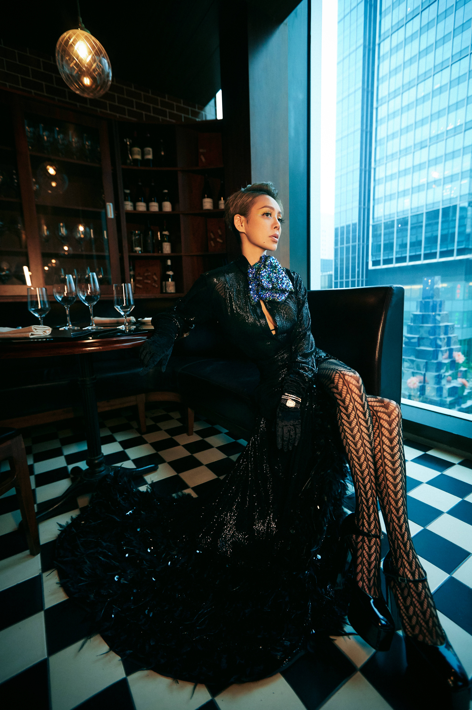
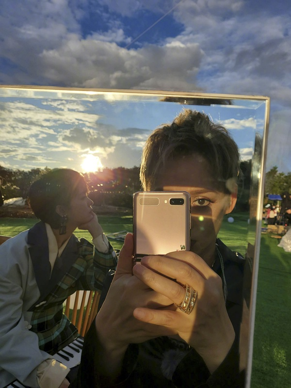
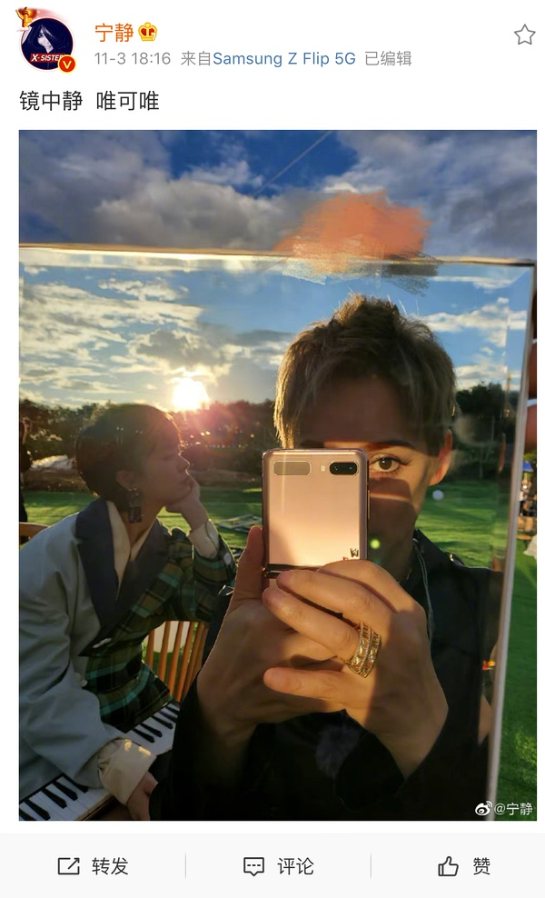

[返回目录](../../README.md "README.md")

# 「时光正好，感谢有你」- 长沙站·完结
    来自: [Yisa黎珞](https://www.douban.com/people/217273308/)    2020-12-11 08:00:06

> 人生在世一虚浮，交已真心，才换得知己两三

楼名歌曲：
> 时光正好：[https://music.163.com/#/song?id=421203086](https://music.163.com/#/song?id=421203086)  
> 感谢有你： [https://music.163.com/#/song?id=1481912395](https://music.163.com/#/song?id=1481912395)  

歌曲汇总：
*   小摩托 (Live) [https://music.163.com/#/song?id=1493073534](https://music.163.com/#/song?id=1493073534)
*   在风中 (Live) [https://music.163.com/#/song?id=1493076216](https://music.163.com/#/song?id=1493076216)
*   想去海边 (Live) [https://music.163.com/#/song?id=1493073544](https://music.163.com/#/song?id=1493073544)
*   心花开 (Live) [https://music.163.com/#/song?id=1489342354](https://music.163.com/#/song?id=1489342354)
*   路过人间 (Live) [https://music.163.com/#/song?id=1495052210](https://music.163.com/#/song?id=1495052210)
*   最美的太短暂 (Live) [https://music.163.com/#/song?id=1496777303](https://music.163.com/#/song?id=1496777303)
*   Invisible Love (Live)   ： [https://music.163.com/#/song?id=1498545701](https://music.163.com/#/song?id=1498545701)
*   我的城 (Live) ： [https://music.163.com/#/song?id=1498545703](https://music.163.com/#/song?id=1498545703)
*   Shining Diamond (Live) ： [https://music.163.com/#/song?id=1498547691](https://music.163.com/#/song?id=1498547691)
*   今夜的雨 (Live) ： [https://music.163.com/#/song?id=1496776844](https://music.163.com/#/song?id=1496776844)
*   红山果 (Live) ： [https://music.163.com/#/song?id=1500428836](https://music.163.com/#/song?id=1500428836)  

往期回顾👇  
1.  [「路过人间，感谢有你」- 泉州站.完结](https://www.douban.com/group/topic/195923820/)
2.  [「我的城，和你一起」—成都站·完结](https://www.douban.com/group/topic/197767383/)
3.  [「一路阳光，微加幸福」—云南站·完结](https://www.douban.com/group/topic/199047732/?start=0)
4.  [「party for two，we are one」—杭州站.完结](https://www.douban.com/group/topic/200783462/?start=0)
5.  [「光阴，如晤」—西安站.完结](https://www.douban.com/group/topic/202581372/?start=0)
6.  [「时光正好，感谢有你」—长沙站.完结](https://www.douban.com/group/topic/204226124/edit)>  

自此长沙站结束，感谢 “小鬼阿蛮”、“[长鬍子的猫](https://www.douban.com/people/123437301/)”的辛苦和陪伴。

  
镇楼图

## 总结集锦

*   因为“时光正好”，学会开口说“感谢有你”了，然后发现感觉不错。哈，静皇热爱不断进化自己，是非常美好的人类~——（我不是谁）
*   在冷漠的浮世，能够有一丝的温暖彼此，加以慰藉是一件美好的事，普通人尚且如此，更何况冷如寒窑的娱乐场。有些错过百年世终不得一见，有些却相遇一瞬就一眼万年。人和人的交往和融合来源于契合的灵魂，美貌止于时间，魅力来自灵魂——（陌生的路人）
*   恩赐就是代表没有任何期望的情况下的意外，得之安然失之淡然，在你没有任何的期许下偶然得知你喜欢的还在，那时会感到生活真的是如此的美好看云卷云舒胜似闲庭信步无望期许得些许恩赐。人与人都是过客的关系只是有的停留时间短有些停留时间长时间短的也不要遗憾因为来过时间长的也不要窃喜因为还是要走，太阳的光亮都不是永恒但是过客的记忆却是永存的无法抹杀。她俩的感情以后的发展无论如何也无法抹杀掉这个夏天给大家给彼此带来的永恒会化作最美妙的记忆永存在最光亮的某一处。当陪你的人要下车时即使再舍不得也要笑着挥手告别终有弱水替沧海再无相思寄巫山。—（陌生的路人）
*   帝都的树梢开始渐红的季节  影后和歌手再次携手 踏上了爱乐之程 一如既往的风波不断  一如既往的我行我素 旅途中两只憨包 Fxxxx Cute 到犯规   影后更专注于路演鲜少关心其他 野蛮生长 特立独行的态度依旧 身姿却多了几分柔和 歌手则一路唱游一路感悟 嬉闹着不亦乐乎 端水的分寸仍在 只是姐姐与他人终究不同 动辄撒娇的醋🐟 被偏爱的有恃无恐 用心 直接 则是金牛座专属的浪漫  长沙飘起雪的时候 旅程走到了终点 回到被她们称为『大歌』的地方  也是她们最初相遇的地方  暮春到隆冬 仿若一个轮回  来这人间 一点都不浪费 。—（chen)

## 番外集锦

*   2020-12-10
时尚先生颁奖典礼  
  
一马平川（bushi）  
  
图源水印Daydream0427  
  
女王大人  
  
优雅迷人  
  
在看什么？  
  
英伦伯爵~  
  
宁老师杀我！！  

*   2020-12-11  
🐟老师邀请宁老师吃火锅，然后主动要求开1分钟直播👉[直播双视角同步 20201211](https://www.bilibili.com/video/BV1e5411G73C?t=1680)
  
how pay  
  
看什么看！  
  
这是我配看到的画面吗  
  
好胖哦~（bushi)  

*   2020-12-11  
由于🐟老师身体原因，不得不改签飞机，最终选了与宁老师相差15分钟的航班，最后同时到达长沙机场，不得不相遇。  
  
嗯 有点帅  
  
拍个杂志都离不开吃的  
  
宁老师yyds  
  
女王的霸气  
  
高贵典雅  
  
我老公（jiushi)  
  
眼神撩人  
  
酷  
  
  
彩虹没拍到没关系了，还有夕阳美照啊  

*   2020-12-19  
🐟老师发微博，不经联想~~  
  
结合鱼葵老师的文案，好像读懂了些什么  

## 长沙集锦

*   2020-12-12  
静霞霏大三角合体👉[1212长沙直播](https://www.bilibili.com/video/BV1aa4y1H7GN)  
  
爱你们哟，宝宝们  
  
怎么有一点点习惯了呢  
  
“欲"  
  
爱心发射  

*   2020-12-14  
静葵参加电台直播👉[12.14姐姐的电台音乐直播 完整版](https://www.bilibili.com/video/BV1sz4y1r7G8?t=2)  
  
距离这么远 也能相互CUE  

*   2020-12-14  
静静早上直播👉[1214直播](https://www.bilibili.com/video/BV1gz4y1r7p6)  

## 直播集锦
*     
宁老师跑的真快  
  
在看什么这么开心  
  
两个小朋友  
  
她好漂亮  
  
她好憨  
  
好累哦~  
  
她好可爱  
  
没关系，捏捏  
  
这就是传说中的雷钵  
  
粉色的给你哦~  
  
姐就是维密queen  
  
她真的真的好漂亮  
  
我想对着你唱  
  
美丽的金丝鸟就在我眼前  
  
表现力绝佳  
  
你在唱，我在听  
  
可可爱爱的  
  
默契无需言语  
  
舞台上的你要完美  
  
爱的“强迫症”  

## 小剧场

### 机场小剧场

####  泉州站  

*   10.5号 北京到泉州同机
*   10.10号 泉州到北京同机  有泉州机场送信名场面，北京机场同框1.0 同机主要原因可能是航班少所以同机概率大

#### 成都站 

*   去:葵北京飞成都，静因工作从上海飞成都
*   回:葵因工作成都飞西安，静飞回北京

#### 云南站

*   10.30号 昆明飞澜沧同机， 静从北京中转昆明到澜沧，葵从大理中转昆明到澜沧 本来静到昆明后可以和其他姐姐一块去澜沧的，但不知道因为什么等了几个小时葵到昆明机场后，两个人同机飞澜沧，下飞机后应静要求两个同车去节目安排酒店。
*   11.4号 无同机 ，葵从西双版纳中转成都到北京，静从西双版纳中转昆明到北京  本来静葵约好一块中转成都到北京，但后静改行程先飞鸽了葵，还没跟她说，详情见11.5号静直播

#### 杭州站 

*   11.16号 北京到杭州同机  本来葵先飞，但因为身体不舒服误机了，下一趟航班因为没票了，所以改签成静的那趟航班。 还能说什么呢 缘分啊
*   11.21号 不同机，葵因杭州有工作晚上飞机回京，静先回北京

#### 中插快本录制

*   11.24 北京到长沙同机 北京机场同框2.0 晚上的航班时间均不在两人日常习惯飞行时间。
*   11.25-26 不同机  静快本录制结束25号连夜从长沙到北京，葵第二天26号从长沙飞北京 据隔壁瓜说，两个人录制完快本还在商量飞机行程“你这么爱我能不能和我一起走”“你那么爱我为啥不陪我留下”

####  西安站

*   11.30号 不同机  两人北京机场航班前后相差半小时，葵早半小时。
*   12.5号 西安到北京同机  本来不同机，但静因为回北京有事，要提前回京，改签了比原先早2小时葵的航班,详情见12.4号静直播，北京机场同框3.0

#### 中插时尚先生活动

*   12.09-10号 不同机 静9号从北京到上海，葵因工作10 号早班机从北京到上海

#### 长沙站 

*   12.11号 不同机 两人上海机场航班前后相差15分钟，葵本来中午飞机，不知道什么原因当天改签了，但可能因静航班没票，所以没改签成同一班，而是稍早一班，但最终两架飞机到长沙时间相差无几。
*   12.18号 不同机 葵当天有行程，中午先飞回京，静因20号南京活动取消直接回京了。

团综6站外加一期快本，有意无意中共同机6次。 高楼因泉州一个同机讨论而起，一不小心就起了六栋高楼，作为楼里的一份子，感谢大家在这段时间带来的美好时光，特此总结同机行程给大家留给念想。（感谢宝宝“不知道”总结）  

### 团综小剧场

> ——向亲密的静葵为何突然冷战？ 宁静心虚一笑，内心惶恐为哪般？ 现场彩排时宁静为何一直低头玩手机？ 下面进入本期特别节目——《背后的故事：百万文案二三事》  

  

11月3日下午18:16，爱乐之程云南站路演即将开始，宁静突然在wb上发了一张和郁葵的合照，并配上百万文案，并在随后的一小时内反复编辑博文，甚至重发一遍，引得众网友议论纷纷，不停猜想其前因后果。 在本期特别节目中，我们将根据本周播出的团综，一起探究其背后的故事。  
  
前因后果：  
1.雨过天晴，彩虹出现，惹得姐姐们一阵欢呼，纷纷拿出手机拍照，郁葵撒娇要求静帮自己拍一张  
  
2.静接过手机顺势拍起了前方的张小雨，郁葵跺脚表示不满 
  
3.静匆忙拿起手机对排向郁葵，原本看向佳鸽镜头的郁葵将视线转向静  
  
4.眼看彩虹就要消失，静使出浑身解数也拍不出满意的照片  
  
5.静将手机递给郁葵时不敢看向她，并借整理衣领缓解内心的忐忑  
  
6.静试图转移话题，心虚一笑，却在郁葵失望出声后抬头望天，内心的惶恐表露无遗  
  
7.沉思良久，静转身提出P图建议，却在郁葵面无表情下转开身子，不敢对视  
  
8.静慢慢靠近郁葵，试图搭话，郁葵置之不理，静只好黯然走开  
  
9.现场彩排时，两人之间距离拉开，根据之后静补妆的镜头，合理猜测合照拍摄于此期间内  
  
10.夹有夹规，第一次编辑完wb后，静发现被夹，于是开始反复编辑，甚至重发 

感谢宝宝“笑忘书”

## 团综之旅结束，静葵之旅开始，未完待续.........
[《骊歌》郁可唯](https://www.bilibili.com/video/BV12b411L7Jg?zw) 
> 岁月辗转成歌，时光流逝如花

## 留言
---
[1-100](./comments1-100.md "1-100")  [101-200](./comments101-200.md "101-200")  [201-300](./comments201-300.md "201-300")  [301-400](./comments301-400.md "301-400")  [401-500](./comments401-500.md "401-500")  [501-600](./comments501-600.md "501-600")  [601-700](./comments601-700.md "601-700")  [701-800](./comments701-800.md "701-800")  [801-900](./comments801-900.md "801-900")  [901-1000](./comments901-1000.md "901-1000")  [1001-1100](./comments1001-1100.md "1001-1100")  [1101-1200](./comments1101-1200.md "1101-1200")  [1201-1300](./comments1201-1300.md "1201-1300")  [1301-1400](./comments1301-1400.md "1301-1400")  [1401-1500](./comments1401-1500.md "1401-1500")  [1501-1600](./comments1501-1600.md "1501-1600")  [1601-1700](./comments1601-1700.md "1601-1700")  [1701-1800](./comments1701-1800.md "1701-1800")  [1801-1900](./comments1801-1900.md "1801-1900")  [1901-2000](./comments1901-2000.md "1901-2000")  [2001-2100](./comments2001-2100.md "2001-2100")  [2101-2200](./comments2101-2200.md "2101-2200")  [2201-2300](./comments2201-2300.md "2201-2300")  [2301-2400](./comments2301-2400.md "2301-2400")  [2401-2500](./comments2401-2500.md "2401-2500")  [2501-2600](./comments2501-2600.md "2501-2600")  [2601-2700](./comments2601-2700.md "2601-2700")  [2701-2800](./comments2701-2800.md "2701-2800")  [2801-2900](./comments2801-2900.md "2801-2900")  [2901-3000](./comments2901-3000.md "2901-3000")  [3001-3100](./comments3001-3100.md "3001-3100")  [3101-3200](./comments3101-3200.md "3101-3200")  [3201-3300](./comments3201-3300.md "3201-3300")  [3301-3400](./comments3301-3400.md "3301-3400")  [3401-3500](./comments3401-3500.md "3401-3500")  [3501-3600](./comments3501-3600.md "3501-3600")  [3601-3700](./comments3601-3700.md "3601-3700")  [3701-3800](./comments3701-3800.md "3701-3800")  [3801-3900](./comments3801-3900.md "3801-3900")  [3901-4000](./comments3901-4000.md "3901-4000")  [4001-4100](./comments4001-4100.md "4001-4100")  [4101-4200](./comments4101-4200.md "4101-4200")  [4201-4300](./comments4201-4300.md "4201-4300")  [4301-4400](./comments4301-4400.md "4301-4400")  