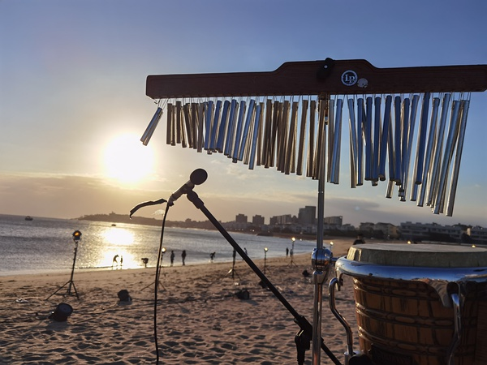
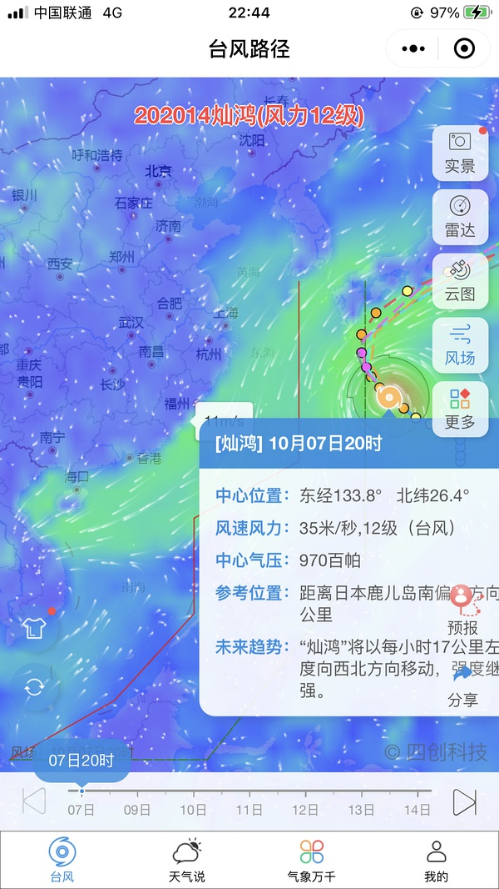

[主页](./main.md "main.md") | [首页](./comments1-100.md "comments1-100.md") | [前一页](./comments3101-3200.md "comments3101-3200.md") | [后一页](./comments3301-3400.md "comments3301-3400.md") | [末页](./comments7301-7400.md "comments7301-7400.md")  

---
*     [Yisa黎珞](https://www.douban.com/people/217273308/)    2020-10-07 22:25:43  
  >明天路演换地方啦？还是不公开的，这么神秘吗？🤐  
  >
  >-- [想不好长不高](https://www.douban.com/people/4098918/)  
  
  ？？不是台子都搭了嘛  
---
*     [已注销](https://www.douban.com/people/187860590/)    2020-10-07 22:26:15  
  >明天路演换地方啦？还是不公开的，这么神秘吗？🤐  
  >
  >-- [想不好长不高](https://www.douban.com/people/4098918/)  
  
  大概是粉丝太火爆？之前就做了plan/b吧  
---
*     [偷吃猫的小鱼](https://www.douban.com/people/72681843/)    2020-10-07 22:27:39  
  >大概是粉丝太火爆？之前就做了plan/b吧  
  >
  >-- [已注销](https://www.douban.com/people/187860590/)  
  
  我觉得有可能是海风太大可能会导致演出收音不好？  
---
*     [宝丁](https://www.douban.com/people/178843968/)    2020-10-07 22:28:25  
  >没有任何辣菜别人的行为，仅仅是因为开心，都要担心我们笑得太大声了是不是不好？  
  >
  >-- [鹧鸪](https://www.douban.com/people/2968358/)  
  
  赞👍  
---
*     [已注销](https://www.douban.com/people/187860590/)    2020-10-07 22:28:56  
  >我觉得有可能是海风太大可能会导致演出收音不好？  
  >
  >-- [偷吃猫的小鱼](https://www.douban.com/people/72681843/)  
  
    
  也有可能，最初的方案应该室内室外都有，今天看了海边的日落，如果取景一定很美  
---
*     [Yisa黎珞](https://www.douban.com/people/217273308/)    2020-10-07 22:29:34  
  >也有可能，最初的方案应该室内室外都有，今天看了海边的日落，如果取景一定很美  
  >
  >-- [已注销](https://www.douban.com/people/187860590/)  
  
  好美啊  
---
*     [小鬼阿蛮](https://www.douban.com/people/219137387/)    楼主    2020-10-07 22:29:38  
  >明天路演换地方啦？还是不公开的，这么神秘吗？🤐  
  >
  >-- [想不好长不高](https://www.douban.com/people/4098918/)  
  
  说是明天有台风，路演变公演……观众就是主楼提到的路边找的“高颜值”观众「此瓜不保真」  
---
*     [rei.s.p](https://www.douban.com/people/131145094/)    2020-10-07 22:32:33  
  借楼说一下，作为葵的散粉，也欣赏静。最近看两家有点太紧绷了。爱之深，虑深远，这是好事；但太紧绷可能缚手缚脚也可能反应过激，这点也得考虑到。上面很多人都说了，小hei们的疯狂是不以我们的行为为转移，想hei的拦不住，眼明心净的人也盲不了，会发光的姐姐总是在闪耀。别提前为姐姐们玻璃心，她们是不锈钢的话，我们也可以是合金钢。借朵姐一句，这是你的功课。人都要成长，如果和葵一样羡慕静姐的那股劲，那更要成长  
  真心话，绝无针对任何人和群体，只是看着这个楼的氛围，两家的关系，真希望大家能一直好，合掌  
---
*     [想不好长不高](https://www.douban.com/people/4098918/)    2020-10-07 22:32:58  
  >说是明天有台风，路演变公演……观众就是主楼提到的路边找的“高颜值”观众「此瓜不保真」  
  >
  >-- [小鬼阿蛮](https://www.douban.com/people/219137387/)  
  
  😫完了，明天还能见到葵吗？戴发带的那种就算了  
---
*     [你杠就是你对哈](https://www.douban.com/people/223037348/)    2020-10-07 22:35:51  
  我的天 你们太厉害了吧😂😂😂那我来添个瓦  
---
*     [Unknow](https://www.douban.com/people/219306324/)    2020-10-07 22:37:43  
  >明天路演换地方啦？还是不公开的，这么神秘吗？🤐  
  >
  >-- [想不好长不高](https://www.douban.com/people/4098918/)  
  
  好像是因为台风天气的原因，转室内了  
---
*     [candy](https://www.douban.com/people/7219773/)    2020-10-07 22:38:14  
  有户外拍摄   天气因素肯定多少会碰到的    
  其实现在已经10月各地入秋 有的甚至入冬  天气条件会越来越差  
---
*     [还能不能好玩](https://www.douban.com/people/165680902/)    2020-10-07 22:38:15  
  台风影响风太大了  泉州现在市区13m/s风速 海边更大  为了安全  姐姐安全第一  
---
*     [十三](https://www.douban.com/people/220614625/)    2020-10-07 22:38:26  
  你笑不笑别人都会黑你，为什么不笑呢？至少我们快乐过  
---
*     [Unknow](https://www.douban.com/people/219306324/)    2020-10-07 22:39:09  
  >也有可能，最初的方案应该室内室外都有，今天看了海边的日落，如果取景一定很美  
  >
  >-- [已注销](https://www.douban.com/people/187860590/)  
  
  哇 如果天气好的话，沙滩篝火晚会 肯定很美，可惜了，看今天路透图 就觉得风好大  
---
*     [Unknow](https://www.douban.com/people/219306324/)    2020-10-07 22:40:02  
  >借楼说一下，作为葵的散粉，也欣赏静。最近看两家有点太紧绷了。爱之深，虑深远，这是好事；但太  
  >
  >-- [rei.s.p](https://www.douban.com/people/131145094/)  
  
  说的太好了 鼓掌  
---
*     [偷吃猫的小鱼](https://www.douban.com/people/72681843/)    2020-10-07 22:40:37  
  >好像是因为台风天气的原因，转室内了  
  >
  >-- [Unknow](https://www.douban.com/people/219306324/)  
  
  没有，我们这边没台风。我觉得应该是今天去踩点发现海风太大可能会影响演出效果，再加上被路透的风险太高，多方面考虑所以决定换地方吧  
---
* [![[已注销]](../../image/icon/user_normal.jpg)](https://www.douban.com/people/222904340/)    [[已注销]](https://www.douban.com/people/222904340/)    2020-10-07 22:40:53  
  那我们明天还能看得到图吗，好想看看静葵的造型啊🤧  
---
*     [想不好长不高](https://www.douban.com/people/4098918/)    2020-10-07 22:41:35  
  >好像是因为台风天气的原因，转室内了  
  >
  >-- [Unknow](https://www.douban.com/people/219306324/)  
  
  室内好啊，适合葵和00，最后麻烦来一首大合唱：酒醉的蝴蝶  
---
* [![[已注销]](../../image/icon/user_normal.jpg)](https://www.douban.com/people/222904340/)    [[已注销]](https://www.douban.com/people/222904340/)    2020-10-07 22:42:06  
  这样搞不公开的，那这节目提出来的路演意义在哪，好无语，第一站就这样搞😐  
---
*     [SiofnaFan](https://www.douban.com/people/180076918/)    2020-10-07 22:42:34  
  >也有可能，最初的方案应该室内室外都有，今天看了海边的日落，如果取景一定很美  
  >
  >-- [已注销](https://www.douban.com/people/187860590/)  
  
  这么美，可惜了😣  
---
*     [Sisyphus](https://www.douban.com/people/223292445/)    2020-10-07 22:42:38  
  >借楼说一下，作为葵的散粉，也欣赏静。最近看两家有点太紧绷了。爱之深，虑深远，这是好事；但太  
  >
  >-- [rei.s.p](https://www.douban.com/people/131145094/)  
  
  非常同意，顶你  
---
*     [Unknow](https://www.douban.com/people/219306324/)    2020-10-07 22:43:29  
  >室内好啊，适合葵和00，最后麻烦来一首大合唱：酒醉的蝴蝶  
  >
  >-- [想不好长不高](https://www.douban.com/people/4098918/)  
  
  天哪 团综也躲不开酒醉的蝴蝶吗 这歌真的洗脑，想看姐姐们大合唱这首，虽然我觉得静静不会唱  
---
*     [Unknow](https://www.douban.com/people/219306324/)    2020-10-07 22:44:08  
  >这样搞不公开的，那这节目提出来的路演意义在哪，好无语，第一站就这样搞😐  
  >
  >-- [[已注销]](https://www.douban.com/people/222904340/)  
  
  可能找个酒吧之类的 做路演吧 猜的  
---
*     [没什么可说的](https://www.douban.com/people/108924101/)    2020-10-07 22:44:43  
  >哇 如果天气好的话，沙滩篝火晚会 肯定很美，可惜了，看今天路透图 就觉得风好大  
  >
  >-- [Unknow](https://www.douban.com/people/219306324/)  
  
  好可惜 换室内最好是酒吧那种近距离的氛围 如果和浪姐公演一样我担心这综艺会糊  
---
*     [团团](https://www.douban.com/people/cheeselover/)    2020-10-07 22:44:56  
  楼主太不容易了 加油  
---
*     [胖🐯](https://www.douban.com/people/171300359/)    2020-10-07 22:45:04  
  >室内好啊，适合葵和00，最后麻烦来一首大合唱：酒醉的蝴蝶  
  >
  >-- [想不好长不高](https://www.douban.com/people/4098918/)  
  
  哈哈哈哈哈酒醉的蝴蝶我投一票  
---
*     [还能不能好玩](https://www.douban.com/people/165680902/)    2020-10-07 22:45:15  
    
    
---
*     [胖🐯](https://www.douban.com/people/171300359/)    2020-10-07 22:45:19  
  >借楼说一下，作为葵的散粉，也欣赏静。最近看两家有点太紧绷了。爱之深，虑深远，这是好事；但太  
  >
  >-- [rei.s.p](https://www.douban.com/people/131145094/)  
  
  说的真棒！dd  
---
*     [小鬼阿蛮](https://www.douban.com/people/219137387/)    楼主    2020-10-07 22:45:44  
    
  这张图前面有发吗？是葵家帮忙拍的❤️  
---
*     [平平无奇的猹](https://www.douban.com/people/218771450/)    2020-10-07 22:46:10  
  >借楼说一下，作为葵的散粉，也欣赏静。最近看两家有点太紧绷了。爱之深，虑深远，这是好事；但太  
  >
  >-- [rei.s.p](https://www.douban.com/people/131145094/)  
  
  dd  
---
*     [鱼丸子](https://www.douban.com/people/43183830/)    2020-10-07 22:46:12  
  不公开。。。是怕路透？影响播出收视？？  
---
*     [二土寸E卩](https://www.douban.com/people/208650306/)    2020-10-07 22:46:30  
  >借楼说一下，作为葵的散粉，也欣赏静。最近看两家有点太紧绷了。爱之深，虑深远，这是好事；但太  
  >
  >-- [rei.s.p](https://www.douban.com/people/131145094/)  
  
  dd  
---
*     [Peggy pan](https://www.douban.com/people/214167695/)    2020-10-07 22:48:01  
  >不公开。。。是怕路透？影响播出收视？？  
  >
  >-- [鱼丸子](https://www.douban.com/people/43183830/)  
  
  上面有人发天气图，应该是台风影响。。。如果怕路透，不会白天辛苦搭台晚上都拆了，我猜哈  
---
* [![[已注销]](../../image/icon/user_normal.jpg)](https://www.douban.com/people/209163881/)    [[已注销]](https://www.douban.com/people/209163881/)    2020-10-07 22:48:22  
  好不容易有个开开心心的避风港，楼主要坚持下去啊。我的开心全在这栋楼里了，多温馨的楼啊。😭😭  
---
*     [已注销](https://www.douban.com/people/187860590/)    2020-10-07 22:48:59  
  >不公开。。。是怕路透？影响播出收视？？  
  >
  >-- [鱼丸子](https://www.douban.com/people/43183830/)  
  
  有台风了，海边风好大  
---
*     [哇咔咔呀](https://www.douban.com/people/213342632/)    2020-10-07 22:49:13  
  其实路透这类事呢，无法避免的。这个泉州站还是比较偏的位置，后面到了杭州成都西安这类城市，被热情围观拍摄根本是躲不开的。摄制组提什么不能发路透，否则会删减片段，更多像是制造开播神秘感。大家别太“乖”了。开心点儿😄  
---
*     [没什么可说的](https://www.douban.com/people/108924101/)    2020-10-07 22:49:19  
  >上面有人发天气图，应该是台风影响。。。如果怕路透，不会白天辛苦搭台晚上都拆了，我猜哈  
  >
  >-- [Peggy pan](https://www.douban.com/people/214167695/)  
  
  芒啊 芒这个运气也是绝了🤦‍♀️  
---
*     [火锅上火火火](https://www.douban.com/people/175305256/)    2020-10-07 22:49:41  
  >这张图前面有发吗？是葵家帮忙拍的❤️  
  >
  >-- [小鬼阿蛮](https://www.douban.com/people/219137387/)  
  
  乍一看静静尾巴好长  
---
*     [Unknow](https://www.douban.com/people/219306324/)    2020-10-07 22:49:53  
  >好不容易有个开开心心的避风港，楼主要坚持下去啊。我的开心全在这栋楼里了，多温馨的楼啊。😭  
  >
  >-- [[已注销]](https://www.douban.com/people/209163881/)  
  
  会一直温馨快乐的 一定会！  
---
*     [没什么可说的](https://www.douban.com/people/108924101/)    2020-10-07 22:50:21  
  >乍一看静静尾巴好长  
  >
  >-- [火锅上火火火](https://www.douban.com/people/175305256/)  
  
  哈哈哈哈哈哈哈哈哈哈哈哈哈哈  
---
*     [Unknow](https://www.douban.com/people/219306324/)    2020-10-07 22:50:35  
  >乍一看静静尾巴好长  
  >
  >-- [火锅上火火火](https://www.douban.com/people/175305256/)  
  
  啊哈哈哈哈哈哈哈哈哈哈哈哈哈哈 成精了  
---
*     [Peggy pan](https://www.douban.com/people/214167695/)    2020-10-07 22:51:00  
  >芒啊 芒这个运气也是绝了🤦‍♀️  
  >
  >-- [没什么可说的](https://www.douban.com/people/108924101/)  
  
  我看微博有在场粉丝发了，说海边风大危险，现场工作人员拆台子，这个真的应该是考虑天气安全原因，那真的是天公不做美吧，芒的运气确实，，，还是姐姐们的安全最重要  
---
*     [Unknow](https://www.douban.com/people/219306324/)    2020-10-07 22:51:12  
  >芒啊 芒这个运气也是绝了🤦‍♀️  
  >
  >-- [没什么可说的](https://www.douban.com/people/108924101/)  
  
  想到浪姐第一期 还有哪一期来着 长沙也下雨 遇水则发  
---
*     [偷吃猫的小鱼](https://www.douban.com/people/72681843/)    2020-10-07 22:52:26  
  楼主该更新了，海边设备已经拆卸改了路演地址了。  
---
*     [十九](https://www.douban.com/people/115373007/)    2020-10-07 22:52:55  
  >乍一看静静尾巴好长  
  >
  >-- [火锅上火火火](https://www.douban.com/people/175305256/)  
  
  哈哈哈哈哈哈哈哈哈哈哈哈哈哈  
---
*     [平平无奇的猹](https://www.douban.com/people/218771450/)    2020-10-07 22:53:09  
  >乍一看静静尾巴好长  
  >
  >-- [火锅上火火火](https://www.douban.com/people/175305256/)  
  
  哈哈哈哈哈哈哈哈哈哈哈哈哈哈哈哈哈哈哈哈哈  
---
*     [你杠就是你对哈](https://www.douban.com/people/223037348/)    2020-10-07 22:53:17  
  >乍一看静静尾巴好长  
  >
  >-- [火锅上火火火](https://www.douban.com/people/175305256/)  
  
  救命 你是魔鬼哈哈哈哈  
---
*     [没什么可说的](https://www.douban.com/people/108924101/)    2020-10-07 22:53:44  
  >我看微博有在场粉丝发了，说海边风大危险，现场工作人员拆台子，这个真的应该是考虑天气安全原因  
  >
  >-- [Peggy pan](https://www.douban.com/people/214167695/)  
  
  看静静的图也真感受到风大了 害 没办法的事儿  
---
*     [紫色的雨](https://www.douban.com/people/220857820/)    2020-10-07 22:53:50  
  >那这个楼里可以只专注静葵吗？为什么要提别的姐姐？聊别的姐姐的粉黑可以自己出去单开贴说吗？三  
  >
  >-- [香芋不加蒜泥](https://www.douban.com/people/168469439/)  
  
  赞同，此楼只关注静葵两位姐姐  
---
*     [还能不能好玩](https://www.douban.com/people/165680902/)    2020-10-07 22:54:04  
  泉州目前在外围风圈里面  中午看的时候是13M/S  现在小了点 但是还是安全为上 毕竟芒果的台子也不是那么牢靠  
---
*     [SiofnaFan](https://www.douban.com/people/180076918/)    2020-10-07 22:54:21  
  啊，这么美丽浪漫的场景，可惜了可惜了😢不过确实安全最重要。如果不影响安全，姐姐们在夕阳下的海边散个步吧，那场景真的想想都好美好啊  
---
*     [没什么可说的](https://www.douban.com/people/108924101/)    2020-10-07 22:54:27  
  >想到浪姐第一期 还有哪一期来着 长沙也下雨 遇水则发  
  >
  >-- [Unknow](https://www.douban.com/people/219306324/)  
  
  红毯因雨取消 路演因台风换场 哈哈哈芒果啊 厉害👍  
---
*     [minimum](https://www.douban.com/people/218236166/)    2020-10-07 22:58:40  
  这么美的夕阳，可惜了，第一场啊，芒这运气真是绝了  
    
  问下，现在有没有成都站具体点的信息了  
---
*     [彷徨少年时](https://www.douban.com/people/charlotte3/)    2020-10-07 23:00:36  
  up，不要被奇奇怪怪的言语影响本楼搭建  
---
*     [程慎](https://www.douban.com/people/175528838/)    2020-10-07 23:01:31  
  >借楼说一下，作为葵的散粉，也欣赏静。最近看两家有点太紧绷了。爱之深，虑深远，这是好事；但太  
  >
  >-- [rei.s.p](https://www.douban.com/people/131145094/)  
  
  对，大家不要怂，姐姐硬气的话，粉丝也可以💪💪  
---
*     [Yisa黎珞](https://www.douban.com/people/217273308/)    2020-10-07 23:01:45  
  >红毯因雨取消 路演因台风换场 哈哈哈芒果啊 厉害👍  
  >
  >-- [没什么可说的](https://www.douban.com/people/108924101/)  
  
  芒好像就没顺过，真惨  
---
*     [背着猪跑了](https://www.douban.com/people/167408982/)    2020-10-07 23:02:14  
  >乍一看静静尾巴好长  
  >
  >-- [火锅上火火火](https://www.douban.com/people/175305256/)  
  
  哈哈哈哈哈哈哈哈哈  
---
* [![[已注销]](../../image/icon/user_normal.jpg)](https://www.douban.com/people/222904340/)    [[已注销]](https://www.douban.com/people/222904340/)    2020-10-07 23:02:23  
  >啊，这么美丽浪漫的场景，可惜了可惜了😢不过确实安全最重要。如果不影响安全，姐姐们在夕阳下  
  >
  >-- [SiofnaFan](https://www.douban.com/people/180076918/)  
  
  确实，海边站估计就泉州这一站，不能再夕阳海边散步真的是可惜了。成都不清楚，普洱感觉会是团综概念里的山海林里的那个山  
---
*     [rroZc](https://www.douban.com/people/218450596/)    2020-10-07 23:02:58  
  新粉卑微😂无忧无虑追星好难  
---
*     [Yisa黎珞](https://www.douban.com/people/217273308/)    2020-10-07 23:03:52  
  >确实，海边站估计就泉州这一站，不能再夕阳海边散步真的是可惜了。成都不清楚，普洱感觉会是团综  
  >
  >-- [[已注销]](https://www.douban.com/people/222904340/)  
  
  反正姐姐们欣赏了大海和美景，只是我们看不见，她们开心就好，安全最重要  
---
*     [minimum](https://www.douban.com/people/218236166/)    2020-10-07 23:05:32  
  >确实，海边站估计就泉州这一站，不能再夕阳海边散步真的是可惜了。成都不清楚，普洱感觉会是团综  
  >
  >-- [[已注销]](https://www.douban.com/people/222904340/)  
  
  感觉成都站粉丝会暴多，看jmz怎么躲  
---
*     [Unknow](https://www.douban.com/people/219306324/)    2020-10-07 23:06:51  
  >确实，海边站估计就泉州这一站，不能再夕阳海边散步真的是可惜了。成都不清楚，普洱感觉会是团综  
  >
  >-- [[已注销]](https://www.douban.com/people/222904340/)  
  
  应该要拍个姐姐们在夕阳下海边散步的背影吧 ，光想象就觉得好美  
---
*     [已注销](https://www.douban.com/people/187860590/)    2020-10-07 23:07:27  
  >感觉成都站粉丝会暴多，看jmz怎么躲  
  >
  >-- [minimum](https://www.douban.com/people/218236166/)  
  
  杭州站也是，整个包邮区都跃跃欲试  
---
*     [想不好长不高](https://www.douban.com/people/4098918/)    2020-10-07 23:08:07  
  成都不会是里吧？莲花府邸就在锦里啊。普洱如果是山，那杭州就是林了啊，不会去临安吧……  
---
*     [阿呆](https://www.douban.com/people/223579792/)    2020-10-07 23:08:21  
  >好的我这就去  
  >
  >-- [josh](https://www.douban.com/people/26961670/)  
  
  我今天看到了一个投票 是你发起的吗 貌似静1更多哦  
---
*     [十三](https://www.douban.com/people/220614625/)    2020-10-07 23:10:12  
  >乍一看静静尾巴好长  
  >
  >-- [火锅上火火火](https://www.douban.com/people/175305256/)  
  
    
  你有毒  
---
*     [TR.AA](https://www.douban.com/people/sunshine-wewe/)    2020-10-07 23:10:21  
  >杭州站也是，整个包邮区都跃跃欲试  
  >
  >-- [已注销](https://www.douban.com/people/187860590/)  
  
  包邮区突然好幸福😁  
---
* [![[已注销]](../../image/icon/user_normal.jpg)](https://www.douban.com/people/222904340/)    [[已注销]](https://www.douban.com/people/222904340/)    2020-10-07 23:12:05  
  >杭州站也是，整个包邮区都跃跃欲试  
  >
  >-- [已注销](https://www.douban.com/people/187860590/)  
  
  预感普洱站应该会是粉丝跟得最少的一站，因为好偏啊（没有说普洱不好的意思 就是地理位置感觉太偏了）  
---
* [![[已注销]](../../image/icon/user_normal.jpg)](https://www.douban.com/people/222904340/)    [[已注销]](https://www.douban.com/people/222904340/)    2020-10-07 23:13:04  
  >反正姐姐们欣赏了大海和美景，只是我们看不见，她们开心就好，安全最重要  
  >
  >-- [Yisa黎珞](https://www.douban.com/people/217273308/)  
  
  嗯，台风天肯定还是要以姐姐们的安全为主。也默默希望在泉州的粉丝们都注意点安全~  
---
*     [minimum](https://www.douban.com/people/218236166/)    2020-10-07 23:13:08  
  >成都不会是里吧？莲花府邸就在锦里啊。普洱如果是山，那杭州就是林了啊，不会去临安吧……  
  >
  >-- [想不好长不高](https://www.douban.com/people/4098918/)  
  
  每个城市都去酒吧，真成跑场驻唱了  
---
*     [已注销](https://www.douban.com/people/187860590/)    2020-10-07 23:13:53  
  >预感普洱站应该会是粉丝跟得最少的一站，因为好偏啊（没有说普洱不好的意思 就是地理位置感觉太  
  >
  >-- [[已注销]](https://www.douban.com/people/222904340/)  
  
  也许普洱能是姐姐们最安静旅行的一站，没有人挤人的粉丝倒也不错，成都西安杭州怕是会挤爆了，长三角的粉丝都开始查自驾路线了，高铁又发达  
---
*     [Unknow](https://www.douban.com/people/219306324/)    2020-10-07 23:14:12  
  >成都不会是里吧？莲花府邸就在锦里啊。普洱如果是山，那杭州就是林了啊，不会去临安吧……  
  >
  >-- [想不好长不高](https://www.douban.com/people/4098918/)  
  
  woc 身在临安的我，开始有点小兴奋了呢，本以为在杭州那么远就不去凑热闹了  
---
*     [宁猫](https://www.douban.com/people/179597455/)    2020-10-07 23:15:00  
  >乍一看静静尾巴好长  
  >
  >-- [火锅上火火火](https://www.douban.com/people/175305256/)  
  
  你有毒！！😂😂😂😂   
  一旦接受这个设定....  
---
*     [Unknow](https://www.douban.com/people/219306324/)    2020-10-07 23:16:27  
  >每个城市都去酒吧，真成跑场驻唱了  
  >
  >-- [minimum](https://www.douban.com/people/218236166/)  
  
  好不容易成个团，结果就去酒吧驻场  哈哈哈哈哈xsl  
---
*     [Yisa黎珞](https://www.douban.com/people/217273308/)    2020-10-07 23:16:54  
  >成都不会是里吧？莲花府邸就在锦里啊。普洱如果是山，那杭州就是林了啊，不会去临安吧……  
  >
  >-- [想不好长不高](https://www.douban.com/people/4098918/)  
  
  在线做法，成都有莲花府邸  
---
* [![[已注销]](../../image/icon/user_normal.jpg)](https://www.douban.com/people/222904340/)    [[已注销]](https://www.douban.com/people/222904340/)    2020-10-07 23:17:10  
  >也许普洱能是姐姐们最安静旅行的一站，没有人挤人的粉丝倒也不错，成都西安杭州怕是会挤爆了，长  
  >
  >-- [已注销](https://www.douban.com/people/187860590/)  
  
  我好想dream一个普洱站的当地音乐人：朱婧汐      朱婧汐就是普洱人，如果节目组能在普洱站请她就好了  
---
*     [已注销](https://www.douban.com/people/187860590/)    2020-10-07 23:17:54  
  >我好想dream一个普洱站的当地音乐人：朱婧汐      朱婧汐就是普洱人，如果节目组能在普洱站请她  
  >
  >-- [[已注销]](https://www.douban.com/people/222904340/)  
  
  目前还没瓜说有姐姐飞行，希望到时候有惊喜  
---
*     [Unknow](https://www.douban.com/people/219306324/)    2020-10-07 23:18:55  
  要是有飞行姐姐 我梦琼姐！我的flow要合体！  
---
*     [Yisa黎珞](https://www.douban.com/people/217273308/)    2020-10-07 23:19:08  
  >好不容易成个团，结果就去酒吧驻场  哈哈哈哈哈xsl  
  >
  >-- [Unknow](https://www.douban.com/people/219306324/)  
  
  每个城市都有live不就是跑场驻场嘛😂细品品不是酒吧也是别的地方  
---
*     [已注 销](https://www.douban.com/people/155947097/)    2020-10-07 23:20:18  
  >要是有飞行姐姐 我梦琼姐！我的flow要合体！  
  >
  >-- [Unknow](https://www.douban.com/people/219306324/)  
  
  我也dream一个琼姐！  
---
*     [minimum](https://www.douban.com/people/218236166/)    2020-10-07 23:22:32  
  >我好想dream一个普洱站的当地音乐人：朱婧汐      朱婧汐就是普洱人，如果节目组能在普洱站请她  
  >
  >-- [[已注销]](https://www.douban.com/people/222904340/)  
  
  哎，恐怕她来音乐不是主题，我不是很想看她的cp  
---
*     [Sisyphus](https://www.douban.com/people/223292445/)    2020-10-07 23:22:34  
  >「该条回应已被删除」  
  >
  >-- [酒醉的蝴嗲](https://www.douban.com/people/203315730/)  
  
  哇！！！好奇这个是哪里来的  
---
*     [Yisa黎珞](https://www.douban.com/people/217273308/)    2020-10-07 23:22:39  
  >「该条回应已被删除」  
  >
  >-- [酒醉的蝴嗲](https://www.douban.com/people/203315730/)  
  
  我好了👏🏻  
---
*     [平平无奇的猹](https://www.douban.com/people/218771450/)    2020-10-07 23:22:58  
  >「该条回应已被删除」  
  >
  >-- [酒醉的蝴嗲](https://www.douban.com/people/203315730/)  
  
  不打码吗？  
---
*     [酒醉的蝴嗲](https://www.douban.com/people/203315730/)    2020-10-07 23:24:00  
  >不打码吗？  
  >
  >-- [平平无奇的猹](https://www.douban.com/people/218771450/)  
  
  删了删了，不好意思，  
---
* [![[已注销]](../../image/icon/user_normal.jpg)](https://www.douban.com/people/222904340/)    [[已注销]](https://www.douban.com/people/222904340/)    2020-10-07 23:24:05  
  >哎，恐怕她来音乐不是主题，我不是很想看她的cp  
  >
  >-- [minimum](https://www.douban.com/people/218236166/)  
  
  我不是从cp角度出发的，再说嗑也嗑不到静葵头上~  
---
*     [Unknow](https://www.douban.com/people/219306324/)    2020-10-07 23:24:14  
  >每个城市都有live不就是跑场驻场嘛😂细品品不是酒吧也是别的地方  
  >
  >-- [Yisa黎珞](https://www.douban.com/people/217273308/)  
  
  没有说酒吧不好昂 只是希望更大点的舞台让更多的人看到姐姐们的live实力  
---
*     [Yisa黎珞](https://www.douban.com/people/217273308/)    2020-10-07 23:25:26  
  >没有说酒吧不好昂 只是希望更大点的舞台让更多的人看到姐姐们的live实力  
  >
  >-- [Unknow](https://www.douban.com/people/219306324/)  
  
  嗯嗯，了解  
---
*     [平平无奇的猹](https://www.douban.com/people/218771450/)    2020-10-07 23:25:27  
  >删了删了，不好意思，  
  >
  >-- [酒醉的蝴嗲](https://www.douban.com/people/203315730/)  
  
  没事没事，其实感觉那个也不算瓜23333  
  节目vlog路透采访都能看出关系不错  
---
*     [路边的彩石](https://www.douban.com/people/4717072/)    2020-10-07 23:25:56  
  杭州站有人组织吗？老阿姨的我也想去追！  
---
*     [Unknow](https://www.douban.com/people/219306324/)    2020-10-07 23:26:01  
  一眨眼的工夫 删了什么 我错过了什么  
---
* [![[已注销]](../../image/icon/user_normal.jpg)](https://www.douban.com/people/222904340/)    [[已注销]](https://www.douban.com/people/222904340/)    2020-10-07 23:26:28  
  >没有说酒吧不好昂 只是希望更大点的舞台让更多的人看到姐姐们的live实力  
  >
  >-- [Unknow](https://www.douban.com/people/219306324/)  
  
  其实酒吧都是其次，最主要的是观众，节目组搞不公开，那就没有真正的观众，就显得这路演live的音综节目贼没有真实感。  
---
* [![[已注销]](../../image/icon/user_normal.jpg)](https://www.douban.com/people/222904340/)    [[已注销]](https://www.douban.com/people/222904340/)    2020-10-07 23:28:07  
  节目组又想要花少的话题，又想清高的展现音综的档次，搞来搞去一没路演二没旅游，搞得有点二不像。  
---
*     [想不好长不高](https://www.douban.com/people/4098918/)    2020-10-07 23:28:08  
  >我好了👏🏻  
  >
  >-- [Yisa黎珞](https://www.douban.com/people/217273308/)  
  
  😫没看到，姐妹能文字描述一下吗？  
---
*     [Unknow](https://www.douban.com/people/219306324/)    2020-10-07 23:28:17  
  >其实酒吧都是其次，最主要的是观众，节目组搞不公开，那就没有真正的观众，就显得这路演live的音  
  >
  >-- [[已注销]](https://www.douban.com/people/222904340/)  
  
  嗯 赞同  
---
*     [Yisa黎珞](https://www.douban.com/people/217273308/)    2020-10-07 23:28:25  
  >一眨眼的工夫 删了什么 我错过了什么  
  >
  >-- [Unknow](https://www.douban.com/people/219306324/)  
  
  一张图，说静葵关系真的好，😂大家都知道的  
---
*     [已注销](https://www.douban.com/people/187860590/)    2020-10-07 23:28:50  
    
  睡前发个🍬吧  
---
* [![[已注销]](../../image/icon/user_normal.jpg)](https://www.douban.com/people/222904340/)    [[已注销]](https://www.douban.com/people/222904340/)    2020-10-07 23:28:55  
  >一眨眼的工夫 删了什么 我错过了什么  
  >
  >-- [Unknow](https://www.douban.com/people/219306324/)  
  
  就是一张图，有个疑似瓜主的人说静葵关系确实是真的好。  
---
*     [努力码论文ing](https://www.douban.com/people/191716333/)    2020-10-07 23:29:06  
  开开心心🥰  
---

3201-3300

---

[主页](./main.md "main.md") | [首页](./comments1-100.md "comments1-100.md") | [前一页](./comments3101-3200.md "comments3101-3200.md") | [后一页](./comments3301-3400.md "comments3301-3400.md") | [末页](./comments7301-7400.md "comments7301-7400.md")  

---
[1-100](./comments1-100.md "1-100")  [101-200](./comments101-200.md "101-200")  [201-300](./comments201-300.md "201-300")  [301-400](./comments301-400.md "301-400")  [401-500](./comments401-500.md "401-500")  [501-600](./comments501-600.md "501-600")  [601-700](./comments601-700.md "601-700")  [701-800](./comments701-800.md "701-800")  [801-900](./comments801-900.md "801-900")  [901-1000](./comments901-1000.md "901-1000")  [1001-1100](./comments1001-1100.md "1001-1100")  [1101-1200](./comments1101-1200.md "1101-1200")  [1201-1300](./comments1201-1300.md "1201-1300")  [1301-1400](./comments1301-1400.md "1301-1400")  [1401-1500](./comments1401-1500.md "1401-1500")  [1501-1600](./comments1501-1600.md "1501-1600")  [1601-1700](./comments1601-1700.md "1601-1700")  [1701-1800](./comments1701-1800.md "1701-1800")  [1801-1900](./comments1801-1900.md "1801-1900")  [1901-2000](./comments1901-2000.md "1901-2000")  [2001-2100](./comments2001-2100.md "2001-2100")  [2101-2200](./comments2101-2200.md "2101-2200")  [2201-2300](./comments2201-2300.md "2201-2300")  [2301-2400](./comments2301-2400.md "2301-2400")  [2401-2500](./comments2401-2500.md "2401-2500")  [2501-2600](./comments2501-2600.md "2501-2600")  [2601-2700](./comments2601-2700.md "2601-2700")  [2701-2800](./comments2701-2800.md "2701-2800")  [2801-2900](./comments2801-2900.md "2801-2900")  [2901-3000](./comments2901-3000.md "2901-3000")  [3001-3100](./comments3001-3100.md "3001-3100")  [3101-3200](./comments3101-3200.md "3101-3200")  [3201-3300](./comments3201-3300.md "3201-3300")  [3301-3400](./comments3301-3400.md "3301-3400")  [3401-3500](./comments3401-3500.md "3401-3500")  [3501-3600](./comments3501-3600.md "3501-3600")  [3601-3700](./comments3601-3700.md "3601-3700")  [3701-3800](./comments3701-3800.md "3701-3800")  [3801-3900](./comments3801-3900.md "3801-3900")  [3901-4000](./comments3901-4000.md "3901-4000")  [4001-4100](./comments4001-4100.md "4001-4100")  [4101-4200](./comments4101-4200.md "4101-4200")  [4201-4300](./comments4201-4300.md "4201-4300")  [4301-4400](./comments4301-4400.md "4301-4400")  [4401-4500](./comments4401-4500.md "4401-4500")  [4501-4600](./comments4501-4600.md "4501-4600")  [4601-4700](./comments4601-4700.md "4601-4700")  [4701-4800](./comments4701-4800.md "4701-4800")  [4801-4900](./comments4801-4900.md "4801-4900")  [4901-5000](./comments4901-5000.md "4901-5000")  [5001-5100](./comments5001-5100.md "5001-5100")  [5101-5200](./comments5101-5200.md "5101-5200")  [5201-5300](./comments5201-5300.md "5201-5300")  [5301-5400](./comments5301-5400.md "5301-5400")  [5401-5500](./comments5401-5500.md "5401-5500")  [5501-5600](./comments5501-5600.md "5501-5600")  [5601-5700](./comments5601-5700.md "5601-5700")  [5701-5800](./comments5701-5800.md "5701-5800")  [5801-5900](./comments5801-5900.md "5801-5900")  [5901-6000](./comments5901-6000.md "5901-6000")  [6001-6100](./comments6001-6100.md "6001-6100")  [6101-6200](./comments6101-6200.md "6101-6200")  [6201-6300](./comments6201-6300.md "6201-6300")  [6301-6400](./comments6301-6400.md "6301-6400")  [6401-6500](./comments6401-6500.md "6401-6500")  [6501-6600](./comments6501-6600.md "6501-6600")  [6601-6700](./comments6601-6700.md "6601-6700")  [6701-6800](./comments6701-6800.md "6701-6800")  [6801-6900](./comments6801-6900.md "6801-6900")  [6901-7000](./comments6901-7000.md "6901-7000")  [7001-7100](./comments7001-7100.md "7001-7100")  [7101-7200](./comments7101-7200.md "7101-7200")  [7201-7300](./comments7201-7300.md "7201-7300")  [7301-7400](./comments7301-7400.md "7301-7400")  