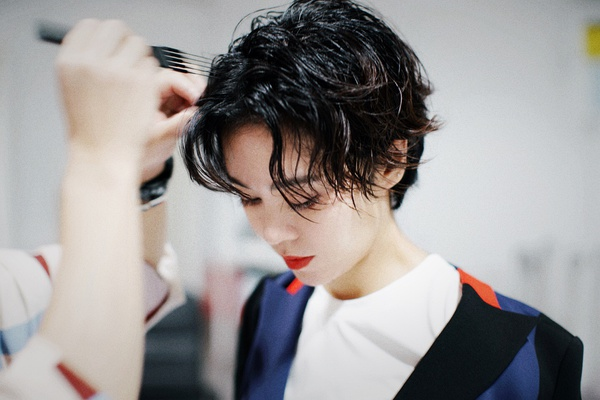
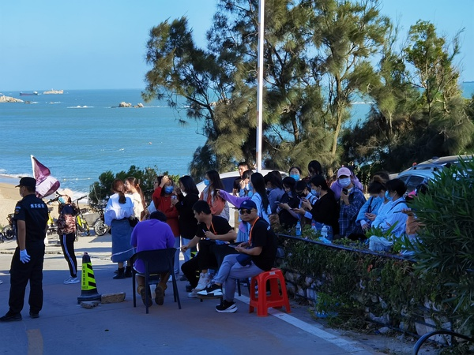

[主页](./main.md "main.md") | [首页](./comments1-100.md "comments1-100.md") | [前一页](./comments3701-3800.md "comments3701-3800.md") | [后一页](./comments3901-4000.md "comments3901-4000.md") | [末页](./comments7301-7400.md "comments7301-7400.md")  

---
*     [Yisa黎珞](https://www.douban.com/people/217273308/)    2020-10-08 14:55:57  
  >音频不要流出来，流出来不好有可能那首歌就会被切掉，我只想知道歌单，唱了哪些歌，哪几位姐姐唱  
  >
  >-- [松鼠与熊](https://www.douban.com/people/168667402/)  
  
  我想听静葵俩人合唱一首，不知道整个团综能不能dream到，她俩声音好搭  
---
*     [已注销](https://www.douban.com/people/187860590/)    2020-10-08 14:56:24  
  >这个配置也很新鲜🤣 一歌手带俩演员 jmz速速安排😈 不然团综没有看点！  
  >
  >-- [W](https://www.douban.com/people/154486190/)  
  
  什么鬼，为什么不是葵带静  
---
*     [Yisa黎珞](https://www.douban.com/people/217273308/)    2020-10-08 14:57:05  
  >音频不要流出来，流出来不好有可能那首歌就会被切掉，我只想知道歌单，唱了哪些歌，哪几位姐姐唱  
  >
  >-- [松鼠与熊](https://www.douban.com/people/168667402/)  
  
  现在音响试音，外面能听见，可以dream了  
---
*     [我不乖](https://www.douban.com/people/67808129/)    2020-10-08 14:57:50  
  >哈哈哈，又回到了各家wb➕ch翻物料的日子，六公的各家的vlog要把姐姐们wb翻烂了  
  >
  >-- [已注销](https://www.douban.com/people/187860590/)  
  
  我本来就是舞台粉，后来喜欢姐姐的互动，没有新舞台表演的情况下，我也只能出来觅食了😂  
---
*     [W](https://www.douban.com/people/154486190/)    2020-10-08 14:59:02  
  >什么鬼，为什么不是葵带静  
  >
  >-- [已注销](https://www.douban.com/people/187860590/)  
  
  霞教雨声乐，佳教静舞蹈也🉑️ 不过感觉团综应该没多少跳舞的部分  
---
*     [松鼠与熊](https://www.douban.com/people/168667402/)    2020-10-08 15:00:16  
  >现在音响试音，外面能听见，可以dream了  
  >
  >-- [Yisa黎珞](https://www.douban.com/people/217273308/)  
  
  等一个歌单了，dream一个外面等的粉丝先把歌单集起来，里面的观众出来后给repo告诉我们谁跟谁合唱的  
---
*     [Yisa黎珞](https://www.douban.com/people/217273308/)    2020-10-08 15:00:17  
  >霞教雨声乐，佳教静舞蹈也🉑️ 不过感觉团综应该没多少跳舞的部分  
  >
  >-- [W](https://www.douban.com/people/154486190/)  
  
  时间太短了，还有排新歌，团综也是走LIVE为主  
---
*     [fangsxy](https://www.douban.com/people/2224500/)    2020-10-08 15:01:07  
  十一年老香香也喜欢静静，在静葵的摩天大楼留下一个脚印  
---
*     [已注销](https://www.douban.com/people/187860590/)    2020-10-08 15:01:12  
  >霞教雨声乐，佳教静舞蹈也🉑️ 不过感觉团综应该没多少跳舞的部分  
  >
  >-- [W](https://www.douban.com/people/154486190/)  
  
  大概静静唱太好了，不用教，还是期待一个静葵合唱，2020就真的圆满了  
---
*     [已注销](https://www.douban.com/people/187860590/)    2020-10-08 15:02:12  
  >现在音响试音，外面能听见，可以dream了  
  >
  >-- [Yisa黎珞](https://www.douban.com/people/217273308/)  
  
  前线真的辛苦了！  
---
*     [Yisa黎珞](https://www.douban.com/people/217273308/)    2020-10-08 15:02:40  
  >大概静静唱太好了，不用教，还是期待一个静葵合唱，2020就真的圆满了  
  >
  >-- [已注销](https://www.douban.com/people/187860590/)  
  
  我也dream，希望整个团综有一首，只有她俩唱的歌，声音真的配，人美那个合音我人没了  
---
*     [Yisa黎珞](https://www.douban.com/people/217273308/)    2020-10-08 15:03:08  
  >前线真的辛苦了！  
  >
  >-- [已注销](https://www.douban.com/people/187860590/)  
  
  我不是前线，隔壁楼有前线，我只是搬过来😂  
---
*     [皓月琉璃](https://www.douban.com/people/153884600/)    2020-10-08 15:03:37  
  >这叫旅游吗 成天在民宿，难怪静说是去工作的  
  >
  >-- [Unknow](https://www.douban.com/people/219306324/)  
  
  要是一地播两集，真想不出这三天能剪出两集素材么～几乎哪也没去～时长倒是够……播啥  
---
*     [皓月琉璃](https://www.douban.com/people/153884600/)    2020-10-08 15:04:47  
  >我好柠檬又好气，就相当于姐姐准备好的演出，仅仅是表演给几十位节目组找好的托看的  
  >
  >-- [松鼠与熊](https://www.douban.com/people/168667402/)  
  
  感觉是有点无趣，等西安成都杭州这几地吧，应该会热闹不少～  
---
*     [Yisa黎珞](https://www.douban.com/people/217273308/)    2020-10-08 15:05:05  
  >要是一地播两集，真想不出这三天能剪出两集素材么～几乎哪也没去～时长倒是够……播啥  
  >
  >-- [皓月琉璃](https://www.douban.com/people/153884600/)  
  
  那就别剪了，都放出来😂就这么几天的素材在剪剪没了  
---
*     [Yisa黎珞](https://www.douban.com/people/217273308/)    2020-10-08 15:05:51  
  >感觉是有点无趣，等西安成都杭州这几地吧，应该会热闹不少～  
  >
  >-- [皓月琉璃](https://www.douban.com/people/153884600/)  
  
  没办法，有大风，安全最重要，后面的估计会好  
---
*     [松鼠与熊](https://www.douban.com/people/168667402/)    2020-10-08 15:06:39  
  >要是一地播两集，真想不出这三天能剪出两集素材么～几乎哪也没去～时长倒是够……播啥  
  >
  >-- [皓月琉璃](https://www.douban.com/people/153884600/)  
  
  可以的，我本来还担心一站只有两集，又是上星节目时长不可能像浪姐那样一期俩小时，路演的部分可能只能准备四五首歌的节目时长，现在看来第二期应该路演部分会占大头或者至少一半的时长。对听众来讲，我满足了  
---
*     [皓月琉璃](https://www.douban.com/people/153884600/)    2020-10-08 15:06:52  
  >不好吧，毕竟不是专业的场所，应该能听见，就怕全封了不让靠近。jmz好严格啊  
  >
  >-- [Yisa黎珞](https://www.douban.com/people/217273308/)  
  
  葵的声音一出来，我就不信有啥铜墙铁壁能挡的住🤣😜  
---
*     [Unknow](https://www.douban.com/people/219306324/)    2020-10-08 15:08:02  
  >我是不是滤镜过于重了，我觉得郁可猪拍得还可以😂  
  >
  >-- [松鼠与熊](https://www.douban.com/people/168667402/)  
  
  太重了+1 重到快赶上静静的滤镜了  
---
*     [Yisa黎珞](https://www.douban.com/people/217273308/)    2020-10-08 15:09:10  
  >葵的声音一出来，我就不信有啥铜墙铁壁能挡的住🤣😜  
  >
  >-- [皓月琉璃](https://www.douban.com/people/153884600/)  
  
  低调低调，静静也是大嗓门，声压很强的，如果唱温温柔柔的歌就不知道了  
---
*     [Unknow](https://www.douban.com/people/219306324/)    2020-10-08 15:10:45  
  >要是一地播两集，真想不出这三天能剪出两集素材么～几乎哪也没去～时长倒是够……播啥  
  >
  >-- [皓月琉璃](https://www.douban.com/people/153884600/)  
  
  播怎么分房间吧(bushi  哈哈哈哈  
---
*     [皓月琉璃](https://www.douban.com/people/153884600/)    2020-10-08 15:11:25  
  >可以的，我本来还担心一站只有两集，又是上星节目时长不可能像浪姐那样一期俩小时，路演的部分可  
  >
  >-- [松鼠与熊](https://www.douban.com/people/168667402/)  
  
  那可以，真素材有限，可以少剪，希望“饱满一些”😌  
---
*     [豆友197930848](https://www.douban.com/people/197930848/)    2020-10-08 15:11:36  
  >葵的声音一出来，我就不信有啥铜墙铁壁能挡的住🤣😜  
  >
  >-- [皓月琉璃](https://www.douban.com/people/153884600/)  
  
  毕竟郁葵专业修音响hhhh 上次商演直播葵没出来之前我还以为音响坏了  
---
*     [小鬼阿蛮](https://www.douban.com/people/219137387/)    楼主    2020-10-08 15:11:38  
  >我不是前线，隔壁楼有前线，我只是搬过来😂  
  >
  >-- [Yisa黎珞](https://www.douban.com/people/217273308/)  
  
  谢谢姐妹的搬运~等待歌单或者更多情报了~  
---
*     [简单](https://www.douban.com/people/147433810/)    2020-10-08 15:11:52  
  是三车人，目测130人出头。没有搭台是很温馨浪漫的氛围，观众拿了星星应援物，节目组要求大家能呈现轻松真实看表演的状态～  
---
*     [Yisa黎珞](https://www.douban.com/people/217273308/)    2020-10-08 15:12:05  
  >播怎么分房间吧(bushi  哈哈哈哈  
  >
  >-- [Unknow](https://www.douban.com/people/219306324/)  
  
  其实我想看她们收拾行李😂爱马仕富婆装了些什么，葵有多少奇奇怪怪的衣服发带  
---
*     [已注销](https://www.douban.com/people/187860590/)    2020-10-08 15:12:34  
  >是三车人，目测130人出头。没有搭台是很温馨浪漫的氛围，观众拿了星星应援物，节目组要求大家能  
  >
  >-- [简单](https://www.douban.com/people/147433810/)  
  
  看来氛围还好，姐姐享受表演，观众安心欣赏  
---
*     [Yisa黎珞](https://www.douban.com/people/217273308/)    2020-10-08 15:13:19  
  >是三车人，目测130人出头。没有搭台是很温馨浪漫的氛围，观众拿了星星应援物，节目组要求大家能  
  >
  >-- [简单](https://www.douban.com/people/147433810/)  
  
  三车这么多，不比赛就好  
---
*     [SiofnaFan](https://www.douban.com/people/180076918/)    2020-10-08 15:13:42  
  >是三车人，目测130人出头。没有搭台是很温馨浪漫的氛围，观众拿了星星应援物，节目组要求大家能  
  >
  >-- [简单](https://www.douban.com/people/147433810/)  
  
  这么多吗  
---
*     [长岛冰茶](https://www.douban.com/people/206269683/)    2020-10-08 15:13:47  
  >我也偷到一张葵的哈哈哈哈哈  
  >
  >-- [Sisyphus](https://www.douban.com/people/223292445/)  
  
  笑死哈哈哈哈哈哈  
---
*     [W](https://www.douban.com/people/154486190/)    2020-10-08 15:14:19  
  >是三车人，目测130人出头。没有搭台是很温馨浪漫的氛围，观众拿了星星应援物，节目组要求大家能  
  >
  >-- [简单](https://www.douban.com/people/147433810/)  
  
  所以到底有没有集体的表演？😈 这个到现在都是未知  
---
*     [mi桑](https://www.douban.com/people/187446485/)    2020-10-08 15:14:51  
  >是三车人，目测130人出头。没有搭台是很温馨浪漫的氛围，观众拿了星星应援物，节目组要求大家能  
  >
  >-- [简单](https://www.douban.com/people/147433810/)  
  
  啊，这么一说开始期待了！  
---
*     [皓月琉璃](https://www.douban.com/people/153884600/)    2020-10-08 15:15:54  
  >现在音响试音，外面能听见，可以dream了  
  >
  >-- [Yisa黎珞](https://www.douban.com/people/217273308/)  
  
  我就刷你的消息更新了，加油🧐🤩🥳✌🏻  
---
*     [Unknow](https://www.douban.com/people/219306324/)    2020-10-08 15:16:20  
  >其实我想看她们收拾行李😂爱马仕富婆装了些什么，葵有多少奇奇怪怪的衣服发带  
  >
  >-- [Yisa黎珞](https://www.douban.com/people/217273308/)  
  
  因为一站就4天 行李应该不多，我更好奇葵的行李，为啥连续两天穿同一件外套 带同一个发箍，是带的衣物不够多吗  
---
*     [彷徨少年时](https://www.douban.com/people/charlotte3/)    2020-10-08 15:17:15  
  如果今晚有repo的话，这栋楼得刷到5000吧🙄🙄😱😱😲😈  
---
*     [Yisa黎珞](https://www.douban.com/people/217273308/)    2020-10-08 15:18:07  
  >因为一站就4天 行李应该不多，我更好奇葵的行李，为啥连续两天穿同一件外套 带同一个发箍，是带  
  >
  >-- [Unknow](https://www.douban.com/people/219306324/)  
  
  发型师没跟着，带发带我怀疑她懒不想弄头发😂  
---
*     [已注销](https://www.douban.com/people/187860590/)    2020-10-08 15:18:34  
  >所以到底有没有集体的表演？😈 这个到现在都是未知  
  >
  >-- [W](https://www.douban.com/people/154486190/)  
  
  猜测之前最后长沙站是有的  
---
*     [松鼠与熊](https://www.douban.com/people/168667402/)    2020-10-08 15:18:44  
  >发型师没跟着，带发带我怀疑她懒不想弄头发😂  
  >
  >-- [Yisa黎珞](https://www.douban.com/people/217273308/)  
  
  杨老师没跟？？？！！！！！！！！！  
---
*     [哎呀脑瓜疼](https://www.douban.com/people/221425755/)    2020-10-08 15:18:48  
  有前线人员吗、现场i静咋了 一个个说i静除了相机啥都有、啥有  
---
*     [Yisa黎珞](https://www.douban.com/people/217273308/)    2020-10-08 15:19:33  
  >杨老师没跟？？？！！！！！！！！！  
  >
  >-- [松鼠与熊](https://www.douban.com/people/168667402/)  
  
  好像没跟，我看ch在吐槽  
---
*     [松鼠与熊](https://www.douban.com/people/168667402/)    2020-10-08 15:19:34  
  >发型师没跟着，带发带我怀疑她懒不想弄头发😂  
  >
  >-- [Yisa黎珞](https://www.douban.com/people/217273308/)  
  
  那把老头帽带起来啊！！我不要看发带葵我要老头葵😐  
---
*     [Yisa黎珞](https://www.douban.com/people/217273308/)    2020-10-08 15:20:19  
  >有前线人员吗、现场i静咋了 一个个说i静除了相机啥都有、啥有  
  >
  >-- [哎呀脑瓜疼](https://www.douban.com/people/221425755/)  
  
  i静i葵都老实，她们拍了不敢放出来，不要再说她们了😂😂😂😂  
---
*     [SiofnaFan](https://www.douban.com/people/180076918/)    2020-10-08 15:20:19  
  连着两天发带了，今天再是发带我要疯  
---
*     [松鼠与熊](https://www.douban.com/people/168667402/)    2020-10-08 15:20:43  
  >好像没跟，我看ch在吐槽  
  >
  >-- [Yisa黎珞](https://www.douban.com/people/217273308/)  
  
  为什么这种节目杨老师不跟...哭了....幸好有耳老师不离不弃时刻跟着....  
---
*     [简单](https://www.douban.com/people/147433810/)    2020-10-08 15:20:53  
  >这么多吗  
  >
  >-- [SiofnaFan](https://www.douban.com/people/180076918/)  
  
  对的，好像大部分是学生吧～  
---
*     [松鼠与熊](https://www.douban.com/people/168667402/)    2020-10-08 15:22:11  
  >对的，好像大部分是学生吧～  
  >
  >-- [简单](https://www.douban.com/people/147433810/)  
  
  如果真是学生，那倒还有点意义些...  
---
*     [没什么可说的](https://www.douban.com/people/108924101/)    2020-10-08 15:22:26  
  >有前线人员吗、现场i静咋了 一个个说i静除了相机啥都有、啥有  
  >
  >-- [哎呀脑瓜疼](https://www.douban.com/people/221425755/)  
  
  相机也有，节目组不让发路透前线i静不敢发，就比较乖。  
    
  然后大家就开始调侃i静什么都有 连烟花都准备了，就是不准备相机😂  
---
*     [SiofnaFan](https://www.douban.com/people/180076918/)    2020-10-08 15:22:44  
  >为什么这种节目杨老师不跟...哭了....幸好有耳老师不离不弃时刻跟着....  
  >
  >-- [松鼠与熊](https://www.douban.com/people/168667402/)  
  
  我怕有耳老师罢工  
---
*     [皓月琉璃](https://www.douban.com/people/153884600/)    2020-10-08 15:23:36  
  >因为一站就4天 行李应该不多，我更好奇葵的行李，为啥连续两天穿同一件外套 带同一个发箍，是带  
  >
  >-- [Unknow](https://www.douban.com/people/219306324/)  
  
  学学她静姐，每天内外上下都有不同搭配，葵这个女纸真是～～唉  
---
*     [Yisa黎珞](https://www.douban.com/people/217273308/)    2020-10-08 15:24:08  
  >我怕有耳老师罢工  
  >
  >-- [SiofnaFan](https://www.douban.com/people/180076918/)  
  
  我怕葵放飞自我，疯起来了😂  
---
*     [松鼠与熊](https://www.douban.com/people/168667402/)    2020-10-08 15:24:27  
  >我怕有耳老师罢工  
  >
  >-- [SiofnaFan](https://www.douban.com/people/180076918/)  
  
  这我不担心，有耳老师要是罢工静静这个美妆达人估计第一个不同意🤣  
---
*     [Yisa黎珞](https://www.douban.com/people/217273308/)    2020-10-08 15:24:44  
  >学学她静姐，每天内外上下都有不同搭配，葵这个女纸真是～～唉  
  >
  >-- [皓月琉璃](https://www.douban.com/people/153884600/)  
  
  静姐的衣服都好好看，日常嫌弃🐷的搭配  
---
*     [简单](https://www.douban.com/people/147433810/)    2020-10-08 15:24:49  
  >如果真是学生，那倒还有点意义些...  
  >
  >-- [松鼠与熊](https://www.douban.com/people/168667402/)  
  
  颜值都蛮高的，芒果颜狗哈哈  
---
*     [皓月琉璃](https://www.douban.com/people/153884600/)    2020-10-08 15:25:54  
  >那把老头帽带起来啊！！我不要看发带葵我要老头葵😐  
  >
  >-- [松鼠与熊](https://www.douban.com/people/168667402/)  
  
  她今天要不是郁少的利落形象出场，我真要ch参与“怼”她了😂啊哈  
---
*     [Yisa黎珞](https://www.douban.com/people/217273308/)    2020-10-08 15:26:59  
  彩排好像有人SOLO但是没听出是谁😂  
---
*     [松鼠与熊](https://www.douban.com/people/168667402/)    2020-10-08 15:29:15  
  >她今天要不是郁少的利落形象出场，我真要ch参与“怼”她了😂啊哈  
  >
  >-- [皓月琉璃](https://www.douban.com/people/153884600/)  
  
    
  她头发虽然剪了但其实比郁少那个长度要长很多，郁少不起来的😂反倒有点像这个时候的长度  
---
*     [SiofnaFan](https://www.douban.com/people/180076918/)    2020-10-08 15:30:03  
  >我怕葵放飞自我，疯起来了😂  
  >
  >-- [Yisa黎珞](https://www.douban.com/people/217273308/)  
  
  有画面了  
---
*     [SiofnaFan](https://www.douban.com/people/180076918/)    2020-10-08 15:30:16  
  >这我不担心，有耳老师要是罢工静静这个美妆达人估计第一个不同意🤣  
  >
  >-- [松鼠与熊](https://www.douban.com/people/168667402/)  
  
  “她什么都好”  
---
*     [皓月琉璃](https://www.douban.com/people/153884600/)    2020-10-08 15:31:00  
  >她头发虽然剪了但其实比郁少那个长度要长很多，郁少不起来的😂反倒有点像这个时候的长度  
  >
  >-- [松鼠与熊](https://www.douban.com/people/168667402/)  
  
  这张特别可以😋利落就行，五公发带可以有，这两天那个可以顺便送现场观众🙃  
---
*     [Yisa黎珞](https://www.douban.com/people/217273308/)    2020-10-08 15:31:04  
  很多舞台 不同组合 弟弟乐器 有solo，站桩也有跳舞  
---
*     [豆友219767725](https://www.douban.com/people/219767725/)    2020-10-08 15:31:21  
  >为什么这种节目杨老师不跟...哭了....幸好有耳老师不离不弃时刻跟着....  
  >
  >-- [松鼠与熊](https://www.douban.com/people/168667402/)  
  
  有耳老师技艺精进后倒是有单飞的实力了 无奈“身不由己” 这辈子注定要被隔壁歌手锁住🔒了 哈哈哈哈哈哈  
---
*     [Yisa黎珞](https://www.douban.com/people/217273308/)    2020-10-08 15:31:48  
  >很多舞台 不同组合 弟弟乐器 有solo，站桩也有跳舞  
  >
  >-- [Yisa黎珞](https://www.douban.com/people/217273308/)  
  
  隔壁一个瓜说没有舞蹈，那个不算😂  
---
*     [SiofnaFan](https://www.douban.com/people/180076918/)    2020-10-08 15:31:49  
  >静姐的衣服都好好看，日常嫌弃🐷的搭配  
  >
  >-- [Yisa黎珞](https://www.douban.com/people/217273308/)  
  
  她私服其实挺好看的，但是…感觉犯懒了……  
---
*     [松鼠与熊](https://www.douban.com/people/168667402/)    2020-10-08 15:32:44  
  >她私服其实挺好看的，但是…感觉犯懒了……  
  >
  >-- [SiofnaFan](https://www.douban.com/people/180076918/)  
  
  是的，她私服真的好多都超🉑  
---
*     [二土寸E卩](https://www.douban.com/people/208650306/)    2020-10-08 15:32:44  
  >  
  >
  >-- [歪楼的蝴蝶](https://www.douban.com/people/176743619/)  
  
  构图好  
  色彩搭配好  
  给人朦胧美感  
  拍的好👍收图了  
---
*     [Yisa黎珞](https://www.douban.com/people/217273308/)    2020-10-08 15:33:40  
  >隔壁一个瓜说没有舞蹈，那个不算😂  
  >
  >-- [Yisa黎珞](https://www.douban.com/people/217273308/)  
  
  姐姐也有乐器上，可以drram葵了  
---
*     [小鬼阿蛮](https://www.douban.com/people/219137387/)    楼主    2020-10-08 15:33:41  
  >很多舞台 不同组合 弟弟乐器 有solo，站桩也有跳舞  
  >
  >-- [Yisa黎珞](https://www.douban.com/people/217273308/)  
  
  昨天看到有个repo说是有十还是四个舞台……是不是可以大胆梦一个 哈哈  
---
*     [松鼠与熊](https://www.douban.com/people/168667402/)    2020-10-08 15:33:42  
  >这张特别可以😋利落就行，五公发带可以有，这两天那个可以顺便送现场观众🙃  
  >
  >-- [皓月琉璃](https://www.douban.com/people/153884600/)  
  
  可是这种也需要杨老师啊😂杨老师不在，看不到😂  
---
*     [SiofnaFan](https://www.douban.com/people/180076918/)    2020-10-08 15:33:55  
  >这张特别可以😋利落就行，五公发带可以有，这两天那个可以顺便送现场观众🙃  
  >
  >-- [皓月琉璃](https://www.douban.com/people/153884600/)  
  
  我宁愿她带小老头帽子……  
---
*     [SiofnaFan](https://www.douban.com/people/180076918/)    2020-10-08 15:35:07  
  >有耳老师技艺精进后倒是有单飞的实力了 无奈“身不由己” 这辈子注定要被隔壁歌手锁住🔒了 哈  
  >
  >-- [豆友219767725](https://www.douban.com/people/219767725/)  
  
  是真的！有耳老师技艺非常🉑️！  
---
*     [Yisa黎珞](https://www.douban.com/people/217273308/)    2020-10-08 15:35:07  
  >昨天看到有个repo说是有十还是四个舞台……是不是可以大胆梦一个 哈哈  
  >
  >-- [小鬼阿蛮](https://www.douban.com/people/219137387/)  
  
  十和四这距离好大😂  
---
*     [想不好长不高](https://www.douban.com/people/4098918/)    2020-10-08 15:37:02  
  >十和四这距离好大😂  
  >
  >-- [Yisa黎珞](https://www.douban.com/people/217273308/)  
  
  十个节目应该要有的吧，不然路演了个寂寞呐  
---
*     [精神小妹哈哈哈](https://www.douban.com/people/203951444/)    2020-10-08 15:38:31  
  >静姐的衣服都好好看，日常嫌弃🐷的搭配  
  >
  >-- [Yisa黎珞](https://www.douban.com/people/217273308/)  
  
  🐷的私服真的很不错的…就是有时候感觉她可能是因为懒，不想好好搭配  
---
*     [SiofnaFan](https://www.douban.com/people/180076918/)    2020-10-08 15:38:34  
  静静今天会帅出新高度吗🥰  
---
*     [Yisa黎珞](https://www.douban.com/people/217273308/)    2020-10-08 15:38:50  
  >十个节目应该要有的吧，不然路演了个寂寞呐  
  >
  >-- [想不好长不高](https://www.douban.com/people/4098918/)  
  
  一首歌最多3分钟，十首也就30分钟，不多不多，也就一期节目  
---
*     [Yisa黎珞](https://www.douban.com/people/217273308/)    2020-10-08 15:39:27  
  >🐷的私服真的很不错的…就是有时候感觉她可能是因为懒，不想好好搭配  
  >
  >-- [精神小妹哈哈哈](https://www.douban.com/people/203951444/)  
  
  🐷她好多私服在我眼里也是奇奇怪怪的，有的很好看，有的一言难尽  
---
*     [W](https://www.douban.com/people/154486190/)    2020-10-08 15:40:03  
  >静静今天会帅出新高度吗🥰  
  >
  >-- [SiofnaFan](https://www.douban.com/people/180076918/)  
  
  肯定！静静子现在是欧美大帅哥😆  
---
*     [彷徨少年时](https://www.douban.com/people/charlotte3/)    2020-10-08 15:40:16  
  >可是这种也需要杨老师啊😂杨老师不在，看不到😂  
  >
  >-- [松鼠与熊](https://www.douban.com/people/168667402/)  
  
  杨老师放假过国庆去了吧  
---
*     [精神小妹哈哈哈](https://www.douban.com/people/203951444/)    2020-10-08 15:40:25  
  >🐷她好多私服在我眼里也是奇奇怪怪的，有的很好看，有的一言难尽  
  >
  >-- [Yisa黎珞](https://www.douban.com/people/217273308/)  
  
  哈哈哈是的，有时候真的…🐷开心就好  
---
*     [Yisa黎珞](https://www.douban.com/people/217273308/)    2020-10-08 15:40:42  
  >静静今天会帅出新高度吗🥰  
  >
  >-- [SiofnaFan](https://www.douban.com/people/180076918/)  
  
  比今天静静帅的永远是明天的静静  
---
*     [松鼠与熊](https://www.douban.com/people/168667402/)    2020-10-08 15:42:29  
  >🐷她好多私服在我眼里也是奇奇怪怪的，有的很好看，有的一言难尽  
  >
  >-- [Yisa黎珞](https://www.douban.com/people/217273308/)  
  
  那我滤镜是真的蛮厚的了，我觉得她私服都超可，有些不是我喜欢的类型但穿在她身上就很好看哈哈哈哈。  
---
*     [歪楼的蝴蝶](https://www.douban.com/people/176743619/)    2020-10-08 15:43:38  
  >构图好  
  >色彩搭配好  
  >给人朦胧美感  
  >拍的好👍收图了  
  >
  >-- [二土寸E卩](https://www.douban.com/people/208650306/)  
  
  哈哈哈哈，认真的嘛，小肥猪滤镜都是从静姐那进口的吧  
---
*     [Yisa黎珞](https://www.douban.com/people/217273308/)    2020-10-08 15:44:06  
  集体在唱歌了，听歌词应该是团歌，隔壁瓜说有一首她最喜欢的是葵唱的  
---
*     [Yisa黎珞](https://www.douban.com/people/217273308/)    2020-10-08 15:44:23  
  >那我滤镜是真的蛮厚的了，我觉得她私服都超可，有些不是我喜欢的类型但穿在她身上就很好看哈哈哈  
  >
  >-- [松鼠与熊](https://www.douban.com/people/168667402/)  
  
  你的滤镜堪比静静  
---
*     [松鼠与熊](https://www.douban.com/people/168667402/)    2020-10-08 15:44:32  
  >杨老师放假过国庆去了吧  
  >
  >-- [彷徨少年时](https://www.douban.com/people/charlotte3/)  
  
  讲道理发型师造型师这种职业，假期应该是跟艺人工作时间段有关的，跟法定节假日不沾边😂  
---
*     [SiofnaFan](https://www.douban.com/people/180076918/)    2020-10-08 15:44:45  
  >比今天静静帅的永远是明天的静静  
  >
  >-- [Yisa黎珞](https://www.douban.com/people/217273308/)  
  
  晚上静静要不考虑出个门？🥰  
---
*     [已注销](https://www.douban.com/people/187860590/)    2020-10-08 15:45:36  
    
  好羡慕进去的观众  
---
*     [Yisa黎珞](https://www.douban.com/people/217273308/)    2020-10-08 15:45:41  
  >晚上静静要不考虑出个门？🥰  
  >
  >-- [SiofnaFan](https://www.douban.com/people/180076918/)  
  
  唱了那么多首，让人家休息吧，明天好像是拍照，姐姐是不是可以闲下来出去转转  
---
*     [Yisa黎珞](https://www.douban.com/people/217273308/)    2020-10-08 15:46:19  
  在彩排公虾米  
---
*     [松鼠与熊](https://www.douban.com/people/168667402/)    2020-10-08 15:47:21  
  >晚上静静要不考虑出个门？🥰  
  >
  >-- [SiofnaFan](https://www.douban.com/people/180076918/)  
  
  昨天爆料的那张泉州站的行程图，如果是真的话，大概率是不会出门的，晚上有可能是路演结束后会有个坐在一起吃东西谈心的环节，就在问海的天台里头录制  
---
*     [Yisa黎珞](https://www.douban.com/people/217273308/)    2020-10-08 15:47:24  
  >在彩排公虾米  
  >
  >-- [Yisa黎珞](https://www.douban.com/people/217273308/)  
  
  改编了 舞曲风  
---
*     [程慎](https://www.douban.com/people/175528838/)    2020-10-08 15:47:57  
  我觉得静静私服也是时而在线时而很迷，她今年初宅在朋友家里那段时间衣服真的很舒适又有年龄感哈哈哈哈 很慈祥的感觉  
---
*     [松鼠与熊](https://www.douban.com/people/168667402/)    2020-10-08 15:48:08  
  >好羡慕进去的观众  
  >
  >-- [已注销](https://www.douban.com/people/187860590/)  
  
  噢喲，看到一面超漂亮的旗子🤣  
---
*     [Yisa黎珞](https://www.douban.com/people/217273308/)    2020-10-08 15:48:45  
  >噢喲，看到一面超漂亮的旗子🤣  
  >
  >-- [松鼠与熊](https://www.douban.com/people/168667402/)  
  
  葵家的😂  
---
*     [已注销](https://www.douban.com/people/187860590/)    2020-10-08 15:48:58  
  >噢喲，看到一面超漂亮的旗子🤣  
  >
  >-- [松鼠与熊](https://www.douban.com/people/168667402/)  
  
    
  让我们看清这面大旗！  
---
*     [SiofnaFan](https://www.douban.com/people/180076918/)    2020-10-08 15:49:00  
  >唱了那么多首，让人家休息吧，明天好像是拍照，姐姐是不是可以闲下来出去转转  
  >
  >-- [Yisa黎珞](https://www.douban.com/people/217273308/)  
  
  🤣我就是dream一下  
---
*     [小鬼阿蛮](https://www.douban.com/people/219137387/)    楼主    2020-10-08 15:49:15  
  >好羡慕进去的观众  
  >
  >-- [已注销](https://www.douban.com/people/187860590/)  
  
  羡慕+1  
---
*     [SiofnaFan](https://www.douban.com/people/180076918/)    2020-10-08 15:49:17  
  >在彩排公虾米  
  >
  >-- [Yisa黎珞](https://www.douban.com/people/217273308/)  
  
  哈哈哈哈，真有这个～  
---
*     [已注销](https://www.douban.com/people/187860590/)    2020-10-08 15:49:30  
  >昨天爆料的那张泉州站的行程图，如果是真的话，大概率是不会出门的，晚上有可能是路演结束后会有  
  >
  >-- [松鼠与熊](https://www.douban.com/people/168667402/)  
  
  这一季开心还是上一季开心？  
---
*     [SiofnaFan](https://www.douban.com/people/180076918/)    2020-10-08 15:49:34  
  >昨天爆料的那张泉州站的行程图，如果是真的话，大概率是不会出门的，晚上有可能是路演结束后会有  
  >
  >-- [松鼠与熊](https://www.douban.com/people/168667402/)  
  
  谈心……  
---

3801-3900

---

[主页](./main.md "main.md") | [首页](./comments1-100.md "comments1-100.md") | [前一页](./comments3701-3800.md "comments3701-3800.md") | [后一页](./comments3901-4000.md "comments3901-4000.md") | [末页](./comments7301-7400.md "comments7301-7400.md")  

---
[1-100](./comments1-100.md "1-100")  [101-200](./comments101-200.md "101-200")  [201-300](./comments201-300.md "201-300")  [301-400](./comments301-400.md "301-400")  [401-500](./comments401-500.md "401-500")  [501-600](./comments501-600.md "501-600")  [601-700](./comments601-700.md "601-700")  [701-800](./comments701-800.md "701-800")  [801-900](./comments801-900.md "801-900")  [901-1000](./comments901-1000.md "901-1000")  [1001-1100](./comments1001-1100.md "1001-1100")  [1101-1200](./comments1101-1200.md "1101-1200")  [1201-1300](./comments1201-1300.md "1201-1300")  [1301-1400](./comments1301-1400.md "1301-1400")  [1401-1500](./comments1401-1500.md "1401-1500")  [1501-1600](./comments1501-1600.md "1501-1600")  [1601-1700](./comments1601-1700.md "1601-1700")  [1701-1800](./comments1701-1800.md "1701-1800")  [1801-1900](./comments1801-1900.md "1801-1900")  [1901-2000](./comments1901-2000.md "1901-2000")  [2001-2100](./comments2001-2100.md "2001-2100")  [2101-2200](./comments2101-2200.md "2101-2200")  [2201-2300](./comments2201-2300.md "2201-2300")  [2301-2400](./comments2301-2400.md "2301-2400")  [2401-2500](./comments2401-2500.md "2401-2500")  [2501-2600](./comments2501-2600.md "2501-2600")  [2601-2700](./comments2601-2700.md "2601-2700")  [2701-2800](./comments2701-2800.md "2701-2800")  [2801-2900](./comments2801-2900.md "2801-2900")  [2901-3000](./comments2901-3000.md "2901-3000")  [3001-3100](./comments3001-3100.md "3001-3100")  [3101-3200](./comments3101-3200.md "3101-3200")  [3201-3300](./comments3201-3300.md "3201-3300")  [3301-3400](./comments3301-3400.md "3301-3400")  [3401-3500](./comments3401-3500.md "3401-3500")  [3501-3600](./comments3501-3600.md "3501-3600")  [3601-3700](./comments3601-3700.md "3601-3700")  [3701-3800](./comments3701-3800.md "3701-3800")  [3801-3900](./comments3801-3900.md "3801-3900")  [3901-4000](./comments3901-4000.md "3901-4000")  [4001-4100](./comments4001-4100.md "4001-4100")  [4101-4200](./comments4101-4200.md "4101-4200")  [4201-4300](./comments4201-4300.md "4201-4300")  [4301-4400](./comments4301-4400.md "4301-4400")  [4401-4500](./comments4401-4500.md "4401-4500")  [4501-4600](./comments4501-4600.md "4501-4600")  [4601-4700](./comments4601-4700.md "4601-4700")  [4701-4800](./comments4701-4800.md "4701-4800")  [4801-4900](./comments4801-4900.md "4801-4900")  [4901-5000](./comments4901-5000.md "4901-5000")  [5001-5100](./comments5001-5100.md "5001-5100")  [5101-5200](./comments5101-5200.md "5101-5200")  [5201-5300](./comments5201-5300.md "5201-5300")  [5301-5400](./comments5301-5400.md "5301-5400")  [5401-5500](./comments5401-5500.md "5401-5500")  [5501-5600](./comments5501-5600.md "5501-5600")  [5601-5700](./comments5601-5700.md "5601-5700")  [5701-5800](./comments5701-5800.md "5701-5800")  [5801-5900](./comments5801-5900.md "5801-5900")  [5901-6000](./comments5901-6000.md "5901-6000")  [6001-6100](./comments6001-6100.md "6001-6100")  [6101-6200](./comments6101-6200.md "6101-6200")  [6201-6300](./comments6201-6300.md "6201-6300")  [6301-6400](./comments6301-6400.md "6301-6400")  [6401-6500](./comments6401-6500.md "6401-6500")  [6501-6600](./comments6501-6600.md "6501-6600")  [6601-6700](./comments6601-6700.md "6601-6700")  [6701-6800](./comments6701-6800.md "6701-6800")  [6801-6900](./comments6801-6900.md "6801-6900")  [6901-7000](./comments6901-7000.md "6901-7000")  [7001-7100](./comments7001-7100.md "7001-7100")  [7101-7200](./comments7101-7200.md "7101-7200")  [7201-7300](./comments7201-7300.md "7201-7300")  [7301-7400](./comments7301-7400.md "7301-7400")  