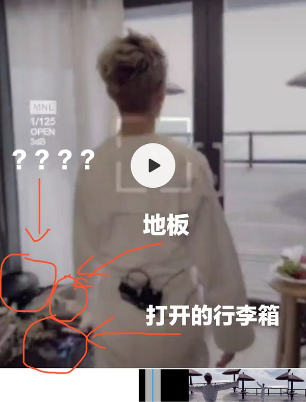
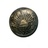
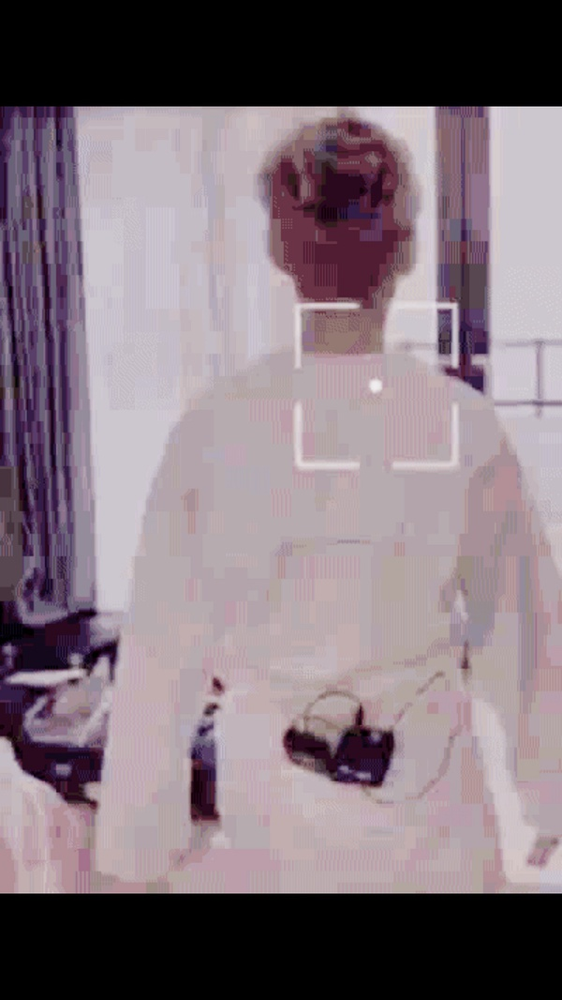
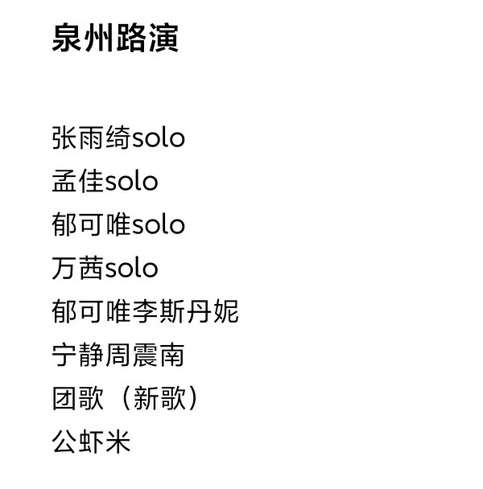

[主页](./main.md "main.md") | [首页](./comments1-100.md "comments1-100.md") | [前一页](./comments4901-5000.md "comments4901-5000.md") | [后一页](./comments5101-5200.md "comments5101-5200.md") | [末页](./comments7301-7400.md "comments7301-7400.md")  

---
*     [想不好长不高](https://www.douban.com/people/4098918/)    2020-10-09 07:35:16  
  >嗯嗯，好好听  
  >
  >-- [豆友213180988](https://www.douban.com/people/213180988/)  
  
  葵能不能每站唱首新专的歌？团综蜜月顺便打歌啊？😂  
---
*     [柳微微](https://www.douban.com/people/149620484/)    2020-10-09 07:35:33  
  感觉像茶几，但是茶几不会摆那个地方吧  
---
*     [豆友213180988](https://www.douban.com/people/213180988/)    2020-10-09 07:35:53  
  >葵能不能每站唱首新专的歌？团综蜜月顺便打歌啊？😂  
  >
  >-- [想不好长不高](https://www.douban.com/people/4098918/)  
  
  这歌我觉得百分之八十跟她没关系，但是我又希望跟她有关系，哎  
---
*     [芦笛](https://www.douban.com/people/220264374/)    2020-10-09 07:44:06  
  静静猴猴看🌺💐🌹🌻🌼🌾🎋🌷  
---
*     [小鬼阿蛮](https://www.douban.com/people/219137387/)    楼主    2020-10-09 07:44:39  
  >「该条回应已被删除」  
  >
  >-- [还能不能好玩](https://www.douban.com/people/165680902/)  
  
    
  这是我的理解……看高度感觉不是吉他盒😭  
---
*     [已注 销](https://www.douban.com/people/155947097/)    2020-10-09 07:44:47  
  睡一觉起来就过5k了，姐妹们🐂🍺  
---
*     [Deer](https://www.douban.com/people/219325210/)    2020-10-09 07:53:07  
  哈哈哈  
---
*     [Deer](https://www.douban.com/people/219325210/)    2020-10-09 07:53:09  
  🐮  
---
*     [SiofnaFan](https://www.douban.com/people/180076918/)    2020-10-09 07:59:08  
  ……这么糊……你们是怎么确定是什么的……😅😅😅  
---
*     [x](https://www.douban.com/people/206846483/)    2020-10-09 08:00:57  
    
  每天一问，昨天的郁可唯有路透吗？  
---
*     [SiofnaFan](https://www.douban.com/people/180076918/)    2020-10-09 08:02:33  
  >害，现在怎么说呢，关于🍬也没有楼主说的那么甜，但是也不是没有，传着传着都乱了  
  >
  >-- [豆友213180988](https://www.douban.com/people/213180988/)  
  
  听描述，心里差不多有底了，应该很甜，但可能确实不至于100倍那么夸张🤣🤣🤣  
---
*     [雨田](https://www.douban.com/people/216409979/)    2020-10-09 08:05:15  
  >每天一问，昨天的郁可唯有路透吗？  
  >
  >-- [x](https://www.douban.com/people/206846483/)  
  
  不怕暗杀吗？🙀  
---
*     [程慎](https://www.douban.com/people/175528838/)    2020-10-09 08:05:29  
  >听描述，心里差不多有底了，应该很甜，但可能确实不至于100倍那么夸张🤣🤣🤣  
  >
  >-- [SiofnaFan](https://www.douban.com/people/180076918/)  
  
  对感觉还是先放低期待会比较好，这样后面才会有惊喜感，感觉宁为郁睡糖都很甜，胃口已经被养刁了  
---
*     [小鬼阿蛮](https://www.douban.com/people/219137387/)    楼主    2020-10-09 08:07:28  
  >听描述，心里差不多有底了，应该很甜，但可能确实不至于100倍那么夸张🤣🤣🤣  
  >
  >-- [SiofnaFan](https://www.douban.com/people/180076918/)  
  
    
  我是嗑nwys的小金鱼，给糖起舞的buff加满了，大家别被我的主观看法影响了😂  
---
*     [长岛冰茶](https://www.douban.com/people/206269683/)    2020-10-09 08:08:03  
  一觉醒来5000了，你们🐮🍺  
---
*     [Shirley Tian](https://www.douban.com/people/150047836/)    2020-10-09 08:16:50  
  一集都还没播，先整了5k楼。。。播起来你们不上天。。。  
---
*     [SiofnaFan](https://www.douban.com/people/180076918/)    2020-10-09 08:16:58  
  >我是嗑nwys的小金鱼，给糖起舞的buff加满了，大家别被我的主观看法影响了😂  
  >
  >-- [小鬼阿蛮](https://www.douban.com/people/219137387/)  
  
  哈哈哈哈哈哈哈哈  
---
*     [SiofnaFan](https://www.douban.com/people/180076918/)    2020-10-09 08:17:13  
  >对感觉还是先放低期待会比较好，这样后面才会有惊喜感，感觉宁为郁睡糖都很甜，胃口已经被养刁了  
  >
  >-- [程慎](https://www.douban.com/people/175528838/)  
  
  “一切都是更好的恩赐”🥰  
---
*     [机智豆](https://www.douban.com/people/219579508/)    2020-10-09 08:18:03  
  >每天一问，昨天的郁可唯有路透吗？  
  >
  >-- [x](https://www.douban.com/people/206846483/)  
  
  哈哈哈哈哈哈哈哈笑死我了  
---
*     [只想静静呆着](https://www.douban.com/people/220407000/)    2020-10-09 08:18:10  
  破5000了 今天大家打算舞到多少？今天姐姐们干什么呢？  
---
*     [微笑着过每一天](https://www.douban.com/people/87974496/)    2020-10-09 08:22:34  
  添砖加瓦  
---
*     [微笑着过每一天](https://www.douban.com/people/87974496/)    2020-10-09 08:22:59  
  >「该条回应已被删除」  
  >
  >-- [小鬼阿蛮](https://www.douban.com/people/219137387/)  
  
  楼主你在问海吗  
---
*     [螺旋藻](https://www.douban.com/people/66268315/)    2020-10-09 08:23:47  
  >「该条回应已被删除」  
  >
  >-- [小鬼阿蛮](https://www.douban.com/people/219137387/)  
  
  还是室内吗  
---
*     [昆士兰啤梨鹅](https://www.douban.com/people/182353457/)    2020-10-09 08:23:58  
  郁可唯的拆礼物跟静姐如出一辙哈哈哈哈哈  
---
*     [已注 销](https://www.douban.com/people/155947097/)    2020-10-09 08:24:15  
  >“一切都是更好的恩赐”🥰  
  >
  >-- [SiofnaFan](https://www.douban.com/people/180076918/)  
  
  得到葵的真传了哈哈哈  
---
*     [小鬼阿蛮](https://www.douban.com/people/219137387/)    楼主    2020-10-09 08:24:25  
  >楼主你在问海吗  
  >
  >-- [微笑着过每一天](https://www.douban.com/people/87974496/)  
  
  我也是搬瓜哈，楼主开始搬砖了  
---
*     [。](https://www.douban.com/people/164210963/)    2020-10-09 08:28:52  
  搬瓜:今日晋江某海滩拍MV 宣传照有惠女服饰  
---
*     [已注销](https://www.douban.com/people/187860590/)    2020-10-09 08:28:56  
  >一集都还没播，先整了5k楼。。。播起来你们不上天。。。  
  >
  >-- [Shirley Tian](https://www.douban.com/people/150047836/)  
  
  扶摇直上九万里！我们要飞黄腾达了！！  
---
*     [一棵麦芽糖](https://www.douban.com/people/114181779/)    2020-10-09 08:29:02  
  歌单瓜有了么？  
---
*     [Unknow](https://www.douban.com/people/219306324/)    2020-10-09 08:29:09  
  >「该条回应已被删除」  
  >
  >-- [还能不能好玩](https://www.douban.com/people/165680902/)  
  
  他们两大概率一屋我信，但抖音是葵拍的我不太信 因为葵拍的视频都是抖到不行 我不信她有这个技术能拍这么稳😂  
---
*     [小瓶子](https://www.douban.com/people/157000565/)    2020-10-09 08:31:08  
  >郁可唯的拆礼物跟静姐如出一辙哈哈哈哈哈  
  >
  >-- [昆士兰啤梨鹅](https://www.douban.com/people/182353457/)  
  
  比静姐敷衍多了。哈哈哈  
---
*     [Unknow](https://www.douban.com/people/219306324/)    2020-10-09 08:32:55  
  >「该条回应已被删除」  
  >
  >-- [还能不能好玩](https://www.douban.com/people/165680902/)  
  
  哇 我就安安静静等节目播出后 你们放彩排视频了 哈哈哈  
---
*     [SiofnaFan](https://www.douban.com/people/180076918/)    2020-10-09 08:33:12  
  >比静姐敷衍多了。哈哈哈  
  >
  >-- [小瓶子](https://www.douban.com/people/157000565/)  
  
  应该像静静学习如何拆礼物🤣静姐拆礼物看的人都觉得无比开心仿佛自己在拆  
---
*     [小鬼阿蛮](https://www.douban.com/people/219137387/)    楼主    2020-10-09 08:33:58  
  >这是我的理解……看高度感觉不是吉他盒😭  
  >
  >-- [小鬼阿蛮](https://www.douban.com/people/219137387/)  
  
  😭😭抱歉我理解的吉他盒是竖放在地上，又仔细看了截图，这就是个倒在地上的乐器盒吧！下面就请扒葵送机的吉他盒照片了！  
---
*     [宁猫](https://www.douban.com/people/179597455/)    2020-10-09 08:38:30  
  越说越期待怎么回事！  
---
*     [小瓶子](https://www.douban.com/people/157000565/)    2020-10-09 08:41:42  
  >应该像静静学习如何拆礼物🤣静姐拆礼物看的人都觉得无比开心仿佛自己在拆  
  >
  >-- [SiofnaFan](https://www.douban.com/people/180076918/)  
  
  对，葵就是很敷衍的拆拆，话说葵以前也拆过么？  
---
*     [吃瓜群众](https://www.douban.com/people/197424509/)    2020-10-09 08:44:40  
  >对，葵就是很敷衍的拆拆，话说葵以前也拆过么？  
  >
  >-- [小瓶子](https://www.douban.com/people/157000565/)  
  
  我也看了，葵真的好敷衍😂  
---
*     [Caleen](https://www.douban.com/people/caleenyeung/)    2020-10-09 08:44:43  
  >😭😭抱歉我理解的吉他盒是竖放在地上，又仔细看了截图，这就是个倒在地上的乐器盒吧！下面就  
  >
  >-- [小鬼阿蛮](https://www.douban.com/people/219137387/)  
  
    
  但我还是感觉不是吉他盒，调亮看起来好像没有长的琴颈那部分  
---
*     [Unknow](https://www.douban.com/people/219306324/)    2020-10-09 08:45:00  
  >嗯嗯，好好听  
  >
  >-- [豆友213180988](https://www.douban.com/people/213180988/)  
  
  我就一个问题 那个小摩托是那首 骑上我心爱的小摩托那首吗  
---
*     [豆友213180988](https://www.douban.com/people/213180988/)    2020-10-09 08:45:32  
  >我就一个问题 那个小摩托是那首 骑上我心爱的小摩托那首吗  
  >
  >-- [Unknow](https://www.douban.com/people/219306324/)  
  
  当然不是啦哈哈哈哈  
---
*     [彷徨少年时](https://www.douban.com/people/charlotte3/)    2020-10-09 08:46:02  
  >对，葵就是很敷衍的拆拆，话说葵以前也拆过么？  
  >
  >-- [小瓶子](https://www.douban.com/people/157000565/)  
  
  没拆过，招了宣传助理之后才弄的小红书吧！  
---
*     [豆友213180988](https://www.douban.com/people/213180988/)    2020-10-09 08:46:12  
  >歌单瓜有了么？  
  >
  >-- [一棵麦芽糖](https://www.douban.com/people/114181779/)  
  
  楼里有啊，是真的  
---
*     [豆友213180988](https://www.douban.com/people/213180988/)    2020-10-09 08:46:57  
  >我是嗑nwys的小金鱼，给糖起舞的buff加满了，大家别被我的主观看法影响了😂  
  >
  >-- [小鬼阿蛮](https://www.douban.com/people/219137387/)  
  
  太主观了哈哈哈，我看了没有戳脑袋甜  
---
*     [Unknow](https://www.douban.com/people/219306324/)    2020-10-09 08:48:25  
  >对，葵就是很敷衍的拆拆，话说葵以前也拆过么？  
  >
  >-- [小瓶子](https://www.douban.com/people/157000565/)  
  
  她不是在浪姐期间才开的小红薯吗  
---
*     [螺旋藻](https://www.douban.com/people/66268315/)    2020-10-09 08:48:43  
  >太主观了哈哈哈，我看了没有戳脑袋甜  
  >
  >-- [豆友213180988](https://www.douban.com/people/213180988/)  
  
  为什么你们都看了  
---
*     [Unknow](https://www.douban.com/people/219306324/)    2020-10-09 08:48:53  
  >当然不是啦哈哈哈哈  
  >
  >-- [豆友213180988](https://www.douban.com/people/213180988/)  
  
  哈哈哈 那就好  
---
*     [豆友213180988](https://www.douban.com/people/213180988/)    2020-10-09 08:49:20  
  >哈哈哈 那就好  
  >
  >-- [Unknow](https://www.douban.com/people/219306324/)  
  
  很好听的歌呢，个人认为全场最佳  
---
*     [豆友213180988](https://www.douban.com/people/213180988/)    2020-10-09 08:49:32  
  >为什么你们都看了  
  >
  >-- [螺旋藻](https://www.douban.com/people/66268315/)  
  
  有点人脉？  
---
*     [Tt喧泫](https://www.douban.com/people/223048587/)    2020-10-09 08:50:09  
    
  话说可唯的发带和穿着，可能是因为看多了或者习惯了，我居然觉得还挺好看的［静静子同款滤镜］٩(๑`н´๑)۶  
---
*     [豆友221180056](https://www.douban.com/people/221180056/)    2020-10-09 08:50:42  
  一早起来先爬楼大家太棒了  
---
*     [螺旋藻](https://www.douban.com/people/66268315/)    2020-10-09 08:51:15  
  >有点人脉？  
  >
  >-- [豆友213180988](https://www.douban.com/people/213180988/)  
  
  🐂逼不消音  
---
*     [一棵麦芽糖](https://www.douban.com/people/114181779/)    2020-10-09 08:51:30  
  >楼里有啊，是真的  
  >
  >-- [豆友213180988](https://www.douban.com/people/213180988/)  
  
  页数太多了 翻了都没看见  
---
*     [已注销](https://www.douban.com/people/187860590/)    2020-10-09 08:51:48  
  >话说可唯的发带和穿着，可能是因为看多了或者习惯了，我居然觉得还挺好看的［静静子同款滤镜］  
  >
  >-- [Tt喧泫](https://www.douban.com/people/223048587/)  
  
  真的就是很好看，高清上镜也许更棒！太不🉑的话，静静子会拦住她的！  
---
*     [豆友213180988](https://www.douban.com/people/213180988/)    2020-10-09 08:54:05  
  >页数太多了 翻了都没看见  
  >
  >-- [一棵麦芽糖](https://www.douban.com/people/114181779/)  
  
    
    
---
*     [吃瓜](https://www.douban.com/people/219893584/)    2020-10-09 08:55:47  
  00是不是也有带吉他？还有李斯有带尤克里里？  
---
*     [想不好长不高](https://www.douban.com/people/4098918/)    2020-10-09 08:56:37  
  >有点人脉？  
  >
  >-- [豆友213180988](https://www.douban.com/people/213180988/)  
  
  😫只有我一个人没看吗？  
---
*     [小瓶子](https://www.douban.com/people/157000565/)    2020-10-09 08:58:28  
  >00是不是也有带吉他？还有李斯有带尤克里里？  
  >
  >-- [吃瓜](https://www.douban.com/people/219893584/)  
  
  只有葵的吉他套是黑色的，其他人不是  
---
* [![[已注销]](../../image/icon/user_normal.jpg)](https://www.douban.com/people/219008874/)    [[已注销]](https://www.douban.com/people/219008874/)    2020-10-09 08:58:54  
  >太主观了哈哈哈，我看了没有戳脑袋甜  
  >
  >-- [豆友213180988](https://www.douban.com/people/213180988/)  
  
  想魂穿宁的大脑！  
---
*     [豆友213180988](https://www.douban.com/people/213180988/)    2020-10-09 08:59:18  
  >😫只有我一个人没看吗？  
  >
  >-- [想不好长不高](https://www.douban.com/people/4098918/)  
  
  那不至于  
---
*     [小瓶子](https://www.douban.com/people/157000565/)    2020-10-09 08:59:30  
  >她不是在浪姐期间才开的小红薯吗  
  >
  >-- [Unknow](https://www.douban.com/people/219306324/)  
  
  恩呢，是才开的。  
---
*     [改名了](https://www.douban.com/people/192157351/)    2020-10-09 08:59:31  
  >真的就是很好看，高清上镜也许更棒！太不🉑的话，静静子会拦住她的！  
  >
  >-- [已注销](https://www.douban.com/people/187860590/)  
  
  静静看她有滤镜，什么都好  
---
*     [。](https://www.douban.com/people/164210963/)    2020-10-09 09:00:09  
  >对，葵就是很敷衍的拆拆，话说葵以前也拆过么？  
  >
  >-- [小瓶子](https://www.douban.com/people/157000565/)  
  
  没拆过吧，前两周才开的小红书  
---
*     [minimum](https://www.douban.com/people/218236166/)    2020-10-09 09:04:40  
  >  
  >
  >-- [豆友213180988](https://www.douban.com/people/213180988/)  
  
  歌单歌单，我想要歌单  
  你们都看过彩排视频了，告诉我，郁葵没有唱骑着我心爱的小摩托，他永远不会堵车吧  
---
*     [Unknow](https://www.douban.com/people/219306324/)    2020-10-09 09:04:56  
  >😫只有我一个人没看吗？  
  >
  >-- [想不好长不高](https://www.douban.com/people/4098918/)  
  
  你不是一个人 这个楼看过的视频的 应该也就那么两三个吧，剩下的都没看过 都在磕空气  
---
*     [豆友213180988](https://www.douban.com/people/213180988/)    2020-10-09 09:05:33  
  >歌单歌单，我想要歌单  
  >你们都看过彩排视频了，告诉我，郁葵没有唱骑着我心爱的小摩托，他永远不  
  >
  >-- [minimum](https://www.douban.com/people/218236166/)  
  
  不是这个啦，是一首很好听的歌，我很期待  
---
*     [豆友213180988](https://www.douban.com/people/213180988/)    2020-10-09 09:05:51  
  >你不是一个人 这个楼看过的视频的 应该也就那么两三个吧，剩下的都没看过 都在磕空气  
  >
  >-- [Unknow](https://www.douban.com/people/219306324/)  
  
  磕空气哈哈哈哈  
---
*     [Unknow](https://www.douban.com/people/219306324/)    2020-10-09 09:06:31  
  >歌单歌单，我想要歌单  
  >你们都看过彩排视频了，告诉我，郁葵没有唱骑着我心爱的小摩托，他永远不  
  >
  >-- [minimum](https://www.douban.com/people/218236166/)  
  
  没有唱这首小摩托 ，虽然我觉得她现在这么奶唱这歌应该也挺好玩的  
---
*     [_-清樽杯莫停](https://www.douban.com/people/161592149/)    2020-10-09 09:06:55  
  >😫只有我一个人没看吗？  
  >
  >-- [想不好长不高](https://www.douban.com/people/4098918/)  
  
  不、也就那一两个、剩下的都在磕天磕地磕空气、  
---
*     [微笑着过每一天](https://www.douban.com/people/87974496/)    2020-10-09 09:07:00  
  >磕空气哈哈哈哈  
  >
  >-- [豆友213180988](https://www.douban.com/people/213180988/)  
  
  从泉州吹来的空气  
---
*     [豆友213180988](https://www.douban.com/people/213180988/)    2020-10-09 09:07:14  
  >歌单歌单，我想要歌单  
  >你们都看过彩排视频了，告诉我，郁葵没有唱骑着我心爱的小摩托，他永远不  
  >
  >-- [minimum](https://www.douban.com/people/218236166/)  
  
  很多没听过的歌，可能是新歌，所以歌单没意义  
---
*     [豆友213180988](https://www.douban.com/people/213180988/)    2020-10-09 09:07:34  
  >从泉州吹来的空气  
  >
  >-- [微笑着过每一天](https://www.douban.com/people/87974496/)  
  
  那也是甜甜的空气  
---
*     [豆友213180988](https://www.douban.com/people/213180988/)    2020-10-09 09:08:15  
  >没有唱这首小摩托 ，虽然我觉得她现在这么奶唱这歌应该也挺好玩的  
  >
  >-- [Unknow](https://www.douban.com/people/219306324/)  
  
  别咯，造型我已经不能接受了，要是唱这个我对这节目就完全没期待了  
---
*     [已注销](https://www.douban.com/people/187860590/)    2020-10-09 09:08:52  
  >你不是一个人 这个楼看过的视频的 应该也就那么两三个吧，剩下的都没看过 都在磕空气  
  >
  >-- [Unknow](https://www.douban.com/people/219306324/)  
  
  有被冒犯到😳  
---
*     [微笑着过每一天](https://www.douban.com/people/87974496/)    2020-10-09 09:12:40  
  继续磕空气，是挺甜的  
---
*     [树根芯](https://www.douban.com/people/150517926/)    2020-10-09 09:13:17  
  >别咯，造型我已经不能接受了，要是唱这个我对这节目就完全没期待了  
  >
  >-- [豆友213180988](https://www.douban.com/people/213180988/)  
  
  我觉得挺可爱啊，我小侄女唱就特别可爱，想亲，葵唱也肯定特别可爱。可以期待下生日直播唱！  
---
*     [minimum](https://www.douban.com/people/218236166/)    2020-10-09 09:13:33  
  >很多没听过的歌，可能是新歌，所以歌单没意义  
  >
  >-- [豆友213180988](https://www.douban.com/people/213180988/)  
  
  只要歌好听，现在吐槽造型难看的肥猪，到时候都是真香系列  
  啊啊啊啊啊行走的CD  
  啊啊啊啊啊专业修音响的  
    
  昨天隔壁说疑似看到郑楠在现场，要是真的郑楠在，葵这趟音乐方面不用担心了，至少不会被“万物生”  
---
*     [你同学](https://www.douban.com/people/186873665/)    2020-10-09 09:15:38  
  >「该条回应已被删除」  
  >
  >-- [还能不能好玩](https://www.douban.com/people/165680902/)  
  
  她静姐的太极柔力球盒子 散会！  
---
*     [豆友213180988](https://www.douban.com/people/213180988/)    2020-10-09 09:15:53  
  >我觉得挺可爱啊，我小侄女唱就特别可爱，想亲，葵唱也肯定特别可爱。可以期待下生日直播唱！  
  >
  >-- [树根芯](https://www.douban.com/people/150517926/)  
  
  对不起，我接受无能……  
---
*     [豆友213180988](https://www.douban.com/people/213180988/)    2020-10-09 09:16:10  
  >只要歌好听，现在吐槽造型难看的肥猪，到时候都是真香系列  
  >啊啊啊啊啊行走的CD  
  >啊啊啊啊啊专业修  
  >
  >-- [minimum](https://www.douban.com/people/218236166/)  
  
  真的是专业修音响，效果好好  
---
*     [已注销](https://www.douban.com/people/187860590/)    2020-10-09 09:17:21  
  >她静姐的太极柔力球盒子 散会！  
  >
  >-- [你同学](https://www.douban.com/people/186873665/)  
  
  为什么要带柔力球的盒子！我哭了  
---
*     [minimum](https://www.douban.com/people/218236166/)    2020-10-09 09:17:37  
  >我觉得挺可爱啊，我小侄女唱就特别可爱，想亲，葵唱也肯定特别可爱。可以期待下生日直播唱！  
  >
  >-- [树根芯](https://www.douban.com/people/150517926/)  
  
  高收视率的上星综艺，大vocal去唱这种可爱的歌暴殄天物啊，千万不要。  
  看几个现场report，都说葵的solo（最）好听  
---
*     [xiaolanzzz](https://www.douban.com/people/xiaolanzzz/)    2020-10-09 09:18:12  
  超级期待静静子的综艺  
---
*     [豆友213180988](https://www.douban.com/people/213180988/)    2020-10-09 09:18:38  
  >高收视率的上星综艺，大vocal去唱这种可爱的歌暴殄天物啊，千万不要。  
  >看几个现场report，都说葵  
  >
  >-- [minimum](https://www.douban.com/people/218236166/)  
  
  好听的，真的  
---
*     [minimum](https://www.douban.com/people/218236166/)    2020-10-09 09:20:15  
  >好听的，真的  
  >
  >-- [豆友213180988](https://www.douban.com/people/213180988/)  
  
  其他solo也是新歌吗  
---
*     [又没名字了](https://www.douban.com/people/212479709/)    2020-10-09 09:20:49  
  别勾了别勾了，天天在这听个寂寞😂😂30号未免也太远了  
---
*     [豆友213180988](https://www.douban.com/people/213180988/)    2020-10-09 09:20:57  
  >其他solo也是新歌吗  
  >
  >-- [minimum](https://www.douban.com/people/218236166/)  
  
  不知道，我没有太关注别家哈哈哈  
---
*     [树根芯](https://www.douban.com/people/150517926/)    2020-10-09 09:21:22  
  >高收视率的上星综艺，大vocal去唱这种可爱的歌暴殄天物啊，千万不要。  
  >看几个现场report，都说葵  
  >
  >-- [minimum](https://www.douban.com/people/218236166/)  
  
  我说的生日直播啊～  
---
*     [已注 销](https://www.douban.com/people/155947097/)    2020-10-09 09:21:32  
  >真的是专业修音响，效果好好  
  >
  >-- [豆友213180988](https://www.douban.com/people/213180988/)  
  
  你这么说我可太期待了  
---
*     [豆友213180988](https://www.douban.com/people/213180988/)    2020-10-09 09:22:41  
  >你这么说我可太期待了  
  >
  >-- [已注 销](https://www.douban.com/people/155947097/)  
  
  这首歌值得期待  
---
*     [吃瓜](https://www.douban.com/people/219893584/)    2020-10-09 09:22:55  
  >只有葵的吉他套是黑色的，其他人不是  
  >
  >-- [小瓶子](https://www.douban.com/people/157000565/)  
  
  这种时候就怀念浪打浪这样的瓜主了，当时都被剪辑误导以为葵霏坤一间屋，还是瓜主积极纠错盖章葵静坤一屋的。团综怎么就没个内部瓜主呢。。。也省得我们猜 叹气  
---
*     [minimum](https://www.douban.com/people/218236166/)    2020-10-09 09:23:02  
  >不知道，我没有太关注别家哈哈哈  
  >
  >-- [豆友213180988](https://www.douban.com/people/213180988/)  
  
  这节目难道还给每个人出单曲  
  最后不会发行团的实体专辑吧，每个人一个封面那种，我的天  
---
*     [已注销](https://www.douban.com/people/187860590/)    2020-10-09 09:23:47  
  >这节目难道还给每个人出单曲  
  >最后不会发行团的实体专辑吧，每个人一个封面那种，我的天  
  >
  >-- [minimum](https://www.douban.com/people/218236166/)  
  
  我去存钱了  
---
*     [豆友213180988](https://www.douban.com/people/213180988/)    2020-10-09 09:23:53  
  >这节目难道还给每个人出单曲  
  >最后不会发行团的实体专辑吧，每个人一个封面那种，我的天  
  >
  >-- [minimum](https://www.douban.com/people/218236166/)  
  
  不是吧，00唱的公虾米就不是新歌啊，别人也有唱自己的歌的  
---
*     [胖🐯](https://www.douban.com/people/171300359/)    2020-10-09 09:24:00  
  >我还没来得及回复就有姐妹给了链接了😆  
  >
  >-- [SiofnaFan](https://www.douban.com/people/180076918/)  
  
  也谢谢你呀姐妹！  
---
*     [minimum](https://www.douban.com/people/218236166/)    2020-10-09 09:26:10  
  >这种时候就怀念浪打浪这样的瓜主了，当时都被剪辑误导以为葵霏坤一间屋，还是瓜主积极纠错盖章葵  
  >
  >-- [吃瓜](https://www.douban.com/people/219893584/)  
  
  这个团队路透热度炒得不太行，8个亿啊  
  浪姐开播前一个月已经很热了  
---
*     [Unknow](https://www.douban.com/people/219306324/)    2020-10-09 09:27:31  
  >有被冒犯到😳  
  >
  >-- [已注销](https://www.douban.com/people/187860590/)  
  
  无意冒犯 哈哈哈哈  
---
*     [豆友213180988](https://www.douban.com/people/213180988/)    2020-10-09 09:27:52  
  >这个团队路透热度炒得不太行，8个亿啊  
  >浪姐开播前一个月已经很热了  
  >
  >-- [minimum](https://www.douban.com/people/218236166/)  
  
  浪姐人多啊，自带热度比不了  
---
*     [minimum](https://www.douban.com/people/218236166/)    2020-10-09 09:28:12  
  >不是吧，00唱的公虾米就不是新歌啊，别人也有唱自己的歌的  
  >
  >-- [豆友213180988](https://www.douban.com/people/213180988/)  
  
  如果每个人有单曲，应该每场出一两首吧，葵下场就该唱自己歌了（如果下场给solo的话  
  葵这场是不是唱得最多的，solo＋组合＋团歌  
---
*     [机智豆](https://www.douban.com/people/219579508/)    2020-10-09 09:29:21  
  >如果每个人有单曲，应该每场出一两首吧，葵下场就该唱自己歌了（如果下场给solo的话  
  >葵这场是不  
  >
  >-- [minimum](https://www.douban.com/people/218236166/)  
  
  别想得太好 不太可能唱自己的  
---
*     [想不好长不高](https://www.douban.com/people/4098918/)    2020-10-09 09:29:45  
  >高收视率的上星综艺，大vocal去唱这种可爱的歌暴殄天物啊，千万不要。  
  >看几个现场report，都说葵  
  >
  >-- [minimum](https://www.douban.com/people/218236166/)  
  
  哈哈，你这个括号打得很有灵性  
---

5001-5100

---

[主页](./main.md "main.md") | [首页](./comments1-100.md "comments1-100.md") | [前一页](./comments4901-5000.md "comments4901-5000.md") | [后一页](./comments5101-5200.md "comments5101-5200.md") | [末页](./comments7301-7400.md "comments7301-7400.md")  

---
[1-100](./comments1-100.md "1-100")  [101-200](./comments101-200.md "101-200")  [201-300](./comments201-300.md "201-300")  [301-400](./comments301-400.md "301-400")  [401-500](./comments401-500.md "401-500")  [501-600](./comments501-600.md "501-600")  [601-700](./comments601-700.md "601-700")  [701-800](./comments701-800.md "701-800")  [801-900](./comments801-900.md "801-900")  [901-1000](./comments901-1000.md "901-1000")  [1001-1100](./comments1001-1100.md "1001-1100")  [1101-1200](./comments1101-1200.md "1101-1200")  [1201-1300](./comments1201-1300.md "1201-1300")  [1301-1400](./comments1301-1400.md "1301-1400")  [1401-1500](./comments1401-1500.md "1401-1500")  [1501-1600](./comments1501-1600.md "1501-1600")  [1601-1700](./comments1601-1700.md "1601-1700")  [1701-1800](./comments1701-1800.md "1701-1800")  [1801-1900](./comments1801-1900.md "1801-1900")  [1901-2000](./comments1901-2000.md "1901-2000")  [2001-2100](./comments2001-2100.md "2001-2100")  [2101-2200](./comments2101-2200.md "2101-2200")  [2201-2300](./comments2201-2300.md "2201-2300")  [2301-2400](./comments2301-2400.md "2301-2400")  [2401-2500](./comments2401-2500.md "2401-2500")  [2501-2600](./comments2501-2600.md "2501-2600")  [2601-2700](./comments2601-2700.md "2601-2700")  [2701-2800](./comments2701-2800.md "2701-2800")  [2801-2900](./comments2801-2900.md "2801-2900")  [2901-3000](./comments2901-3000.md "2901-3000")  [3001-3100](./comments3001-3100.md "3001-3100")  [3101-3200](./comments3101-3200.md "3101-3200")  [3201-3300](./comments3201-3300.md "3201-3300")  [3301-3400](./comments3301-3400.md "3301-3400")  [3401-3500](./comments3401-3500.md "3401-3500")  [3501-3600](./comments3501-3600.md "3501-3600")  [3601-3700](./comments3601-3700.md "3601-3700")  [3701-3800](./comments3701-3800.md "3701-3800")  [3801-3900](./comments3801-3900.md "3801-3900")  [3901-4000](./comments3901-4000.md "3901-4000")  [4001-4100](./comments4001-4100.md "4001-4100")  [4101-4200](./comments4101-4200.md "4101-4200")  [4201-4300](./comments4201-4300.md "4201-4300")  [4301-4400](./comments4301-4400.md "4301-4400")  [4401-4500](./comments4401-4500.md "4401-4500")  [4501-4600](./comments4501-4600.md "4501-4600")  [4601-4700](./comments4601-4700.md "4601-4700")  [4701-4800](./comments4701-4800.md "4701-4800")  [4801-4900](./comments4801-4900.md "4801-4900")  [4901-5000](./comments4901-5000.md "4901-5000")  [5001-5100](./comments5001-5100.md "5001-5100")  [5101-5200](./comments5101-5200.md "5101-5200")  [5201-5300](./comments5201-5300.md "5201-5300")  [5301-5400](./comments5301-5400.md "5301-5400")  [5401-5500](./comments5401-5500.md "5401-5500")  [5501-5600](./comments5501-5600.md "5501-5600")  [5601-5700](./comments5601-5700.md "5601-5700")  [5701-5800](./comments5701-5800.md "5701-5800")  [5801-5900](./comments5801-5900.md "5801-5900")  [5901-6000](./comments5901-6000.md "5901-6000")  [6001-6100](./comments6001-6100.md "6001-6100")  [6101-6200](./comments6101-6200.md "6101-6200")  [6201-6300](./comments6201-6300.md "6201-6300")  [6301-6400](./comments6301-6400.md "6301-6400")  [6401-6500](./comments6401-6500.md "6401-6500")  [6501-6600](./comments6501-6600.md "6501-6600")  [6601-6700](./comments6601-6700.md "6601-6700")  [6701-6800](./comments6701-6800.md "6701-6800")  [6801-6900](./comments6801-6900.md "6801-6900")  [6901-7000](./comments6901-7000.md "6901-7000")  [7001-7100](./comments7001-7100.md "7001-7100")  [7101-7200](./comments7101-7200.md "7101-7200")  [7201-7300](./comments7201-7300.md "7201-7300")  [7301-7400](./comments7301-7400.md "7301-7400")  