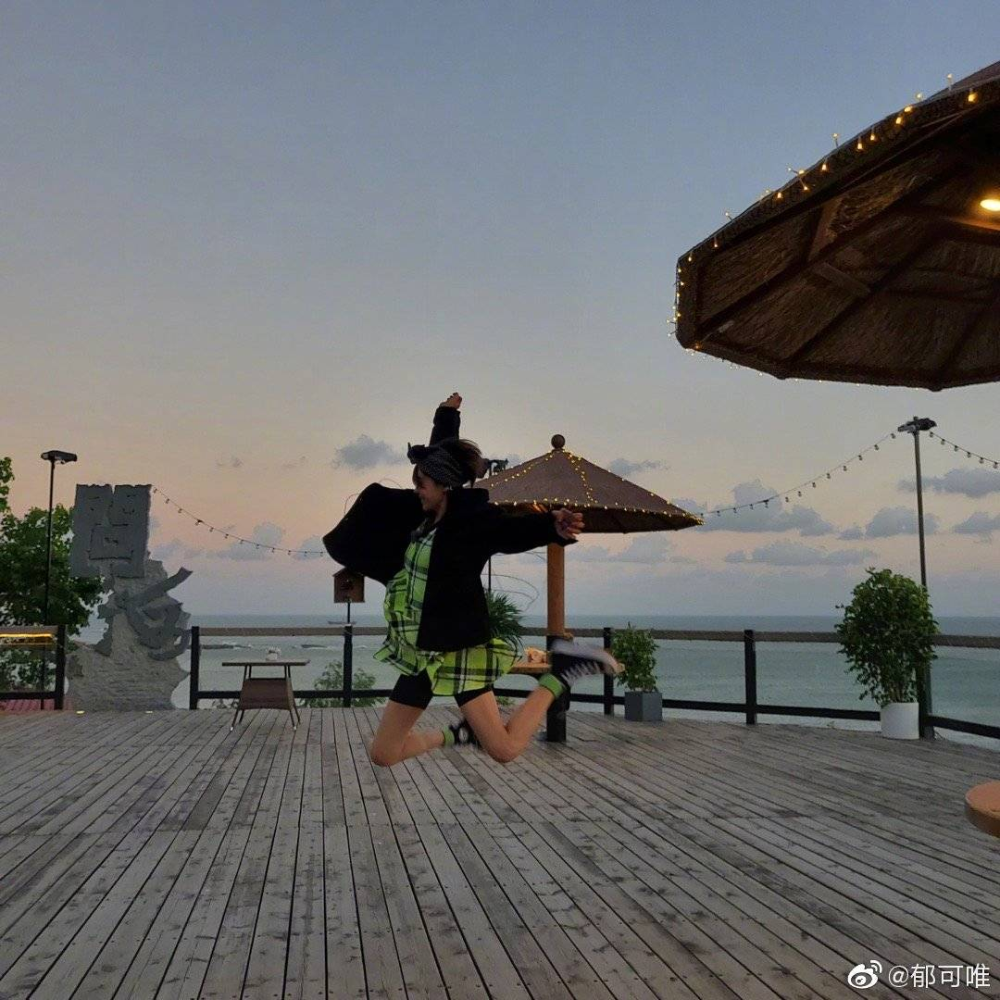
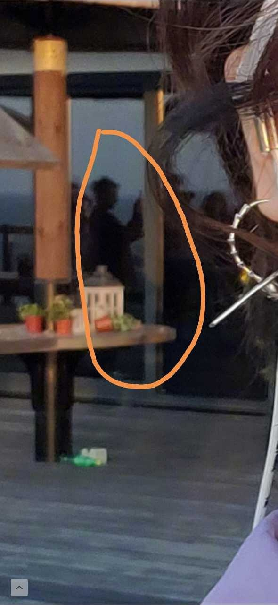
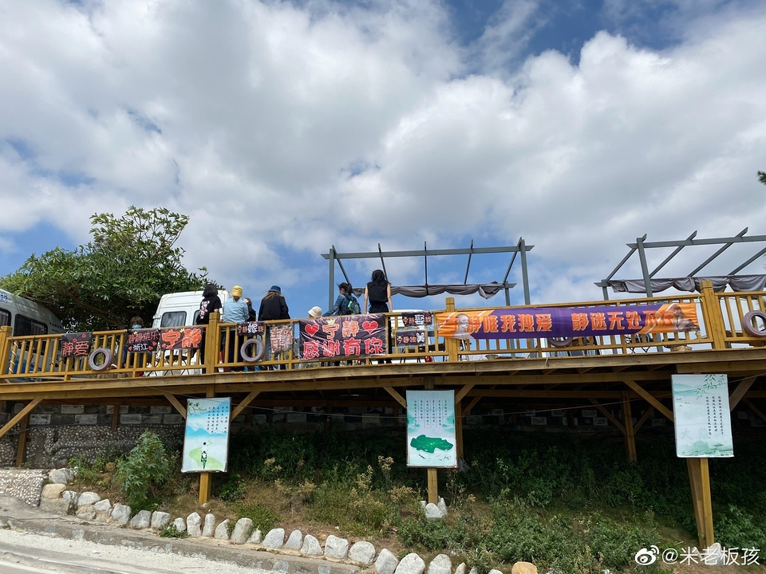
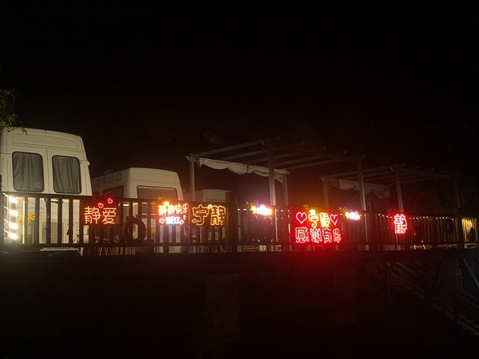
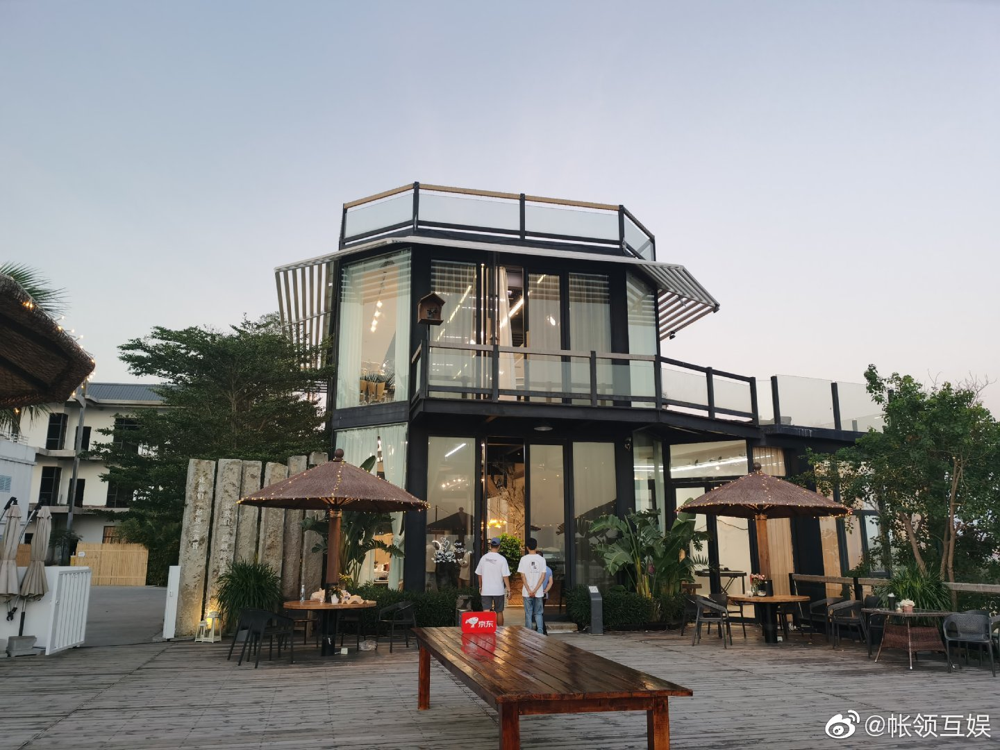
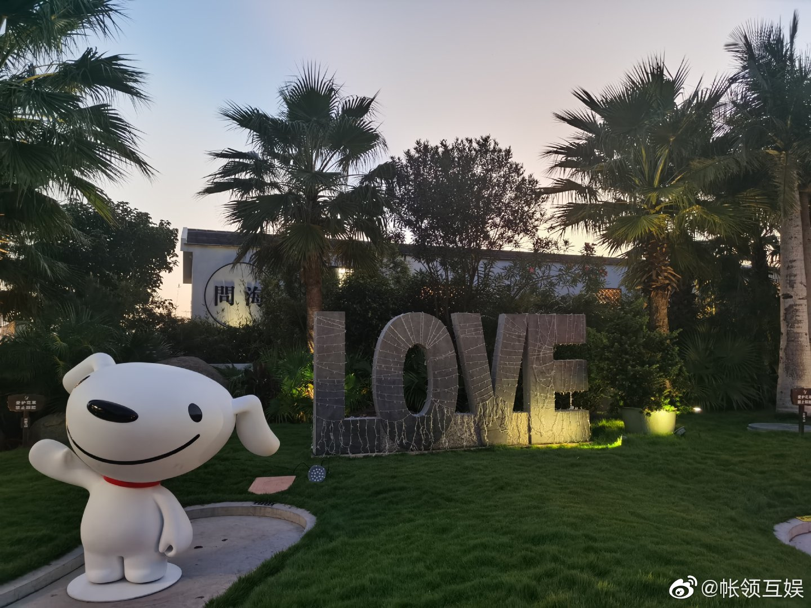
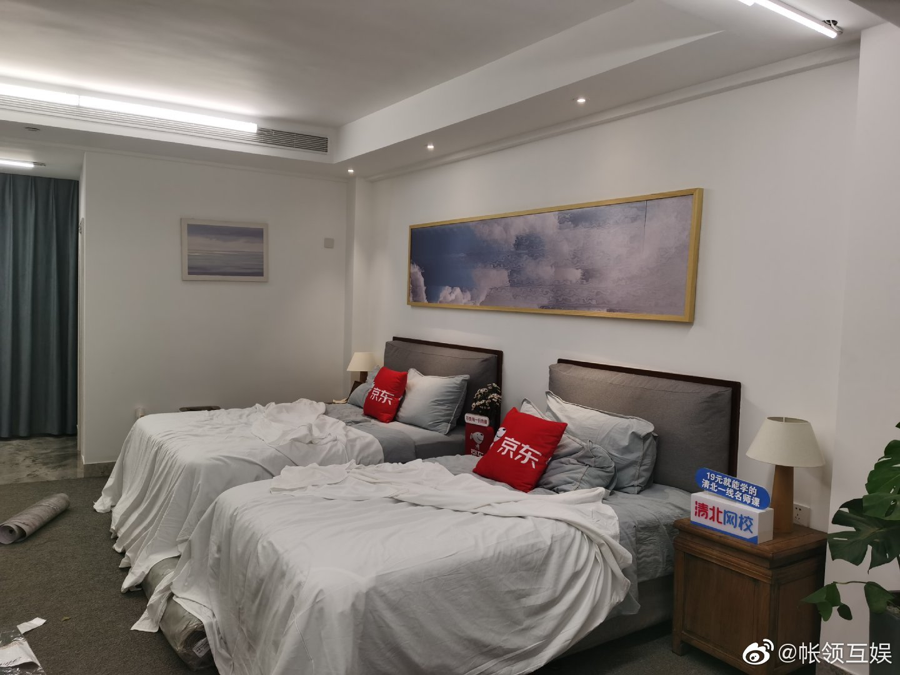
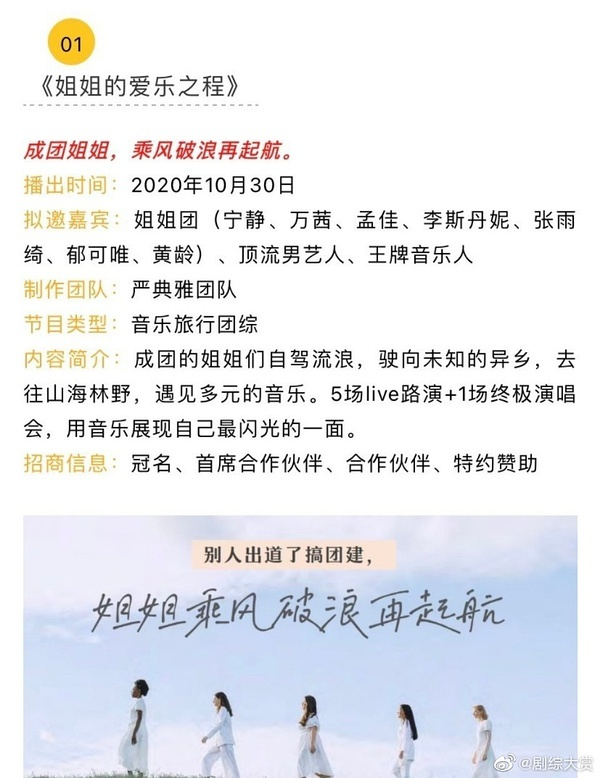
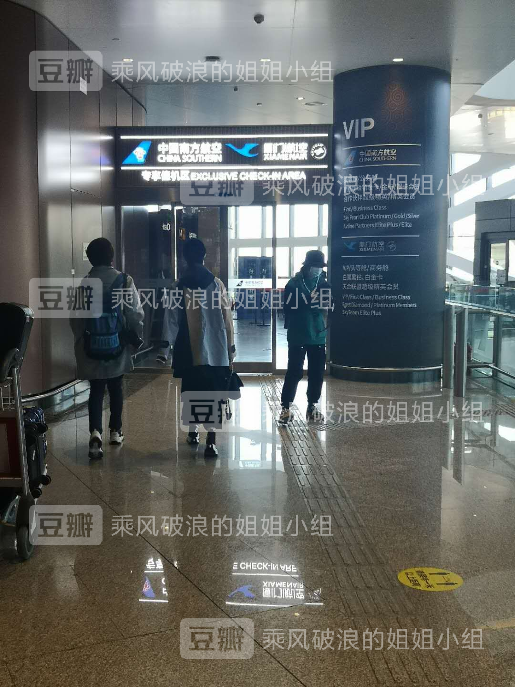
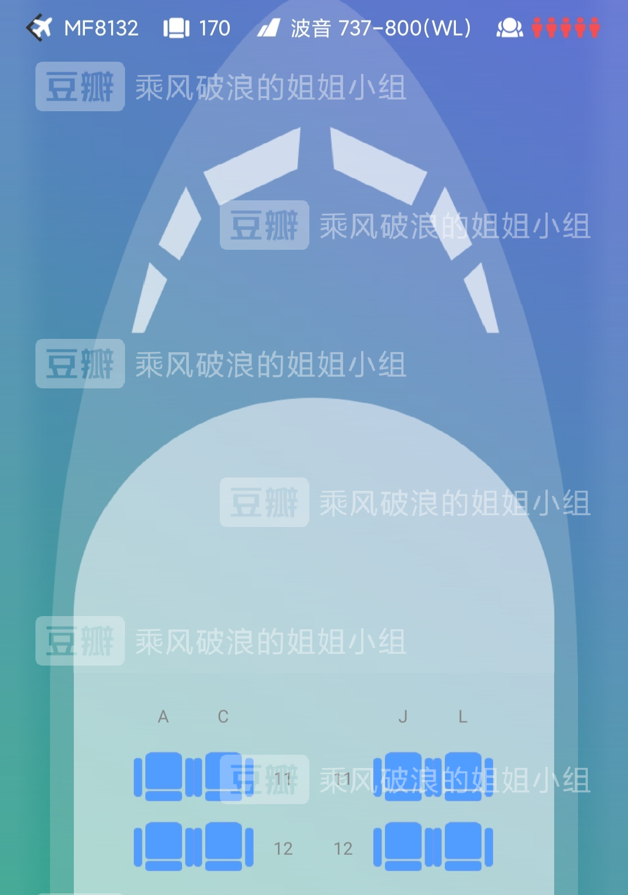

[返回目录](../../README.md "README.md")

# 「路过人间，感谢有你」- 泉州站·完结

    来自: [小鬼阿蛮](https://www.douban.com/people/219137387/)    2020-10-02 23:05:47

    谢谢你们让我在这里找到看浪姐的初心。

## 目录

各pa详细位置会在主楼正文中提到，请善用翻页功能，不然爬楼很累~  

#### 1、航班预测：1 - 5

#### 2、10月5号接送机repo：6 - 64

#### 3、10月6号泉州录制： 74 - 121 

#### 4、10月7号泉州彩排：128 - 151 

#### 5、10月8号泉州+路演repo：174 - 242

#### 6、10月9号泉州海边mv+蒸煮锤瓜：271 - 308

#### 7、10月10日机场送机和接机：318 - 337

### 10号更新：

答应群友放上这张图作为本楼最后的更新，请原谅我的私心  

送机和到达的图（截图来自wb），送机318页起，北京接机332页起  
  
到达北京  
  
泉州出发

wb新发图：海子静静  

下午的飞机，就先吸一口昨天的奶气秋葵吧，图来自站子  
  
  
衣服穿反的憨憨

### 9号更新：

今天活在小红书的静静又分享了新视频，有分房瓜，正如我们所愿（294页起）  
  
新鲜秋葵  
  
  

今天静葵同车去沙滩拍照（261页）  

葵发了新歌「如晤」  
  

### 8号更新：

半夜来看有耳老师拆礼物好了  
郁可唯发布了一篇小红书笔记 [小红书 xhslink.com](http://xhslink.com/a9i1I)  

已经开始正式演出了，可从205页开始翻。  

图源来自新浪综艺，静葵休息时坐在一起，现场瓜主说宁为郁睡是真的❤️❤️❤️据说这次综艺是用现场收音，211页之后是路透图的讨论楼。  
  
  
  
  
  
  
  

❤️  

静静刚更新了抖音（200页），美~有兴趣的话可以去看评论，她点赞了好几个。  

只要想跳舞 海天一色都是你的舞台 跟姐一起flow#带你去看海[https://v.douyin.com/JyDstLX/](https://v.douyin.com/JyDstLX/) 
  

楼里在说问海拉了三车观众到问海（189页），确认是在问海进行不公开表演。目前姐姐们已完成彩排，说是节目还不少，欢迎在评论共享情报~
  
  

今天率先出场的是昨天消失在路透，但活跃在微博的葵（182页）。今天是录制表演，不知道有物料出来没。今天的话题从174页开始。
  
  

### 7号更新：

今天下午静静和两位男嘉宾在海边进行了彩排，由于明天有8-9级的东北大风（谢亲故指正），节目组出于安全起见，将海边搭起的舞台拆掉了，路演变为封闭式公演，观众只有之前筛选的那些，挺遗憾的，相关内容在161-163页……今晚的糖从166页开始❤️

更新：

在海边彩排了，从140页开始。静小王子和葵小圆子，以及两人的合影。
  
  
  
合影……

🌟

民宿对面的应援牌，比之前的多了不少~
  
10.7的应援  
  
10.6的应援  

更新下民宿的环境吧，图源来自微博  
  
  
  
  

补个昨日憨葵  
  
  

原本暂定的23号播出因为和金鹰节撞了，目前写的是30号播出。  
  

### 6号更新：

虽说不发路透，主楼还是遵守规则吧，这是节目第一天的静葵。有合照的涉及节目录制现场，就用i葵大粉的物料拼了一个~大家每天都要开心哟~对应页码在74-121页，大多物料来自zzn家的站姐和葵家  
  

这个分组可以发吧？  
  

说是只要不是节目录制的路透，中间转场的还是可以发……不妥的话麻烦私信我。图源来自zzn的超话（i静们可以别把钱拿去陪女朋友浪漫，还是升级下装备吧😂😂）  
  
  

### 5号更新：

大兴机场送机repo：6-18页  

泉州机场接机repo：25-36页  

i静烟花秀：54-64页  
  
可爱的静静~

5号21点更新：静葵分别换车前往录制节目的地方。图来自宁静超话。  
  
  

今晚泉州的i静在海边给静静放了烟花秀，祝愿节目录制顺利~ 具体页码为54-64页  
  

静静看到了这场属于她的烟花秀  
  

大兴机场的一些repo，i静送了葵王菲的黑胶唱片  
  
  

机场最佳应援，静静的女友粉和妈粉一起上阵哈哈哈哈哈哈哈  
  
  

虽然走的vip通道，但是静葵是一起出来的！！葵的车在前面，走得比较快，静静的车在门口停了一下，她还和粉丝握手互动了。  
  
  
  

宠粉到差点被夹手的静静  
  

其它物料  
  

### 10.5更新：

郁可唯已经现身机场，静静暂时没出现，但是机场有i静在蹲~（这张图是葵主动跟穿绿豆tee的i静打了招呼之后拍的）  
  

啊啊啊啊啊啊啊！头发都睡得没型了  
  

全方位炸毛的静静❤️  
  

东张西望等静静的葵（工作室返图）  
  

更新个商务舱座位图，你们果然还是要在一起~  
  

补一个送崽去“上学”的动图  
  

机场物料：  
  
  
  
  

### 这是开楼的初心 

虽然楼已经歪了，阴差阳错变成了摩天楼，也是意外惊喜 hhh，对应的页码在1-5页。  

已知：  

1. 静葵10月5号北京飞泉州

2. 北京有两个机场：首都和大兴

3. 5号航班时间可查

结论：俩人可能大概率会同一航班去泉州呢！  

来自 [豆瓣App](/doubanapp/app?channel=from_group_topic "豆瓣App")  

## 留言
---
[1-100](./comments1-100.md "1-100")  [101-200](./comments101-200.md "101-200")  [201-300](./comments201-300.md "201-300")  [301-400](./comments301-400.md "301-400")  [401-500](./comments401-500.md "401-500")  [501-600](./comments501-600.md "501-600")  [601-700](./comments601-700.md "601-700")  [701-800](./comments701-800.md "701-800")  [801-900](./comments801-900.md "801-900")  [901-1000](./comments901-1000.md "901-1000")  [1001-1100](./comments1001-1100.md "1001-1100")  [1101-1200](./comments1101-1200.md "1101-1200")  [1201-1300](./comments1201-1300.md "1201-1300")  [1301-1400](./comments1301-1400.md "1301-1400")  [1401-1500](./comments1401-1500.md "1401-1500")  [1501-1600](./comments1501-1600.md "1501-1600")  [1601-1700](./comments1601-1700.md "1601-1700")  [1701-1800](./comments1701-1800.md "1701-1800")  [1801-1900](./comments1801-1900.md "1801-1900")  [1901-2000](./comments1901-2000.md "1901-2000")  [2001-2100](./comments2001-2100.md "2001-2100")  [2101-2200](./comments2101-2200.md "2101-2200")  [2201-2300](./comments2201-2300.md "2201-2300")  [2301-2400](./comments2301-2400.md "2301-2400")  [2401-2500](./comments2401-2500.md "2401-2500")  [2501-2600](./comments2501-2600.md "2501-2600")  [2601-2700](./comments2601-2700.md "2601-2700")  [2701-2800](./comments2701-2800.md "2701-2800")  [2801-2900](./comments2801-2900.md "2801-2900")  [2901-3000](./comments2901-3000.md "2901-3000")  [3001-3100](./comments3001-3100.md "3001-3100")  [3101-3200](./comments3101-3200.md "3101-3200")  [3201-3300](./comments3201-3300.md "3201-3300")  [3301-3400](./comments3301-3400.md "3301-3400")  [3401-3500](./comments3401-3500.md "3401-3500")  [3501-3600](./comments3501-3600.md "3501-3600")  [3601-3700](./comments3601-3700.md "3601-3700")  [3701-3800](./comments3701-3800.md "3701-3800")  [3801-3900](./comments3801-3900.md "3801-3900")  [3901-4000](./comments3901-4000.md "3901-4000")  [4001-4100](./comments4001-4100.md "4001-4100")  [4101-4200](./comments4101-4200.md "4101-4200")  [4201-4300](./comments4201-4300.md "4201-4300")  [4301-4400](./comments4301-4400.md "4301-4400")  [4401-4500](./comments4401-4500.md "4401-4500")  [4501-4600](./comments4501-4600.md "4501-4600")  [4601-4700](./comments4601-4700.md "4601-4700")  [4701-4800](./comments4701-4800.md "4701-4800")  [4801-4900](./comments4801-4900.md "4801-4900")  [4901-5000](./comments4901-5000.md "4901-5000")  [5001-5100](./comments5001-5100.md "5001-5100")  [5101-5200](./comments5101-5200.md "5101-5200")  [5201-5300](./comments5201-5300.md "5201-5300")  [5301-5400](./comments5301-5400.md "5301-5400")  [5401-5500](./comments5401-5500.md "5401-5500")  [5501-5600](./comments5501-5600.md "5501-5600")  [5601-5700](./comments5601-5700.md "5601-5700")  [5701-5800](./comments5701-5800.md "5701-5800")  [5801-5900](./comments5801-5900.md "5801-5900")  [5901-6000](./comments5901-6000.md "5901-6000")  [6001-6100](./comments6001-6100.md "6001-6100")  [6101-6200](./comments6101-6200.md "6101-6200")  [6201-6300](./comments6201-6300.md "6201-6300")  [6301-6400](./comments6301-6400.md "6301-6400")  [6401-6500](./comments6401-6500.md "6401-6500")  [6501-6600](./comments6501-6600.md "6501-6600")  [6601-6700](./comments6601-6700.md "6601-6700")  [6701-6800](./comments6701-6800.md "6701-6800")  [6801-6900](./comments6801-6900.md "6801-6900")  [6901-7000](./comments6901-7000.md "6901-7000")  [7001-7100](./comments7001-7100.md "7001-7100")  [7101-7200](./comments7101-7200.md "7101-7200")  [7201-7300](./comments7201-7300.md "7201-7300")  [7301-7400](./comments7301-7400.md "7301-7400")  